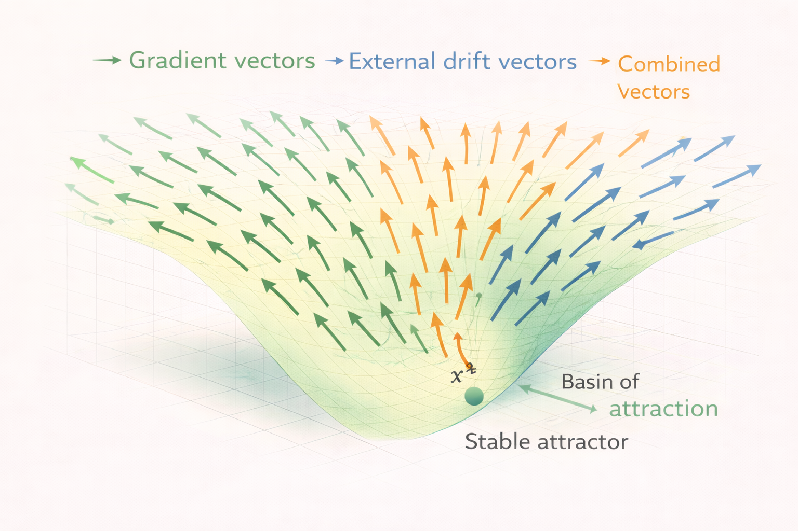

# Drift Systems – Concept

Drift systems describe dynamical systems in which system evolution is influenced by both **internal stability gradients** and **external forces**.

While gradient systems move purely along the slope of a stability landscape, drift systems introduce an additional directional influence that modifies the natural gradient flow.

The diagram illustrates how three vector components interact within the system:

- **gradient vectors** that point toward stable regions of the landscape  
- **external drift vectors** that introduce directional forcing  
- **combined vectors** representing the resulting system motion  

Together these vectors form a **drift-modified vector field** that determines how the system evolves through the state space.

---

# Stability Landscape with Drift

The stability landscape still defines the underlying structure of the system.

In this landscape:

- valleys correspond to **stable attractors**
- ridges represent **transition boundaries**
- slopes determine the **natural direction of stabilization**

However, the presence of external forces modifies the direction of motion.

Instead of moving purely downhill, the system follows a **combined direction** determined by both the gradient and the external drift.

---

# Vector Field Interpretation

At every point in the state space, two vector contributions exist:

1. the **gradient vector**  
   pointing toward decreasing stability potential

2. the **drift vector**  
   representing external forcing

The resulting system motion is the **sum of both vectors**.

This produces trajectories that may:

- deviate from direct gradient descent
- cross attractor basins
- follow persistent directional paths

---

# Drift-Induced Motion

External drift can significantly change system behavior.

Possible effects include:

- displacement of equilibrium positions  
- slow migration across stability regions  
- forced transitions between attractor basins  
- long-term directional transport  

In such cases, the system may not settle in the nearest attractor.

Instead, it may continue moving through the landscape under sustained forcing.

---

# Real-World Interpretation

Drift systems appear in many natural and engineered systems.

Examples include:

- atmospheric transport influenced by wind fields  
- ocean circulation driven by temperature and salinity gradients  
- particle transport in fluid environments  
- ecological population shifts under environmental pressure  

In each case, the stability landscape exists, but **external drivers modify system trajectories**.

---

# Relation to Other NEXAH Models

Within the NEXAH framework:

- **Gradient Systems** describe purely stability-driven dynamics  
- **Drift Systems** introduce directional forcing  
- **Regime Systems** describe systems with multiple structural states  

Drift systems therefore represent an intermediate level of complexity between simple gradient flow and regime-switching dynamics.
