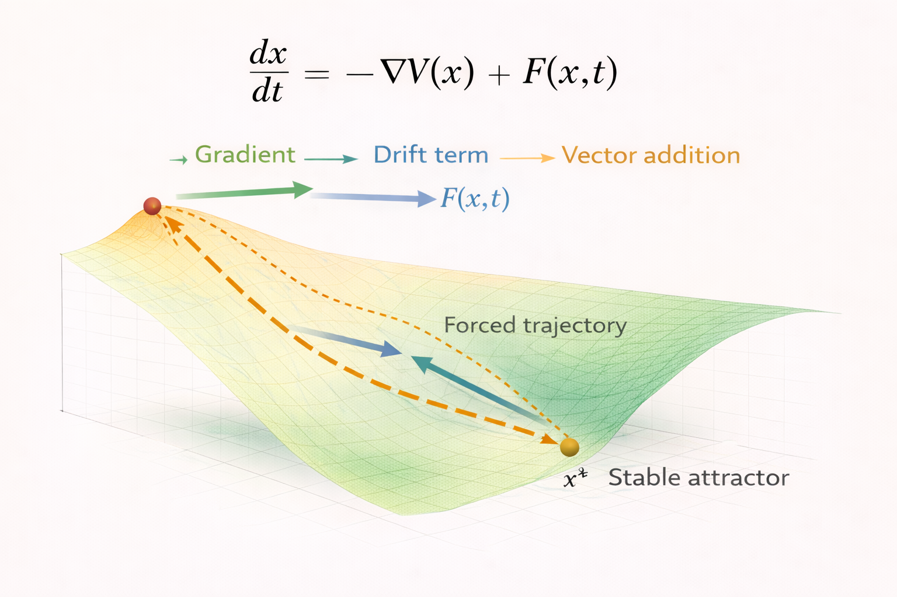

# Drift Systems – Formal Model

This document provides the mathematical formulation of **drift systems** within the NEXAH framework.

Drift systems extend gradient dynamics by introducing an additional **external forcing term** that influences system evolution.

The diagram illustrates how system motion results from the combination of two vector components:

- the **gradient of the stability landscape**
- an **external drift force**

Together these forces determine the resulting system trajectory.

---

# System State

A system is described by a state vector:

x ∈ S

where

- **x** represents the current configuration of the system
- **S** represents the state space of possible configurations

The state evolves continuously through time.

---

# Stability Potential

As in gradient systems, the structure of the landscape is defined by a **stability potential**:

V(x)

This function assigns a scalar value to each system state.

Interpretation:

- low values of **V(x)** correspond to stable regions
- high values correspond to unstable regions

The gradient of this function defines the natural direction of stabilization.

---

# Gradient Component

In the absence of external forces, the system follows pure gradient dynamics:

dx/dt = -∇V(x)

This motion corresponds to **steepest descent** in the stability landscape.

---

# Drift Extension

Drift systems introduce an additional forcing term:

F(x,t)

The full system dynamics therefore become:

dx/dt = -∇V(x) + F(x,t)

where

- **-∇V(x)** represents the stabilizing gradient force  
- **F(x,t)** represents external drift forces  

This formulation produces a **drift-modified vector field**.

---

# Vector Interpretation

At every point in the state space, two vectors contribute to system motion:

1. the **gradient vector**
2. the **drift vector**

The resulting motion is given by **vector addition**:

system motion = gradient + drift

This produces trajectories that may deviate from pure gradient descent.

---

# Forced Trajectories

External drift can produce several effects:

- displacement of equilibrium positions
- slow migration across basins of attraction
- delayed stabilization
- forced transitions between attractors

In some systems, continuous forcing prevents the system from reaching equilibrium.

---

# Relation to Gradient Systems

Drift systems generalize the gradient system formulation.

If the external force disappears:

F(x,t) = 0

the dynamics reduce to the pure gradient system:

dx/dt = -∇V(x)

Thus, gradient systems represent a **special case of drift dynamics**.

---

# Relation to Regime Systems

Drift systems still assume a single continuous stability landscape.

However, many complex systems contain **multiple stability regimes** separated by structural boundaries.

These systems are described in the next module:

**Regime Systems**.
