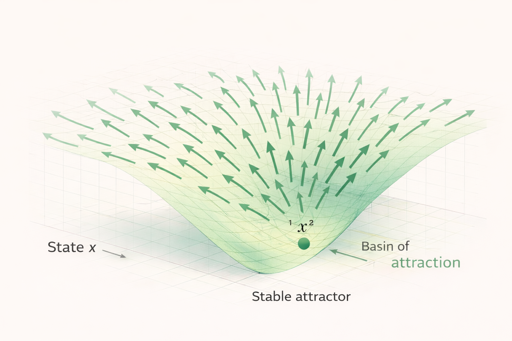

# Gradient Systems – Concept

Gradient systems describe a class of dynamical systems that evolve along the slope of a stability landscape.

In these systems, the direction of change is determined by the **local gradient of a stability function**.

Instead of exploring the state space randomly, the system follows deterministic paths that lead toward regions of higher stability.

The diagram above illustrates the characteristic behavior of a gradient system.

Arrows represent the **gradient field** of the stability function.  
From every point in the state space, the system moves in the direction of **steepest descent**, eventually converging toward a stable attractor.

---

# Stability Landscapes

The concept of gradient systems builds directly on the **stability landscape model**.

In this interpretation:

- the **landscape** represents the space of possible system states
- the **height of the landscape** represents the stability potential
- the **slope of the landscape** determines the direction of system evolution

Systems tend to move **downhill in the landscape**, toward regions of lower potential.

These regions correspond to **stable attractors**.

---

# Deterministic System Evolution

In gradient systems, the direction of motion is not arbitrary.

The system follows the steepest descent of the stability function.

This means that at every point in the state space, the gradient defines the direction in which the system will evolve.

As a result, gradient systems typically exhibit:

- smooth trajectories through state space
- convergence toward stable equilibria
- predictable stability behavior

---

# Attractor Convergence

Over time, a gradient system tends to converge toward stable attractor regions.

Once the system reaches such a region, further movement becomes minimal or stops entirely.

This leads to **stable equilibrium states**.

In physical systems, this often corresponds to:

- energy minimization
- structural equilibrium
- thermodynamic relaxation

---

# Basin of Attraction

Each stable attractor in the landscape has an associated **basin of attraction**.

This basin contains all system states that eventually converge toward that attractor.

Systems starting in different regions of the state space may therefore stabilize in different attractors depending on their initial conditions.

---

# Limitations of Pure Gradient Systems

While gradient systems describe many natural processes well, they represent a simplified case.

Real-world systems often include additional influences such as:

- external forces
- environmental fluctuations
- regime transitions

These influences can cause systems to deviate from pure gradient behavior.

---

# Relation to Other System Types

Gradient systems represent the **simplest dynamic case** of the stability landscape framework.

More complex system dynamics are introduced in the following models:

- **Drift Systems** – systems influenced by external forces
- **Regime Systems** – systems with multiple structural regimes

These models extend the gradient system formulation to capture a broader range of real-world dynamics.
