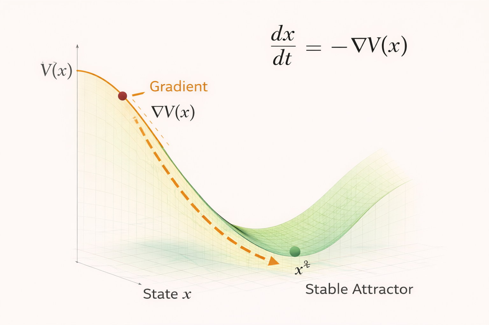

# Gradient Systems – Formal Model

This document provides a minimal mathematical formulation of **gradient systems** within the NEXAH framework.

Gradient systems describe dynamics in which a system evolves along the gradient of a stability function.

The diagram above illustrates the fundamental mechanism of gradient systems:  
a system state moves through the landscape following the **gradient descent of a stability potential**.

---

# System State

A system is described by a state vector

x ∈ S

where

- **x** represents the current configuration of the system
- **S** represents the state space of all possible configurations

The state evolves continuously through time.

---

# Stability Function

To describe the structure of the landscape we introduce a **stability potential**:

V(x)

This function assigns a scalar value to each system state.

Interpretation:

- high values of **V(x)** → unstable regions
- low values of **V(x)** → stable regions

The landscape defined by **V(x)** determines the possible system dynamics.

---

# Gradient Dynamics

In gradient systems the direction of motion is determined by the **gradient of the stability function**.

System evolution follows the differential equation:

dx/dt = -∇V(x)

where

- **∇V(x)** is the gradient of the stability function
- the negative sign indicates motion toward lower potential

This equation describes **gradient descent** in the stability landscape.

---

# Stable Equilibria

Stable system states occur where the gradient of the potential vanishes:

∇V(x*) = 0

and the curvature of the potential is positive:

∇²V(x*) > 0

These points correspond to **local minima of the stability function**.

Such points act as **stable attractors** of the system.

---

# Basin of Attraction

Each stable attractor has an associated **basin of attraction**.

The basin consists of all initial states that eventually converge toward the attractor under gradient dynamics.

Different basins correspond to different stable outcomes of the system.

---

# Energy Interpretation

In many physical systems the stability potential corresponds to an **energy function**.

In this interpretation:

- systems evolve toward **minimum energy states**
- the gradient describes the **direction of steepest descent**
- equilibrium corresponds to **energy minimization**

This makes gradient systems a natural model for many physical and biological processes.

---

# Relation to Other System Types

Gradient systems represent the simplest form of stability dynamics.

More complex dynamics arise when additional influences are introduced:

- **Drift Systems** add external forcing terms
- **Regime Systems** introduce multiple structural regimes and transitions

These extensions build directly on the gradient system formulation.
