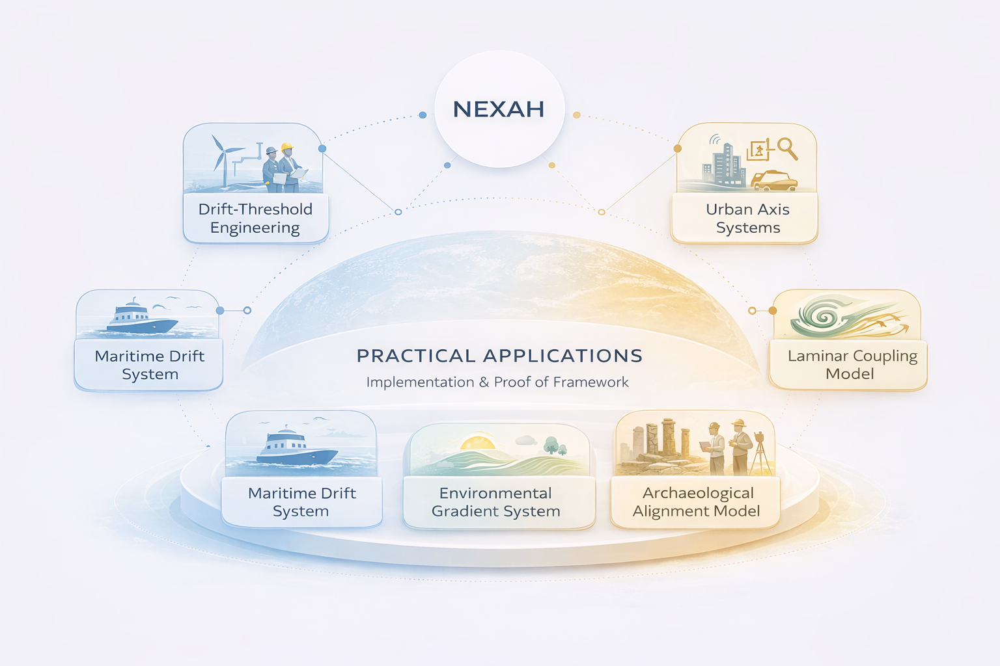

# NEXAH Framework — Portal

Welcome to the **NEXAH Framework portal**.

This section introduces the structural foundations of the NEXAH system — its conceptual layers, modeling principles, and practical applications.

NEXAH is designed as a **structural modeling framework for navigating complex systems** through **relational modeling, regime analysis, and explicit system orientation**.

---

# What is the NEXAH Framework?

The **NEXAH Framework** is a modular structural modeling system for analyzing and navigating complex systems.

Instead of reducing systems to simplified variables, NEXAH focuses on:

- structural relations between elements
- regime transitions within systems
- navigable orientations across system states

The framework allows complex systems to be explored through **explicit structural models and navigation strategies**.

---

# Framework Structure

The NEXAH framework is organized as a **five-layer system stack**.

META → ARCHY → MESO → NEXAH → MEVA

Each layer contributes a new capability for understanding and navigating complex systems.

---

# META — Relational Structure

The **META layer** defines the structural foundation of a system.

It describes how system elements are related and how dependencies are organized.

Examples include:

- relational graphs
- ordering relations
- dependency structures
- system semantics

META establishes the **structural language of the system**.

---

# ARCHY — Stability Regimes

The **ARCHY layer** analyzes system stability and regime transitions.

It identifies states, transitions between states, and structural stability regions.

Examples include:

- regime transitions
- collapse states
- basin structures
- system thresholds

ARCHY reveals **how systems move between structural configurations**.

---

# MESO — Risk Geometry

The **MESO layer** evaluates the **risk landscape** of the system.

It computes how far states lie from collapse regimes and generates risk gradients across the system.

Examples include:

- collapse distance
- risk gradients
- basin geometry
- resilience analysis

MESO allows systems to be analyzed in terms of **risk topology**.

---

# NEXAH — Orientation & Navigation

The **NEXAH layer** enables navigation through the regime landscape.

Using structures discovered in META, ARCHY, and MESO, it computes safe trajectories through the system state space.

Examples include:

- navigation policies
- trajectory planning
- regime-aware decision making
- orientation frames

NEXAH transforms system analysis into **navigable structural models**.

---

# MEVA — Execution Layer

The **MEVA layer** executes navigation decisions.

It applies actions, updates system states, and records system trajectories.

Examples include:

- state updates
- action execution
- trajectory simulation
- system control

MEVA turns navigation policies into **operational system behavior**.

---

# NEXAH in Practice

The framework is designed not only as a conceptual model but also as a **practical system for analyzing real-world structures**.

Applications may include domains such as:

- infrastructure systems
- environmental modeling
- maritime systems
- urban structural analysis
- archaeological alignment studies
- complex network governance

These applications demonstrate how relational modeling and regime analysis can reveal hidden structural dynamics.

---

# Purpose of the Framework

The goal of NEXAH is to provide a **clear structural language for complex systems**.

Instead of describing systems only through metrics or variables, NEXAH models:

- structural relations
- stability regimes
- system risk geometry
- navigable system orientations

This enables complex domains to be explored through **structured relational models and explicit navigation strategies**.

---

# Continue Exploring

From this portal you can continue exploring the NEXAH ecosystem.

---

## Research Portal

[research_portal.md](./research_portal.md)

Explore the theoretical foundations and structural principles behind the framework.

---

## Applications Portal

[applications_portal.md](./applications_portal.md)

Discover documented case studies and real-world structural modeling examples.

---

## Repository Navigator

[repository_portal.md](./repository_portal.md)

Access the structural map of the NEXAH repository and explore its modules.
