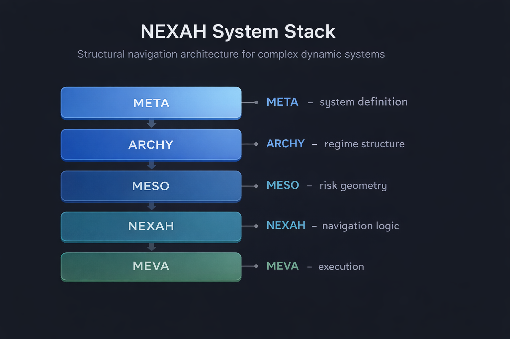
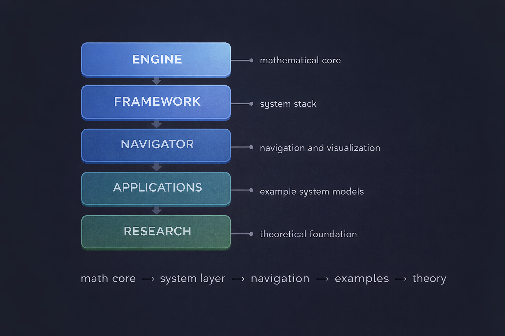

# NEXAH Framework — Architecture Overview

This directory provides the **architectural overview of the NEXAH framework**.

It serves as a structured entry point for understanding the system architecture, development status, capabilities, and engine design.

The NEXAH framework is a structural navigation system for **complex dynamic environments**.

---

# Architecture Overview

## NEXAH System Stack

The architecture follows a layered model:

META → ARCHY → MESO → NEXAH → MEVA

These layers transform:

**system definitions → regime structures → risk landscapes → navigable trajectories**

| Layer | Function |
|------|------|
| META | relational system definition |
| ARCHY | regime structure detection |
| MESO | risk geometry computation |
| NEXAH | navigation strategies |
| MEVA | execution and simulation |

---

## Repository Architecture

The NEXAH repository is organized into several major components.

| Directory | Role |
|------|------|
| ENGINE | structural algebra and analysis engine |
| FRAMEWORK | system stack implementation |
| NAVIGATOR | system exploration and visualization |
| APPLICATIONS | example system models |
| RESEARCH | theoretical foundation |

This structure separates **mathematical core systems, framework logic, navigation tools, and applied models**.

---

# Engine Execution Flow

The NEXAH engine bridges **formal mathematical structures** with **executable system analysis**.

Pipeline:

Formal Structure (Research)  
↓  
Structural Algebra Core  
↓  
Executable Analysis  
↓  
Structural Output  

---

# Documents in this Directory

## Architecture Status

[NEXAH_ARCHITECTURE_COMPLETION_MAP.md](./NEXAH_ARCHITECTURE_COMPLETION_MAP.md)

Tracks the architectural implementation status of the framework.

Includes:

- completed system components
- partial implementations
- remaining development tasks
- roadmap toward full framework completion

This document serves as the **development progress map** of the system.

---

## Architecture Milestone

[ARCHITECTURE_MILESTONE.md](./ARCHITECTURE_MILESTONE.md)

Records the milestone where the **core NEXAH architecture became operational**.

Describes:

- the system stack
- achieved architectural capabilities
- the operational scope of the framework

This document captures a **major stage in the evolution of the NEXAH system**.

---

## System Capabilities

[SYSTEM_CAPABILITIES.md](./SYSTEM_CAPABILITIES.md)

Describes the current functional capabilities of the framework.

Includes:

- structural system modeling
- regime analysis
- risk geometry computation
- cascade simulation
- navigation strategies
- execution and control
- visualization tools

This document functions as the **capabilities reference** for the framework.

---

## Engine Release Notes

[NEXAH_Engine_v1.0.0_Release_Notes.md](./NEXAH_Engine_v1.0.0_Release_Notes.md)

Technical documentation for the first stable release of the **NEXAH Engine**.

Highlights:

- finite structural algebra core
- monotone and fixpoint operators
- deterministic dataflow solver
- validated finite abstract interpretation kernel

This document explains the **computational foundation of the engine**.

---

# How These Documents Fit Together

The documents in this directory describe the NEXAH system from complementary perspectives.

| Document | Role |
|------|------|
| Architecture Completion Map | development progress |
| Architecture Milestone | system breakthrough |
| System Capabilities | operational functionality |
| Engine Release Notes | computational foundation |

Together they provide a complete overview of the **NEXAH architecture and current system state**.

---

# Summary

The NEXAH framework combines:

- structural modeling  
- regime analysis  
- risk geometry  
- navigation strategies  
- execution control  

into a unified architecture for exploring and navigating **complex dynamic systems**.
