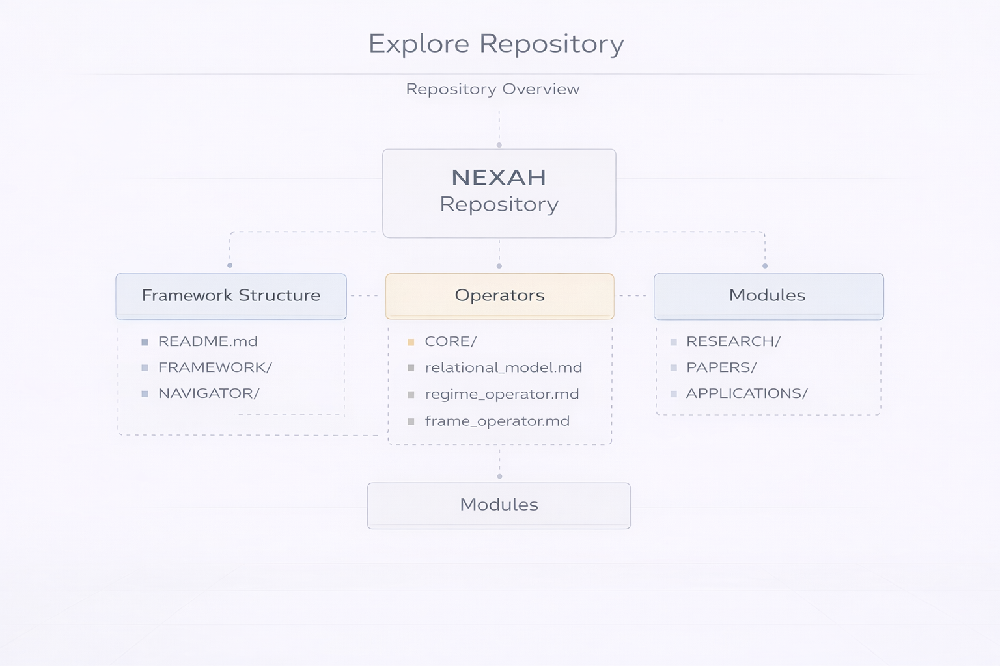

# NEXAH — Explore the Repository

Welcome to the **NEXAH Repository**.

This portal provides an overview of the repository structure and helps you navigate the conceptual framework, computational engine, and documented applications of the NEXAH system.

The repository integrates **theoretical foundations, executable structural modeling tools, and applied system models**.

Repository entry point:

→ https://github.com/Scarabaeus1031/NEXAH

---

## Conceptual Architecture

The NEXAH system combines several conceptual layers that connect theoretical foundations with practical implementation.

### META — Framework Structure
Defines the relational structure and foundational architecture of the system.

### AXIOMS — Foundational Rules
Core assumptions that define the logical basis of the framework.

### THEOREMS — Formal Derivations
Derived formal structures that describe system behavior.

### PRINCIPLES — Core Concepts
Conceptual bridges between theory and real-world modeling.

### ARCHY — Integration & Regimes
Describes stability regimes and transitions between system states.

### NEXAH — Tools & Implementation
The practical modeling layer where systems become analyzable and navigable.

---

## Repository Overview

The repository is organized into several major components.

---

## Framework Structure

Conceptual documentation and system architecture.

→ https://github.com/Scarabaeus1031/NEXAH/tree/main/FRAMEWORK  
→ https://github.com/Scarabaeus1031/NEXAH/blob/main/README.md  
→ https://github.com/Scarabaeus1031/NEXAH/tree/main/NAVIGATOR

These documents describe the conceptual structure and navigation of the NEXAH framework.

---

## ENGINE — Computational Core

The **ENGINE** implements the executable structural algebra and analysis engine.

→ https://github.com/Scarabaeus1031/NEXAH/tree/main/ENGINE

Key capabilities include:

- finite posets and lattice operations
- closure and interior operators
- monotone operators
- fixpoint solvers
- rank and Hasse structure extraction
- regime restriction and frame projection

The ENGINE provides the **finite abstract interpretation kernel** used for structural system analysis.

---

## Research Modules

Research documentation and structural studies.

→ https://github.com/Scarabaeus1031/NEXAH/tree/main/RESEARCH

This section includes theoretical material and extended system models.

---

## Applications and Case Studies

Applied structural modeling examples.

These may include domains such as:

- infrastructure systems
- environmental systems
- maritime drift models
- urban axis systems
- archaeological alignment models

These examples demonstrate how NEXAH can be applied to real-world systems.

---

## Tests and Validation

The repository includes a full validation suite.

→ https://github.com/Scarabaeus1031/NEXAH/tree/main/tests

Current status:

- ~89 tests passing
- ~95% code coverage
- strict type checking (`mypy`)
- deterministic solver semantics

---

## Explore the System

From here you can continue exploring the NEXAH ecosystem:

**Framework**  
Explore the conceptual architecture of the system.

**Research**  
Study the theoretical background and structural modeling principles.

**Applications**  
Discover applied case studies and modeling examples.

**Repository**  
Browse the implementation and engine components.
