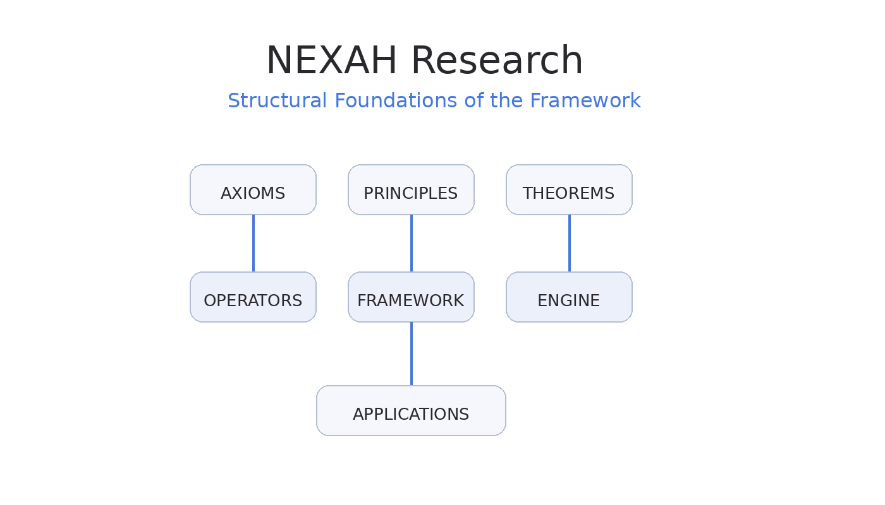

# NEXAH — Research Portal

Welcome to the **NEXAH Research Portal**.

This section explores the theoretical foundations behind the NEXAH framework and connects **formal research**, **structural modeling**, and **real-world applications**.

---

## Research Architecture

The research layer defines the conceptual structure of the NEXAH framework.

It establishes the theoretical basis used to construct the modeling operators and system analysis tools implemented in the repository.

The architecture follows a layered structure.

### Axioms

Foundational assumptions defining the relational modeling approach.

These axioms describe how systems can be represented as structured relations.

---

### Principles

Core conceptual rules guiding how relational structures behave and interact.

Principles define the structural logic of the framework.

---

### Theorems

Formal derivations describing system behavior.

These results provide mathematical grounding for the relational modeling framework.

---

### Operators

Structural operators implement the theoretical rules.

Examples include:

- relational model operators  
- regime restriction operators  
- frame projection operators  

These operators form the executable modeling layer.

---

### Framework and Engine

The theoretical concepts are implemented in the **NEXAH framework** and the **ENGINE modules** of the repository.

The repository therefore contains:

- structural operators
- modeling tools
- system analysis engines
- framework definitions

---

## Research Pipeline

The research workflow follows a progression from theory to real-world systems.

Axioms
↓
Principles
↓
Theorems
↓
Operators
↓
Framework
↓
Applications

The pipeline illustrates how theoretical concepts are transformed into executable models and eventually applied to complex environments.

---

## Application Domains

The research framework supports modeling across several domains.

Examples include:

- **Drift–Threshold Engineering**
- **Urban Axis Systems**
- **Maritime Drift Systems**
- **Environmental Gradient Systems**
- **Laminar Coupling Models**
- **Archaeological Alignment Models**

These applications demonstrate how relational system modeling can be used to analyze real-world structures.

---

## Research Areas

The NEXAH research layer currently focuses on three primary domains.

### Structural System Modeling

Development of relational models describing complex systems.

---

### Stability and Regime Theory

Study of transitions between stable system states, including:

- regime shifts
- threshold behavior
- stabilization processes

---

### Relational Navigation

Methods for navigating and analyzing large relational structures.

This includes:

- structural graphs
- relational mapping
- system orientation frameworks

---

## Repository Resources

Framework documentation  
https://github.com/Scarabaeus1031/NEXAH/tree/main/FRAMEWORK

Research materials  
https://github.com/Scarabaeus1031/NEXAH/tree/main/RESEARCH

Navigator documentation  
https://github.com/Scarabaeus1031/NEXAH/tree/main/NAVIGATOR

---

## Continue Exploring

Framework Portal  
`framework_portal.md`

Repository Portal  
`repository_portal.md`

Applications Portal  
`applications_portal.md`

---

The **Research Portal** connects theoretical exploration with executable modeling tools and practical system applications within the NEXAH ecosystem.

Research
↓
Framework
↓
Engine
↓
Applications

The pipeline illustrates how theoretical concepts are transformed into executable models and eventually applied to complex environments.

---

## Application Domains

The research framework supports modeling across several domains.

Examples include:

- **Drift–Threshold Engineering**
- **Urban Axis Systems**
- **Maritime Drift Systems**
- **Environmental Gradient Systems**
- **Laminar Coupling Models**
- **Archaeological Alignment Models**

These applications demonstrate how relational system modeling can be used to analyze real-world structures.

---

## Research Areas

The NEXAH research layer currently focuses on three primary domains.

### Structural System Modeling

Development of relational models describing complex systems.

---

### Stability and Regime Theory

Study of transitions between stable system states, including:

- regime shifts
- threshold behavior
- stabilization processes

---

### Relational Navigation

Methods for navigating and analyzing large relational structures.

This includes:

- structural graphs
- relational mapping
- system orientation frameworks

---

## Repository Resources

Framework documentation  
https://github.com/Scarabaeus1031/NEXAH/tree/main/FRAMEWORK

Research materials  
https://github.com/Scarabaeus1031/NEXAH/tree/main/RESEARCH

Navigator documentation  
https://github.com/Scarabaeus1031/NEXAH/tree/main/NAVIGATOR

---

## Continue Exploring

Framework Portal  
`framework_portal.md`

Repository Portal  
`repository_portal.md`

Applications Portal  
`applications_portal.md`

---

The **Research Portal** connects theoretical exploration with executable modeling tools and practical system applications within the NEXAH ecosystem.
