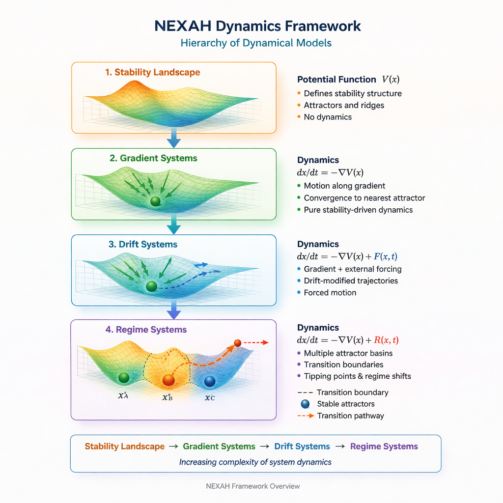

# NEXAH Applications

# NEXAH Applications


This directory contains **system models and practical applications** built with the **NEXAH framework**.

The goal of this layer is to demonstrate how structural models developed in the framework can be applied to **real-world dynamical systems**.

Applications translate the theoretical operators of NEXAH into **concrete system models and simulations.**

---

# From Framework to Applications

The NEXAH repository follows a layered structure:

Framework  
↓  
Structural Operators  
↓  
System Models  
↓  
Applications  
↓  
Exploration Hub  

- The **framework** defines the structural modeling architecture.
- The **applications** demonstrate how these ideas can be used to analyze real systems.
- The **Exploration Hub** allows builders to extend these models into new domains.

---

# Framework Navigation

| Model | Description | Module |
|------|-------------|--------|
| **Stability Landscape** | Conceptual foundation of system stability | [STABILITY_LANDSCAPE](./STABILITY_LANDSCAPE) |
| **Gradient Systems** | Systems evolving along stability gradients | [GRADIENT_SYSTEM](./GRADIENT_SYSTEM) |
| **Drift Systems** | Gradient dynamics with external forces | [DRIFT_SYSTEM](./DRIFT_SYSTEM) |
| **Regime Systems** | Systems with multiple attractor regimes | [REGIME_SYSTEM](./REGIME_SYSTEM) |

---

# Application Modules

### Stability Landscape  
`APPLICATIONS/STABILITY_LANDSCAPE`

Introduces the fundamental concept of stability landscapes and attractor basins.

### Gradient Systems  
`APPLICATIONS/GRADIENT_SYSTEM`

Models systems that evolve along the gradient of a potential field.

### Drift Systems  
`APPLICATIONS/DRIFT_SYSTEM`

Extends gradient systems with external forces and dynamic perturbations.

### Regime Systems  
`APPLICATIONS/REGIME_SYSTEM`

Models systems that contain multiple attractors and regime transitions.

---

# External System Integration

NEXAH can connect to **existing simulators and system models** through an adapter layer.

Rather than replacing simulation software, NEXAH operates as a **navigation layer above simulators**.

```
Simulator
    ↓
Adapter
    ↓
State Graph
    ↓
NEXAH Navigator
    ↓
Policy
    ↓
Actions
```

External simulators describe **system dynamics**, while NEXAH analyzes the **regime structure and navigation possibilities**.

Examples of compatible systems include:

- MATPOWER
- pandapower
- PyPSA
- traffic simulations
- cyber-physical systems
- supply chain simulators
- infrastructure models

Adapters translate simulator output into **finite state graphs** that NEXAH can analyze.

Adapter implementations live in:

```
APPLICATIONS/adapters
```

Structure:

```
adapters/
   README.md
   nexah_adapter_spec.md
   base_adapter.py
   examples/
      energy_grid_adapter.py
```

This architecture allows NEXAH to remain **system-agnostic** while integrating with existing simulation ecosystems.

---

# From Structure to Application


The NEXAH workflow connects formal structural theory with real-world system analysis.

The process follows four conceptual layers:

```
Formal Core → Structural Semantics → System Models → Applications
```

- **Formal Core** defines mathematical operators
- **Structural Semantics** introduces regimes and thresholds
- **System Models** represent system dynamics
- **Applications** analyze real-world systems

---

# NEXAH Dynamical Framework


The NEXAH applications are built on a hierarchy of dynamical models describing how systems evolve in structured state spaces.

The framework introduces increasing levels of dynamical complexity:

```
Stability Landscape
↓
Gradient Systems
↓
Drift Systems
↓
Regime Systems
```

---



This diagram summarizes the **four core dynamical models** used in the NEXAH applications framework.

---

# Application Navigation Map


The applications follow a conceptual progression:

```
Stability Landscape (intro model)
↓
Structural System Classes
↓
Example Applications
```

This structure demonstrates how general dynamical systems can be represented and analyzed using the NEXAH framework.

---

# Example System Classes

## Gradient Systems

Gradient systems evolve along the slope of a stability landscape.

```
dx/dt = -∇V(x)
```

Examples include:

- temperature gradients  
- pressure systems  
- energy landscapes  
- ecological distributions  

Module:

[GRADIENT_SYSTEM](./GRADIENT_SYSTEM/README.md)

---

## Drift Systems

Drift systems extend gradient dynamics with external forces.

```
dx/dt = -∇V(x) + F(x,t)
```

Examples include:

- ocean currents  
- atmospheric transport  
- particle drift  
- migration flows  

Module:

[DRIFT_SYSTEM](./DRIFT_SYSTEM/README.md)

---

## Regime Systems

Regime systems contain **multiple attractor basins** with possible transitions between them.

```
dx/dt = -∇V(x) + R(x,t)
```

Examples include:

- traffic flow vs congestion  
- financial market regimes  
- ecosystem transitions  
- infrastructure thresholds  

Module:

[REGIME_SYSTEM](./REGIME_SYSTEM/README.md)

---

# Connection to the Exploration Hub

While the application modules demonstrate **reference models**, the **Exploration Hub** extends these ideas into open system exploration.

Location:

```
EXPLORATION_HUB/
```

The hub invites builders to create new applications for domains such as:

- planetary infrastructure
- ecosystems
- cities
- financial systems
- supply chains
- astronomical data

Applications developed in the Exploration Hub can eventually evolve into **formal modules within the APPLICATIONS layer**.

---

# Philosophy

NEXAH focuses on **structural stability in complex systems**.

Instead of predicting outcomes purely through statistical models, NEXAH analyzes the **structure of possible system states** and determines where systems stabilize.

In short:

> **NEXAH explores the stability landscape of complex systems.**
