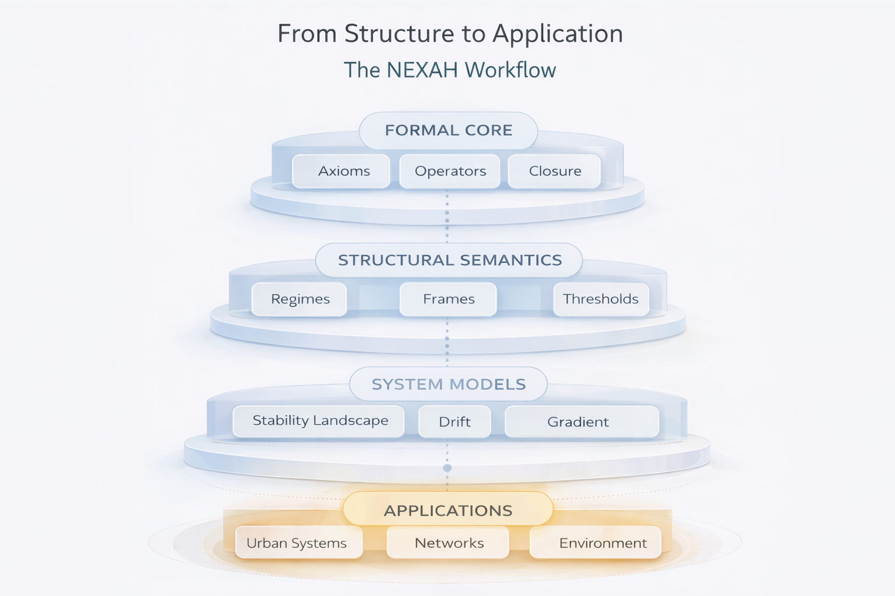
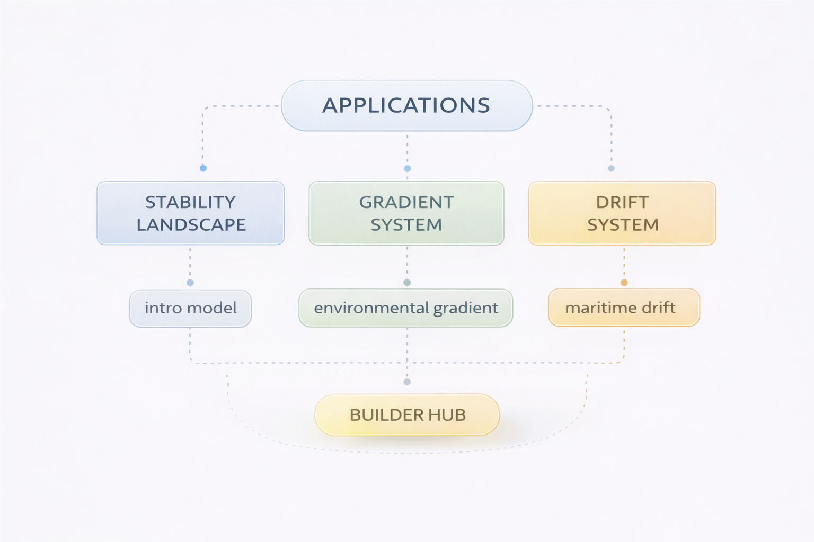
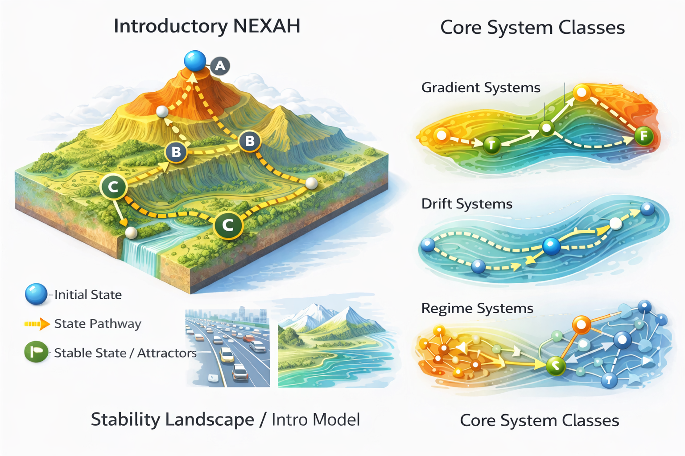

# NEXAH Applications

This directory contains practical system models and example applications built with the **NEXAH framework**.

While the core framework provides the structural operators and algorithms, the applications demonstrate how NEXAH can be used to analyze real-world systems.

In simple terms:

> **NEXAH helps understand where systems stabilize.**

Many complex systems evolve through different states and eventually reach stable configurations.  
NEXAH provides tools to model these systems structurally and compute their stable states.

---

# From Structure to Application

The NEXAH workflow connects formal structural theory with real-world system analysis.

The process follows four conceptual layers:

**Formal Core → Structural Semantics → System Models → Applications**

- **Formal Core** defines the mathematical and logical operators.
- **Structural Semantics** introduces regimes, frames, and thresholds.
- **System Models** represent specific structural dynamics.
- **Applications** demonstrate how these models analyze real systems.

---

# Application Structure

The applications follow a simple conceptual progression:

Stability Landscape (intro model)
↓
Three structural system classes
↓
Example applications

The goal is to show how general system dynamics can be represented, analyzed, and applied using NEXAH.

---

# Intro Model

The **intro model** introduces the central idea of NEXAH:

Systems evolve through possible states and eventually stabilize.

This is represented as a **stability landscape**, where system states move toward stable attractors.

Directory:

# APPLICATIONS/STABILITY_LANDSCAPE
This model provides the conceptual foundation for the applications that follow.

---

# Core System Classes

NEXAH focuses on three fundamental classes of structural systems.

Each class represents a different type of system dynamics.

---

## Gradient Systems

Systems that evolve along an ordered gradient.

Examples:

- temperature gradients  
- altitude or pressure systems  
- energy landscapes  
- ecological distributions  

Example application:

The goal is to show how general system dynamics can be represented, analyzed, and applied using NEXAH.

---

## Intro Model

The **intro model** introduces the central idea of NEXAH:

Systems evolve through possible states and eventually stabilize.

This is represented as a **stability landscape**, where system states move toward stable attractors.

Directory:

# APPLICATIONS/STABILITY_LANDSCAPE

This model provides the conceptual foundation for the applications that follow.

---

# Core System Classes

NEXAH focuses on three fundamental classes of structural systems.

Each class represents a different type of system dynamics.

---

## Gradient Systems

Systems that evolve along an ordered gradient.

Examples:

- temperature gradients  
- altitude or pressure systems  
- energy landscapes  
- ecological distributions  

Example application:

# APPLICATIONS/GRADIENT_SYSTEM

---

## Drift Systems

Systems that move through a structured space under external forces.

Examples:

- ocean currents  
- particle drift  
- migration flows  
- atmospheric transport  

Example application:

# APPLICATIONS/DRIFT_SYSTEM

---

## Regime Systems

Systems that transition between different structural regimes.

Examples:

- traffic flow vs congestion  
- market regimes  
- ecosystem state transitions  
- infrastructure thresholds  

Example application:

## APPLICATIONS/REGIME_SYSTEM

---

# Builder Hub

Experimental ideas and community-built applications are collected in:

This area is intended for:

- new application ideas
- prototype system models
- experimental analyses
- community contributions

---

# Philosophy

NEXAH focuses on **finite structural systems**.

Instead of predicting outcomes purely through statistical methods, NEXAH analyzes the **structure of possible states** and determines where systems stabilize.

In short:

> **NEXAH explores the stability landscape of complex systems.**
