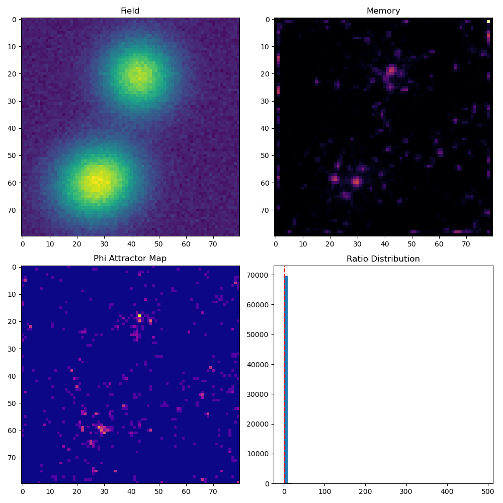

# NEXAH Applications  
**Structural Analysis and Regime Navigation in Complex Systems**

---

## 🧭 Overview

This directory contains **applied system modules** built with the NEXAH framework.

NEXAH explores how complex systems can be interpreted through:

→ structure  
→ flow  
→ geometry  
→ regime transitions  

Instead of focusing purely on event detection (e.g. collapse),  
NEXAH analyzes how systems evolve within **structured dynamical landscapes**.

---

## 🚀 Core Idea

NEXAH shifts the focus from:

→ discrete instability events  

to:

→ **continuous structural and regime-based analysis**

---

## ⚡ 1. Power Systems — Structural Analysis


### 🔍 Observations

- system trajectories exhibit **structured behavior**
- collapse appears as a **transition boundary**
- dynamics are consistent with **flow-like evolution**
- similar patterns appear across different system sizes  

---

### 🧠 Interpretation

> Power system stability can be interpreted as a  
> **trajectory evolving within a structured dynamical landscape**

---

### ⚙️ Current Capabilities

- structural analysis of IEEE test systems  
- trajectory-based interpretation of stability  
- regime transition detection (experimental)  
- scaling experiments up to **9241-bus systems**  

---

### ⚠️ Important Note

- early detection performance is **case-dependent**  
- no universal lead-time guarantee  
- results currently based on **synthetic and limited real scenarios**  

---

## 🧭 Entry Points

### 🔹 Quick Results
👉 [`power_systems/nexah_ieeeX/`](power_systems/nexah_ieeeX/README.md)

- scaling experiments  
- pipeline outputs  
- large-system behavior  

---

### 🔹 Full System Overview
👉 [`power_systems/`](power_systems/README.md)

- system architecture  
- field interpretation  
- navigation concepts  

---

### 🔹 Minimal Pipeline
👉 [`power_systems/nexah_ieee9`](power_systems/nexah_ieee9/README.md)

- clean reference implementation  
- simplified control experiments  

---

### 🔹 Structural Theory
👉 [`power_systems/stability_field_dynamics`](power_systems/stability_field_dynamics/ieee_test_cases/README.md)

- collapse geometry  
- stability distance  
- manifold structure  

---

### 🔹 Geometric Analysis
👉 [`power_systems/ieee_xray_pipeline`](power_systems/ieee_xray_pipeline/README.md)

- reduced state spaces  
- geometric embeddings  
- trajectory visualization  

---

## ⚡ Run Example

```bash
PYTHONPATH=. python APPLICATIONS/power_systems/nexah_ieeeX/decision/main_ieee300.py
```

# 🌀 2. Dynamical Systems — Reference Models



Reference systems:

- Lorenz attractor  
- gradient systems  
- drift systems  

---

## 🧠 Interpretation

Chaotic systems exhibit structured dynamics,  
which can be analyzed through regime transitions and geometry.

👉 [`dynamical_systems/lorenz`](dynamical_systems/lorenz/README.md)

---

# 🧩 3. Structural Theory — Collapse Geometry


Core concepts:

- manifold (expected system behavior)  
- boundary (instability transition)  
- distance (stability metric)  

---

## 🧠 Interpretation

Collapse is better understood as a  
**geometric transition within system structure**

---

# 🔵 4. Adapter Layer — System Integration
```test
System → Adapter → State Graph → NEXAH → Analysis
```

Supports:

- power grids  
- dynamical systems  
- synthetic environments  

👉 [`adapters/`](adapters/README.md)

---

# 🧠 Core Insight

Across all modules:

> Systems evolve along structured trajectories.  
> Instability emerges as a **regime transition**, not a single event.

NEXAH focuses on:

- structural analysis  
- trajectory interpretation  
- regime detection  

---

# 🧭 Navigation Guide

| Goal | Start Here |
|------|-----------|
| Large system experiments | `power_systems/nexah_ieeeX/` |
| System understanding | `power_systems/` |
| Code entry point | `power_systems/nexah_ieee9/` |
| Theory | `power_systems/stability_field_dynamics/` |

---

# 🌀 NEXAH

> From dynamics → structure  
> From structure → regimes  

---

**Scarabæus1033 · NEXAH**
