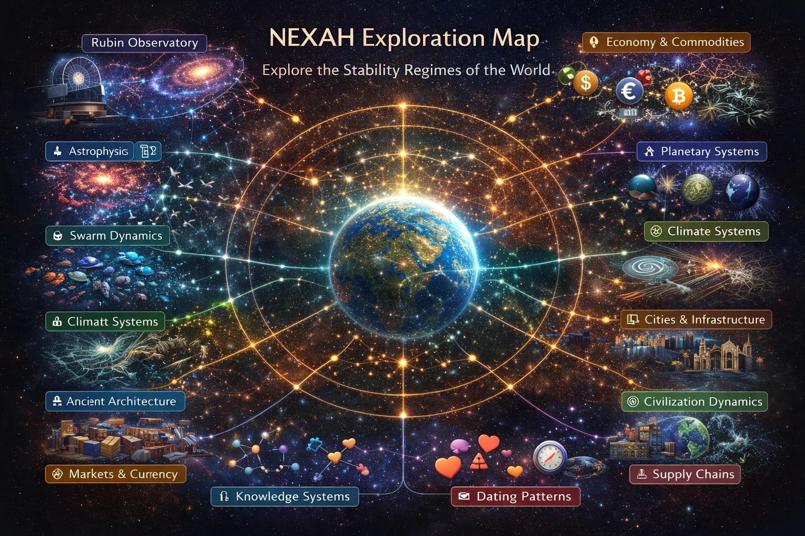

# NEXAH Applications



This directory contains **real-world system models and applications** built with the NEXAH framework.

> NEXAH does not just simulate systems —  
> it reveals their **structure, flow, and stability landscape**.

---

## ⚡ Real-World Application: Power Grid Stability (IEEE)

NEXAH has been successfully applied to **electrical power systems** using IEEE benchmark networks:

- IEEE 9  
- IEEE 14  
- IEEE 30  
- IEEE 118  

### What NEXAH reveals

- early instability signals (before collapse)  
- structural failure paths  
- branching collapse behavior  
- system evolution inside a field  

---

### 🔬 Example — Field-Based Collapse Dynamics (V69)


- trajectories follow structured directions  
- collapse emerges along flow paths  
- branching and divergence become visible  

---

### Why this matters

Classical methods:

→ detect collapse **late**  

NEXAH:

→ detects **structural instability early**  
→ reveals **how collapse develops**  
→ enables **navigation instead of observation**

---

## 🧭 From Framework to Applications

NEXAH follows a layered pipeline:

Framework  
↓  
Structure Extraction  
↓  
System Models  
↓  
Applications  
↓  
Exploration  

- **Framework** → defines structural operators  
- **Applications** → apply them to real systems  
- **Exploration Hub** → expands into new domains  

---

## 🔬 Core Application Models

| Model | Description | Module |
|------|-------------|--------|
| **Stability Landscape** | Attractor basins and system stability | [STABILITY_LANDSCAPE](./dynamical_systems/STABILITY_LANDSCAPE) |
| **Gradient Systems** | Motion along potential gradients | [GRADIENT_SYSTEM](./dynamical_systems/GRADIENT_SYSTEM) |
| **Drift Systems** | Gradient + external forcing | [DRIFT_SYSTEM](./dynamical_systems/DRIFT_SYSTEM) |
| **Regime Systems** | Multi-attractor transitions | [REGIME_SYSTEM](./dynamical_systems/REGIME_SYSTEM) |

---

## 🤖 Structural Navigation (Multi-Agent System)

NEXAH enables agents to navigate **stability landscapes without reward functions**.

Agents:

- explore system structure  
- detect stable regions  
- follow structural gradients  
- move along field-aligned paths  

Core idea:

> Agents do not optimize —  
> they follow **stable directions in the field**

Run demo:

```bash
python ENGINE/run_agent.py
```

---

## 🌪 Lorenz System — Reference Demonstrator

The Lorenz system serves as a **complete structural test case**.

NEXAH reconstructs:

- attractor geometry  
- basin boundaries  
- separatrix structures  
- regime transitions  
- stability landscapes  

---

### What this demonstrates

- chaotic systems contain hidden structure  
- transitions are not random  
- instability follows geometric patterns  

> Chaos is not randomness —  
> it is **structured and navigable**

Run demo:

```bash
python -m APPLICATIONS.run_navigation_demo
```

---

## 🔌 External System Integration

NEXAH connects to existing simulators via an adapter layer:

Simulator  
↓  
Adapter  
↓  
State Graph  
↓  
NEXAH Analysis  
↓  
Navigation  

Supported systems include:

- MATPOWER  
- pandapower  
- PyPSA  
- traffic simulations  
- supply chains  
- infrastructure systems  

Adapter location:

APPLICATIONS/adapters/

---

## 🌐 From Structure to Application


NEXAH bridges:

Formal Theory → Structure → System Models → Real Applications  

---

## 🧠 Core Idea

Everything in this directory follows one principle:

> Structure is not imposed —  
> it is extracted from dynamics.

---

## 🚀 What you can do here

- analyze real systems (power grids, Lorenz, networks)  
- detect instability early  
- visualize system structure and flow  
- explore stability landscapes  
- build new system models  

---

## 🔮 Outlook

The APPLICATIONS layer is evolving toward:

- real-world system integration  
- predictive stability control  
- autonomous navigation in complex systems  
- cross-domain structural analysis  

---

Scarabæus1033 · NEXAH
