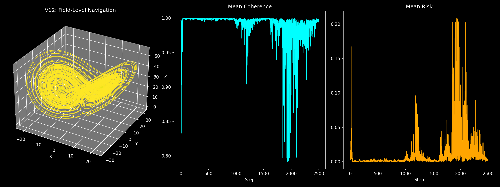
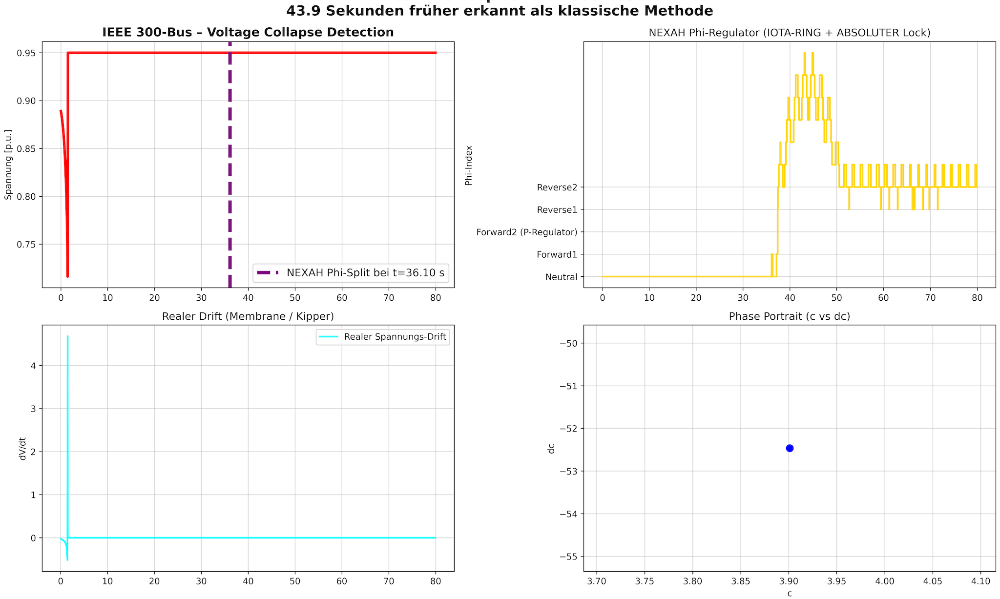
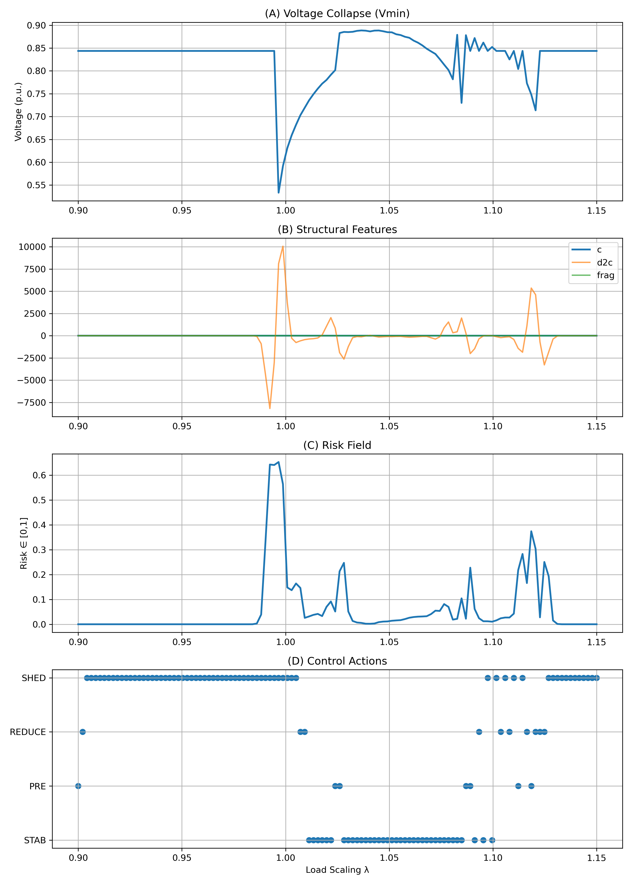
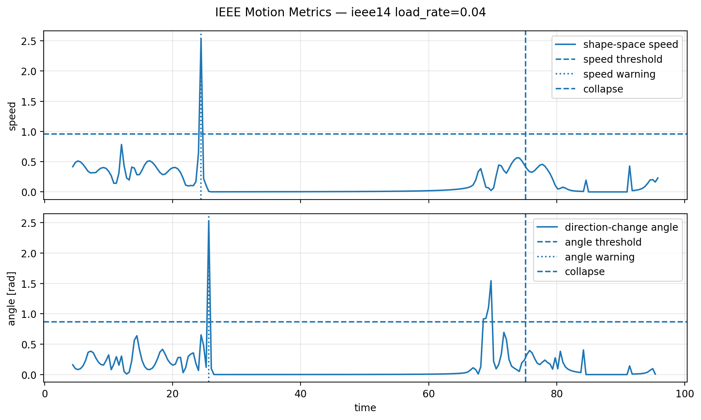
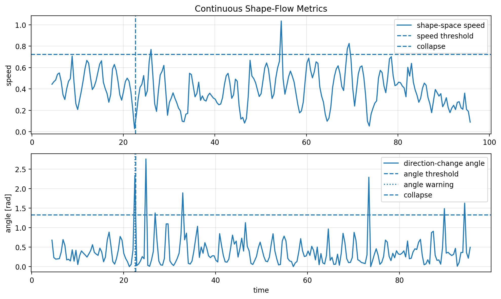
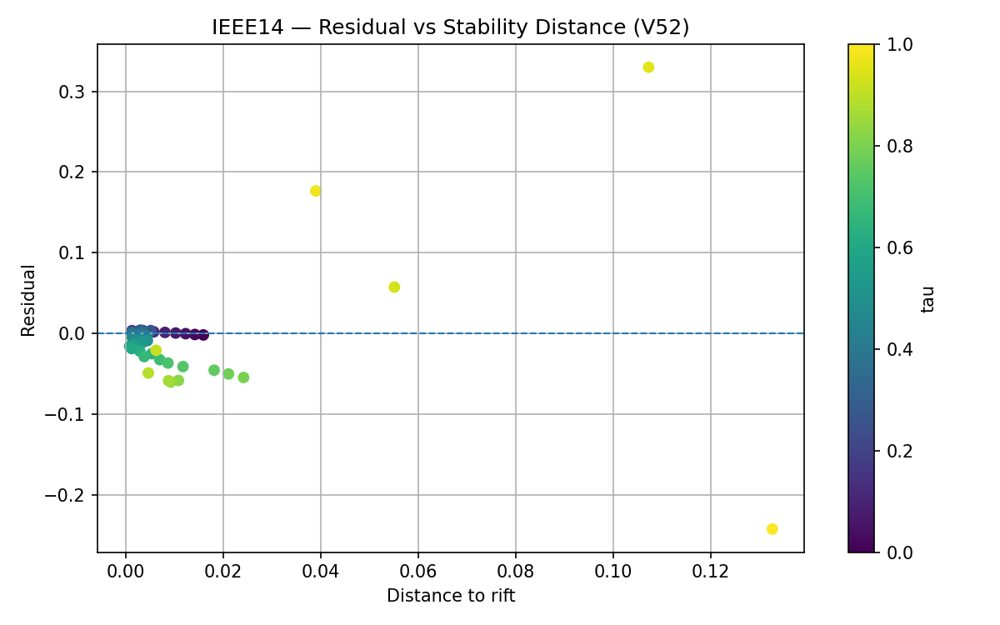

# NEXAH — Demonstrations of Structured Dynamics  
**Structural Analysis and Regime Navigation in Complex Systems**

---

## 🧭 Overview

This directory contains **validated demonstrations and early applications**  
of the NEXAH framework.

NEXAH provides a unified approach to analyzing complex systems through:

→ structure  
→ flow  
→ geometry  
→ regime transitions  

Instead of focusing on isolated events (e.g. collapse), NEXAH studies how systems evolve within:

> **structured dynamical landscapes**

---

## 🚀 Core Principle

Classical system analysis:

→ detects instability as a discrete event  

NEXAH:

→ interprets instability as a **continuous transition between regimes**

---

# 🧪 🔥 Validation Layer (CRITICAL)

📂 `power_systems/VALIDATION_LAYER/`

The Validation Layer provides **quantitative and structural evidence**  
for the NEXAH approach.

---

## Purpose

To test whether NEXAH can:

```text
detect instability earlier
and/or
reveal structural behavior beyond classical signals
```

---

## Key Mechanism

```text
signal → event → shape → geometry → motion
```

---

## Verified Results

- early warning up to **40–50 time units** (IEEE collapse scenarios)  
- instability appears as **geometric drift**, not threshold crossing  
- motion-based metrics (angle, speed) reveal **transition dynamics**  
- statistical validation confirms reliability (~86% detection rate)

---

## Interpretation

```text
Instability is not a point.

It is a movement through structure.
```

---

## References

- `power_systems/VALIDATION_LAYER/reports/validation_report_v3.md`  
- `power_systems/VALIDATION_LAYER/reports/validated_findings.md`  

---

# 🌀 1. Dynamical Systems — Core Reference (Lorenz)



The Lorenz system serves as the **reference implementation** of the NEXAH framework.

It demonstrates the core transformation pipeline:

```text
Dynamics → Structure → Geometry → Signal → Behavior
```

---

## 🧠 Key Insights

From the Lorenz module:

- chaotic systems exhibit **latent structure**
- trajectories form **repeatable patterns**
- transitions occur in **specific regions**
- signals emerge directly from local dynamics  
- behavior becomes **geometry-aware** rather than reactive  

---

## 🧭 Entry Point

👉 `core_demos/lorenz/README.md`

---

## 🧠 Interpretation

> The Lorenz system is a **minimal working example** of NEXAH:
>
> a system where dynamics and structure can be observed in a unified way.

---

# ⚡ 2. Power Systems — Structural Stability Analysis



*Structural transition behavior in large-scale power system dynamics.*



*Field-based analysis pipeline and resulting system structure.*

---

## 🔬 Highlight Results

### ⚡ Early Warning — IEEE Collapse Sweep



**Observation:**
- collapse under high load stress (~60–75)  
- NEXAH warning significantly earlier (~20–25)  

**Result:**

```text
Lead time ≈ 40–50 time units
```

---

### 🌀 Geometric Instability — Continuous Shape Flow



**Observation:**
- angle spikes precede collapse  
- speed increases later  

**Interpretation:**

```text
Instability emerges as directional change in system motion
```

---

## 🔍 Observations

- system trajectories exhibit **structured organization**  
- collapse appears as a **boundary in state space**  
- system evolution follows **flow-like dynamics**  
- qualitative patterns persist across different network sizes  

---

## 🧠 Interpretation

> Power system stability can be interpreted as a  
> **trajectory within a structured dynamical landscape**

---

⚠️ These results are based on controlled simulations  
and should be interpreted as **validated structural behavior**, not final operational guarantees.

---

## ⚙️ Current Capabilities

- structural analysis of IEEE test systems  
- trajectory-based stability interpretation  
- experimental regime transition detection  
- scaling up to **9241-bus systems**  

---

## ⚠️ Important Note

- early detection performance is **scenario-dependent**  
- no universal guarantee of lead time  
- validation on real-world data is ongoing  

---

## 🧭 Entry Points

| Purpose | Path |
|--------|------|
| Quick results | `power_systems/nexah_ieeeX/` |
| Full overview | `power_systems/` |
| Minimal pipeline | `power_systems/nexah_ieee9/` |
| Structural theory | `power_systems/stability_field_dynamics/` |
| Geometric analysis | `power_systems/ieee_xray_pipeline/` |
| Validation (critical) | `power_systems/VALIDATION_LAYER/` |

---

## ⚡ Run Example

```bash
PYTHONPATH=. python APPLICATIONS/power_systems/nexah_ieeeX/decision/main_ieee300.py
```

---

# 🧩 3. Structural Theory — Collapse Geometry



---

## 🧠 Interpretation

> Collapse is not a singular failure event,  
> but a **geometric transition within system structure**

---

# 🔵 4. Adapter Layer — System Integration

```text
System → Adapter → State Graph → NEXAH → Analysis
```

Supported domains:

- power systems  
- dynamical systems  
- synthetic environments  

👉 `adapters/README.md`

---

# 🧠 Unified Insight

Across all modules:

> Systems evolve along structured trajectories.  
> Instability emerges as a **transition between regimes**, not a single event.

---

# 🧭 Navigation Guide

| Goal | Start Here |
|------|-----------|
| Understand the framework | `core_demos/lorenz/` |
| Explore validation | `power_systems/VALIDATION_LAYER/` |
| Explore large-scale systems | `power_systems/nexah_ieeeX/` |
| Run minimal example | `power_systems/nexah_ieee9/` |
| Study structure | `power_systems/stability_field_dynamics/` |

---

# 🌀 NEXAH

```text
dynamics → structure → flow → geometry → regimes → navigation
```

---

**Thomas K. R. Hofmann · NEXAH**
