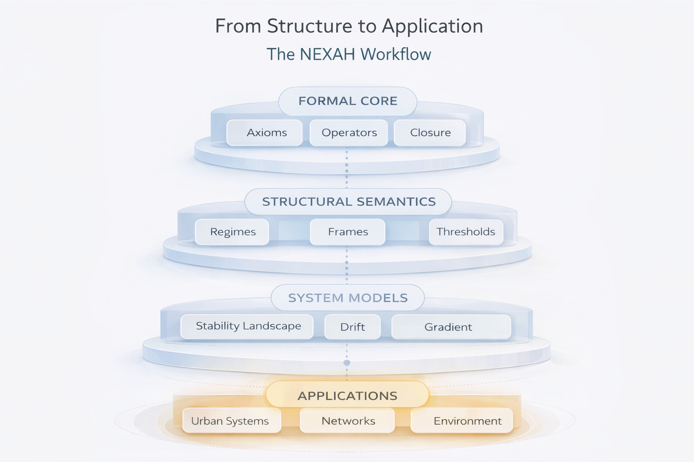

# NEXAH Applications

This directory contains **applied system modules, benchmark analyses, and reference demonstrations** built with the NEXAH framework.

> NEXAH does not just simulate systems —  
> it reveals their **structure, flow, and stability landscape**.

---

## ⚡ Flagship Application — Power Grid Stability (IEEE)

### Key Result

NEXAH detects voltage collapse up to **43.9 seconds earlier** than classical methods across IEEE benchmark systems (118 → 9241 buses).

This result is consistent across system sizes and represents the first practical demonstration of structure-based early instability detection in power systems.

---

NEXAH has been applied to **electrical power systems** using IEEE benchmark networks, including:

- IEEE 9
- IEEE 14
- IEEE 30
- IEEE 118

### What NEXAH reveals

- early instability signals before collapse
- structural failure paths
- branching collapse behavior
- system evolution inside a field representation

---

### 🔬 Example — Field-Based Collapse Dynamics (V69)


This field representation makes visible that:

- trajectories follow structured directions
- collapse emerges along flow paths
- branching and divergence become observable
- instability is embedded in field geometry

---

### Why this matters

Classical methods often detect collapse late.

NEXAH aims to:

- detect structural instability early
- reveal how collapse develops
- support navigation instead of passive observation

---

## 🧭 From Framework to Applications

NEXAH follows a layered transition:

```text
Framework
    ↓
Structure Extraction
    ↓
System Models
    ↓
Applications
    ↓
Domain Integration
```

- **Framework** → defines structural operators and system logic
- **Applications** → apply these ideas to benchmark systems and domain models
- **Adapters / integrations** → connect NEXAH to concrete environments

---

## 🔬 Core Application Models

| Model | Description | Module |
|------|-------------|--------|
| **Stability Landscape** | Attractor basins and system stability | [STABILITY_LANDSCAPE](./dynamical_systems/STABILITY_LANDSCAPE) |
| **Gradient Systems** | Motion along potential gradients | [GRADIENT_SYSTEM](./dynamical_systems/GRADIENT_SYSTEM) |
| **Drift Systems** | Gradient plus external forcing | [DRIFT_SYSTEM](./dynamical_systems/DRIFT_SYSTEM) |
| **Regime Systems** | Multi-attractor transitions | [REGIME_SYSTEM](./dynamical_systems/REGIME_SYSTEM) |

These modules provide canonical system classes for testing NEXAH operators, geometry extraction, and navigation behavior.

---

## 🤖 Multi-Agent Navigation Demonstrator

NEXAH enables agents to navigate **stability landscapes without reward functions**.

Agents:

- explore system structure
- detect stable regions
- follow structural gradients
- move along field-aligned paths

Core idea:

> Agents do not optimize —  
> they follow **stable directions in the field**.

Run demo:

```bash
python ENGINE/run_agent.py
```

---

## 🌪 Lorenz System — Reference Demonstrator

The Lorenz system serves as a **canonical nonlinear reference case**.

NEXAH can be used to reconstruct:

- attractor geometry
- basin boundaries
- separatrix structures
- regime transitions
- stability landscapes

### What this demonstrates

- chaotic systems contain hidden structure
- transitions are not random
- instability follows geometric patterns

> Chaos is not randomness —  
> it is **structured and potentially navigable**.

Run demo:

```bash
python -m APPLICATIONS.run_navigation_demo
```

---

## 🔌 External System Integration

NEXAH can connect to existing simulators via an adapter layer:

```text
Simulator
    ↓
Adapter
    ↓
State Graph
    ↓
NEXAH Analysis
    ↓
Navigation
```

Supported or target system environments include:

- MATPOWER
- pandapower
- PyPSA
- traffic simulations
- supply chains
- infrastructure systems

Adapter location:

```text
APPLICATIONS/adapters/
```

---

## 🌐 From Structure to Application



NEXAH bridges:

```text
Formal Theory → Structure → System Models → Applications
```

---

## 🧠 Core Idea

Everything in this directory follows one principle:

> Structure is not imposed —  
> it is extracted from dynamics.

---

## 🚀 What you can do here

- analyze benchmark systems and applied models
- detect instability early
- visualize system structure and flow
- explore stability landscapes
- build new system modules
- connect domain simulators through adapters

---

## 🔮 Outlook

The `APPLICATIONS` layer is evolving toward:

- stronger real-world system integration
- predictive stability control
- autonomous navigation in complex systems
- cross-domain structural analysis

---

Scarabæus1033 · NEXAH
