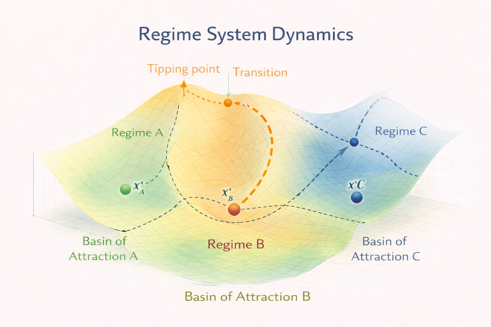

# Regime Systems

This module introduces **Regime Systems**, a class of dynamical systems that operate within multiple structural regimes.

Unlike gradient or drift systems, regime systems contain **multiple stable attractors separated by transition boundaries**.

The diagram illustrates a stability landscape containing several distinct regimes.  
Each regime corresponds to a **basin of attraction** with its own stable equilibrium state.

Transitions between regimes occur when the system crosses a **tipping point** in the landscape.

---

# Core Idea

In regime systems, the stability landscape contains **multiple attractor basins**.

Each basin represents a different structural state of the system.

Examples of such regimes include:

- climate states
- ecological equilibria
- economic phases
- infrastructure operating states

Within a basin, system dynamics behave similarly to gradient or drift systems.

However, crossing the boundary between basins can lead to **sudden structural transitions**.

---

# Regime Transitions

Regime transitions occur when the system moves across a **stability boundary**.

These boundaries correspond to:

- saddle points in the stability landscape
- bifurcation thresholds
- tipping points between attractor basins

Small changes in system parameters can therefore lead to **large qualitative changes in system behavior**.

---

# Tipping Points

A tipping point occurs when the system crosses a critical threshold in the landscape.

Beyond this threshold, the system may move rapidly toward a **different attractor basin**.

Such transitions are often difficult to reverse.

Examples include:

- ecosystem collapse
- climate regime shifts
- financial crises
- infrastructure failure cascades

---

# Basin Structure

Each attractor has an associated **basin of attraction**.

This basin contains all initial states that eventually converge toward that attractor.

The structure of these basins determines:

- system resilience
- recovery potential
- sensitivity to perturbations

Understanding basin geometry is therefore crucial for analyzing regime systems.

---

# Relation to Other NEXAH Models

Regime systems extend the previous models in the NEXAH framework.

The hierarchy of models becomes:

- **Gradient Systems** – purely stability-driven dynamics
- **Drift Systems** – gradient dynamics with external forcing
- **Regime Systems** – multiple attractor basins with structural transitions

Regime systems represent the most complex class of dynamics in the core stability landscape framework.

---

# Applications

Many real-world systems behave as regime systems.

Examples include:

- climate tipping points
- urban infrastructure resilience
- ecological regime shifts
- energy system transitions

These applications are explored in later modules of the NEXAH framework.
