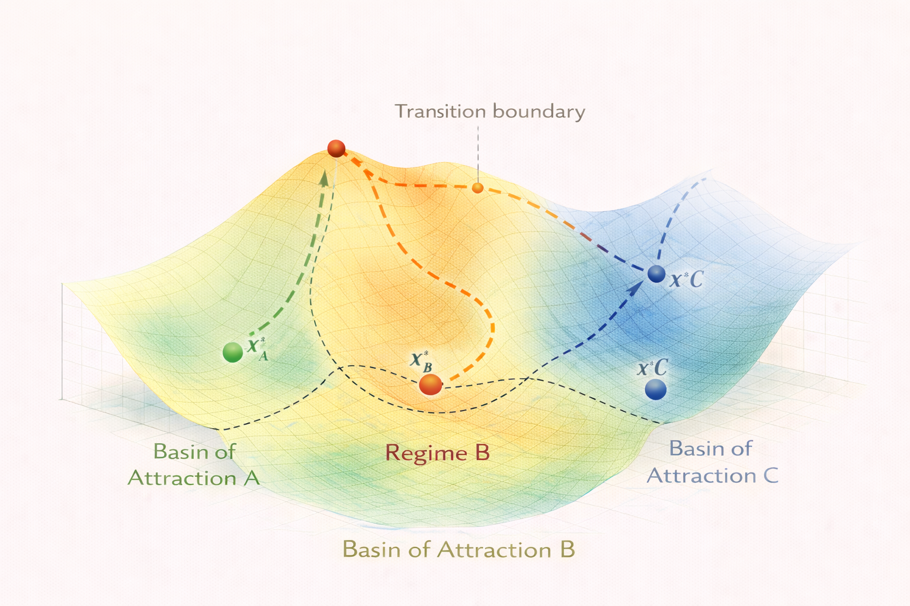

# Regime Systems – Concept

Regime systems describe dynamical systems that contain **multiple stable configurations**, each corresponding to a different structural regime.

Instead of evolving within a single attractor basin, the system may transition between different basins under changing conditions.

The diagram illustrates how a system may move across a stability landscape that contains multiple attractor basins.

Each basin corresponds to a **distinct regime** of the system.

---

# Multiple Stability Basins

In regime systems, the stability landscape contains several **basins of attraction**.

Each basin contains a stable equilibrium state:

x*_A  
x*_B  
x*_C  

These attractors correspond to different long-term configurations of the system.

Within a basin, system behavior resembles gradient or drift dynamics.

However, transitions between basins lead to **structural changes in system behavior**.

---

# Transition Boundaries

Basins of attraction are separated by **transition boundaries**.

These boundaries correspond to:

- saddle points in the stability landscape  
- instability ridges  
- bifurcation thresholds  

Crossing such a boundary may cause the system to move toward a **different attractor basin**.

This is the fundamental mechanism behind **regime shifts**.

---

# Transition Pathways

When a system approaches a boundary between regimes, several transition pathways may exist.

Small perturbations can determine which basin the system ultimately enters.

Possible pathways include:

- direct transition between adjacent basins  
- multi-step transitions through intermediate states  
- delayed transitions triggered by external forcing  

Understanding these pathways is essential for predicting regime changes.

---

# Regime Stability

Each regime has its own degree of stability.

The stability of a regime depends on:

- the depth of its attractor basin  
- the shape of the surrounding landscape  
- external forcing conditions  

Deep basins correspond to **highly resilient regimes**, while shallow basins can shift easily under perturbations.

---

# System Implications

Regime systems often exhibit behaviors such as:

- tipping points  
- hysteresis effects  
- abrupt structural transitions  
- nonlinear recovery dynamics  

These behaviors are characteristic of complex systems operating near stability boundaries.

---

# Connection to Applications

Many real-world systems behave as regime systems.

Examples include:

- climate tipping points  
- ecosystem regime shifts  
- urban infrastructure transitions  
- economic phase changes  

In the NEXAH framework, regime systems provide the foundation for analyzing **large-scale structural transitions in complex systems**.
