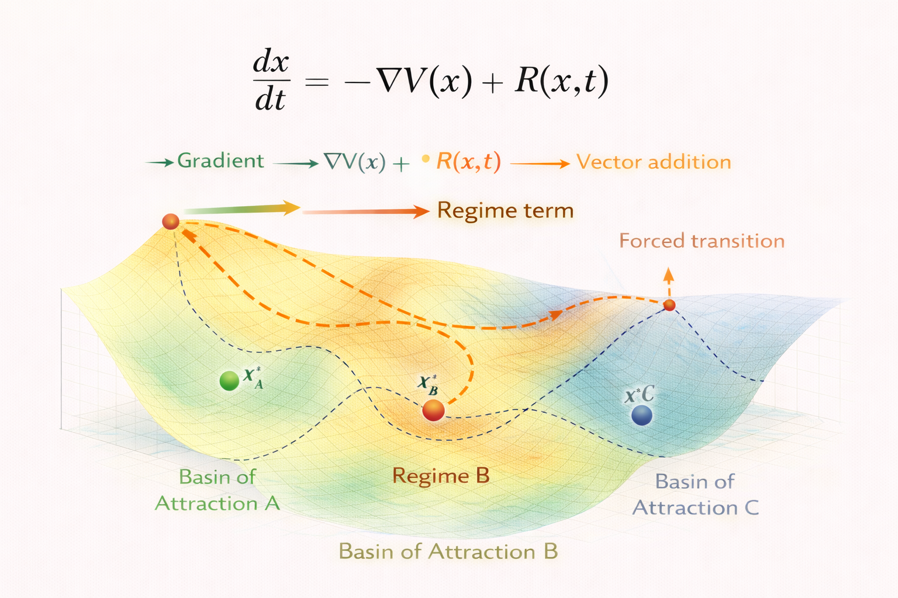

# Regime Systems – Formal Model

This document introduces the mathematical formulation of **regime systems** in the NEXAH framework.

Regime systems extend gradient and drift dynamics by allowing **transitions between multiple attractor basins** in the stability landscape.

The diagram illustrates how system motion may lead to **transitions between stability regimes** when the system crosses basin boundaries.

---

# System State

A system is described by a state vector:

x ∈ S

where

- **x** represents the current system configuration  
- **S** represents the state space of possible configurations  

The system evolves continuously through time.

---

# Stability Landscape

As in the previous models, system dynamics occur within a stability landscape defined by a potential function:

V(x)

This function determines the structure of attractor basins within the state space.

Stable attractors occur where:

∇V(x*) = 0  
∇²V(x*) > 0  

Each attractor corresponds to a **stable regime** of the system.

---

# Regime Extension

In regime systems, additional forces may drive the system across basin boundaries.

The dynamics can therefore be expressed as:

dx/dt = -∇V(x) + R(x,t)

where

- **-∇V(x)** represents the stabilizing gradient force  
- **R(x,t)** represents regime-driving forces  

These forces may arise from:

- parameter shifts
- environmental forcing
- structural system changes

---

# Regime Transition

When the system approaches a boundary between basins, the stability of the current regime decreases.

Crossing this boundary leads to a **regime transition**, where the system begins to move toward a different attractor basin.

Such transitions often occur near:

- saddle points
- bifurcation thresholds
- tipping points

---

# Transition Dynamics

Regime transitions may follow complex pathways through the landscape.

Possible behaviors include:

- direct transitions between attractors  
- multi-stage transitions through intermediate states  
- delayed transitions triggered by external forcing  

These dynamics produce the nonlinear behavior often observed in complex systems.

---

# System Implications

Regime systems may exhibit:

- tipping points  
- hysteresis effects  
- abrupt system shifts  
- nonlinear recovery dynamics  

These behaviors are characteristic of systems operating near **structural stability boundaries**.

---

# Relation to Other Models

Regime systems extend the previous models in the NEXAH framework:

- **Gradient Systems**  
  dx/dt = -∇V(x)

- **Drift Systems**  
  dx/dt = -∇V(x) + F(x,t)

- **Regime Systems**  
  dx/dt = -∇V(x) + R(x,t)

Together these models form the **core dynamical framework of NEXAH**.
