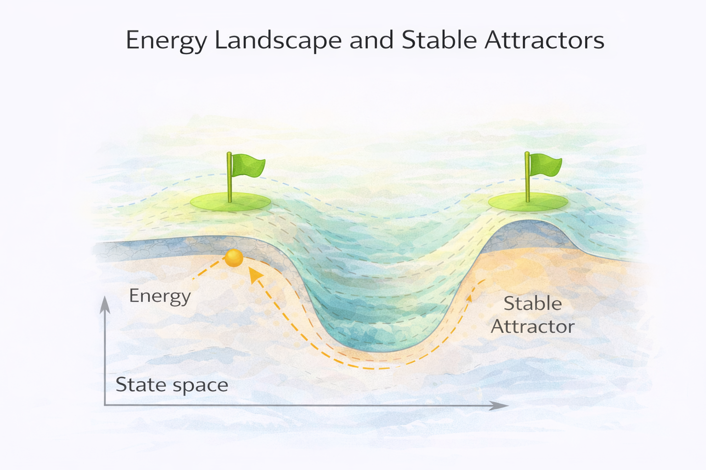
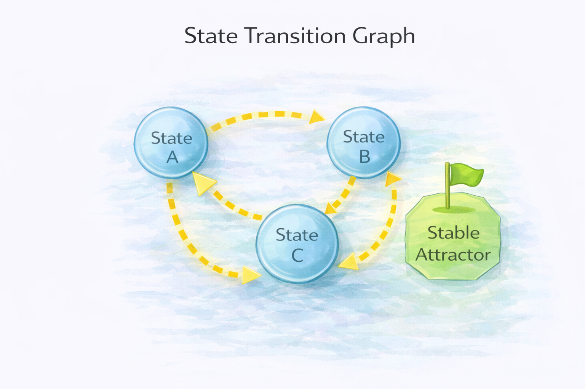
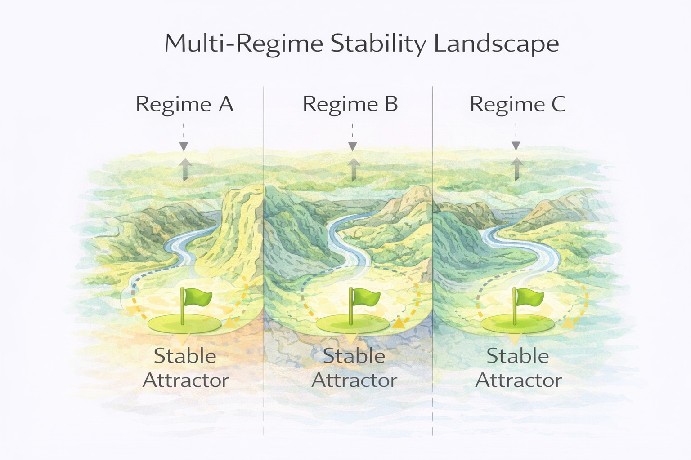

# Stability Landscape – Concept

The **Stability Landscape Model** introduces the core conceptual idea behind the NEXAH framework.

Many real-world systems evolve through a space of possible configurations.  
Over time, these systems tend to move toward **stable regions** within that space.

NEXAH represents this process using the concept of a **stability landscape**.

---

# The Stability Landscape Idea

A system can be represented as a point moving through a structured landscape.

In this interpretation:

- the **landscape** represents the *space of possible system states*
- **movement** represents *system dynamics*
- **valleys** represent *stable configurations*
- **ridges or barriers** represent *structural thresholds*

Over time, systems tend to move toward lower-energy or more stable regions of the landscape.

These regions are known as **stable attractors**.

---

# System States and Dynamics

At any moment, a system occupies a specific **state** within the landscape.

The system may transition between states depending on internal dynamics or external influences.

These transitions form **state pathways** through the landscape.

Each possible movement represents a structural transition between states.

The collection of all possible states and transitions forms the **state space** of the system.

---

# Structural Regimes

In many real-world systems, the landscape contains **multiple regimes**.

A regime is a region of the landscape with distinct structural behavior.

Examples of regimes include:

- ecological system states
- economic market regimes
- traffic flow patterns
- climate system configurations

Transitions between regimes occur when the system crosses **structural thresholds** in the landscape.

---

# Complex Landscapes

Real-world systems often contain multiple attractors and pathways.

A system may move through several intermediate states before reaching a stable configuration.

Possible outcomes include:

- stabilization in different attractor regions
- transitions between regimes
- complex multi-path dynamics

NEXAH focuses on identifying the structural properties of these landscapes.

---

# Key Idea

The central question of the NEXAH framework is:

> **Where does a system stabilize?**

Rather than predicting exact trajectories, the framework analyzes:

- the structure of possible states
- the transitions between states
- the stable attractors within the landscape

Understanding this structure allows us to analyze:

- system resilience
- regime shifts
- tipping points
- long-term system evolution

---

# Relation to NEXAH Models

The Stability Landscape model provides the conceptual foundation for the application models that follow.

These models analyze specific classes of structural systems:

- **Gradient Systems**
- **Drift Systems**
- **Regime Systems**

Each model applies the stability landscape concept to a different type of system dynamics.
