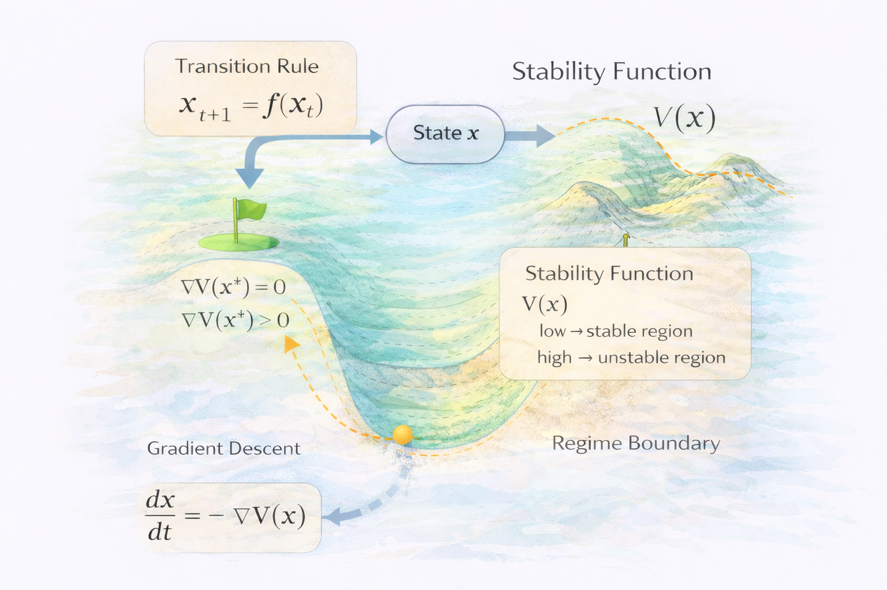

# Stability Landscape – Formal Model

This document introduces a minimal mathematical formulation of the **Stability Landscape Model** used in the NEXAH framework.

The goal is not to predict exact trajectories of complex systems, but to describe the **structural properties of their state space**.

The diagram above summarizes the key elements of the stability landscape formulation:

- the **transition rule** describing how the system evolves
- the **stability function** defining the structure of the landscape
- the **attractor conditions** that define stable states
- the **gradient descent dynamics** describing movement toward stability

The following sections define these elements formally.

---

# System State

A system is described by a state vector:

x ∈ S

where

- **x** represents the current system configuration
- **S** represents the state space of all possible configurations

The system evolves through time according to a transition rule.

---

# State Transition

System dynamics can be represented as a discrete update rule:

xₜ₊₁ = f(xₜ)

where

- **xₜ** is the system state at time t
- **f(·)** describes the system dynamics

This formulation describes how the system moves through the state space.

---

# Stability Function

To represent stability within the landscape we introduce a **potential function**:

V(x)

This function assigns a stability value to each possible system state.

Interpretation:

- low values of **V(x)** → stable regions
- high values of **V(x)** → unstable regions

---

# Attractors

Stable attractors occur where the gradient of the potential function vanishes:

∇V(x*) = 0

and

∇²V(x*) > 0

These points correspond to **local minima of the stability landscape**.

In practice this means the system tends to move toward these regions.

---

# Transition Dynamics

System movement through the landscape can be approximated by gradient descent:

dx/dt = -∇V(x)

This expresses the idea that systems tend to move toward lower-energy or more stable states.

---

# Regime Boundaries

Structural regime shifts occur when the system crosses a boundary between attractor basins.

These boundaries correspond to:

- saddle points
- ridges in the stability landscape
- bifurcation thresholds

Such transitions may lead to sudden qualitative changes in system behavior.

---

# Interpretation

The stability landscape framework allows us to analyze:

- attractor structures
- transition pathways
- regime boundaries
- system resilience

Instead of predicting exact trajectories, NEXAH focuses on the **structural organization of the state space**.

---

# Relation to Applications

The following models specialize this framework for different classes of systems:

- **Gradient Systems**
- **Drift Systems**
- **Regime Systems**

Each model defines a different structure for the transition function **f(x)**.
