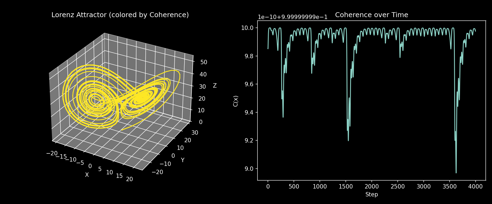
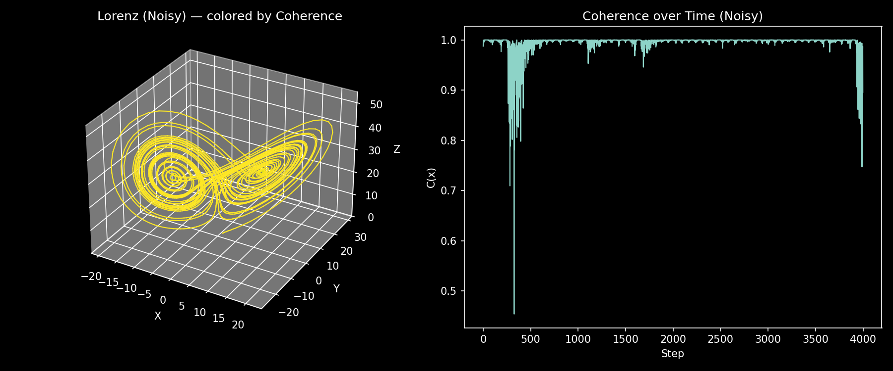
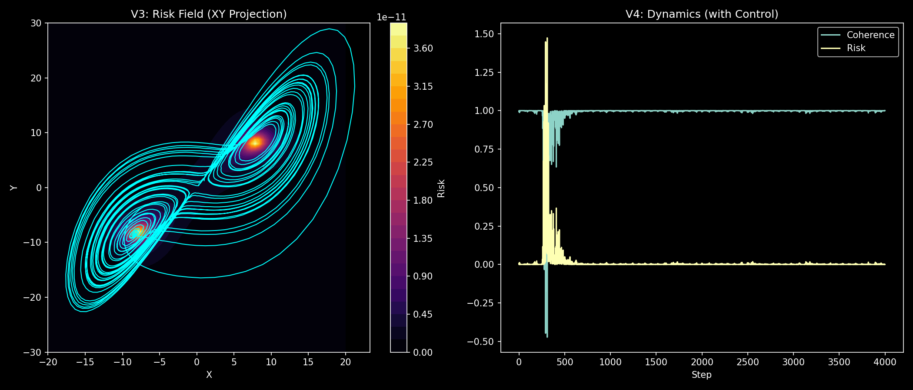
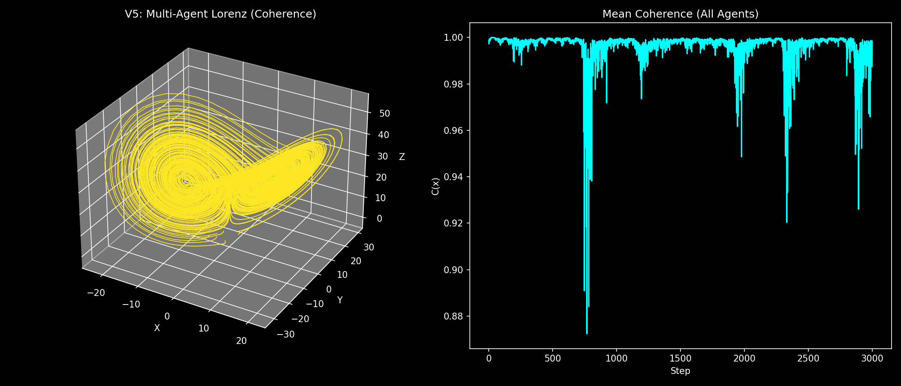
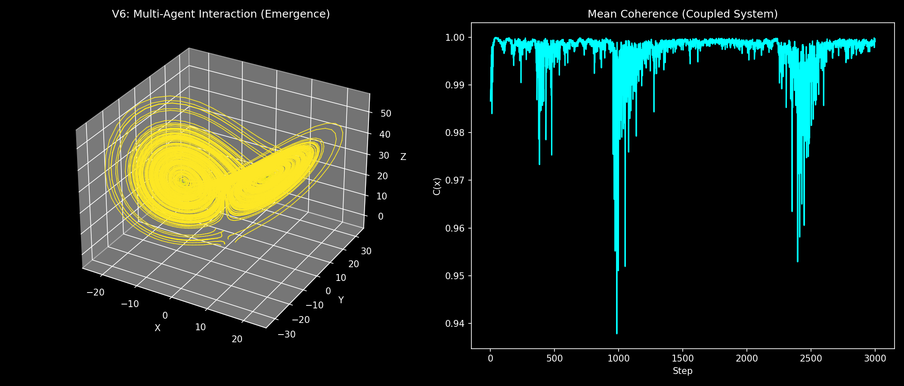
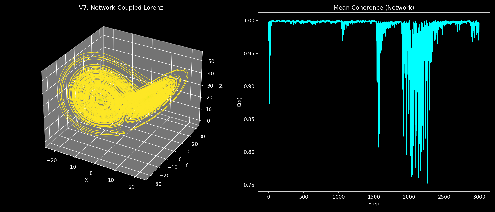
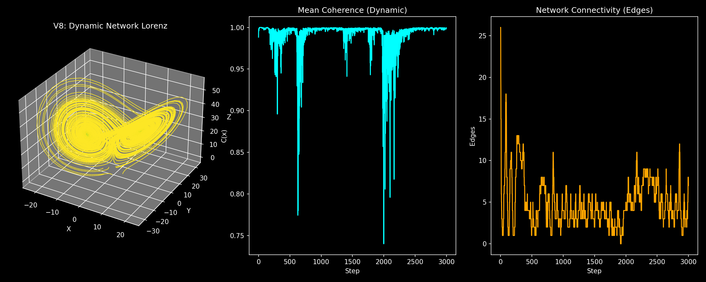
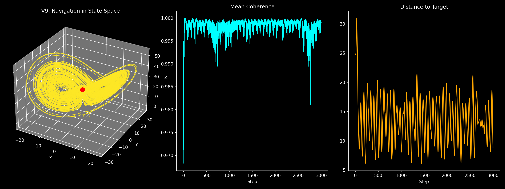
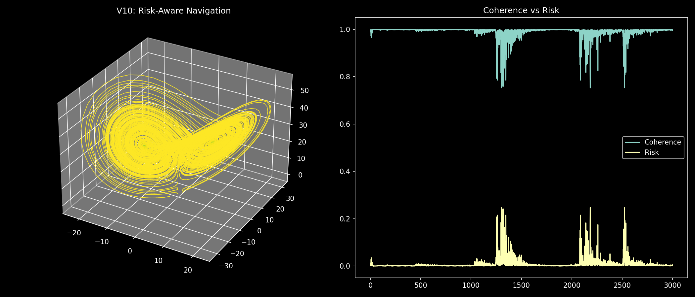
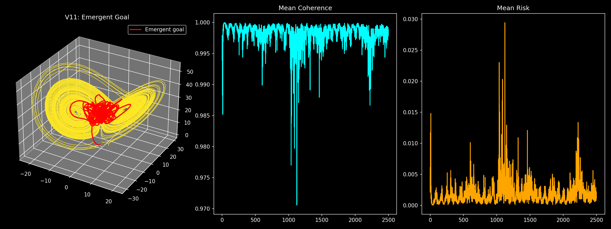

# 🎬 NEXAH — Visual System Gallery

This gallery documents the evolution of the NEXAH framework  
from simple dynamics to full field-level navigation.

---

## 🧭 Overview

The system progresses through 12 stages:

```text
V1 → V4   → Field & Metrics
V5 → V8   → Multi-Agent & Networks
V9 → V11  → Navigation & Emergence
V12       → Field-Level Navigation (Final)
```

# 🔹 V1 — Baseline Dynamics



**Concept:**
- raw Lorenz dynamics  
- near-perfect coherence (numerical baseline)  

👉 reference system without disturbance  

---

# 🔹 V2 — Noise & Real Dynamics



**Concept:**
- introduces noise  
- reveals instability  

👉 first deviation from ideal system  

---

# 🔹 V3–V4 — Risk & Coherence



**Concept:**
- coherence becomes measurable  
- risk defined as misalignment  

👉 chaos becomes **quantifiable**

---

# 🔹 V5 — Multi-Agent System



**Concept:**
- multiple trajectories  
- shared dynamics  

👉 emergence begins  

---

# 🔹 V6 — Interaction



**Concept:**
- local coupling between agents  
- stabilization through interaction  

👉 coordination reduces instability  

---

# 🔹 V7 — Network Structure



**Concept:**
- dynamic network  
- topology influences dynamics  

👉 structure emerges from proximity  

---

# 🔹 V8 — Dynamic Network



**Concept:**
- evolving network connectivity  
- adaptive interaction  

👉 system self-organizes  

---

# 🔹 V9 — Target Navigation



**Concept:**
- explicit goal introduced  
- agents move toward target  

👉 control via direction  

⚠️ Limitation:
- external targets distort dynamics  

---

# 🔹 V10 — Risk-Aware Navigation



**Concept:**
- navigation via risk minimization  
- no explicit target  

👉 first true field-based control  

---

# 🔹 V11 — Emergent Goal



**Concept:**
- goal emerges from system  
- agents follow low-risk regions  

👉 self-organized stability  

⚠️ Observation:
- system may become **over-stabilized**  

---

# 🔥 V12 — Field-Level Navigation (Final)


**Concept:**
- no external target  
- no emergent goal  
- no reward  

Only:

- field structure  
- local interaction  
- risk-aware motion  

👉 system navigates **within the field itself**

---


# 🧠 Key Observations

Across all versions:

### 1. Chaos = loss of alignment
- measured via coherence  

---

### 2. Interaction stabilizes dynamics
- networks reduce extreme deviations  

---

### 3. Explicit goals distort systems
- high coherence but reduced freedom  

---

### 4. Risk is a natural control signal
- enables navigation without targets  

---

### 5. Emergence can over-stabilize
- system collapses into low-variance states  

---

### 6. Optimal behavior is balanced

> Not maximum stability  
> Not maximum freedom  

But:

> **controlled movement within structure**

---

# 🌀 Final Statement

NEXAH demonstrates:

> complex systems can be understood and influenced  
> through **navigation within structured dynamical fields**

---

## 🧭 Core Principle

```text
dynamics → structure → field → regimes → navigation
