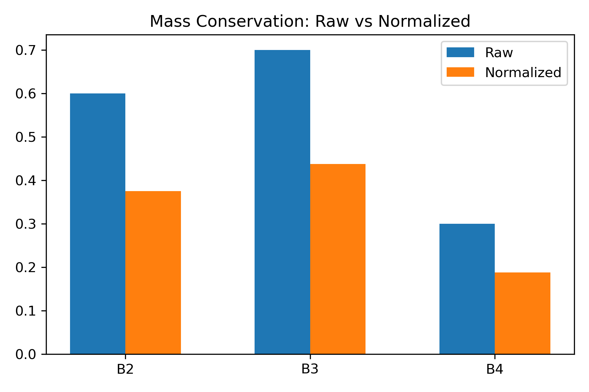
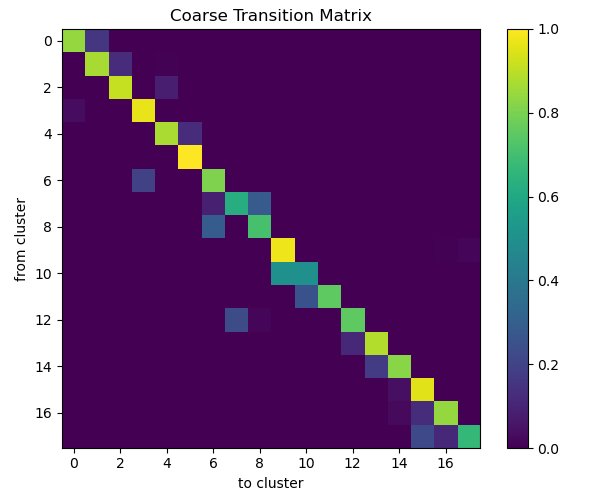
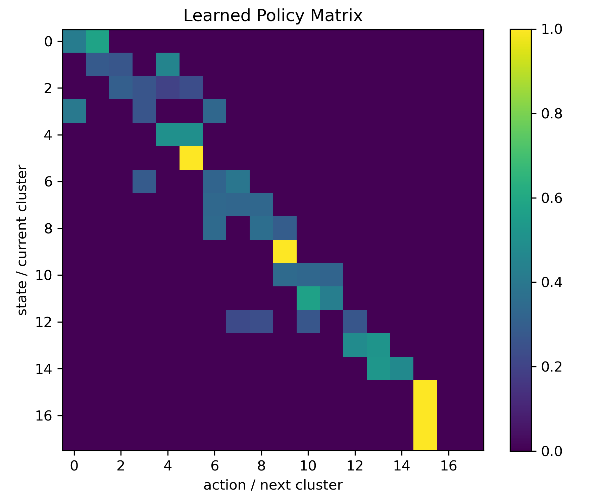
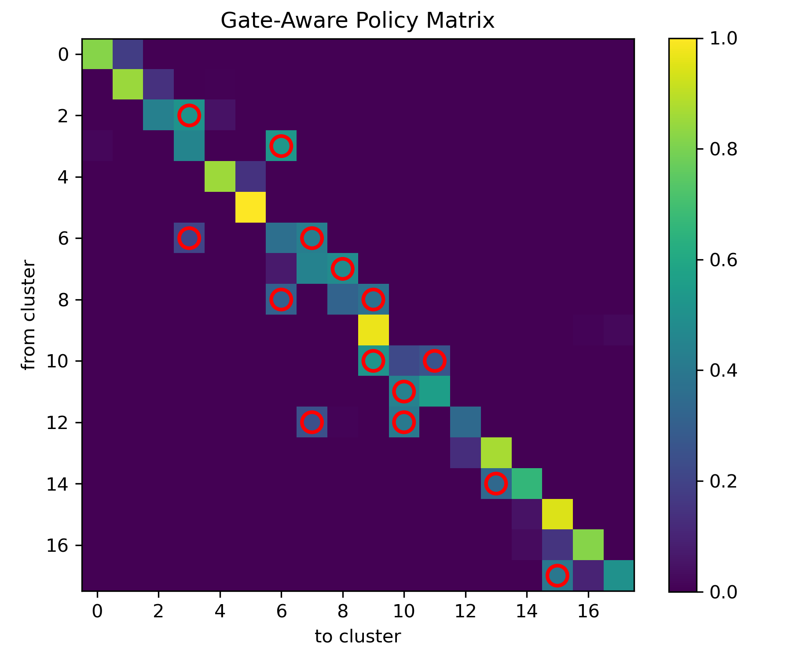
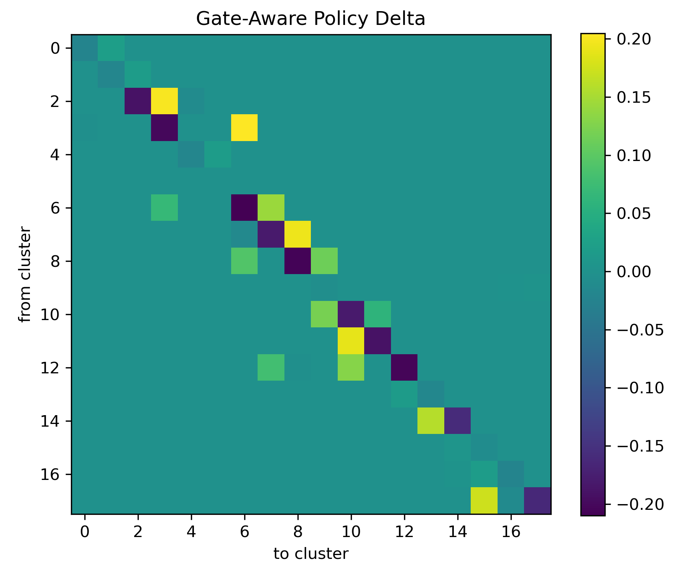
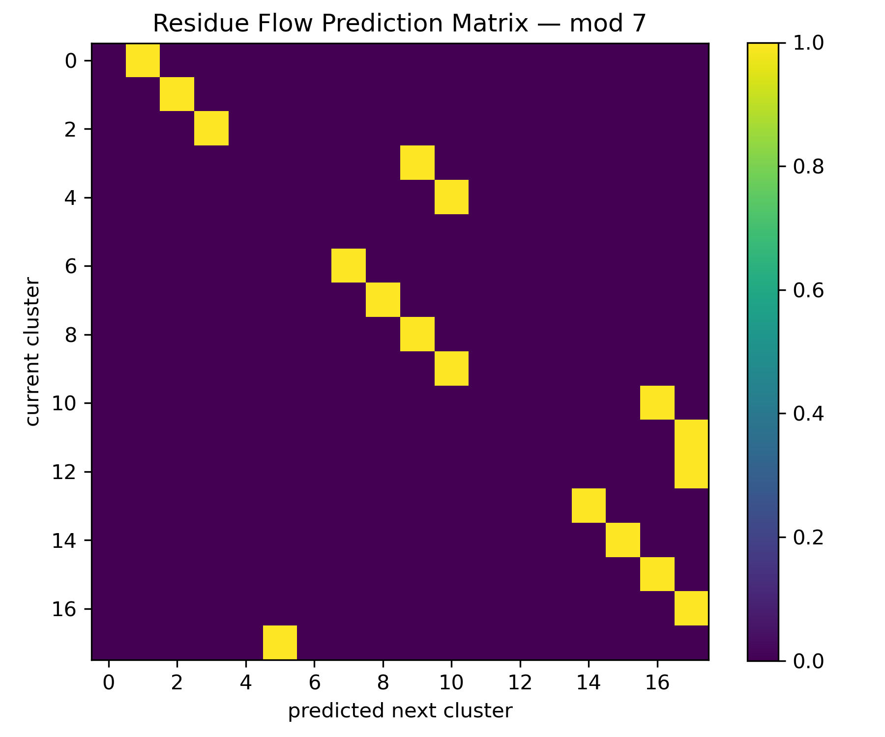
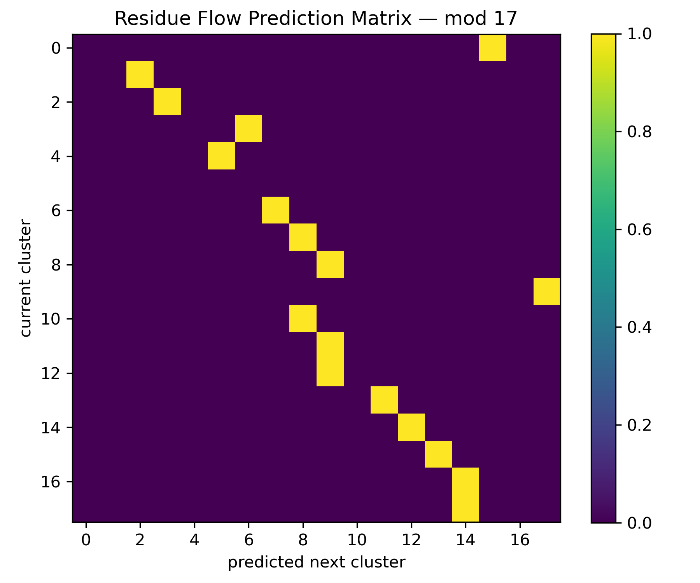
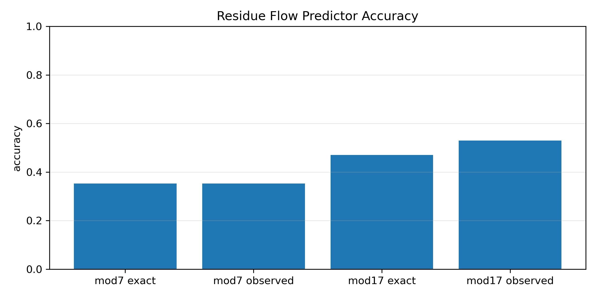

# NEXAH — Halvorsen Build Log

Status: ACTIVE  
System: Halvorsen Attractor  
Pipeline: Continuous Flow → Transition Matrix → Gates → Policy → Residue Dynamics → Dual-System Animation

---

## 0. RAW SYSTEM

Simulation of the Halvorsen attractor.


**Interpretation**

- Continuous chaotic flow  
- No explicit discrete structure yet  
- Attractor shows rotational / cyclic organization  

---

## 1. TRANSITION EXTRACTION


**Result**

- Flow discretized into transition states  
- Probabilistic transition graph extracted  
- First Markov-like representation  

---

## 2. MASS CONSERVATION CHECK



**Result**

- Row-normalized transition matrix  
- Markov structure validated  

```text
Σ P(B_i → B_j) = 1
```

---

## 3. COARSE GRAINING



**Result**

- Collapse into basins  
- Strong diagonal structure emerges  
- Off-diagonal = transition channels  

**Key insight**

- quasi-chain + cyclic movement  

---

## 4. GATE DETECTION


**Result**

- rare but structured transitions  
- escape / switching channels  

**Interpretation**

- gates = structured transition corridors  
- not noise  

---

## 5. GATE GRAPH


**Result**

- sparse control skeleton  
- local cycles + directional structure  

---

## 6. PATH PLANNING

```text
6 → 15 : NO PATH
```

**Interpretation**

- fragmented system  
- navigation requires intervention  

---

## 7. REACHABILITY


**Result**

- multiple disconnected components  

**Interpretation**

- no global connectivity  
- defines control targets  

---

## 8. COMPONENT CONNECTION


**Bridges**

```text
5 → 3
14 → 9
11 → 15
```

**Interpretation**

- control = topology repair  

---

## 9. GLOBAL POLICY


**Target**

```text
cluster 15
```

**Key funnel**

```text
9 → 17 → 15
```

---

## 10. ADAPTIVE BRIDGING


**Result**

- data-driven bridges  
- smoother connectivity  

---

## 11. POLICY GRADIENT




**Result**

```text
~0.11 → ~0.23 success
```

---

## 12. GATE-AWARE POLICY





**Result**

- emphasizes critical transitions  
- suppresses noise  

---

## 13. FLOW DECOMPOSITION


### Lorenz

- discrete switching  
- few strong edges  

### Halvorsen

- distributed cyclic flow  
- many medium edges  

---

## 14. RESIDUE FLOW MODEL

  





**Result**

```text
mod7 exact     ≈ 0.07
mod7 observed  ≈ 0.27
mod17 exact    ≈ 0.27
mod17 observed ≈ 0.27
```

**Interpretation**

- residue structure captures real transitions  
- mod17 > mod7  
- structure is real but incomplete  

---

## 15. DUAL SYSTEM ANIMATION


**Observation**

- Lorenz → switching between lobes  
- Halvorsen → rotational cycling  
- both share structured transition logic  

---

## GLOBAL INTERPRETATION

Halvorsen is NOT:

```text
a regime-switch system
```

Halvorsen IS:

```text
a distributed cyclic transport system
with embedded transition gates
requiring control for navigation
```

---

## KEY INSIGHT

```text
control ≠ path finding
control = restructuring flow topology
```

---

## NEXT STEPS

- [ ] unified execution kernel  
- [ ] closed-loop control  
- [ ] continuous control injection  
- [ ] real-world system (IEEE / grid)  
- [ ] formal gate detection  

---

END
