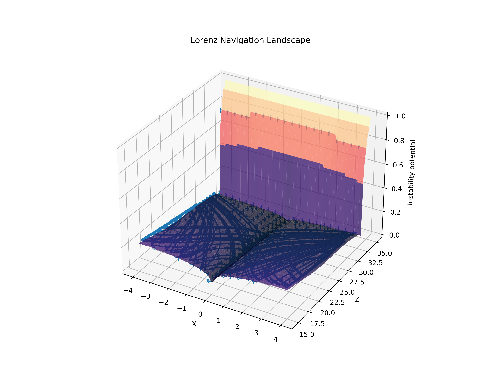
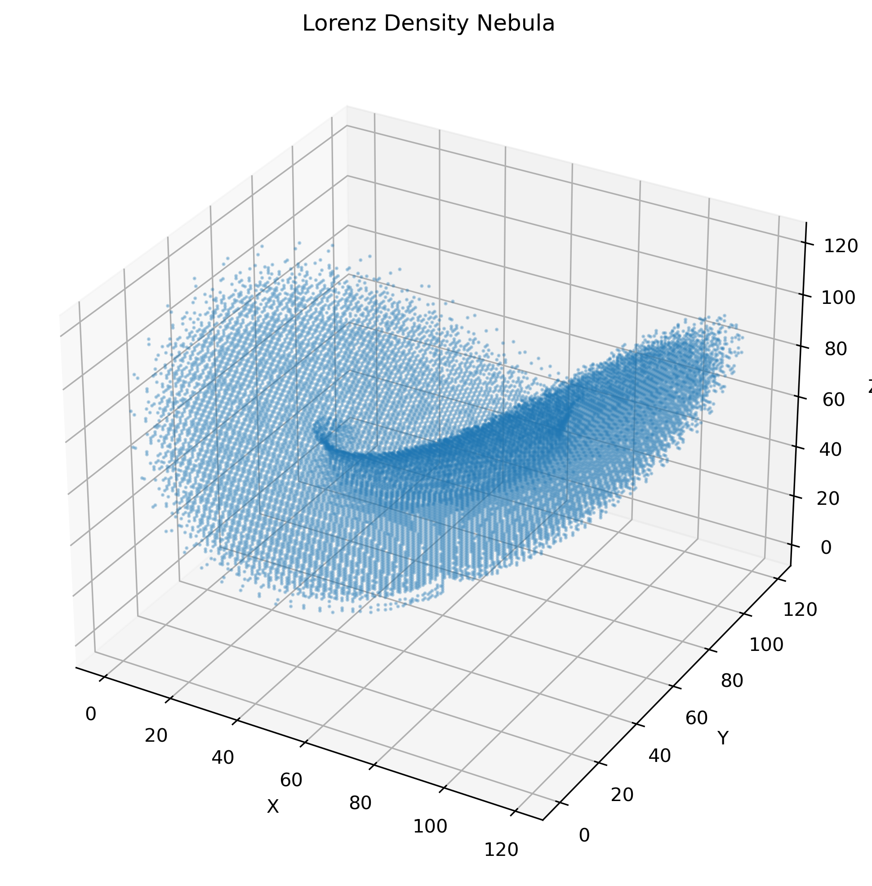
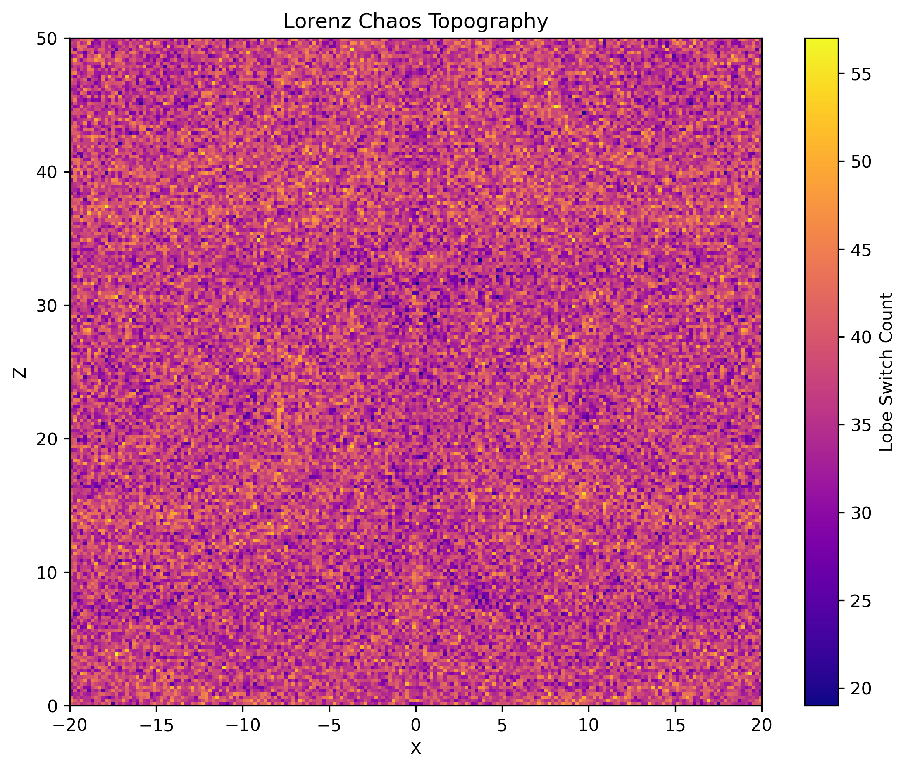
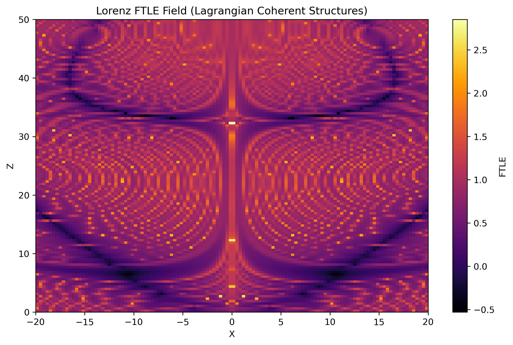
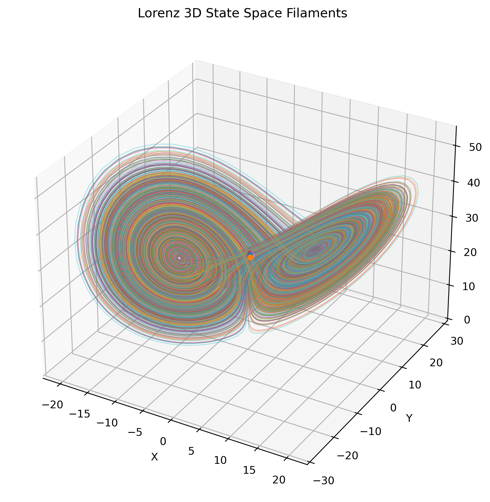
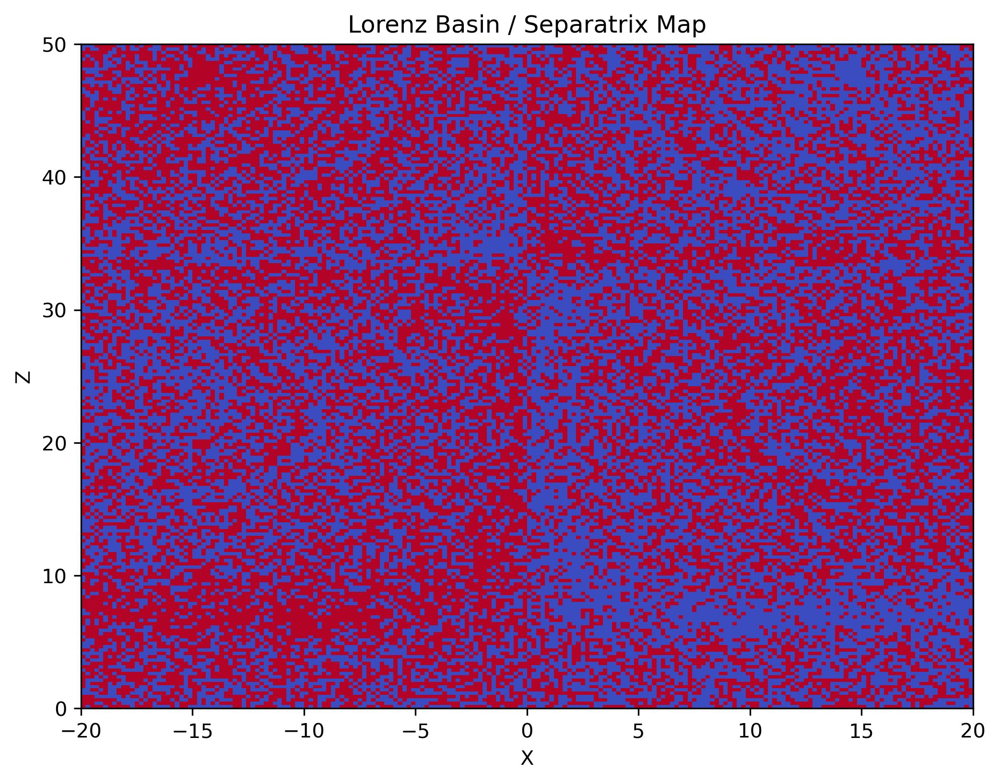
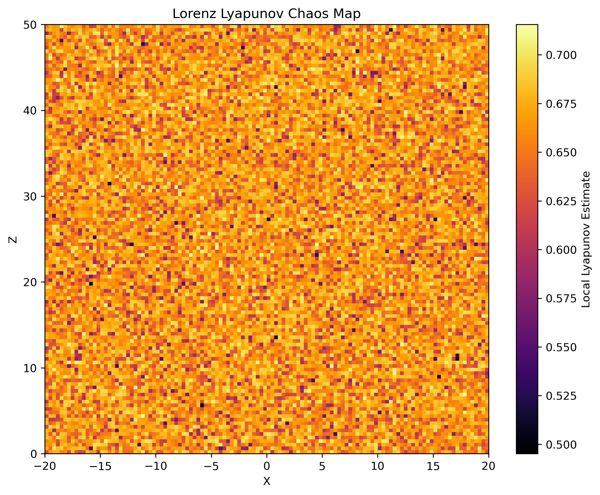
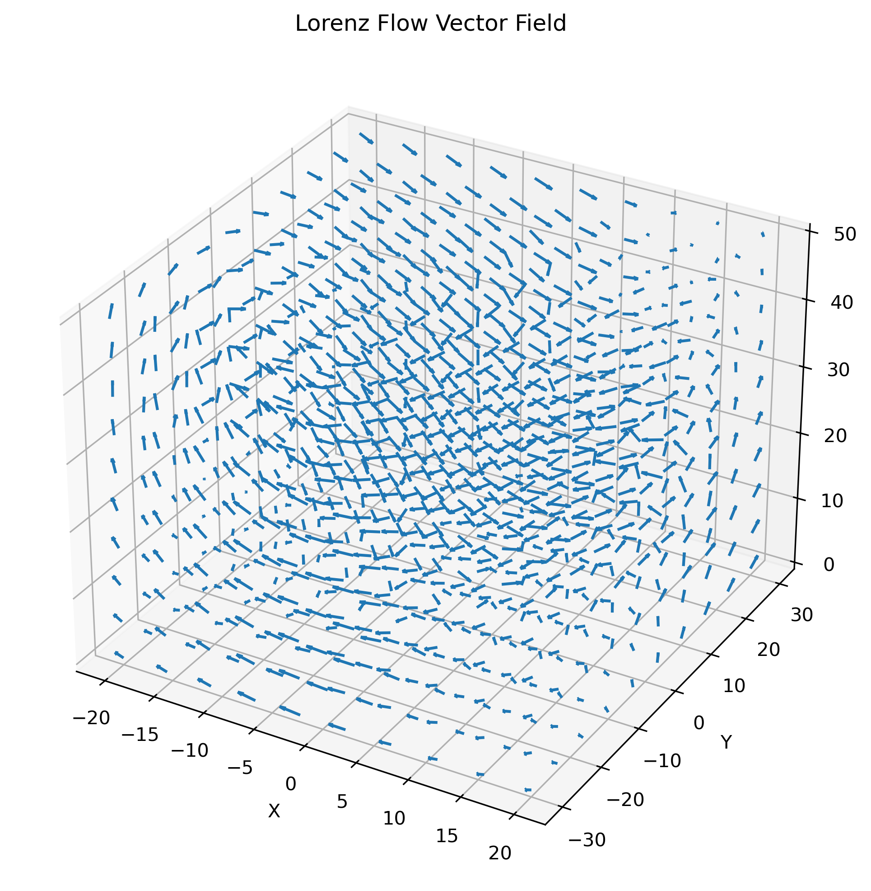

# Lorenz Chaos Exploration

This module explores the **geometry of chaos** using the classical **Lorenz dynamical system**.

The Lorenz system serves as a **reference system for the NEXAH dynamical framework**, demonstrating how chaotic dynamics can be transformed into a **structured, navigable stability landscape**.

---

# 🔥 Chaos Navigation Map



This visualization summarizes the core idea:

- chaotic systems contain **hidden structure**
- transport follows **geometric pathways**
- navigation becomes possible through **field-aware intervention**

---

# 🧠 Core Idea

Instead of simulating trajectories, NEXAH reconstructs the **geometry that generates them**.

This reveals:

- attractor geometry  
- flow fields  
- Lyapunov instability  
- FTLE transport barriers  
- regime boundaries  
- navigation pathways  

The result is a **tomographic reconstruction of phase space**.

---

# Lorenz System

The Lorenz equations:

dx/dt = σ (y − x)  
dy/dt = x (ρ − z) − y  
dz/dt = xy − β z  

Typical parameters:

σ = 10  
ρ = 28  
β = 8/3  

---

# Structural Analysis Pipeline
```text
Lorenz Attractor
↓
Flow Field
↓
Lyapunov Field
↓
Stretching / Rotation
↓
FTLE Structures
↓
Filament Graph
↓
Chaos Density
↓
Topography
↓
Regime Boundaries
↓
Navigation
```

---

# Key Structural Layers

## Chaos Density Nebula



Global density of chaotic transport.

---

## Chaos Topography



Phase space interpreted as a **landscape**.

---

## FTLE Transport Structures



Transport barriers (LCS) forming the **skeleton of chaos**.

---

## Filament Structure



Fine-scale chaotic structure.

---

## Separatrix Structure



Fractal boundary between attractor regimes.

---

## Lyapunov Instability Map



Regions of exponential divergence.

---

## Flow Field



Underlying vector field of the system.

---

# Navigation Layer

The Lorenz system can be interpreted as a **navigation landscape**:

- stability valleys  
- instability ridges  
- transport channels  
- regime boundaries  

Navigation strategies:

- gradient descent toward stable regions  
- controlled regime switching  
- trajectory steering  
- barrier avoidance  

---

# 🧭 Core Mapping
```text
Field → Geometry → Operator → Navigation
```
- Field organizes motion  
- Geometry defines structure  
- Operator reshapes trajectories  
- Navigation becomes possible  

---

# Interpretation

The system decomposes into:

Attractor Geometry  
+ Instability Fields  
+ Transport Barriers  
+ Regime Boundaries  
+ Navigation Structure  

---

# Role within NEXAH

The Lorenz module serves as a **benchmark system** demonstrating:

- structural reconstruction of chaos  
- regime detection  
- transport geometry  
- navigation in dynamical systems  

---

# Final Insight

> The system is not defined by trajectories.  
> It is defined by the geometry that generates them.


