# Lorenz Chaos Exploration

This module explores the **geometry of chaos** using the classical **Lorenz dynamical system**.

The Lorenz system is one of the most studied chaotic systems and serves here as a **reference system for the NEXAH dynamical framework**.

The goal of this module is not only to simulate the Lorenz attractor but to **reconstruct the structural geometry of chaos** through a sequence of analysis layers.

These layers reveal:

- attractor geometry
- flow fields
- Lyapunov instability
- FTLE transport barriers
- chaotic filament structures
- regime boundaries
- stability landscapes
- navigation possibilities in chaotic systems

The result is effectively a **tomography of the Lorenz phase space**.

---

# Lorenz System

The Lorenz equations describe a simplified atmospheric convection model:

dx/dt = σ (y − x)
dy/dt = x (ρ − z) − y
dz/dt = xy − β z

Typical parameters:

σ = 10
ρ = 28
β = 8/3

These parameters produce the well-known **Lorenz strange attractor**.

---

# Structural Analysis Pipeline

The Lorenz module reconstructs the system step by step.

Lorenz Attractor
↓
Flow Vector Field
↓
Lyapunov Instability Field
↓
Stretching / Rotation Field
↓
FTLE Transport Structures
↓
Filament Graph
↓
Chaos Density Nebula
↓
Chaos Topography
↓
Regime Boundaries
↓
Navigation Agent
↓
5D Projection

Each step reveals a deeper structural layer of the chaotic system.

---

# Attractor Geometry

The attractor represents the **core structure of the chaotic system**.

Scripts:

attractor/lorenz_density_map.py
attractor/lorenz_density_nebula.py
attractor/lorenz_density_nebula_true.py
attractor/lorenz_filament_3d.py
attractor/lorenz_chaos_filament_map.py

These scripts reconstruct the **density structure of the attractor** and the filament geometry of chaotic trajectories.

---

# Flow Vector Field

The vector field describes the **instantaneous motion of the system in phase space**.

Script:

analysis/lorenz_flow_vector_field.py

This reveals the **underlying flow architecture** that generates the attractor.

---

# Lyapunov Instability Field

Lyapunov exponents measure **local instability and exponential divergence of trajectories**.

Scripts:

analysis/lorenz_lyapunov_field.py
analysis/lorenz_lyapunov_map.py

These maps show where the system is **most sensitive to perturbations**.

---

# Stretching and Rotation Field

Chaos emerges from repeated **stretching and folding of trajectories**.

Script:

These maps show where the system is **most sensitive to perturbations**.

analysis/lorenz_rotation_stretch_field.py

---

This field highlights where the system stretches and rotates phase-space structures.

---

# FTLE Structures

Finite-Time Lyapunov Exponents (FTLE) reveal **transport barriers and coherent structures** in chaotic flows.

Scripts:

analysis/lorenz_ftle_lcs_map.py
analysis/lorenz_ftle_filament_graph.py
analysis/lorenz_ftle_nebula_3d.py
analysis/lorenz_ftle_surface_reconstruction.py
analysis/lorenz_ftle_surface_5d_projection.py

These structures correspond to **Lagrangian Coherent Structures (LCS)**.

They form the **skeleton of chaotic transport**.

---

# Chaos Density Nebula

Example output from the FTLE density reconstruction.

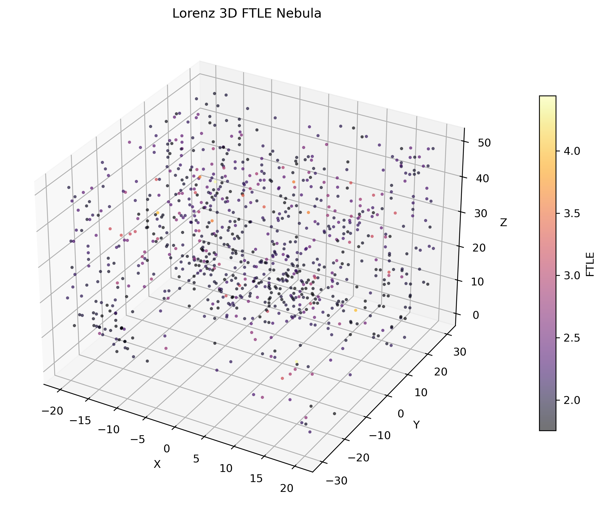

The nebula visualization reveals the **global density structure of chaotic transport**.

---

# Chaos Topography

The attractor can be interpreted as a **chaotic landscape**.

Scripts:

landscapes/lorenz_chaos_topography.py
landscapes/lorenz_chaos_topographyii.py
landscapes/lorenz_potential_landscape.py

These maps reconstruct a **topographic view of chaos**, where valleys correspond to stable regions and ridges correspond to transition zones.

---

# Regime Structure

The Lorenz system contains **two main attractor lobes** separated by a complex boundary.

Scripts:

regimes/lorenz_basin_boundary.py
regimes/lorenz_basin_fractal.py
regimes/lorenz_basin_zoom.py
regimes/lorenz_regime_map.py
regimes/lorenz_regime_network.py
regimes/lorenz_resilience_map.py
regimes/lorenz_separatrix_map.py
regimes/lorenz_separatrix_zoom.py
regimes/lorenz_separatrix_on_landscape.py
regimes/lorenz_switch_heatmap.py
regimes/lorenz_transition_channel.py

These analyses reveal the **fractal separatrix** that divides the attractor regimes.

---

# Navigation Layer

The navigation layer explores how a system could **move intentionally within the chaotic state space**.

Scripts:

navigation/lorenz_gradient_controller.py
navigation/lorenz_gradient_navigation.py
navigation/lorenz_navigation_analysis.py
navigation/lorenz_navigator_agent.py
navigation/lorenz_chaos_navigator.py
navigation/lorenz_trajectory_on_landscape.py

This layer demonstrates how chaotic systems can be interpreted as **navigation problems across stability landscapes**.

---

# 5D Phase-Space Projection

Higher-dimensional projections reveal additional geometric structure.

Script:

visualization/lorenz_5d_polar_projection.py

This projection allows exploration of **extended phase-space geometry**.

---

# Full Visual Pipeline

The entire visualization pipeline can be executed via:

pipeline/lorenz_visual_pipeline.py

This script generates the full set of structural maps used in the Lorenz exploration.

---

# Interpretation

The Lorenz system can be decomposed into several structural layers:

Attractor Geometry
+
Instability Fields
+
Transport Barriers
+
Regime Boundaries
+
Navigation Structure

Together these layers form a **structural map of chaos**.

Instead of predicting trajectories directly, the system can be studied through its **geometry of stability and transport**.

---

# Role within the NEXAH Framework

Within the NEXAH architecture, the Lorenz system acts as a **reference dynamical system** used to test structural operators.

It demonstrates how NEXAH can analyze complex systems by reconstructing:

- stability landscapes
- transport barriers
- regime transitions
- navigation possibilities in chaotic state spaces

The Lorenz module therefore serves as a **benchmark system for chaos exploration within the NEXAH framework**.

---

# Visual Gallery

The following figures illustrate different structural layers of the Lorenz system reconstructed by the analysis pipeline.

---

## Chaos Density Nebula

A 3D density reconstruction of chaotic transport structures.

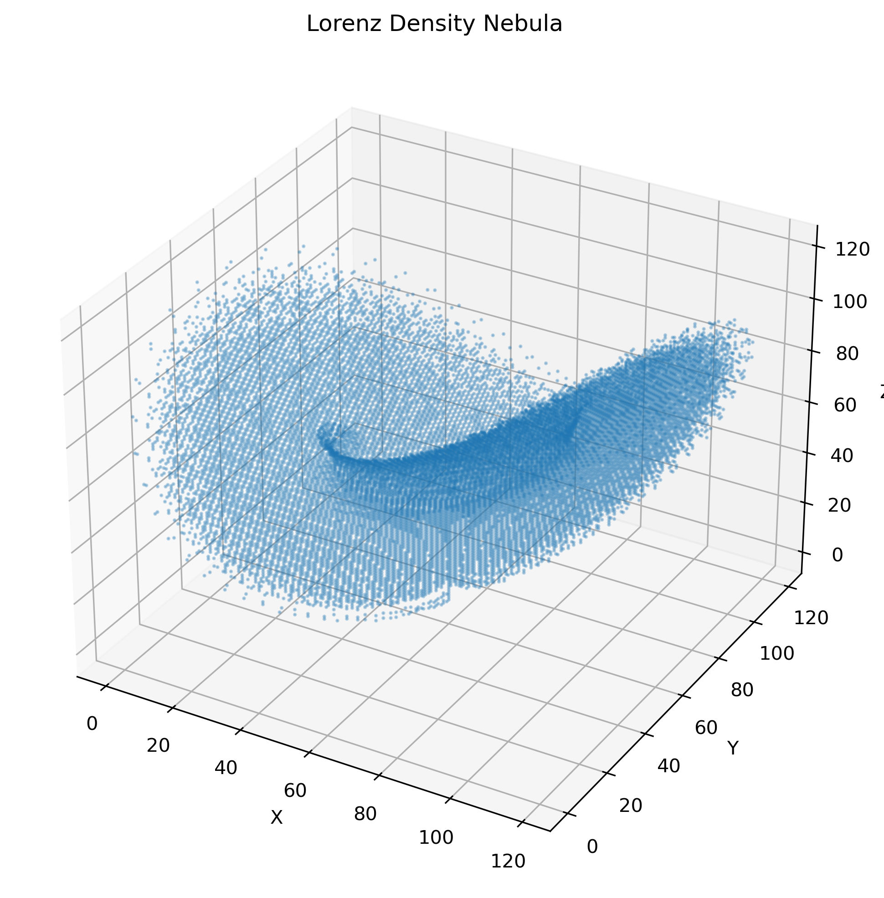

---

## Chaos Topography

Topographic representation of the chaotic phase space landscape.

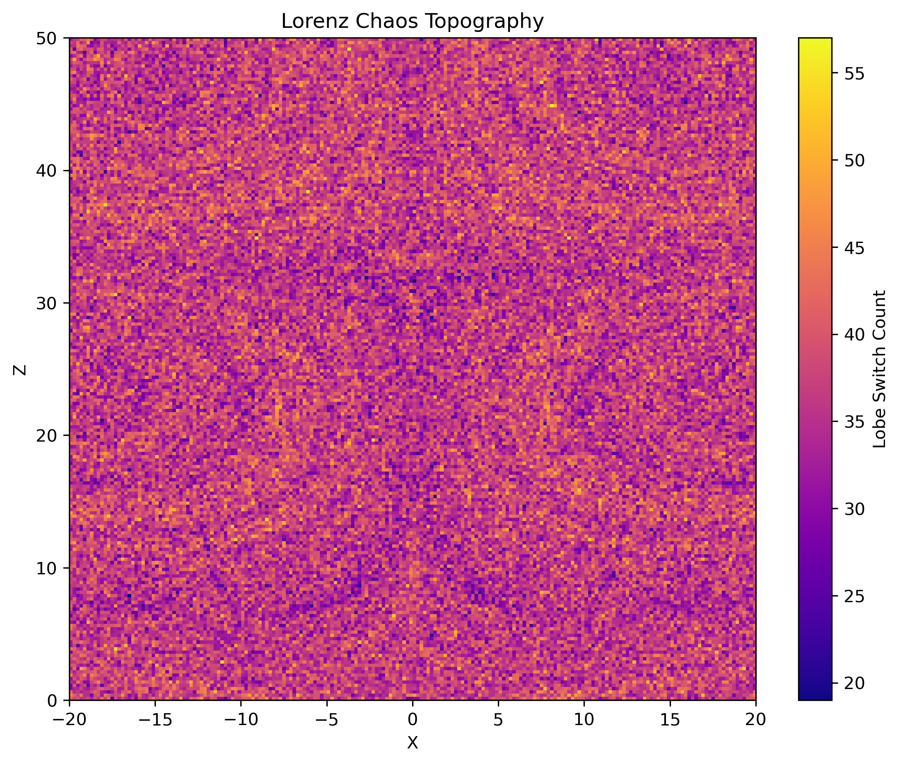

---

## FTLE Transport Structures

Finite-Time Lyapunov Exponent (FTLE) ridges reveal transport barriers and chaotic transport structures.

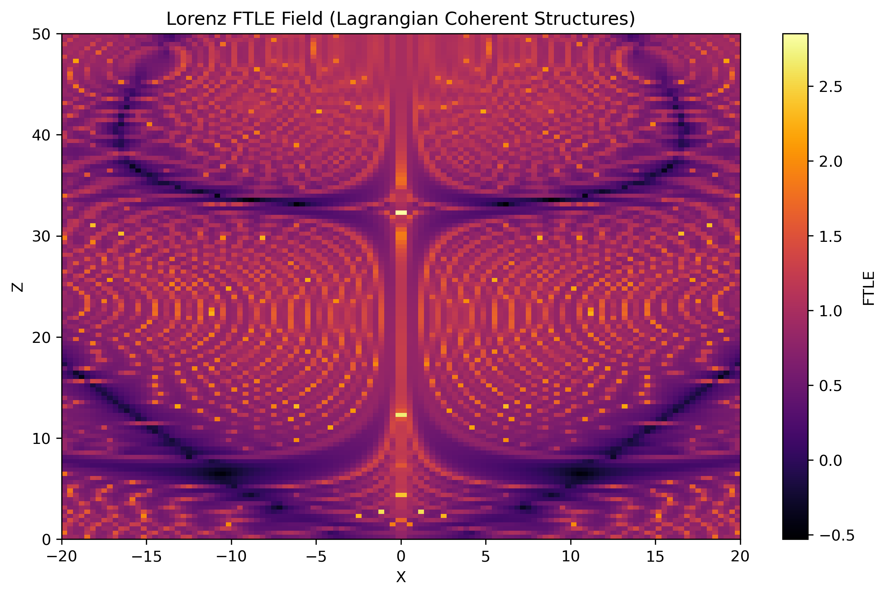

---

## Filament Graph

Chaotic transport skeleton reconstructed from FTLE ridges.

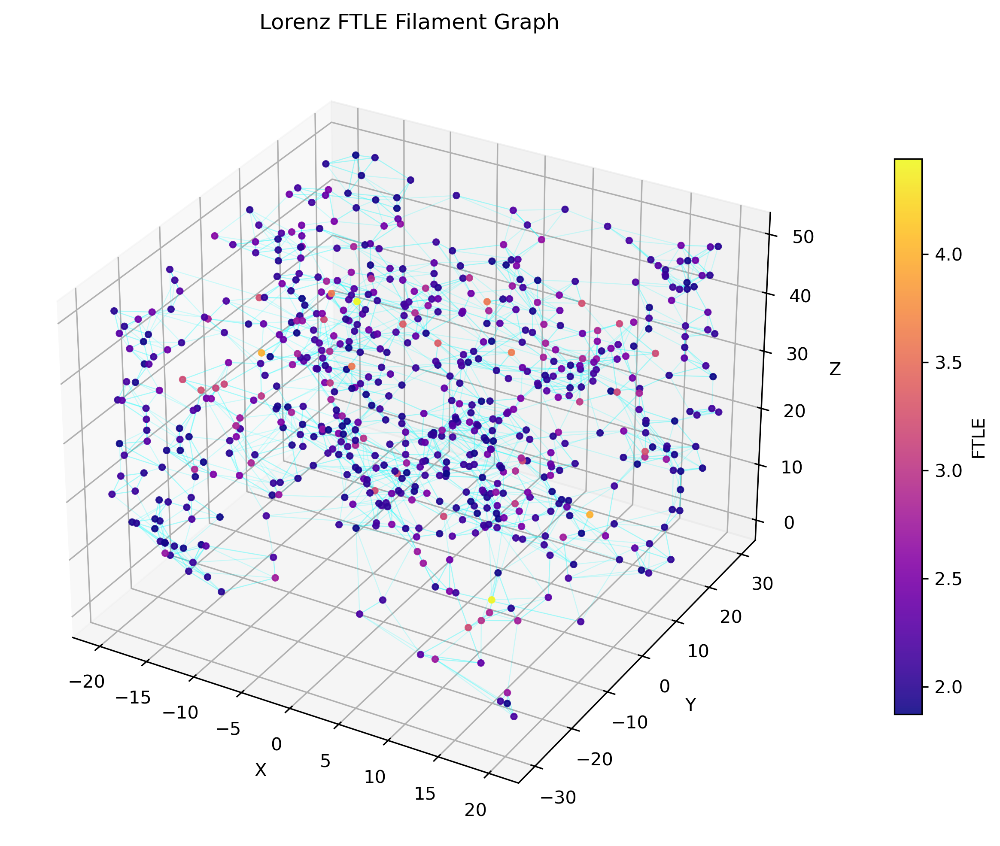

---

## 3D Chaos Filament Structure

Filamentary trajectory structures within the attractor.

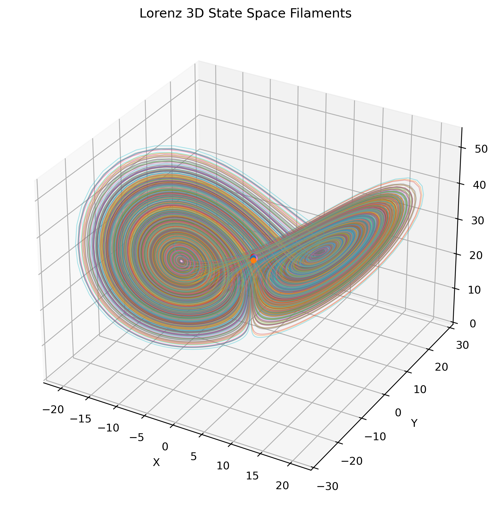

---

## 5D Polar Projection

Higher-dimensional projection of the Lorenz attractor.

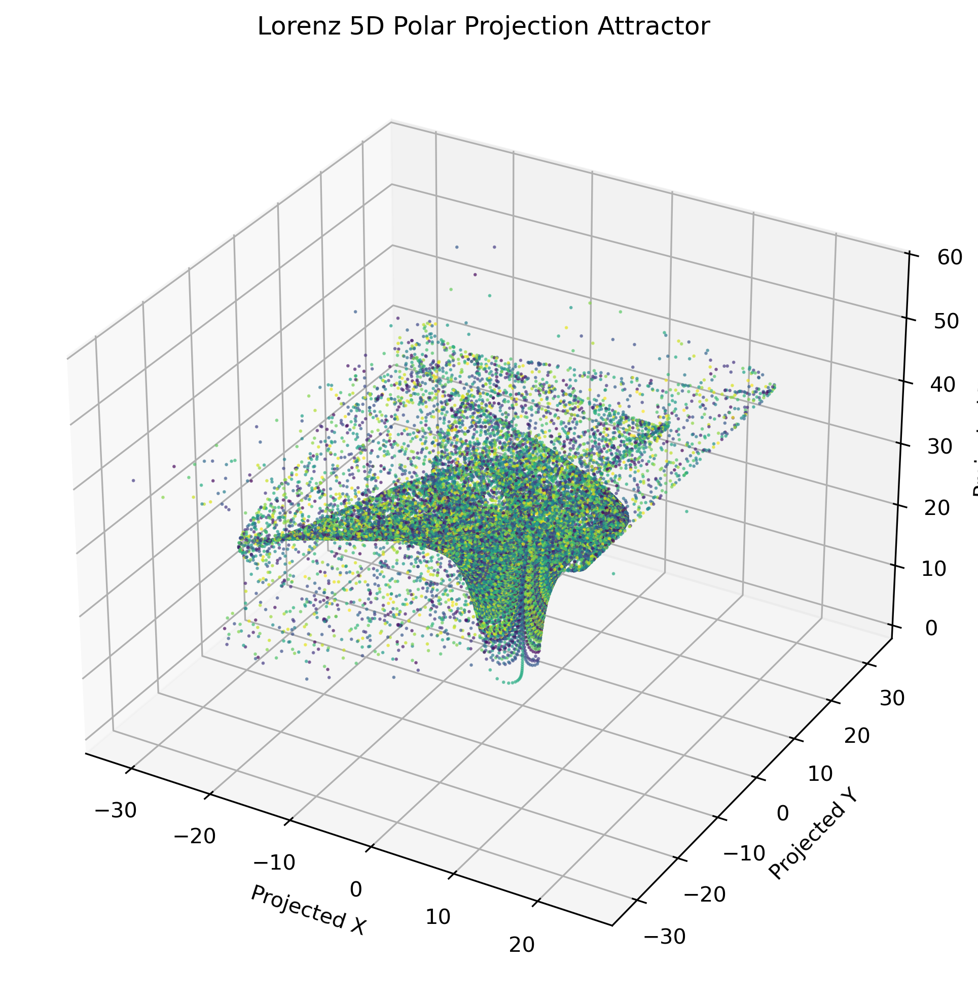

---

## Flow Vector Field

Local velocity field of the Lorenz dynamics.

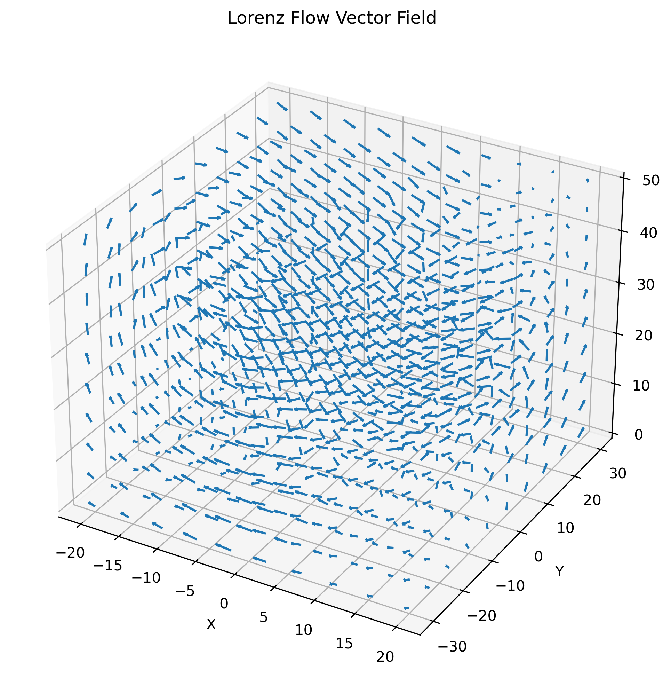

---

## Chaos Filament Map

Large-scale chaotic filament structure of the attractor.

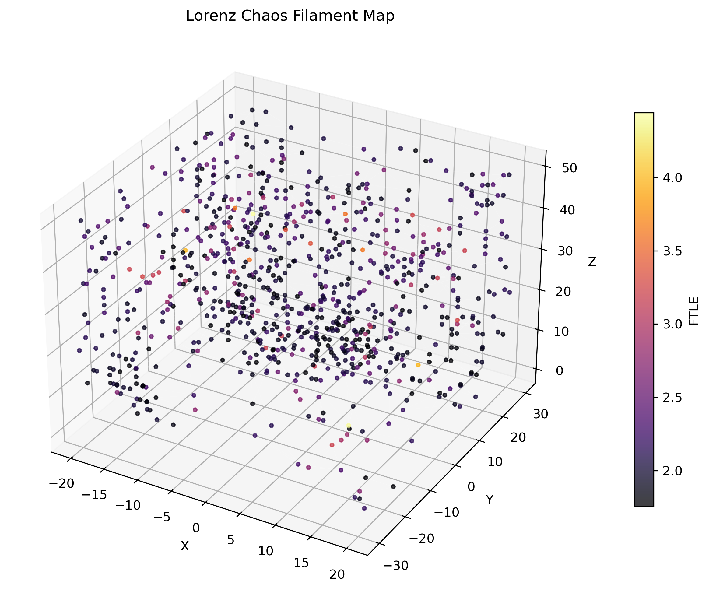

---

## Lyapunov Stability Map

Lyapunov field highlighting chaotic stretching regions.

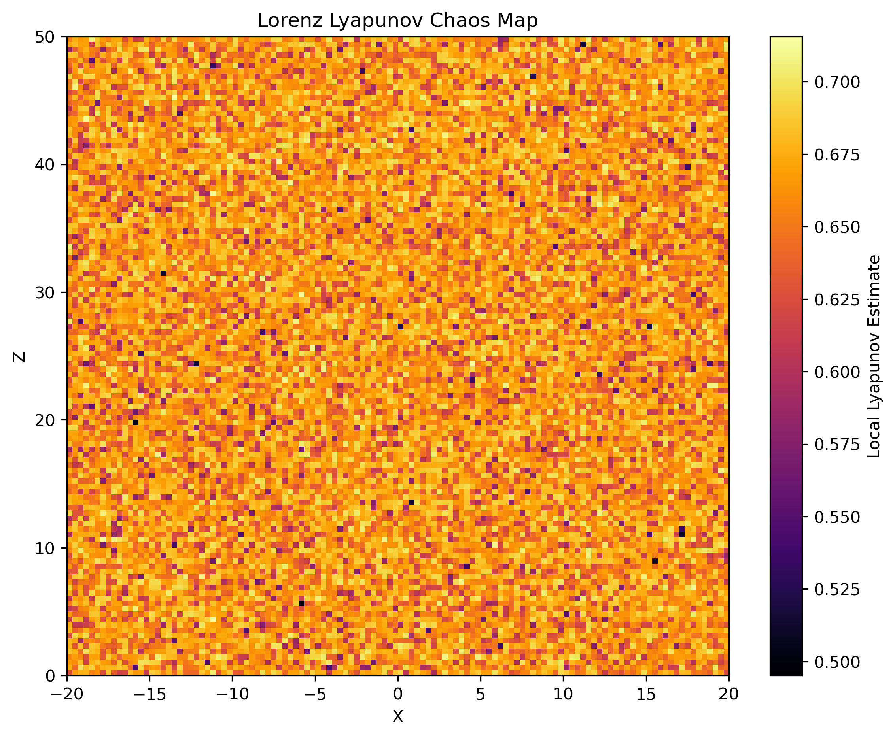

---

## Separatrix Structure

Fractal regime boundary separating attractor lobes.

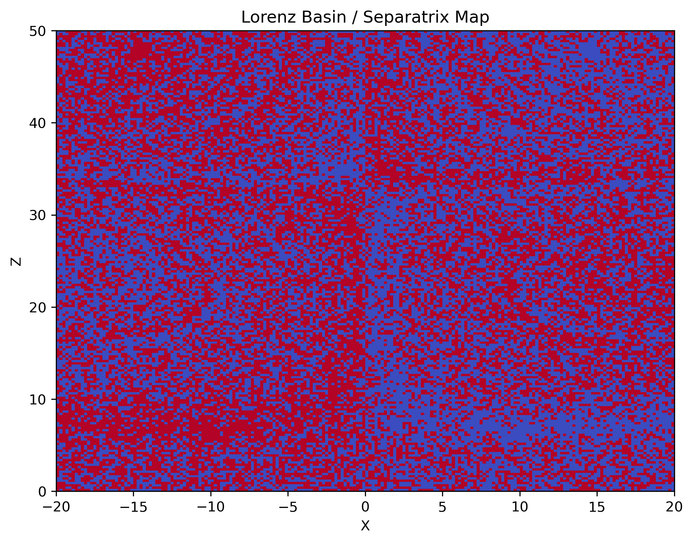

---

## Regime Switching Heatmap

Visualization of lobe-switching frequency across the attractor.

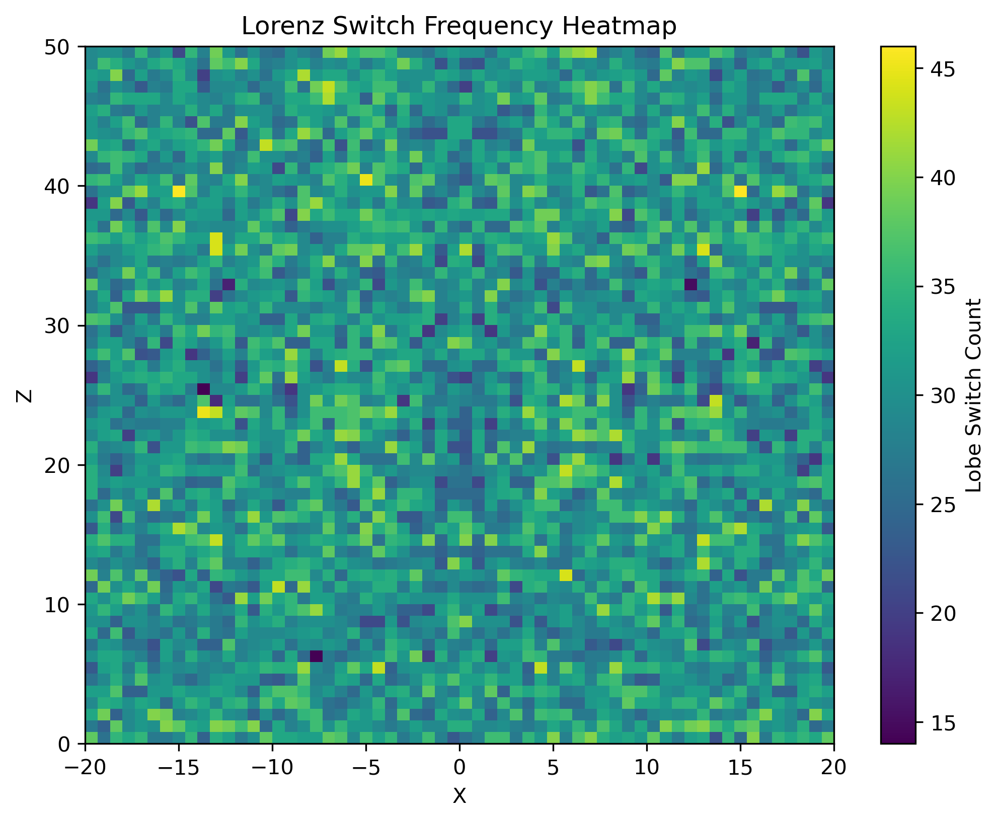

---

## Navigation Map

Structural navigation pathways across the Lorenz regime landscape.

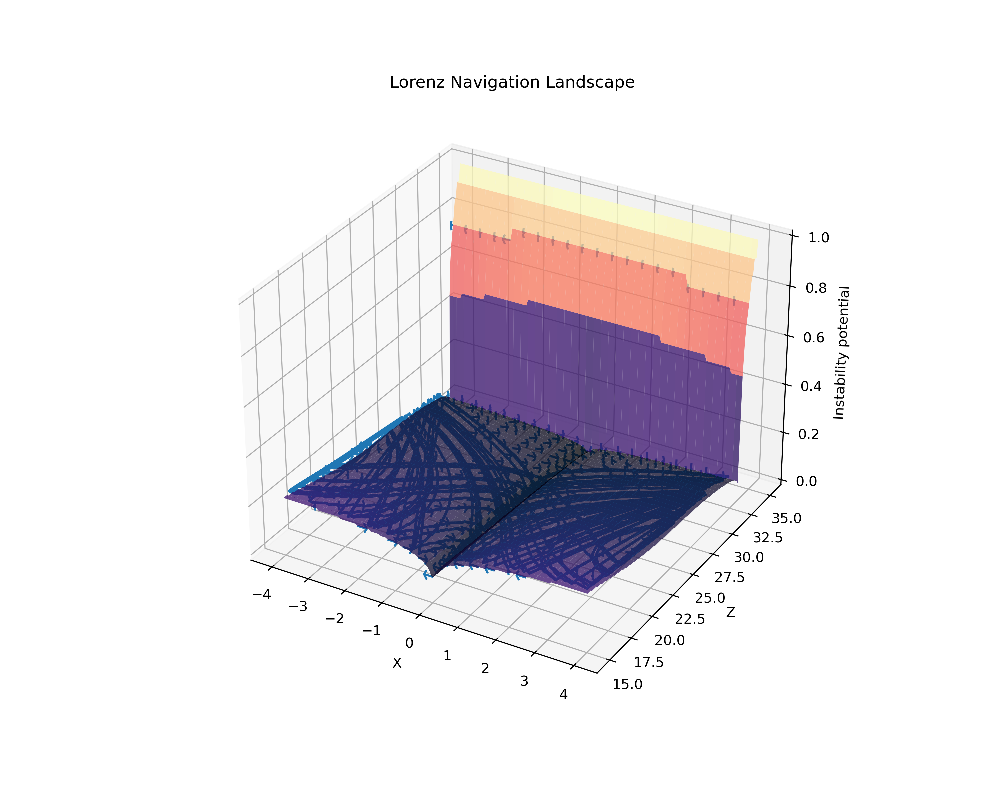
