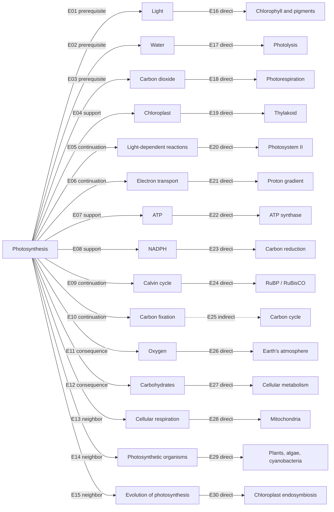

# PHOTOSYNTHESIS ORIENTATION NEIGHBORHOOD

## Status and scope

This is an evidence-bounded orientation neighborhood constructed from the completed Photosynthesis Orientation Translation pilot and its reflection report. It is not a knowledge graph, ontology, scientific review, or claim that the represented relations are complete.

The twelve pilot artifacts are frozen evidence. This artifact does not alter them. It records what naturally surrounds their focal representation and why each transition is admitted, limited, editorial, or rejected.

## Admission boundary

“Every immediate neighbor” means every topic that the frozen pilot evidence explicitly records as directly related to Photosynthesis and that participates in its mechanism, living-systems, or human-context orientation. It does **not** mean every hyperlink, citation, category, or conceivable scientific neighbor in Wikipedia.

A topic enters the connected neighborhood only when:

1. the fixed source relation is already recorded in the pilot; or
2. the pilot explicitly records an indirect relation and its missing support.

Editorial bridges and unsupported expansions are audited but do not silently enter the connected graph.

## Two independent classifications

Each edge has both a **neighborhood role** and a **support class**.

### Neighborhood roles

| Role | Meaning |
| --- | --- |
| Direct continuation | A next step inside the represented process or explanatory sequence |
| Neighboring representation | A distinct topic or view that can be compared without being merged |
| Supporting representation | Material that helps explain a process, entity, location, carrier, or condition |
| Prerequisite representation | An input or prior distinction required to read the focal relation |
| Consequence representation | A represented product or wider effect, without implying a complete causal model |
| Editorial bridge | A useful transition deliberately constructed beyond continuous source explanation |
| Unsupported expansion | An attractive transition lacking sufficient support in the frozen evidence |

### Support classes

- **Direct Source Support** — the fixed source body explicitly relates both sides.
- **Indirect Source Support** — the source contains both relevant materials but leaves the connecting account dispersed or incomplete.
- **Editorial Construction** — the transition is a declared reader-facing construction and not a source finding.
- **Unsupported** — the required relation is not established by the frozen evidence.

No support class is inferred from visual proximity or shared vocabulary.

---

# Part I — Immediate Neighbors

All admitted first-ring edges have Direct Source Support. Their different neighborhood roles remain explicit.

| Edge | Immediate neighbor | Role | Why the transition exists | Support location in frozen evidence | What is not supported |
| --- | --- | --- | --- | --- | --- |
| E01 | Light | Prerequisite representation | Photosynthesis begins with absorbed light energy in the represented processes | Source lead and Overview; `OBSERVATION_RECORD.md` O-01/O-03; Mechanism lens | A complete solar-radiation or planetary-energy model |
| E02 | Water | Prerequisite representation | Water is represented as an electron donor in oxygenic photosynthesis and is split in light-dependent reactions | Source Overview and reaction sections; O-03 | Water as the electron donor in every form of photosynthesis |
| E03 | Carbon dioxide | Prerequisite representation | CO₂ is incorporated into organic compounds in the article's carbon-fixation account | Source Overview and Calvin-cycle material; O-04 | That every photosynthetic process fixes CO₂ in the same way |
| E04 | Chloroplast | Supporting representation | Plant and algal photosynthesis is located in chloroplasts | Membranes and organelles; O-02 | Chloroplasts as universal locations for bacteria or all phototrophs |
| E05 | Light-dependent reactions | Direct continuation | The source explicitly presents these reactions as the light-capture stage | Overview and dedicated section; O-03 | A complete account of every alternative light reaction |
| E06 | Electron transport | Direct continuation | Light absorption initiates electron flow through a transport chain | Light-dependent reactions; O-03 | That the simplified chain covers all cyclic, non-cyclic, or alternative routes |
| E07 | ATP | Supporting representation | ATP is produced in the light-dependent account and used in carbon fixation | Lead, Overview, light-dependent and Calvin-cycle sections; O-03/O-04 | ATP as the only energy carrier or as a cross-scale measure of “energy” |
| E08 | NADPH | Supporting representation | NADPH is produced by light-dependent reactions and used in carbon reduction | Lead, Overview, reaction sections; O-03/O-04 | NADPH as a universal product in every photosynthetic mechanism |
| E09 | Calvin cycle | Direct continuation | The article presents it as the familiar light-independent carbon-fixation sequence in plants, algae, and cyanobacteria | Lead, Overview, dedicated subsection; O-04 | The Calvin cycle as universal to all photosynthetic organisms |
| E10 | Carbon fixation | Direct continuation | The article explicitly connects photosynthesis to incorporation of carbon dioxide into organic compounds | Overview and light-independent reactions; O-04 | A complete carbon-cycle representation |
| E11 | Oxygen | Consequence representation | Oxygen is represented as a byproduct of water splitting in oxygenic photosynthesis | Lead, Overview, light-dependent reactions; O-01/O-03 | Oxygen production by all photosynthetic processes or a complete atmospheric model |
| E12 | Carbohydrates | Consequence representation | The article connects fixed carbon and stored chemical energy to sugars and other carbohydrates | Lead and Overview; O-01/O-04 | A direct or sufficient explanation of biomass, food webs, or nutrition |
| E13 | Cellular respiration | Neighboring representation | The article explicitly compares photosynthesis and respiration while distinguishing their reactions and cellular locations | Overview; O-05; Orientation Map neighbors | Exact opposition, symmetry, or a closed universal cycle |
| E14 | Photosynthetic organisms | Neighboring representation | Plants, algae, cyanobacteria, and other phototrophs are named as organisms performing different forms | Lead and Overview; O-01/O-02; Biological Process lens | One organismal model that applies unchanged to every group |
| E15 | Evolution of photosynthesis | Neighboring representation | The source contains a dedicated evolutionary account linking early forms, oxygenation, and chloroplast history | Evolution section; O-09/O-10; Evolutionary lens | A resolved date, pathway, or uniform evidence class for the earliest photosynthesis |

## First-ring structure

The immediate ring is not one kind of neighborhood:

- **Inputs and prerequisites:** Light, Water, Carbon dioxide.
- **Process continuations:** Light-dependent reactions, Electron transport, Calvin cycle, Carbon fixation.
- **Supporting structures and carriers:** Chloroplast, ATP, NADPH.
- **Represented products:** Oxygen, Carbohydrates.
- **Distinct neighboring views:** Cellular respiration, Photosynthetic organisms, Evolution of photosynthesis.

This distinction is produced by the orientation process. It does not alter the scientific status of any source relation.

---

# Part II — Secondary Neighbors

Exactly one additional representation is admitted for each immediate neighbor. Reuse of a node was avoided so that every second-ring relation remains separately inspectable.

| Edge | From immediate neighbor | Secondary neighbor | Role | Support class | Why the transition exists | Support location in frozen evidence | What is not supported |
| --- | --- | --- | --- | --- | --- | --- | --- |
| E16 | Light | Chlorophyll and photosynthetic pigments | Supporting representation | Direct Source Support | Pigments absorb light and determine relevant absorption ranges | Lead; membranes; light-dependent reactions; O-01/O-03 | A complete action spectrum for every organism |
| E17 | Water | Photolysis | Direct continuation | Direct Source Support | The source names water splitting as photolysis within light-dependent reactions | Lead and light-dependent section; O-03 | Photolysis as part of anoxygenic processes using other donors |
| E18 | Carbon dioxide | Photorespiration | Neighboring representation | Direct Source Support | RuBisCO's relation to CO₂ and O₂ makes photorespiration relevant when CO₂ is limited | Factors and carbon-concentrating material; O-07/O-08 | One universal response across C3, C4, CAM, or aquatic mechanisms |
| E19 | Chloroplast | Thylakoid | Supporting representation | Direct Source Support | Thylakoid membranes are represented as sites of plant/algal light reactions | Membranes and organelles; O-02 | Thylakoids as the whole chloroplast or as universal organelles |
| E20 | Light-dependent reactions | Photosystem II | Supporting representation | Direct Source Support | The source describes photon capture and electron release at Photosystem II | Light-dependent reactions | A complete account of both photosystems and alternative reaction centers |
| E21 | Electron transport | Proton gradient | Consequence representation | Direct Source Support | Electron transport is represented as generating a proton gradient used for ATP production | Light-dependent reactions; O-03 | A full chemiosmotic model or quantitative gradient account |
| E22 | ATP | ATP synthase | Supporting representation | Direct Source Support | The source relates the proton gradient and ATP synthase to ATP formation | Light-dependent reactions; O-03 | ATP synthase as the only source or use of ATP |
| E23 | NADPH | Carbon reduction | Direct continuation | Direct Source Support | NADPH is represented as reducing power used after light-dependent reactions | Lead, Overview, Calvin-cycle material; O-04 | A complete inventory of reduction reactions or alternative carriers |
| E24 | Calvin cycle | RuBP / RuBisCO | Supporting representation | Direct Source Support | The source describes CO₂ incorporation into RuBP and discusses RuBisCO | Lead, Overview, carbon-concentrating mechanisms | That RuBisCO behaves identically across organisms and conditions |
| E25 | Carbon fixation | Carbon cycle | Editorial bridge | Indirect Source Support | Carbon fixation and global carbon conversion are explicit, while a full cycle representation is absent | Lead/Overview; Orientation Model Climate lens; pilot reflection bridge audit | A represented reservoir-flow cycle, causal climate model, or complete planetary accounting |
| E26 | Oxygen | Earth's atmosphere | Consequence representation | Direct Source Support | Oxygenic photosynthesis is explicitly related to atmospheric oxygen and oxygenation history | Lead and Evolution; O-09/O-10 | That photosynthesis alone determines atmospheric composition |
| E27 | Carbohydrates | Cellular metabolism | Consequence representation | Direct Source Support | The source states that cells metabolize stored organic compounds for usable energy | Lead and Overview | A full metabolic network, nutrition model, or food-web relation |
| E28 | Cellular respiration | Mitochondria | Supporting representation | Direct Source Support | The article distinguishes cellular locations and names mitochondria for respiration | Overview; O-05 | Mitochondria in every organism or exact process symmetry with chloroplasts |
| E29 | Photosynthetic organisms | Plants, algae, and cyanobacteria | Supporting representation | Direct Source Support | These groups are repeatedly named as prominent oxygenic photosynthesizers | Lead and Overview; O-01/O-02 | An exhaustive taxonomy or identical cellular organization |
| E30 | Evolution of photosynthesis | Chloroplast endosymbiosis | Direct continuation | Direct Source Support | The source links chloroplast origins to acquisition of photosynthetic bacteria | Evolution and chloroplast-origin sections; Evolutionary lens | A complete or uncontested evolutionary history |

## Secondary-ring boundary

Only E25 uses Indirect Source Support. It remains in the neighborhood because the completed pilot already identified Carbon Cycle as a source-adjacent missing representation and explicitly recorded the absence of a complete cycle model. Its inclusion makes the gap inspectable; it does not fill it.

---

# Part III — Transition Audit

## Edge classification summary

| Support class | Edge IDs | Count | Graph treatment |
| --- | --- | ---: | --- |
| Direct Source Support | E01–E24, E26–E30 | 29 | Included as solid evidence-bounded edges |
| Indirect Source Support | E25 | 1 | Included as a qualified edge with an explicit missing representation |
| Editorial Construction | B01–B04 below | 4 | Recorded as possible bridges; excluded from the minimal connected graph |
| Unsupported | U01–U05 below | 5 | Rejected; excluded from the graph |

## Declared editorial bridges

| Edge | Proposed transition | Why it is tempting | Existing basis | What is missing / not supported |
| --- | --- | --- | --- | --- |
| B01 | Carbohydrates → Biomass → Food webs | It would connect mechanism to ecological significance | Article names carbohydrates, biomass, and biological energy | The intermediate producer, consumption, trophic, and decomposition relations are not developed |
| B02 | Photosynthetic organisms → Ecosystems | It would extend organismal diversity into an ecological route | Ecology neighbors and broad significance claims exist | No ecosystem structure, interaction model, or contextual case is represented |
| B03 | Carbon cycle → Climate | It would connect carbon fixation to a major public question | CO₂, temperature, water, global carbon conversion, and atmosphere appear | No integrated carbon-cycle/climate model or direction of effect is established |
| B04 | Crop photosynthesis → Food systems | It would make the human-context route socially relevant | Crops, yield research, and environmental limits are present | Soils, management, supply, access, economics, policy, and social systems are absent |

These are **Editorial Construction** edges. They may guide later source selection, but they are not part of the current connected neighborhood.

## Unsupported expansions

| Edge | Rejected transition | Why it might be proposed | Support location | What is not supported |
| --- | --- | --- | --- | --- |
| U01 | Photosynthesis → guaranteed ecosystem stability | Photosynthesis supplies broad biological energy and biomass | No support for the asserted edge in the frozen evidence | Stability, guarantee, and ecosystem outcome |
| U02 | Photosynthesis → climate solution | The source names CO₂ conversion and environmental factors | No intervention support in the frozen evidence | Intervention model, validation, outcome, comparison basis, or authority |
| U03 | Increased photosynthesis → guaranteed crop yield | The source discusses rates, crops, and yield-oriented research | No guarantee support in the frozen evidence | Sufficiency, field outcome, and exclusion of other biological or agronomic conditions |
| U04 | Crop productivity → food security policy | The Human Context path approaches food systems | No policy support in the frozen evidence | Distribution, access, governance, economics, policy, or authority |
| U05 | Photosynthesis/respiration relation → perfect closed cycle | The article uses an outline comparison and names related inputs/outputs | No closure support in the frozen evidence | Exact symmetry, closure, or universality |

These edges have support class **Unsupported**. They are neither displayed as possible routes nor admitted as nodes in the minimal graph.

---

# Part IV — Network Structure

## Smallest connected graph

The authoritative graph consists of one focal node, fifteen immediate neighbors, and exactly one secondary neighbor for each immediate neighbor: **31 nodes and 30 admitted edges**. It contains no cross-links that are merely plausible.

Solid edges are Direct Source Support. The single dotted edge, E25, is Indirect Source Support. The edge tables—not visual proximity—remain authoritative.

## Why the graph stops here

The graph stops after one secondary neighbor because:

- every additional hop would require a new source audit;
- the completed pilot does not support automatic transitivity;
- two directly supported edges do not automatically support their composed endpoint relation;
- editorial bridges and unsupported expansions have already been separated from admitted edges;
- depth beyond the second ring would cease to describe what naturally surrounds the frozen pilot.

---

# Part V — Candidate Orientation Atlas

## Determination

The evidence supports **the beginning of an Orientation Atlas**, not an existing atlas.

### Why it is more than an isolated pilot

The completed pilot already contains:

- one reproducibly identified focal representation;
- several separated lenses;
- explicit neighboring representations;
- non-ranked routes;
- inspectable support and uncertainty boundaries;
- at least one direct neighbor—Cellular Respiration—that can become a new focal representation without inventing the connection.

The neighborhood adds a repeatable local form: focal representation, immediate ring, secondary ring, declared edge reason, source location, prohibited implication, and stopping boundary.

### Why it is not yet an Orientation Atlas

- only one focal article has completed the full pilot;
- no neighboring topic has its own independently constructed orientation neighborhood;
- reciprocal edges have not been audited from another source's perspective;
- no cross-pilot comparison has tested identity, conflict, or asymmetric support;
- the neighborhood remains a manually reviewed local map.

The evidence therefore supports an atlas **seed**. Calling it a completed atlas would exceed the pilot.

---

# Part VI — Expansion Strategy

## Recommended next pilot: Cellular Respiration

Cellular Respiration is the natural extension of this neighborhood.

### Evidence-bounded reasons

1. **Direct source connection:** the fixed Photosynthesis article explicitly compares the processes and distinguishes their reaction sequences and cellular locations.
2. **Existing admitted edge:** E13 already places Cellular Respiration in the immediate ring without an editorial bridge.
3. **Natural secondary depth:** E28 connects it directly to Mitochondria, providing a bounded starting neighborhood.
4. **High orientation value:** the relation invites comparison across matter transformation, energy conversion, organelles, organisms, and ecosystems.
5. **Strong boundary test:** the familiar “opposite process” shorthand risks false symmetry, exact closure, and universality. A second pilot can test whether those differences remain inspectable.
6. **Reciprocity test:** Pilot 02 can determine whether Photosynthesis is represented from the Respiration source with the same strength, purpose, and boundary. Reciprocity must be demonstrated, not assumed.

### Why the other candidates do not come first

| Candidate | Current neighborhood status | Reason not selected for the next pilot |
| --- | --- | --- |
| Carbon Cycle | E25, Indirect Source Support | Valuable, but already depends on a missing intermediate representation |
| Food Webs | B01, Editorial Construction | Requires producer and trophic relations not represented by the frozen source |
| Evolution | E15/E30, Direct Source Support | Natural and well supported, but less effective for testing cross-source reciprocal comparison |
| Water | E02/E17, Direct Source Support | Strong prerequisite branch, but narrower as a test of multi-perspective neighborhood composition |
| Light | E01/E16, Direct Source Support | Strong process entrance, but a Solar Energy expansion would require a new system boundary immediately |
| Plant Cell | Partly represented through Chloroplast and organismal context | “Plant Cell” is not the admitted immediate node; promoting it would require a new editorial grouping |
| No expansion | Not selected | A direct, bounded, high-value neighbor already exists, so stopping is not required by the current evidence |

## Expansion constraint

Pilot 02 should begin from an independently fixed Cellular Respiration source. It must not inherit edges from this neighborhood as facts. It may use E13 and E28 as questions to test. Only after independent construction may the two neighborhoods be compared, and only then may a reciprocal atlas edge be considered supported.

---

# Final Boundary

This neighborhood establishes inspectable local adjacency, not universal semantic structure.

It shows:

- what the frozen source directly connects;
- which second-ring representations are naturally reachable;
- where indirect support begins;
- which bridges are editorial;
- which expansions remain unsupported;
- why the graph stops.

Nothing in the neighborhood becomes connected merely because it is plausible, visually nearby, or scientifically familiar.
