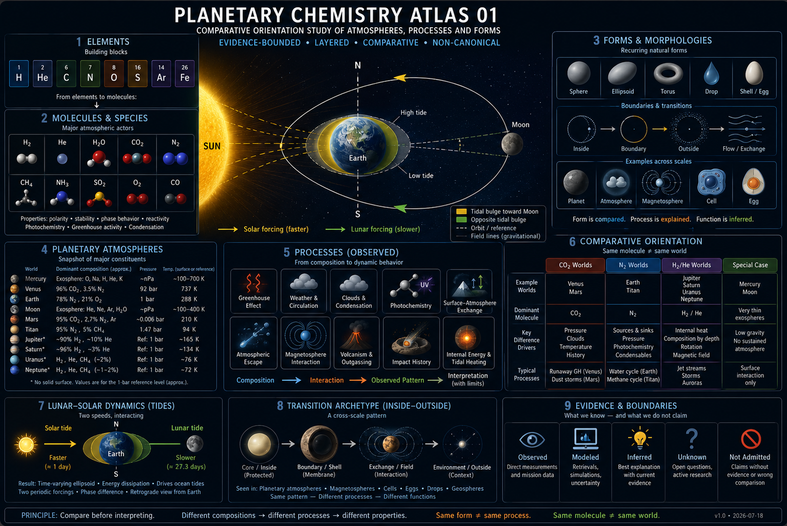

# EDITORIAL GRAMMAR OF ORIENTATION
## Exploratory Review 01

## Objective

Determine whether the current NEXAH corpus repeatedly uses editorial operations
that help readers navigate bounded knowledge spaces, without turning those
operations into a standard, canonical vocabulary, natural mechanism, or formal
system.

## Corpus boundary

The analytical corpus contains **26 source objects** sampled across six areas:

- Orientation Translation pilots, comparison, Meta Review, and Method
  Archaeology;
- Planetary Chemistry Atlas 01;
- Morphologies of Transition 01;
- Living Concepts and Library reader navigation;
- repository and Editorial Operating System architecture;
- OLS 1.0, used only as a semantic and authority boundary.

The exact register is in [CORPUS_REGISTER.md](CORPUS_REGISTER.md). The broad
book and historical whiteboard corpus was not re-reviewed directly. Existing
bounded cross-work reviews were used where their own source limitations remain
visible.

The required source object is preserved byte-identically as
[SOURCE_WHITEBOARD.png](SOURCE_WHITEBOARD.png).



> The image is editorial evidence. Its scientific values, arrows, mechanisms,
> period labels, and cross-scale relations are not validated by inclusion.

```text
SHA-256  5c909d5aab48d4e3b80f212a654d523f7eacfe3ca894906861977ec70b950a1a
```

## Method

1. Bound a multi-area sample rather than treat the repository as one uniform
   corpus.
2. Extract candidate editorial actions without beginning from a fixed grammar.
3. Record representation type, relation type, reader function, recurrence,
   ambiguity, scope, and counterexample for each candidate.
4. Separate scientific relations from editorial relations.
5. Test relation types, evidence states, reader movements, and failure cases.
6. Admit recurrence only when the operation appears in more than one artifact
   and is not explained solely by one file template.

This is reconstruction from artifacts, not a reader-effect experiment. The
review can identify what the corpus does; it cannot establish what readers
actually understand.

## Major findings

### 1. A recurring operation family is present

Twenty candidate operations were identified. Thirteen recur with sufficient
traceability to be admitted as an operation family:

- separate representations;
- juxtapose bounded views;
- sequence with a declared relation;
- offer alternative routes;
- compare by contrast;
- qualify non-implications;
- label evidence or status;
- mark boundaries;
- declare scale and scope;
- preserve traceability;
- state stopping conditions;
- preserve alternatives and asymmetry;
- return through an open question.

Seven further candidates remain local or ambiguous. Counts and decisions are
in [EDITORIAL_OPERATION_INVENTORY.md](EDITORIAL_OPERATION_INVENTORY.md).

### 2. The family is functional rather than stylistically uniform

The recurring feature is not a common color palette or panel geometry. It is a
set of editorial actions that preserve distinctions while allowing movement:

```text
bounded representations
        +
declared relation
        +
evidence or status boundary
        +
reader route or stopping condition
```

The operations appear in biological pilots, planetary comparison, Library
navigation, Living Concepts reviews, and architecture communication. Their
layouts and vocabularies differ.

### 3. Arrows are the largest unresolved ambiguity

Across the sample an arrow can indicate physical process, temporal sequence,
document order, dependency, navigation, editorial transition, or controlled
execution. Text often disambiguates it, but arrow form alone does not.

### 4. Evidence boundaries recur more reliably than visual conventions

Explicit non-implications, status labels, scope statements, source links,
uncertainty, stopping rules, and rejected relations recur across independent
artifact classes. Color, symmetry, nesting, and icon recurrence are much less
stable and remain local conventions.

### 5. `Inside → Boundary → Exchange → Outside` is not an admitted mechanism

The sequence is supported as a local editorial reading path in the source
whiteboard and Morphologies review. The corpus does not demonstrate that it is
a universal scientific process, geometric law, or mandatory editorial order.

## Limitations

- The sample is curated and produced largely within one repository and one
  editorial lineage.
- Several recurring structures are reinforced by shared prompts and templates.
- No independent reader study demonstrates orientation gain.
- Book evidence is mediated through existing reviews rather than a new
  page-level survey.
- Visual recurrence was inspected in a small visual sample, not the full image
  archive.
- OLS 1.0 defines semantics and conformance; it is not evidence of a visual or
  editorial grammar.

## Disposition

# RECURRING EDITORIAL OPERATION FAMILY

The corpus repeatedly uses a family of editorial operations that helps readers
compare, navigate, and preserve evidence boundaries. The evidence does not
support a provisional cross-domain grammar or a candidate formal system: there
is no stable syntax, uniform visual semantics, independent reproducibility, or
validated reader effect.

## Recommended next research question

Can readers without prior NEXAH training reliably distinguish editorial
sequence from scientific causality in three independently selected artifacts
when the existing boundary labels are present?

This is a future research question only. No reader test, redesign, or
specification change is performed here.

