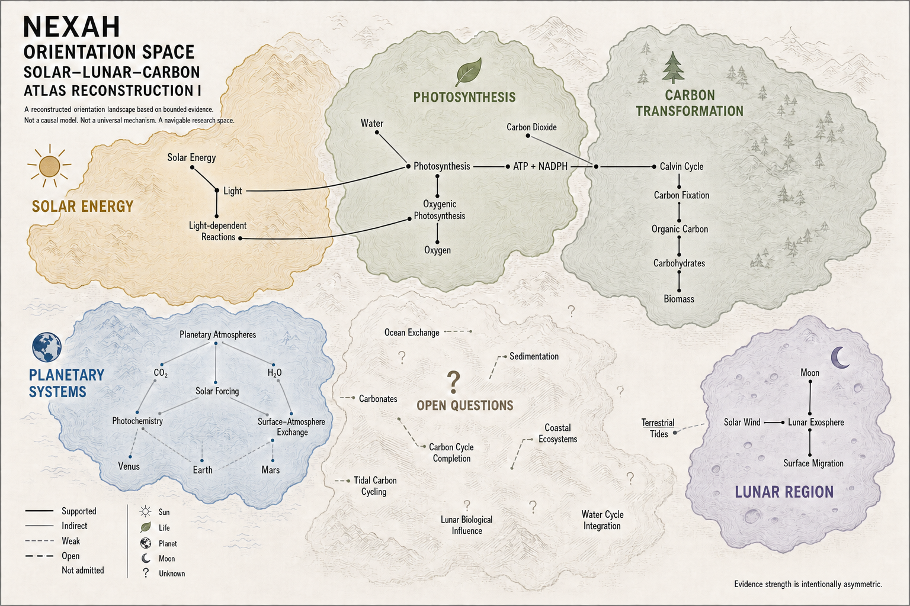
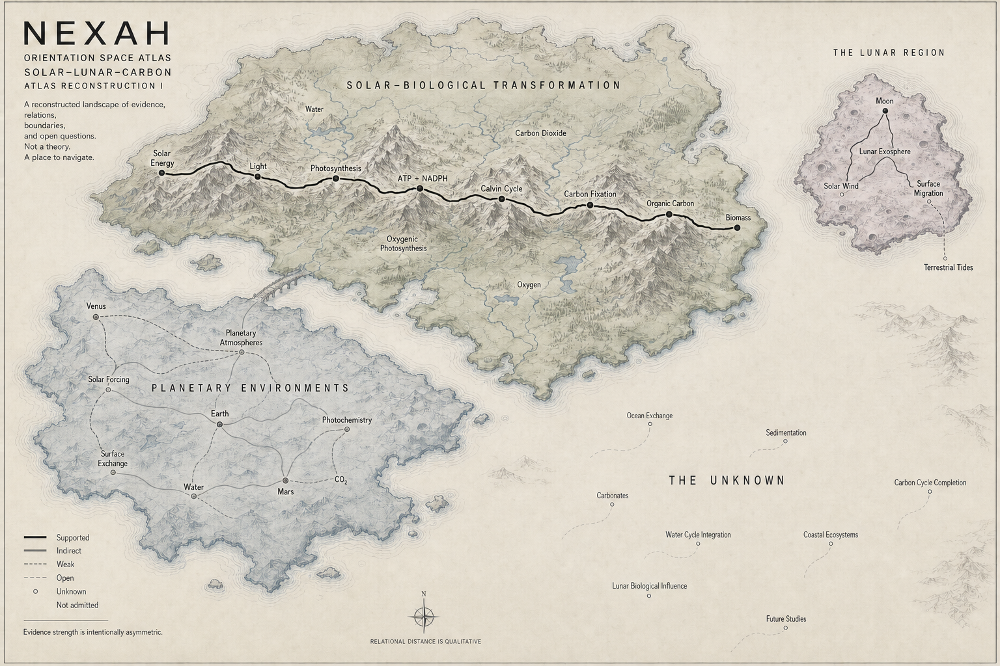

# Solar–Lunar–Carbon Orientation Cartography 01

First explicitly audited NEXAH study-to-map prototype.

## Publication layers

- **Evidence Map** — research-facing spatial reconstruction of the completed bounded review.
- **Museum Edition** — public-facing translation of the same admitted relations and boundaries.

The Museum Edition is derivative. It does not add evidence, relations, mechanisms, or conclusions. `drafts/` contains retained non-final generations and must not be used as approved output.

## Status

- approved visual artifacts;
- non-canonical research/application material;
- no OLS, Kernel, Registry, Operator, or Architecture change;
- relational distance is qualitative.
