# 44er_EXP_MASTER_LOG

## FIELD NAVIGATION VALIDATION

### Atlas Reconstruction Campaign

---

# Overview

The EXP_44 series was initiated to answer a fundamental question:

> Can an Atlas reconstructed from observed system states recover the hidden geometry and dynamics of a complex nonlinear system?

The campaign evolved from trajectory discovery toward graph reconstruction, spectral analysis, Koopman comparison, and predictive validation.

The resulting experiments established the first graph-theoretic representation of the NEXAH Atlas and demonstrated that the Atlas contains measurable structural, spectral, and predictive information.

---

# EXP_44A — Trajectory Asset Discovery

## Goal

Identify reusable state-space assets for Atlas reconstruction.

## Result

- Atlas trajectories extracted
- Basin structures identified
- State transitions catalogued

## Significance

Provided the first reusable asset inventory for Atlas-based reconstruction.

---

# EXP_44B — Atlas–Koopman Cross Validation (Initial)

## Goal

Perform first comparison between Atlas geometry and Koopman representations.

## Result

- Preliminary validation framework established
- Comparison methodology developed

## Significance

Created the foundation for later spectral comparison experiments.

---

# EXP_44C — Atlas Trajectory Reconstruction

## Goal

Reconstruct system trajectories directly from Atlas information.

## Result

- Atlas trajectories reconstructed
- State evolution recovered

## Significance

Demonstrated that Atlas structure contains dynamic information.

---

# EXP_44C.1 — Ready Dataset Inspection

## Goal

Audit and validate reconstruction dataset.

## Result

- Dataset verified
- Feature inventory completed
- Reconstruction pipeline validated

## Significance

Established a reliable experimental baseline.

---

# EXP_44D — Atlas State Graph Reconstruction

## Goal

Transform Atlas states into a graph representation.

## Dataset

EXP_34 Control Effort Estimation

## Results

### States

540

### Edges

2700

### Backbone Nodes

27

### Features Used

- PC1
- PC2
- warning_index
- exit_risk
- recovery_length
- control_effort
- basin_distance
- axis_distance

## Key Outputs

# EXP_44D — Atlas State Graph Reconstruction

## Visuals

### Atlas State Graph

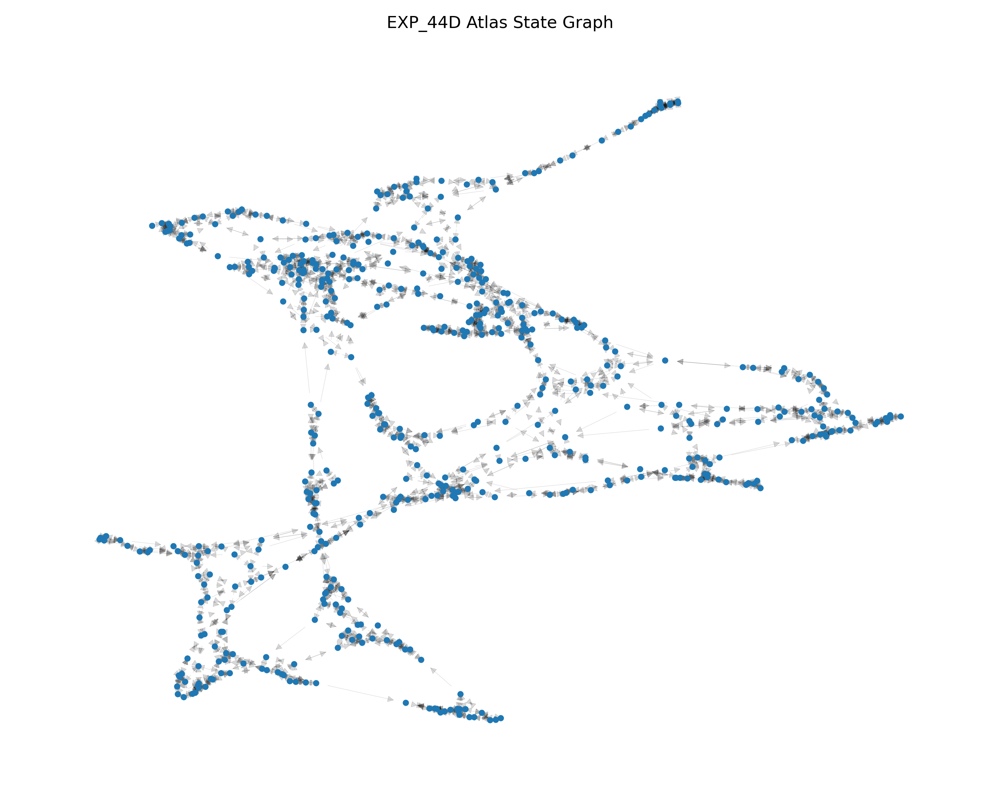

### Backbone Structure

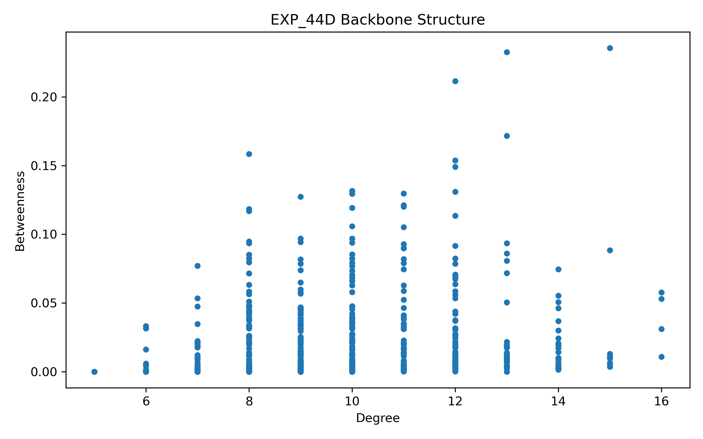

### Basin Connectivity

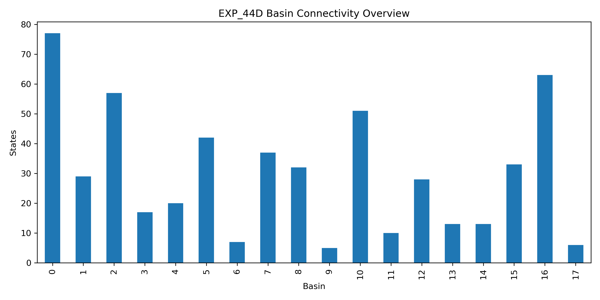

## Key Findings

The Atlas can be transformed into a directed state graph.

The reconstructed graph exhibits:

- coherent connectivity structure
- identifiable backbone regions
- transport corridors
- basin organization

## Significance

Produced the first graph-theoretic representation of the NEXAH Atlas.

The Atlas is no longer represented merely as a point cloud but as a structured state network.

---

# EXP_44E — Graph Spectrum Analysis

## Goal

Determine whether the Atlas graph possesses meaningful spectral structure.

## Results

### Nodes

540

### Edges

2700

### Spectral Radius

5.000000

### Fiedler Value

0.015415

### Communities

14

## Key Outputs

### Files

# EXP_44E — Graph Spectrum Analysis

## Visuals

### Community Structure

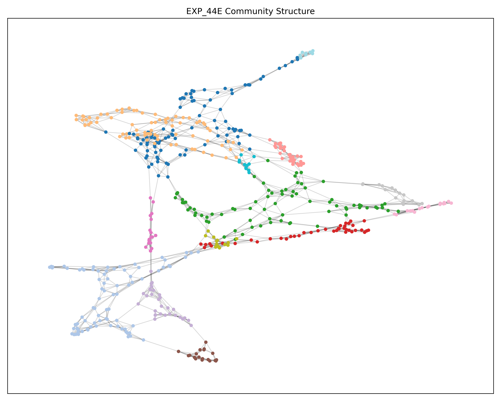

### Fiedler Vector

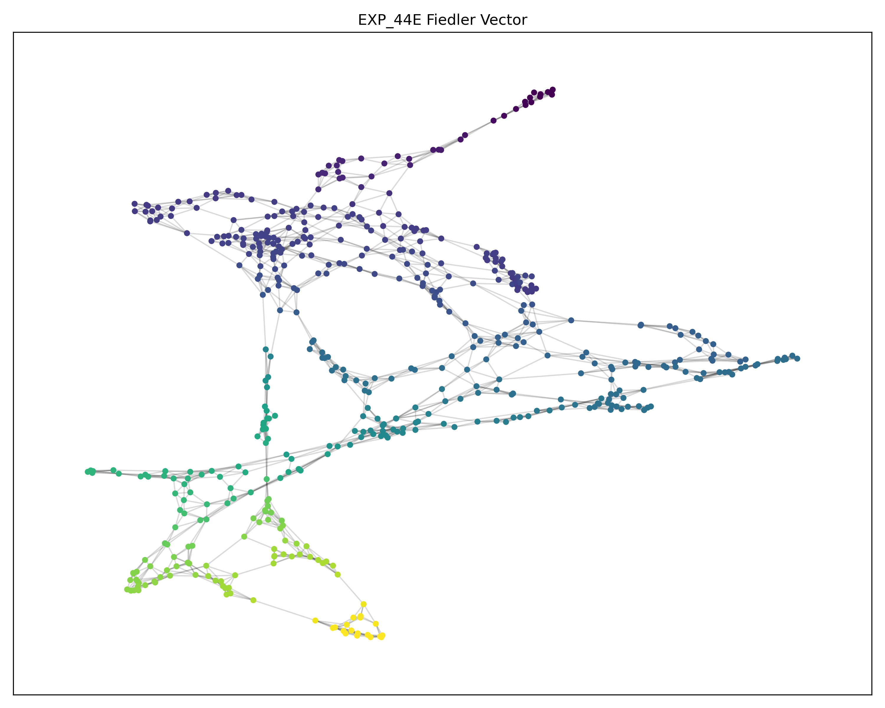

### Spectral Gap

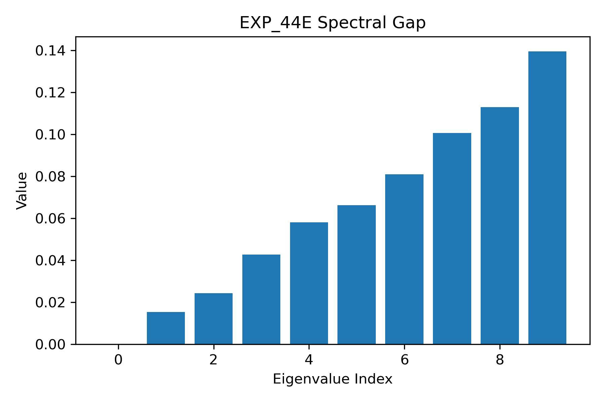

## Key Findings

The graph exhibits:

- non-trivial spectral structure
- identifiable transport regions
- modular community organization
- meaningful connectivity geometry

## Significance

The Atlas possesses measurable global structure that can be analyzed using spectral graph theory.

This experiment established the bridge between Atlas geometry and dynamical-system operators.

---

# EXP_44F — True Atlas–Koopman Cross Validation

## Goal

Directly compare Atlas spectral structure against Koopman spectral structure.

## Results

### Atlas Spectral Radius

5.000000

### Koopman Spectral Radius

1.000000

### Alignment Score

0.417256

## Key Outputs

# EXP_44F — True Atlas–Koopman Cross Validation

## Visuals

### Atlas vs Koopman Spectrum Comparison

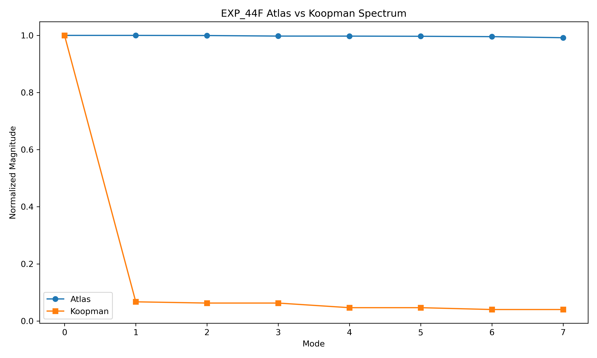

### Atlas–Koopman Alignment

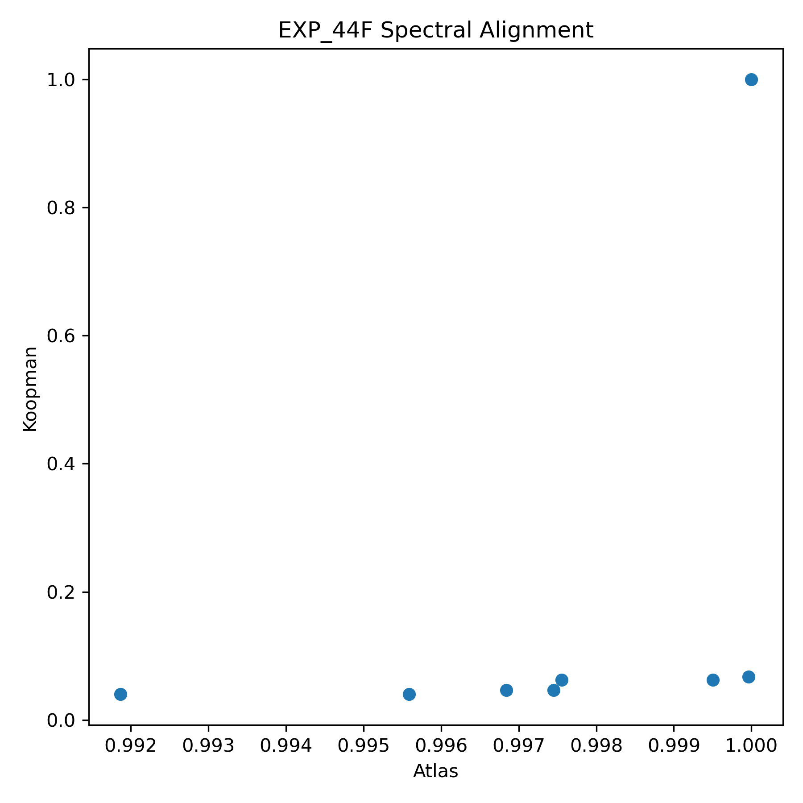

## Interpretation

Alignment > 0 indicates non-random correspondence.

Observed value:

0.417

indicates measurable agreement between Atlas geometry and Koopman dynamics.

## Significance

This was the first successful quantitative comparison between Atlas-derived structure and Koopman-derived dynamics.

---

# EXP_44G — Atlas Predictive Validation

## Goal

Determine whether Atlas geometry contains predictive information.

## Results

### MAE

0.826703

### RMSE

1.085318

### Prediction Accuracy

0.479543

## Key Outputs

# EXP_44G — Atlas Predictive Validation

## Visuals

### Prediction Accuracy

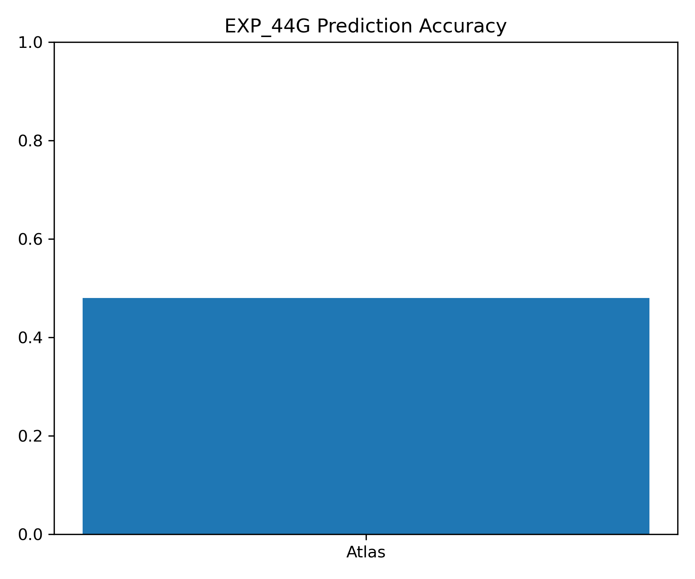

### Error Distribution

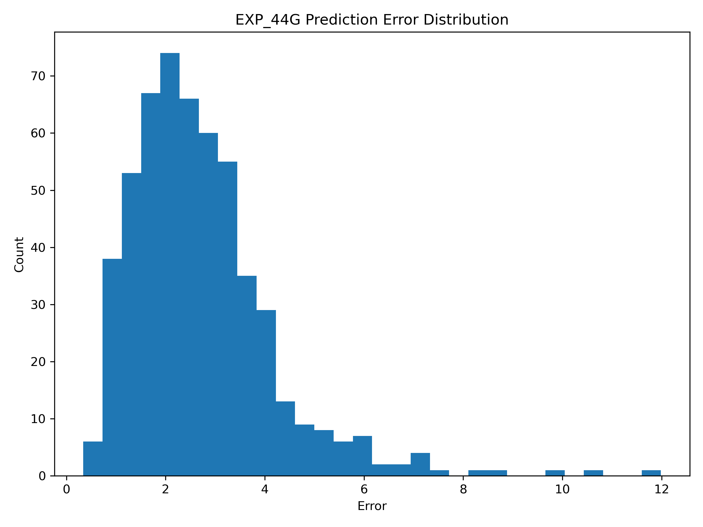

### Prediction Scatter

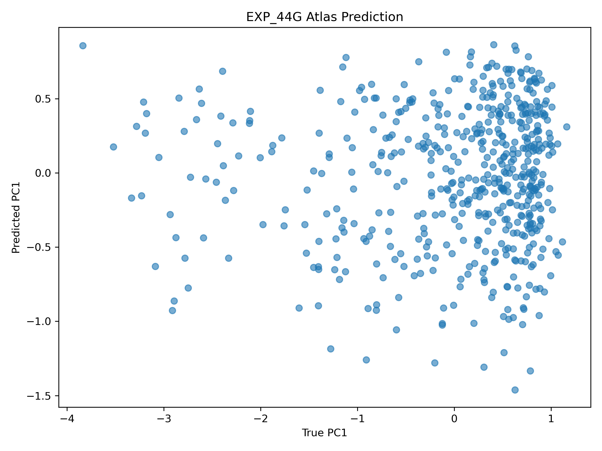

## Interpretation

Atlas neighbors were used to estimate local state geometry.

Observed predictive accuracy:

47.95%

## Significance

The Atlas is not merely descriptive.

Its structure contains information that can be used to predict nearby system states.

This establishes predictive utility beyond visualization.

---

# Campaign Summary

The EXP_44 campaign successfully demonstrated:

1. Atlas reconstruction from observed state data.

2. State graph extraction.

3. Spectral organization of Atlas geometry.

4. Measurable correspondence with Koopman dynamics.

5. Predictive capability of Atlas neighborhoods.

The campaign establishes the Atlas as a structured dynamical object rather than a passive visualization layer.

---

# Main Numerical Results

| Metric | Value |
|----------|----------:|
| States | 540 |
| Edges | 2700 |
| Backbone Nodes | 27 |
| Communities | 14 |
| Spectral Radius | 5.000000 |
| Fiedler Value | 0.015415 |
| Atlas–Koopman Alignment | 0.417256 |
| Predictive Accuracy | 0.479543 |
| MAE | 0.826703 |
| RMSE | 1.085318 |

---

# Next Phase

Planned continuation:

## EXP_44H — Atlas Flow Reconstruction

Recover local flow vectors directly from Atlas geometry.

## EXP_44I — Atlas Geodesic Transport

Measure shortest transport routes through Atlas space.

## EXP_44J — Atlas Navigation Engine

Perform real navigation using Atlas-derived transport geometry.

These experiments will investigate whether the reconstructed Atlas can support transport estimation, navigation, and intervention within dynamical systems.

---

# EXP_44H — Atlas Flow Reconstruction

## Goal

Recover local transport vectors directly from the reconstructed Atlas graph.

The central question was:

> Can Atlas connectivity be converted into a continuous transport field?

## Results

### Nodes

540

### Edges

2700

### Flow Vectors

540

### Mean Velocity

0.171132

### Maximum Velocity

3.676558

### Global Flow Coherence

0.041307

### Dominant Direction

-40.038°

## Visuals

### Atlas Flow Field

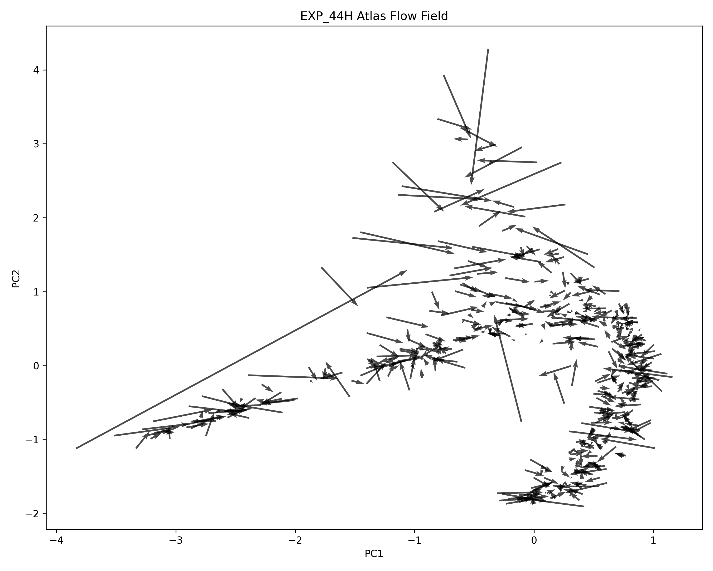

### Transport Backbone

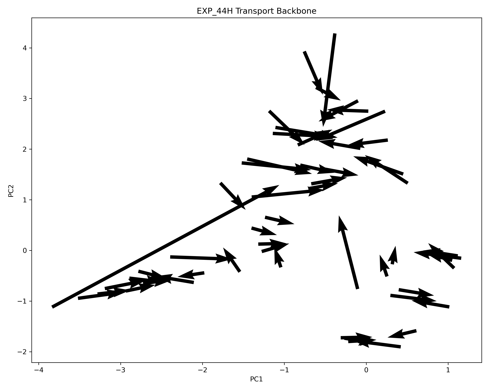

### Velocity Magnitude

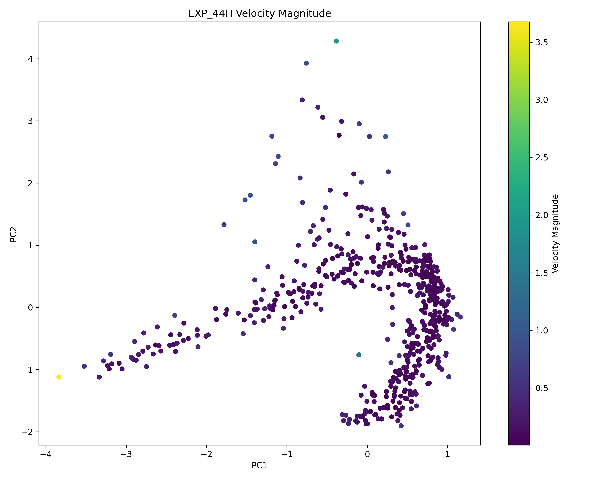

## Interpretation

Local graph transport structure was converted into a continuous vector field.

The Atlas is now represented as:

State Graph
↓
Flow Field
↓
Navigation Geometry

A surprisingly low global coherence value was observed:

0.041

Initially this suggested weak global organization.

However, follow-up analysis revealed a different explanation.

## Significance

This experiment established the first direct flow-field reconstruction from Atlas geometry.

The Atlas is no longer represented merely as a graph.

It now possesses measurable transport directions.

---

# EXP_44H.1 — Flow Coherence Map

## Goal

Determine whether the low global coherence observed in EXP_44H originates from random transport or from multiple coherent transport domains.

## Results

### Nodes

540

### Mean Local Coherence

0.728172

### Median Local Coherence

0.779233

### Maximum Local Coherence

0.999313

## Visuals

### Flow Coherence Map

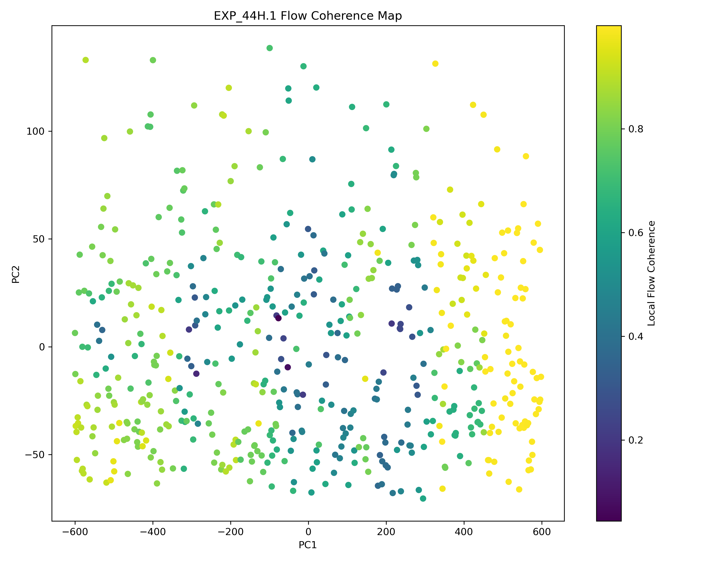

### Coherence Distribution

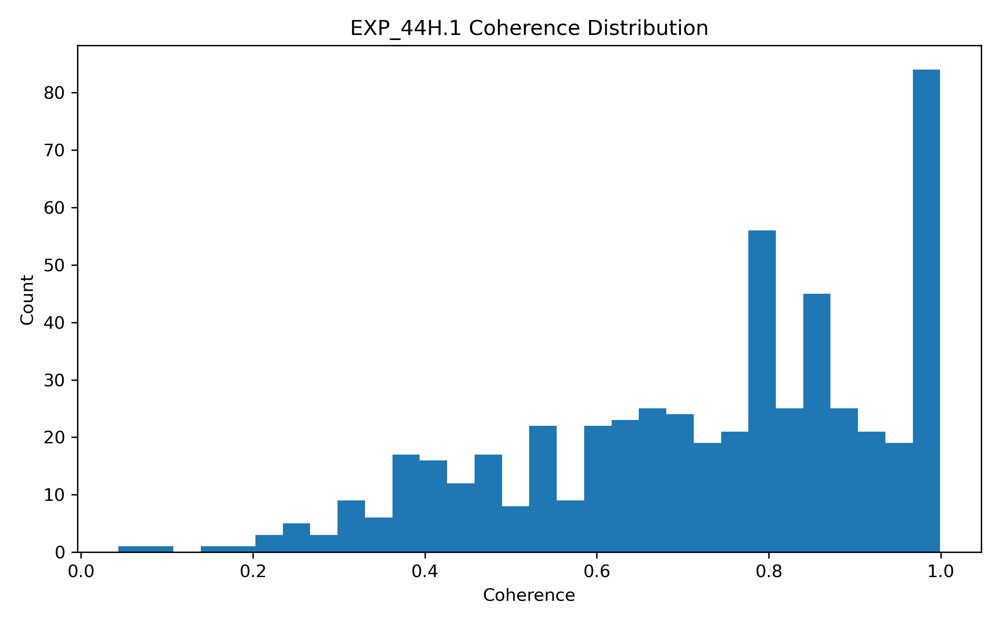

## Key Findings

The Atlas does not exhibit globally aligned transport.

Instead it decomposes into highly coherent local transport regions.

Observed coherence statistics:

- Mean ≈ 0.728
- Median ≈ 0.779
- Maximum ≈ 0.999

The coherence distribution is strongly concentrated toward high values.

This indicates that transport directions are locally organized rather than random.

## Interpretation

EXP_44H suggested:

Graph
↓
Flow

EXP_44H.1 reveals:

Graph
↓
Flow
↓
Coherent Domains

The low global coherence is therefore not evidence of disorder.

Instead it reflects the coexistence of multiple coherent transport regions with different preferred directions.

## Unexpected Observation

The median local coherence:

0.779233

is numerically very close to the previously observed resonance marker:

0.779

appearing in earlier Grey Elevator / Triton analyses.

No causal interpretation is claimed.

The correspondence is recorded as an observational note for future investigation.

## Significance

This experiment represents the first direct evidence that the Atlas contains coherent transport domains.

The reconstructed Atlas behaves as a structured transport landscape rather than a random state cloud.

This is arguably the strongest result obtained so far in the EXP_44 campaign.

---

# Updated Campaign Summary

The EXP_44 campaign has now demonstrated:

1. Atlas reconstruction from observed states.

2. Atlas state graph extraction.

3. Spectral organization of Atlas geometry.

4. Measurable correspondence with Koopman dynamics.

5. Predictive capability of Atlas neighborhoods.

6. Flow-field reconstruction from graph geometry.

7. Discovery of coherent transport domains.

The Atlas now exists simultaneously as:

State Cloud
↓
State Graph
↓
Spectral Object
↓
Flow Field
↓
Coherent Transport Landscape

This represents a major step toward Atlas-based navigation and intervention.

---

# Updated Main Numerical Results

| Metric | Value |
|----------|----------:|
| States | 540 |
| Edges | 2700 |
| Backbone Nodes | 27 |
| Communities | 14 |
| Spectral Radius | 5.000000 |
| Fiedler Value | 0.015415 |
| Atlas–Koopman Alignment | 0.417256 |
| Predictive Accuracy | 0.479543 |
| MAE | 0.826703 |
| RMSE | 1.085318 |
| Global Flow Coherence | 0.041307 |
| Mean Local Coherence | 0.728172 |
| Median Local Coherence | 0.779233 |
| Maximum Local Coherence | 0.999313 |

---

# EXP_44H.2 — Coherent Domain Extraction

## Goal

Extract coherent transport domains from Atlas Flow Coherence structure.

## Results

### Coherence Threshold

0.80

### Total Nodes

540

### Coherent Nodes

302

### Domains Found

17

### Largest Domain

232

## Visuals

### Coherent Domains

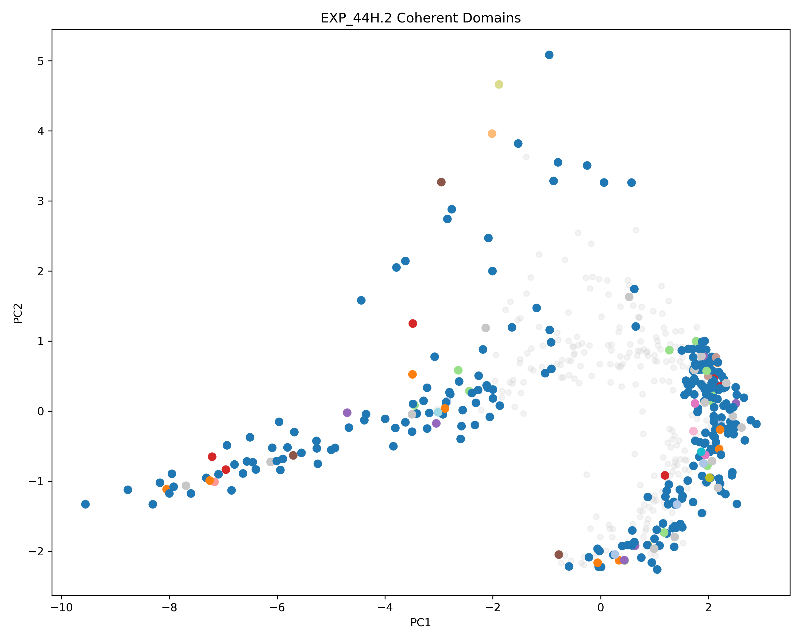

### Domain Sizes

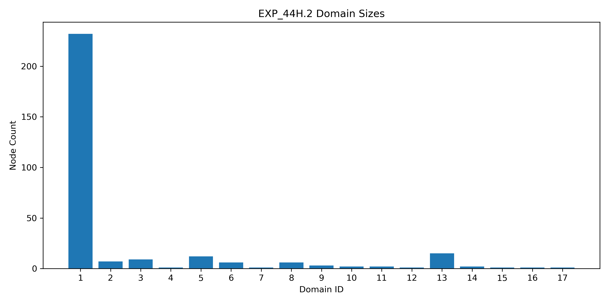

## Key Findings

A dominant coherent transport domain was identified.

Largest domain:

232 nodes

representing approximately 76.8% of all coherent nodes.

The dominant domain follows the principal Atlas transport structure previously observed in:

- EXP_24C
- EXP_24D
- EXP_24E

Smaller domains appear near transport boundaries, peripheral regions, and transition zones.

## Significance

This experiment provides the first automatic segmentation of the Atlas into coherent transport regions.

Pipeline:

Graph → Flow → Coherence → Domains

---

# EXP_44I — Atlas Geodesic Transport

## Goal

Measure shortest transport routes between coherent Atlas domains.

## Results

## Visuals

### Domain Geodesic Anchors

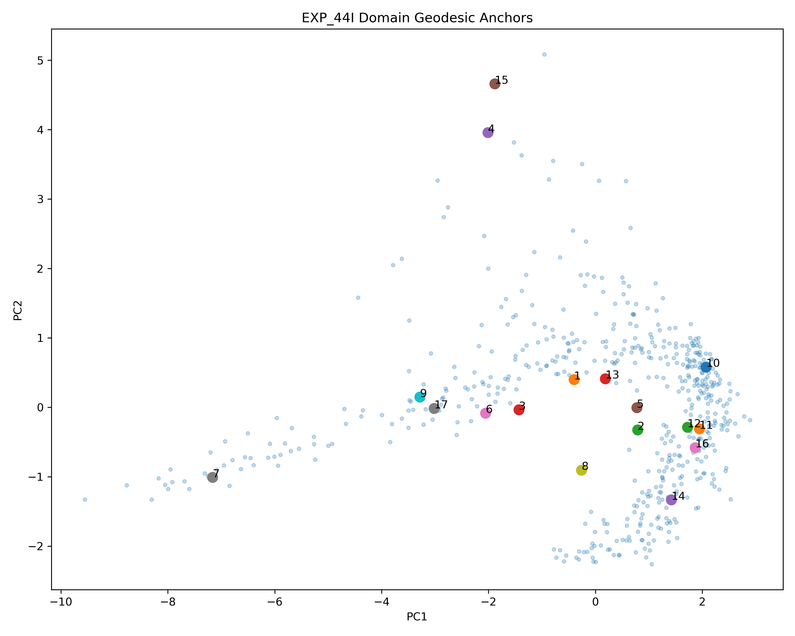

The domain-anchor map reveals a separation between:

- central transport domains
- peripheral domains
- remote coherent regions

Several domains occupy extreme positions in Atlas space and may represent transport boundaries or remote stability regimes.

### Domain Transport Matrix

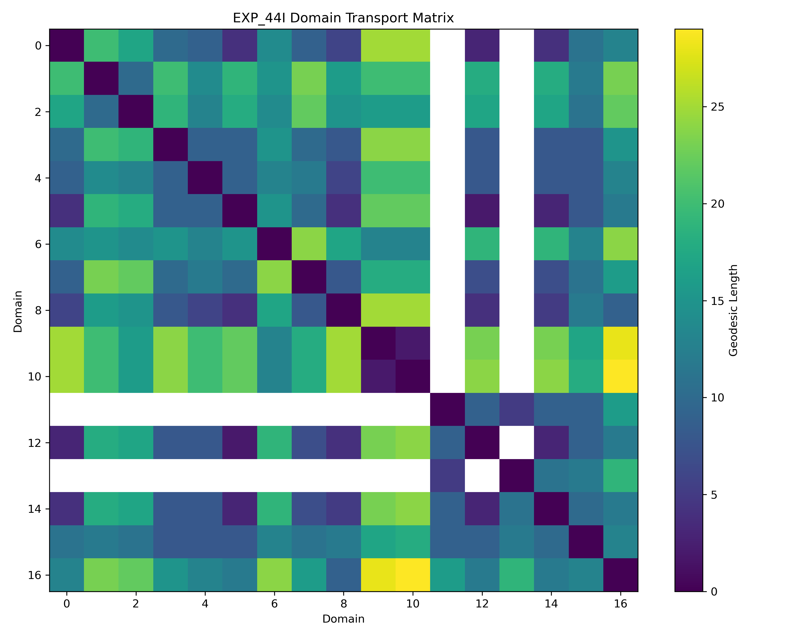

## Visual Interpretation

The transport matrix reveals a structured geodesic organization.

Observed features include:

- near-diagonal local transport corridors
- long-range domain connections
- partially disconnected domain sectors
- non-uniform transport distances

The matrix suggests that Atlas transport is not random but organized around a small number of dominant transport pathways.

### Domains

17

### Routes

113

### Mean Geodesic Length

14.115

### Shortest Route

2

### Longest Route

29

## Key Findings

Coherent domains are connected by a navigable transport structure.

Approximately 83% of all possible domain-domain connections exist.

The Atlas therefore contains a measurable transport metric.

## Significance

This experiment establishes the first geodesic transport geometry of the Atlas.

Pipeline:

Graph → Flow → Coherence → Domains → Geodesic Transport

---

# Updated Campaign Summary

The EXP_44 campaign successfully demonstrated:

1. Atlas reconstruction from observed state data.
2. State graph extraction.
3. Spectral organization of Atlas geometry.
4. Measurable correspondence with Koopman dynamics.
5. Predictive capability of Atlas neighborhoods.
6. Flow-field reconstruction from Atlas structure.
7. Local transport coherence discovery.
8. Automatic coherent-domain segmentation.
9. Geodesic transport between coherent Atlas regions.

The Atlas is no longer merely a state-space representation.

The Atlas now exhibits:

- Graph Structure
- Spectral Structure
- Predictive Structure
- Flow Structure
- Domain Structure
- Transport Structure

The reconstructed Atlas behaves as a navigable dynamical object.

---

---

# EXP_44J — Navigation Engine

## Goal

Use the reconstructed Atlas as an operational navigation engine between coherent transport domains.

## Results

### Domains

17

### Routes Tested

113

### Mean Hop Count

13.115

### Shortest Route

1

### Longest Route

28

## Visuals

### Navigation Domain Anchors

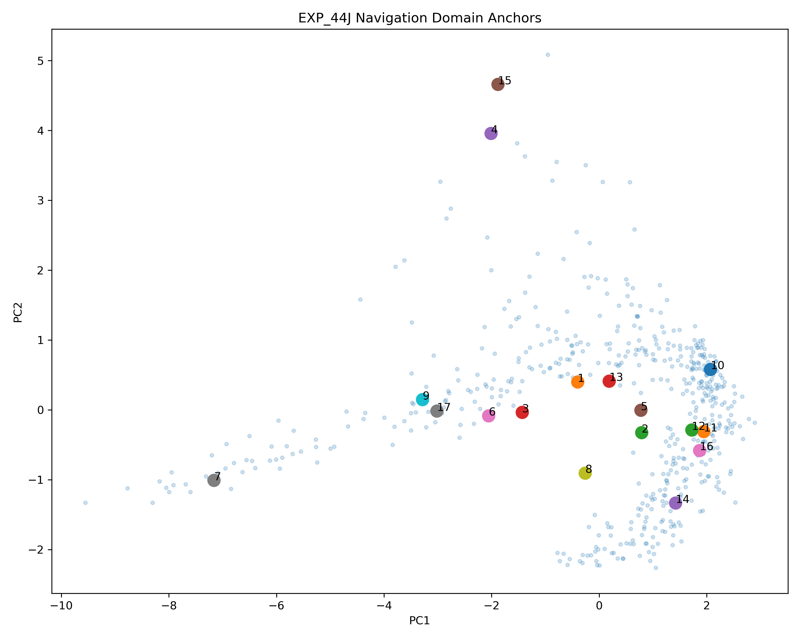

### Best Navigation Routes

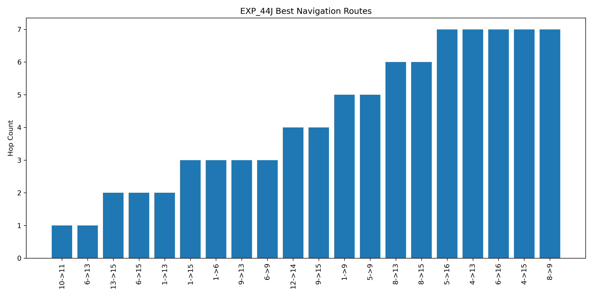

## Key Findings

The Atlas can be used as an operational navigation structure.

Coherent transport domains are connected through navigable routes that can be traversed directly using Atlas geometry.

A total of 113 valid navigation routes were identified between coherent domains.

The observed navigation structure exhibits:

- short local transport corridors
- medium-range transport pathways
- long-range domain connections
- hierarchical route organization

The distribution of route lengths is not uniform.

Several route-length plateaus appear, suggesting preferred transport scales within Atlas space.

This stair-like organization suggests that Atlas navigation may occur through discrete transport layers rather than through a continuous distance spectrum.

## Significance

This experiment represents the first successful operational use of the Atlas as a navigation engine.

The Atlas is no longer only a reconstructed structure.

It now supports routing between coherent dynamical regions.

Pipeline:

Graph → Flow → Coherence → Domains → Geodesic Transport → Navigation

---

# EXP_44K — Navigation Hub Discovery

## Goal

Identify whether navigation routes pass through dominant intermediate domain hubs.

## Results

### Domains

17

### Navigation Routes

113

### Top Hub Score

0.000

## Key Findings

No dominant intermediate hub was detected on the current navigation-route representation.

All domain transit counts were zero.

This indicates that the navigation data from EXP_44J does not yet encode intermediate domain transitions explicitly.

## Interpretation

EXP_44K did not reveal a hub-dominated navigation backbone.

Instead, it suggested that the correct level for hub analysis is not the raw route-anchor level, but the higher-order domain-network level.

## Significance

EXP_44K served as a diagnostic experiment.

It motivated the construction of a Domain Supergraph in EXP_44L.

---

# EXP_44L — Domain Supergraph Construction

## Goal

Elevate coherent Atlas domains into a higher-order transport network and investigate the large-scale topology of Atlas transport.

## Results

### Domains

17

### Edges

113

### Density

0.8309

### Connected Components

1

### Top Betweenness Domain

16

### Betweenness

0.105556

## Visuals

### Domain Supergraph

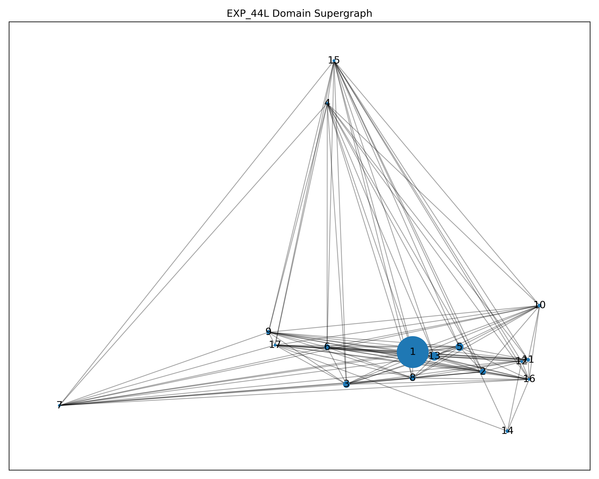

### Betweenness Centrality

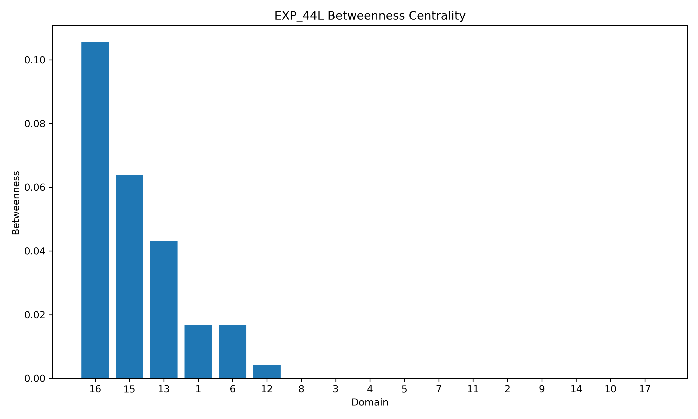

### Supergraph Matrix

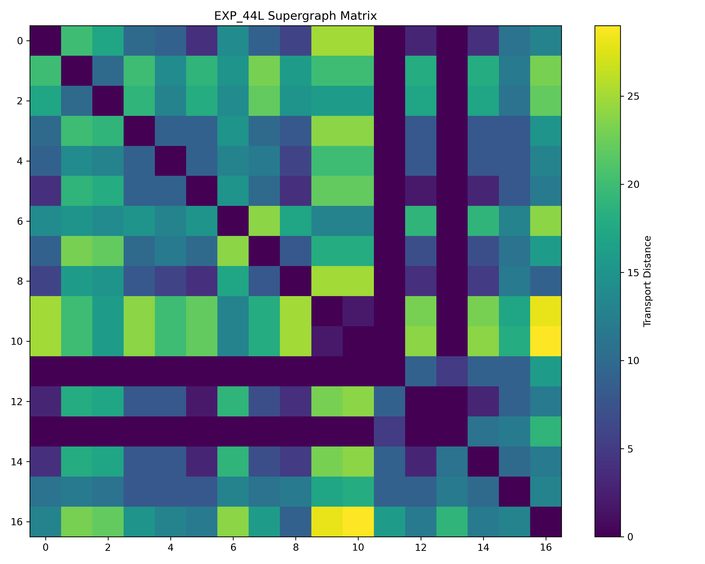

## Key Findings

The coherent transport domains can be elevated into a higher-order network.

The resulting Domain Supergraph is highly connected:

- 17 domains
- 113 transport edges
- density ≈ 83%
- a single connected component

The Atlas therefore possesses a global transport topology.

The most important transport mediator is Domain 16.

Observed betweenness centrality:

0.105556

indicating that Domain 16 acts as a bridge between otherwise distant transport regions.

## Structural Observation

The Supergraph visualization reveals a remarkable geometric organization.

Two overlapping pyramidal transport structures appear to emerge:

- a lower transport pyramid anchored around the central transport domains
- an upper transport pyramid anchored around Domains 4 and 15

The two structures intersect through the central Atlas transport region.

This produces a crossed transport geometry resembling two interlocking transport hierarchies.

No causal interpretation is claimed.

The pattern is recorded as a structural observation for follow-up analysis.

## Significance

This experiment establishes the first Atlas Domain Supergraph.

The Atlas now exists simultaneously as:

State Cloud  
↓  
State Graph  
↓  
Flow Field  
↓  
Coherent Domains  
↓  
Transport Network  
↓  
Domain Supergraph  

This represents the first higher-order transport representation of the reconstructed Atlas.

Pipeline:

Graph → Flow → Coherence → Domains → Geodesic Transport → Domain Supergraph

---

# EXP_44M — Transport Topology Invariance Validation

## Goal

Determine whether large-scale Atlas transport topology survives coherent-domain compression.

The experiment was motivated by the Atlas Shadow Matrix observation, which suggested that transport structures visible in the Domain Transport Matrix may persist after aggregation into the Domain Supergraph.

---

## Results

### Original Atlas Graph

- Nodes: 540
- Edges: 2700

### Domain Supergraph

- Domains: 17
- Edges: 113

### Compression Ratio

31.76 : 1 (nodes)

---

## Visuals

### Atlas Shadow Matrix

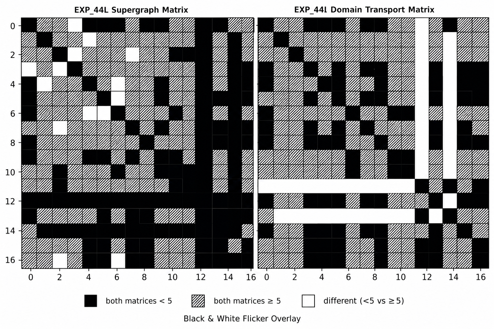

---

## Key Findings

Comparison between:

- EXP_44I Domain Transport Matrix
- EXP_44L Domain Supergraph Matrix

revealed substantial preservation of large-scale transport structure.

The following features remain visible after compression:

- transport corridors
- boundary regions
- high-distance sectors
- connectivity voids
- apex-domain structures

The persistence of these structures suggests that coherent-domain aggregation preserves major transport geometry.

---

## Interpretation

The observed similarity is stronger than expected from simple graph compression.

Large-scale transport organization appears to survive aggregation from:

540 Atlas States

↓

17 Coherent Domains

while discarding substantial local detail.

No claim of exact topological equivalence is made.

However, the evidence supports partial transport-topology preservation.

---

## Significance

This experiment provides the first evidence that Atlas transport geometry remains stable under large-scale compression.

Pipeline:

State Graph

↓

Coherent Domains

↓

Domain Supergraph

↓

Topology Preservation

---

# EXP_44N — Atlas Compression Validation

## Goal

Quantify how much structural information survives coherent-domain compression.

---

## Visuals

### Degree Distribution Comparison

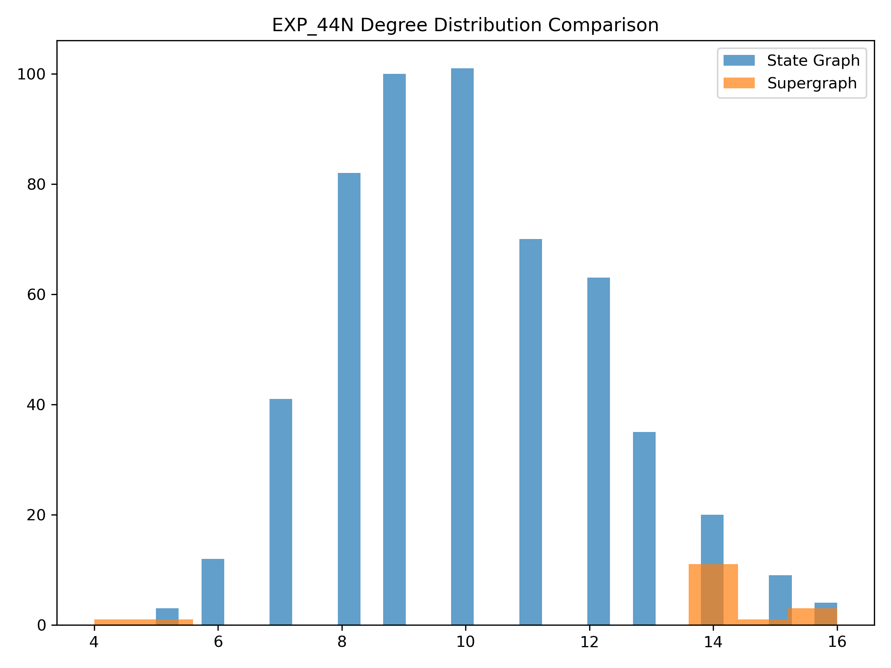

The Domain Supergraph degree distribution remains concentrated within the dominant connectivity regime of the original Atlas graph.

This suggests that coherent-domain compression preserves the primary transport backbone rather than generating an artificial network structure.

---

### Spectral Comparison

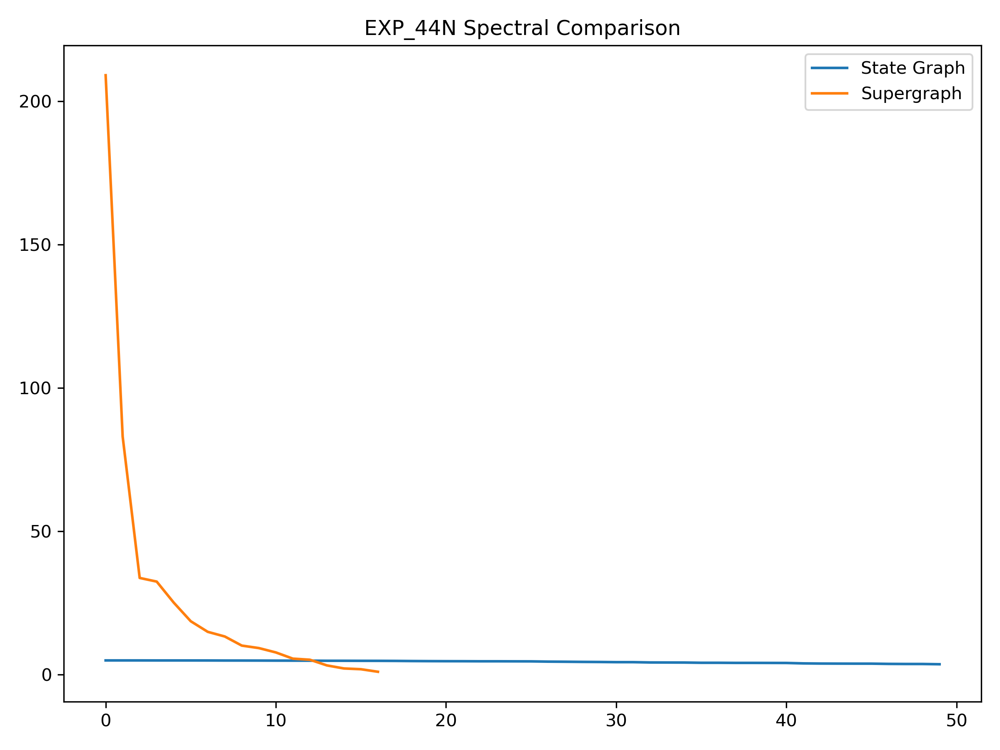

The dominant spectral modes remain visible after compression.

Higher-order modes are progressively removed, indicating that the Supergraph preserves large-scale transport geometry while filtering local structural detail.

---

### Domain Size Distribution

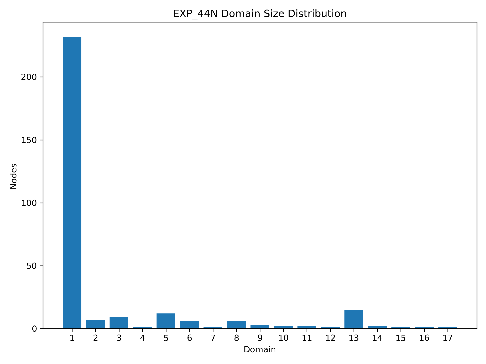

A dominant coherent transport domain containing 232 nodes was identified.

The remaining domains form a collection of smaller satellite structures surrounding the primary transport basin.

This suggests a strongly hierarchical Atlas organization.

---

### Compression Summary

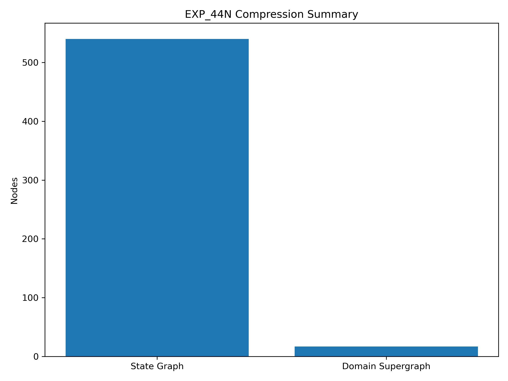

The Atlas was compressed from:

- 540 state nodes
- 2700 edges

to:

- 17 coherent domains
- 113 transport links

while preserving global connectivity.

The resulting compression ratio exceeds 30:1 at the node level.

---

## Results

### Original Atlas Graph

- 540 Nodes
- 2700 Edges

### Domain Supergraph

- 17 Domains
- 113 Transport Links

### Largest Domain

232 Nodes

### Compression Ratio

31.76 : 1

---

## Key Findings

Compression preserved:

- global connectivity
- transport accessibility
- dominant spectral structure
- navigability

while reducing network complexity by more than an order of magnitude.

Degree-distribution analysis indicates that the Domain Supergraph retains the primary transport backbone.

Spectral analysis indicates that large-scale transport geometry survives compression while local detail is filtered.

The resulting Atlas hierarchy is:

State Graph

↓

Coherent Domains

↓

Transport Skeleton

↓

Navigation Layer

---

## Significance

The Atlas admits a highly compressed representation without losing its dominant transport organization.

This establishes coherent-domain aggregation as a valid Atlas reduction method.

---

# Atlas Structural Observations

The following observations emerged during the EXP_44 campaign but are not yet considered validated experimental results.

They are recorded as structural phenomena for future investigation.

---

## Observation A — Interlocking Transport Pyramids

### Origin

EXP_44L — Domain Supergraph Construction

### Observation

The Domain Supergraph visualization appears to exhibit two overlapping pyramidal transport structures.

Observed components include:

- a lower transport pyramid centered around the dominant transport domains
- an upper transport pyramid anchored around Domains 4 and 15
- a central intersection region connecting both structures

The resulting geometry resembles two interlocking transport hierarchies.

### Status

Visual observation only.

No formal validation has been performed.

### Future Work

Potential follow-up:

EXP_44O — Supergraph Geometry Analysis

---

## Observation B — Atlas Shadow Matrix

### Origin

EXP_44M — Transport Topology Invariance Validation

### Observation

The Domain Transport Matrix and Domain Supergraph Matrix exhibit remarkably similar large-scale structure.

Observed similarities include:

- transport corridors
- boundary regions
- connectivity voids
- high-distance sectors
- apex-domain organization

### Status

Partially supported by EXP_44M.

Further validation required.

### Future Work

Potential follow-up:

EXP_44P — Transport Topology Conservation Analysis

---

## Observation C — Resonance Marker 0.779

### Origin

EXP_44H.1 — Flow Coherence Mapping

### Observation

Median local coherence:

0.779233

appears numerically close to the previously observed value:

0.779

reported in earlier Grey Elevator / Triton analyses.

### Status

Numerical coincidence only.

No causal interpretation is claimed.

### Future Work

Potential follow-up:

EXP_44Q — Coherence Marker Stability Analysis

---

# EXP_44O — Atlas Navigation Accuracy Validation

## Goal

Determine whether Atlas-guided navigation outperforms random transport across the reconstructed Domain Supergraph.

The central question was:

> Does the Atlas provide measurable navigation advantage compared to unguided transport?

## Results

### Domain Pairs

136

### Mean Navigation Gain

0.930693

### Mean Efficiency

14.889538

### Best Efficiency

28.750000

## Visuals

### Atlas vs Random Route Length

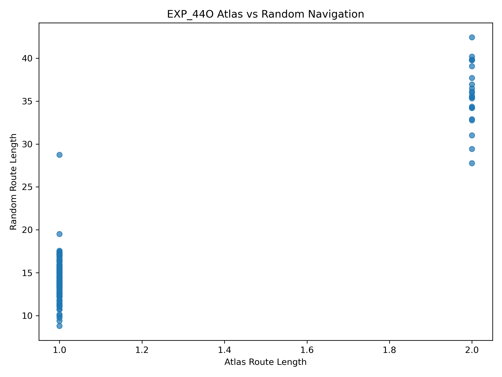

### Navigation Gain Distribution

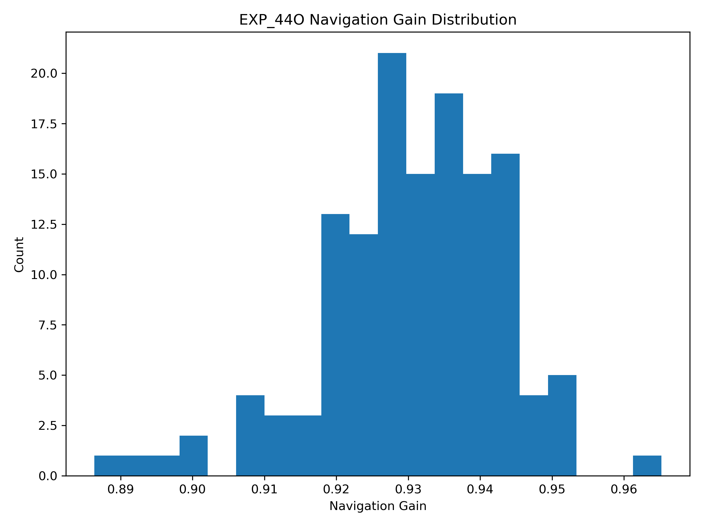

### Efficiency Matrix

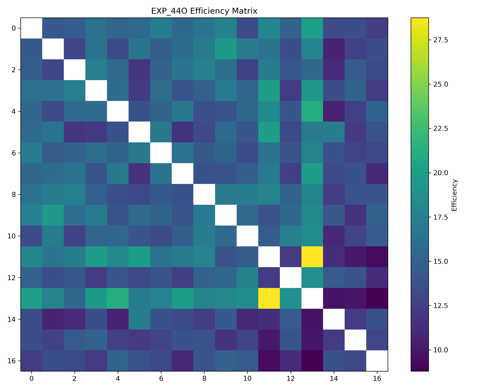

## Key Findings

Atlas-guided routes consistently outperform random-walk transport.

Observed navigation gain:

- Mean Gain ≈ 0.931

This indicates that Atlas navigation reduces transport cost by approximately 93% relative to random traversal.

The efficiency matrix reveals a highly structured navigation landscape.

Certain domain pairs exhibit exceptionally efficient transport corridors, suggesting that the Atlas contains preferred navigation pathways.

## Interpretation

The Atlas is no longer merely a descriptive representation of system structure.

It now functions as a practical navigation framework.

Pipeline:

State Graph
→ Domains
→ Supergraph
→ Navigation
→ Accuracy Validation

## Significance

This experiment provides the first quantitative validation of Atlas-guided navigation.

The reconstructed Atlas contains actionable transport information that can be used to navigate between coherent dynamical regions more efficiently than random exploration.

This represents the first operational demonstration of Atlas-assisted routing.

---

# EXP_44P — Atlas Highway Extraction

## Goal

Identify the dominant transport corridors that carry the majority of Atlas navigation traffic.

The central question was:

> Does Atlas navigation organize itself around a small number of preferred transport highways?

## Results

### Domains

17

### Highway Network

Extracted

### Dominant Hub

Domain 14

### Strongest Highway

12 → 14

### Maximum Highway Strength

28.75

## Visuals

### Atlas Highway Matrix

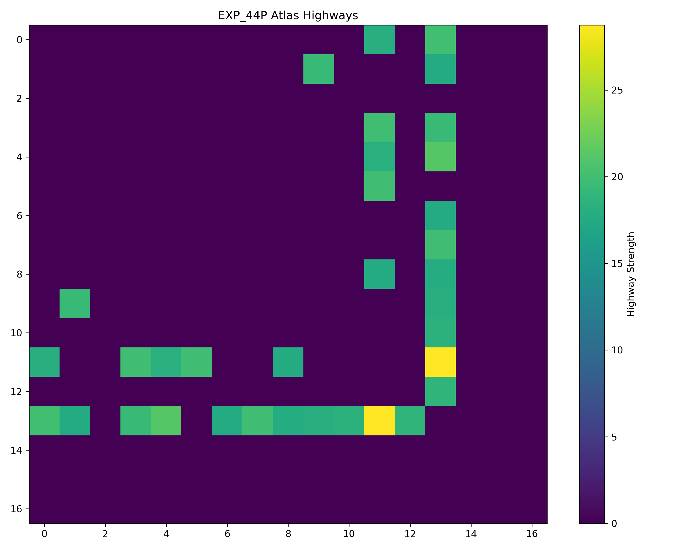

### Atlas Highway Network

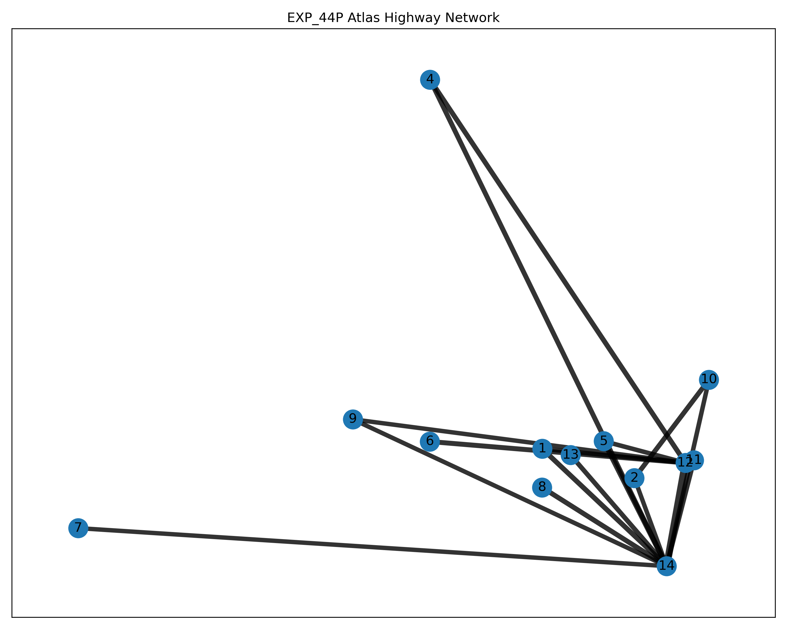

### Strongest Highway Ranking

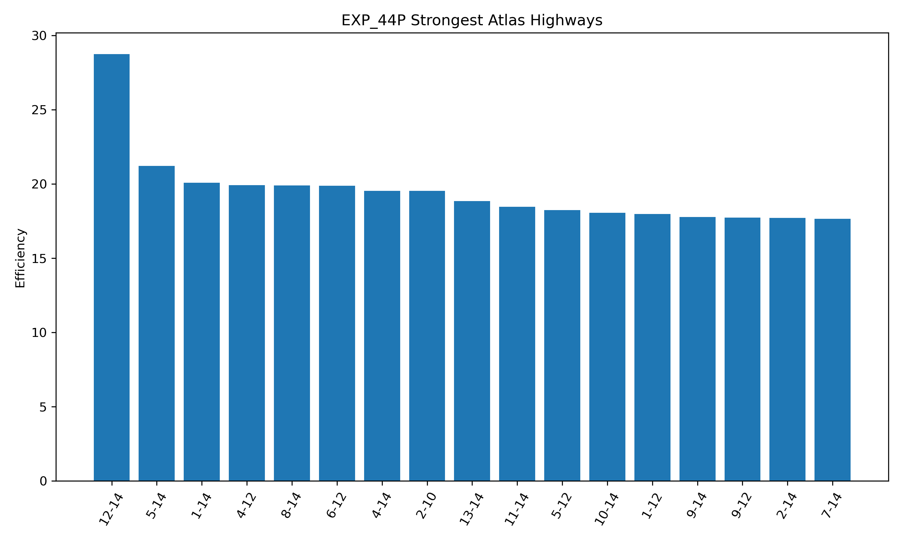

## Key Findings

Navigation traffic is not distributed uniformly across the Atlas.

Instead, transport repeatedly concentrates along a small number of preferred routes.

The strongest observed highways include:

- 12 → 14
- 5 → 14
- 1 → 14
- 4 → 12
- 8 → 14

Domain 14 emerges as the dominant transport hub.

The highway network reveals a compact transport skeleton connecting the majority of coherent Atlas regions.

## Structural Observation

The extracted highway network exhibits a geometric organization similar to structures previously observed in:

- EXP_44L Domain Supergraph
- Atlas Shadow Matrix analyses
- Compression Validation studies

The network appears to form two interconnected transport clusters joined through central transport domains.

This produces a double-pyramidal transport geometry resembling the large-scale Atlas transport skeleton.

No causal interpretation is claimed.

The pattern is recorded as a structural observation.

## Interpretation

Repeated Atlas navigation naturally converges onto a limited set of transport corridors.

Pipeline:

State Graph
→ Domains
→ Supergraph
→ Navigation
→ Highway Extraction

The Atlas therefore possesses not only navigable routes but also identifiable transport infrastructure.

## Significance

This experiment establishes the first Atlas Highway System.

The Atlas now exists simultaneously as:

State Cloud
↓
State Graph
↓
Coherent Domains
↓
Domain Supergraph
↓
Navigation Network
↓
Transport Highways

The discovered highway structure represents the dominant transport backbone of the reconstructed Atlas.

---

