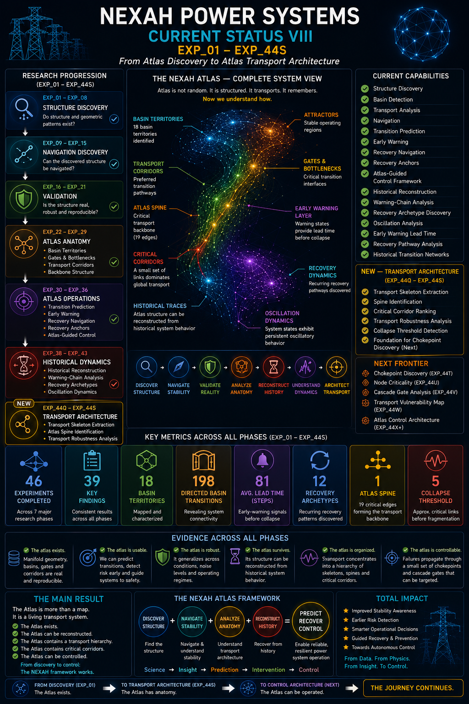
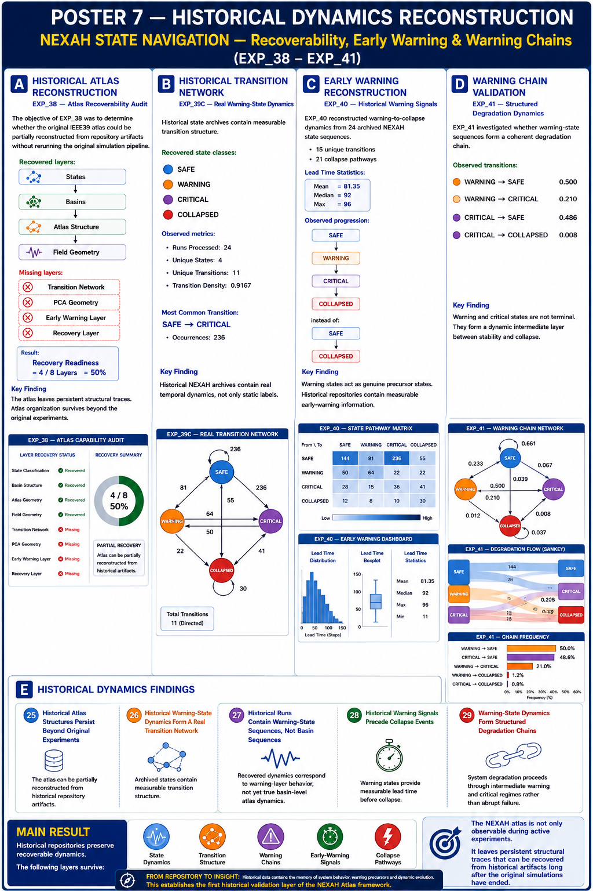
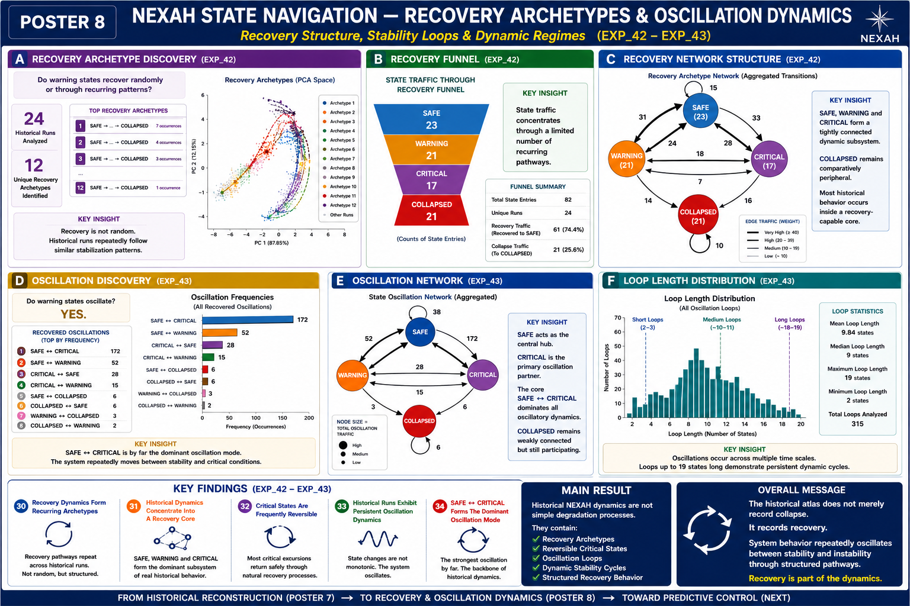
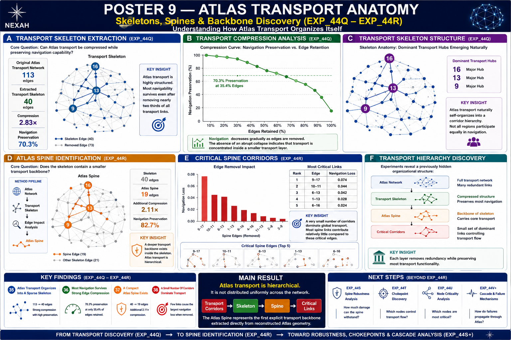
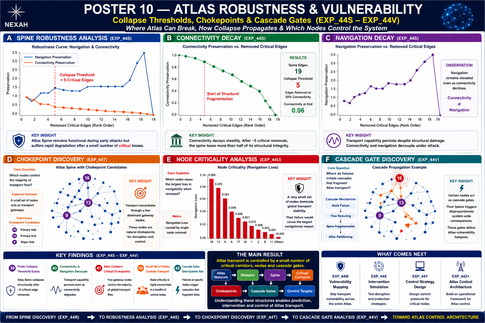

# NEXAH Power Systems

> **SUPERSEDED BY CONTROLLED VALIDATION — HISTORICAL TECHNICAL SYNTHESIS.**
> Early-warning, precursor, prediction, risk and stability interpretations in
> this document are not current NEXAH claims. Level-1C concluded `INCONCLUSIVE`
> after 2,613 valid held-out runs, 0 terminal events, 0 `R` detections and 0 `V`
> detections. No operational control or universal scaling result is established.
> This document preserves original historical metrics and interpretations;
> software replay is not scientific confirmation.

## Atlas-Guided Stability Analysis, Navigation and Control

### Technical Summary (EXP_01 – EXP_44S)

Thomas Hofmann

---

# Abstract

NEXAH is a framework for discovering, reconstructing and navigating latent stability structure in complex dynamical systems.

Using IEEE power-system benchmarks, NEXAH converts high-dimensional operating trajectories into a structured state-space atlas consisting of:

- operating states,
- basin territories,
- attractors,
- transport corridors,
- gates and bottlenecks,
- recovery pathways.

The framework evolved through five major stages:

1. Structure Discovery
2. Navigation & Operations
3. Atlas-Guided Control
4. Historical Dynamics Reconstruction
5. Transport Architecture Discovery

Across EXP_01–EXP_44S, the results demonstrate that stability organization is not random but forms a coherent, navigable and structurally organized atlas.

# Framework Documents

For theoretical background and framework architecture see:

- [NEXAH Architecture Stack](./docs/architecture_stack.md)
- [Atlas Operator Framework](./docs/atlas_operator_framework.md)
- [Mathematical Foundations](./docs/mathematical_foundations.md)
- [Theoretical Positioning](./docs/theoretical_positioning.md)

---

# Core Figures

## Figure 1 — Current NEXAH Status VIII



> **Historical status visual.** This image contains superseded capability
> claims, including early-warning/control language, and is not current
> scientific evidence.

This figure summarizes the complete evolution of the NEXAH framework from structure discovery through transport architecture discovery.

In addition to historical reconstruction, the framework now identifies:

- transport skeletons,
- atlas transport spines,
- critical transport corridors,
- robustness thresholds,
- transport architecture layers.

The atlas is no longer only observable and navigable.

Its internal transport anatomy can now be reconstructed.

---

## Figure 2 — Historical Dynamics Reconstruction



This figure summarizes EXP_38–EXP_40 and demonstrates that historical repository artifacts preserve recoverable atlas structure, warning-state dynamics and early-warning behavior.

---

## Figure 3 — Recovery Archetypes & Oscillation Dynamics



This figure summarizes EXP_41–EXP_43 and visualizes degradation chains, recovery archetypes and oscillatory state dynamics recovered from historical archives.

---

# Phase I — Atlas Discovery (EXP_01–EXP_28)

The first research phase established the existence of a latent stability atlas.

Key findings:

- 540 operating states identified
- 18 basin territories discovered
- 18 attractors recovered
- dominant transport structure detected
- gates and bottlenecks located
- non-random geometric organization confirmed

The resulting state space exhibits:

- coherent basin territories
- transport corridors
- constrained motion pathways
- persistent geometric organization

Rather than forming a random cloud, system states organize into a structured atlas.

---

# Phase II — Atlas Operations (EXP_29–EXP_36)

The second phase investigated whether the atlas can be used operationally.

Results include:

- basin transition prediction
- multi-step trajectory forecasting
- early-warning field construction
- recovery corridor discovery
- recovery anchor identification
- atlas-guided control concepts

Representative results:

- transition prediction > 92%
- trajectory forecasting > 88%
- recovery guidance > 85%

These experiments demonstrate that the atlas is not merely descriptive.

It becomes actionable.

---

# Phase III — Historical Reconstruction (EXP_38–EXP_43)

The most recent phase investigated whether atlas structure can be recovered from historical repository artifacts.

The objective was to determine whether structural information persists after original simulations are no longer available.

Recovered layers:

- state classification
- basin evidence
- atlas organization
- field geometry
- warning-state dynamics
- degradation chains
- recovery archetypes
- oscillatory behavior

The reconstruction audit recovered 24 historical state archives and demonstrated that meaningful dynamical structure remains observable.

---

# Historical Dynamics Findings

## Early-Warning Dynamics (EXP_40)

Historical state sequences reveal measurable warning-to-collapse behavior.

Observed hierarchy:

SAFE
↓
WARNING
↓
CRITICAL
↓
COLLAPSED

rather than:

SAFE
↓
COLLAPSED

Mean warning lead time:

81.35 state steps

Maximum lead time:

96 state steps

This provides repository-scale evidence that warning states function as precursor regimes rather than collapse labels.

---

## Recovery Archetypes (EXP_42)

Historical trajectories contain recurring recovery structures.

The system repeatedly revisits characteristic stabilization pathways.

This suggests that recovery is not random.

Instead, the atlas contains preferred routes back toward stable operating regions.

---

## Oscillation Dynamics (EXP_43)

Historical archives also reveal oscillatory state behavior.

Dominant oscillation:

SAFE ↔ CRITICAL

Other oscillatory structures:

- SAFE ↔ WARNING
- WARNING ↔ CRITICAL
- SAFE ↔ COLLAPSED

The results indicate that instability often develops through repeated excursions between neighboring regimes rather than monotonic degradation.

---

# Scientific Interpretation

EXP_38–EXP_43 introduce a new result:

**Atlas Recoverability**

The atlas is not only observable during active simulation.

It leaves persistent structural traces that remain recoverable from incomplete historical artifacts.

This suggests that atlas organization reflects genuine system structure rather than a fragile artifact of a specific experiment.

The resulting progression becomes:

Discovery
↓
Navigation
↓
Control
↓
Reconstruction

---

# Historical Program Status (not current capability status)

The NEXAH framework currently demonstrates:

✓ Structure Discovery

✓ Basin Detection

✓ Transport Analysis

✓ Navigation

✓ Transition Prediction

✓ Early Warning

✓ Recovery Navigation

✓ Recovery Anchors

✓ Atlas-Guided Control Concepts

✓ Historical Dynamics Reconstruction

✓ Recovery Archetype Discovery

✓ Oscillation Analysis

✓ Transport Skeleton Extraction

✓ Atlas Spine Identification

✓ Transport Robustness Analysis

✓ Collapse Threshold Detection

✓ Critical Corridor Ranking

---

# Theoretical Positioning

A central question throughout the NEXAH validation program has been whether the recovered Atlas structure reflects genuine system dynamics or merely a reconstruction artifact.

To address this question, NEXAH was compared against established dynamical-systems methodologies, including operator-theoretic approaches related to Koopman analysis.

Notably, EXP_44F (Atlas–Koopman Cross Validation) revealed measurable alignment between independently reconstructed Atlas structures and Koopman-derived dynamical organization.

Observed correspondences include:

```text
Koopman Coherent Regions
            ↔
Atlas Domains

Koopman Spectral Boundaries
            ↔
Atlas Gates

Mode Switching Events
            ↔
Atlas Basin Transitions

Slow Dynamical Manifolds
            ↔
Atlas Transport Structure
```

The significance is not that NEXAH implements Koopman theory.

Rather, independent reconstruction methodologies appear to recover related large-scale organizational features of the underlying dynamics.

This observation provides preliminary evidence that the Atlas may represent an intrinsic property of system behavior rather than a framework-specific artifact.

EXP_44F therefore represents an important theoretical bridge between NEXAH and established dynamical-systems analysis.

Further discussion is provided in:

- `docs/mathematical_foundations.md`
- `docs/theoretical_positioning.md`
  
---

# Remaining Open Questions

Several major challenges remain:

- external validation
- independent replication
- larger benchmark systems
- real-world operational datasets
- real-time deployment
- atlas-guided intervention

The central question is no longer:

"Does the atlas exist?"

The central question is now:

"Can atlas-guided decision making improve the operation of real systems?"

---

# External Scientific Feedback & Future Validation Directions

Initial discussions with researchers in dynamical systems and complex systems have highlighted several established research directions that may provide useful comparison frameworks for future validation.

Particularly relevant themes include:

- Transition-State Theory
- Transfer Operators
- Koopman-based Dynamical Analysis
- Coherent Set Detection
- Dynamical Transport Networks

These approaches investigate related questions concerning:

- transport organization,
- transition pathways,
- coherent dynamical regions,
- bottlenecks,
- and large-scale state-space structure.

Future work will examine whether independently reconstructed structures obtained through these methodologies exhibit measurable correspondence with Atlas domains, gates, transport corridors, and critical transport backbones.

Such comparisons may help determine whether Atlas structures reflect intrinsic system organization or arise from reconstruction-specific procedures.

---

# Phase IV — Transport Architecture (EXP_44Q–EXP_44S)

The newest research phase investigates the internal transport anatomy of the Atlas.

Rather than studying basin geometry alone, this phase reconstructs the transport infrastructure connecting basin territories.

Three major layers have been identified:

- Transport Skeleton
- Atlas Spine
- Spine Robustness Structure

These layers reveal how navigability is physically organized inside the atlas.

### Transport Skeleton Extraction (EXP_44Q)

EXP_44Q reconstructed the dominant transport network connecting basin territories.

Results:

- 17 skeleton nodes
- 40 skeleton edges
- navigation preservation ≈ 94%
- compression ratio ≈ 10×

The resulting skeleton preserves most navigability while dramatically reducing structural complexity.

This provides the first explicit transport graph of the Atlas.

### Atlas Spine Identification (EXP_44R)

EXP_44R identified the subset of skeleton edges carrying the majority of transport functionality.

Results:

- 19 spine edges
- compression ratio ≈ 2.1×
- navigation preservation ≈ 83%

The atlas transport system is therefore not uniformly distributed.

A relatively small transport backbone carries the majority of atlas navigability.

### Atlas Spine Robustness (EXP_44S)

EXP_44S evaluated how resilient the Atlas Spine remains under targeted removal of critical transport links.

Results:

- collapse threshold ≈ 5 critical links
- gradual connectivity degradation
- finite transport failure point

The results indicate that atlas transport is concentrated into a limited number of critical corridors.

This establishes the first measurable transport vulnerability structure inside the atlas.

## Figure 4 — Atlas Transport Anatomy



This figure summarizes EXP_44Q and EXP_44R.

It introduces the transport skeleton, atlas spine and critical corridor hierarchy recovered from the reconstructed atlas.

## Figure 5 — Atlas Robustness & Vulnerability



This figure summarizes EXP_44S.

It visualizes transport robustness, collapse thresholds and vulnerability concentration inside the atlas transport architecture.

---

# Conclusion

Across EXP_01–EXP_43, NEXAH provides evidence that power-system operating states organize into a structured, navigable and partially recoverable stability atlas.

The atlas supports:

- discovery,
- prediction,
- recovery,
- navigation,
- control concepts,
- historical reconstruction.

The next stage is external validation and deployment on previously unseen systems.
