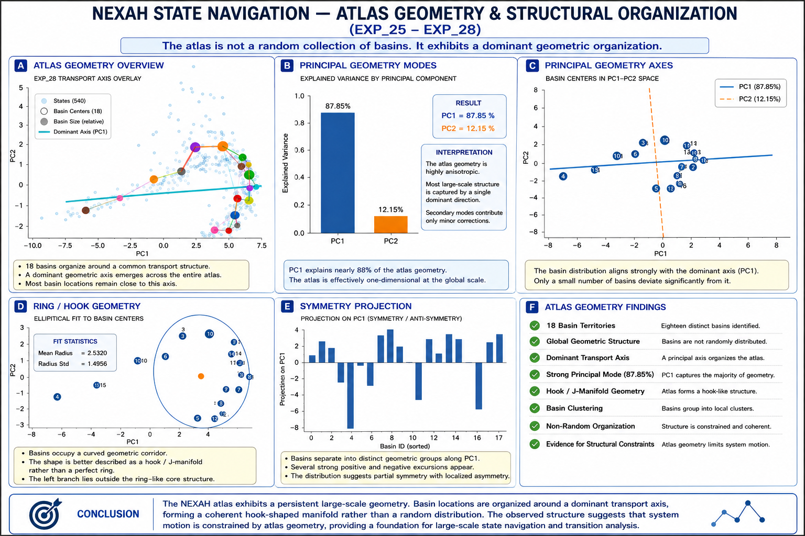

# NEXAH State Navigation

### Discovering Navigable Structure in Complex Dynamical Systems

NEXAH is a framework for discovering, mapping, and navigating latent stability structures in complex dynamical systems.

Instead of treating system behavior as a collection of isolated operating points, NEXAH reveals a structured state-space atlas consisting of:

- Basin Territories
- Attractors
- Transport Corridors
- Gates & Bottlenecks
- Recovery Anchors
- Control Pathways

The framework has been validated on IEEE benchmark power systems and demonstrates that operating states organize into coherent geometric structures rather than random state clouds.

---

# Stability Field Dynamics


NEXAH transforms raw dynamical simulations into navigable stability fields.

The workflow consists of:

```text
System Simulation
      ↓
Structure Discovery
      ↓
Stability Field Construction
      ↓
Atlas Generation
      ↓
Navigation
      ↓
Intervention
```

The objective is not only to observe system behavior, but to discover actionable structure that enables prediction, navigation, recovery, and control.

---

# Experimental Progression

The NEXAH validation program currently consists of four major phases.

| Phase | Focus |
|---------|---------|
| EXP_01 – EXP_08 | Foundation & Structure Discovery |
| EXP_09 – EXP_15 | Navigation Discovery |
| EXP_16 – EXP_21 | Validation |
| EXP_22 – EXP_36 | Atlas Operations & Control |

---

# Current Status

.png)

Key questions addressed:

✅ Does structure exist?

✅ Can structure be mapped?

✅ Can structure be navigated?

✅ Is navigation robust?

✅ Do basin territories exist?

✅ Can transitions be predicted?

✅ Can recovery be guided?
 
---

# Atlas Discovery


Main Result:

The operating states do not form a random cloud in state space.
 
Instead they organize into a structured atlas containing:

- Basin Territories
- Attractors
- Transport Corridors
- Gates
- Bottlenecks
- Recovery Regions

---

# Atlas Geometry



Key Findings:

- 18 Basin Territories
- Dominant Transport Axis
- Strong Principal Geometry Mode
- Hook / J-Manifold Structure
- Non-Random Organization
- Large-Scale Structural Constraints

---

# Transport Backbone


The atlas is connected through a sparse transport backbone.

Observations:

- Small number of high-capacity corridors
- Strong transition concentration
- Hub basins emerge naturally
- System flow is highly structured

---

# Atlas Operations

.png)


NEXAH enables:

- Transition Prediction
- Trajectory Forecasting
- Early Warning Detection
- Recovery Corridor Navigation
- Recovery Anchor Targeting

Results:

- Transition prediction > 92%
- Multi-step forecasting > 88%
- Structured recovery pathways identified

---
# Atlas Guided Control


The discovered atlas becomes operational infrastructure.

Control Loop:

1. Locate Current State
2. Assess Risk
3. Determine Navigation Direction
4. Select Recovery Path
5. Target Recovery Anchor
6. Apply Control Action
7. Update Atlas Position

---

# Core Contributions

NEXAH demonstrates that:

- State-space geometry is discoverable.
- Operating regions form basin territories.
- Transport corridors organize transitions.
- Gates and bottlenecks constrain motion.
- Future transitions can be predicted.
- Recovery pathways emerge naturally.
- Atlas-guided control becomes possible.

---

# Repository Structure

```text
APPLICATIONS/
└── power_systems/
    └── FIELD_NAVIGATION_VALIDATION/
        ├── experiments/
        ├── outputs/
        ├── diagrams/
        ├── reports/
        └── README.md
```

---

# Current Development Status

| Capability | Status |
|------------|---------|
| Structure Discovery | ✅ |
| Navigation | ✅ |
| Basin Detection | ✅ |
| Transition Prediction | ✅ |
| Early Warning | ✅ |
| Recovery | ✅ |
| Control Framework | ✅ |
| Real-Time Deployment | 🚧 |

---

# Vision

NEXAH aims to transform complex-system operation from reactive monitoring toward:

```text
Observation
      ↓
Structure Discovery
      ↓
Navigation
      ↓
Prediction
      ↓
Recovery
      ↓
Control
```

A navigable stability atlas enables resilient, predictive, and self-guiding system operation.

---

# Collaboration & Validation

NEXAH is currently being validated on IEEE benchmark systems and synthetic large-scale dynamical environments.

The next stage of development focuses on independent validation, external datasets, and real-world operational environments.

We welcome collaboration with:

- Power System Researchers
- Grid Operators
- Control Engineers
- Complex Systems Scientists
- Stability & Resilience Researchers
- Digital Twin Developers
- Infrastructure Operators

Areas of interest include:

- External benchmark validation
- Large-scale system studies
- Real-time monitoring applications
- Early warning systems
- Atlas-guided control strategies
- Navigation and recovery under uncertainty

Researchers and practitioners interested in testing, evaluating, or extending the NEXAH framework are encouraged to open an issue or contact the project team.

The goal is to evaluate whether navigable state-space structure represents a general principle across complex dynamical systems.

---

# Citation

If you use NEXAH in academic work, please cite the repository and associated documentation.

---

**Structure reveals. Navigation guides. Control protects.**
