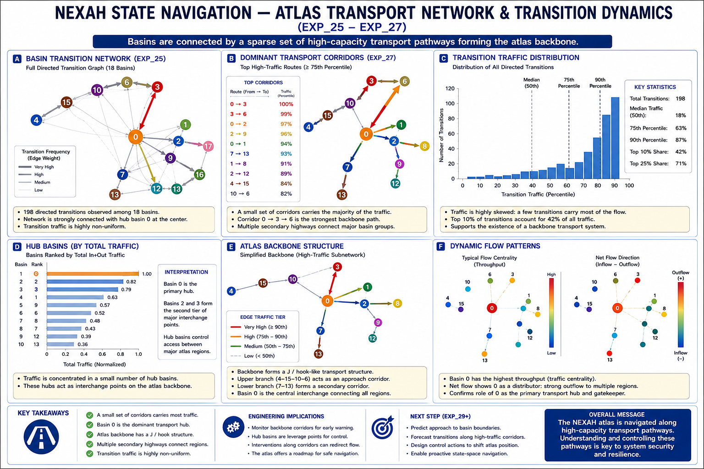
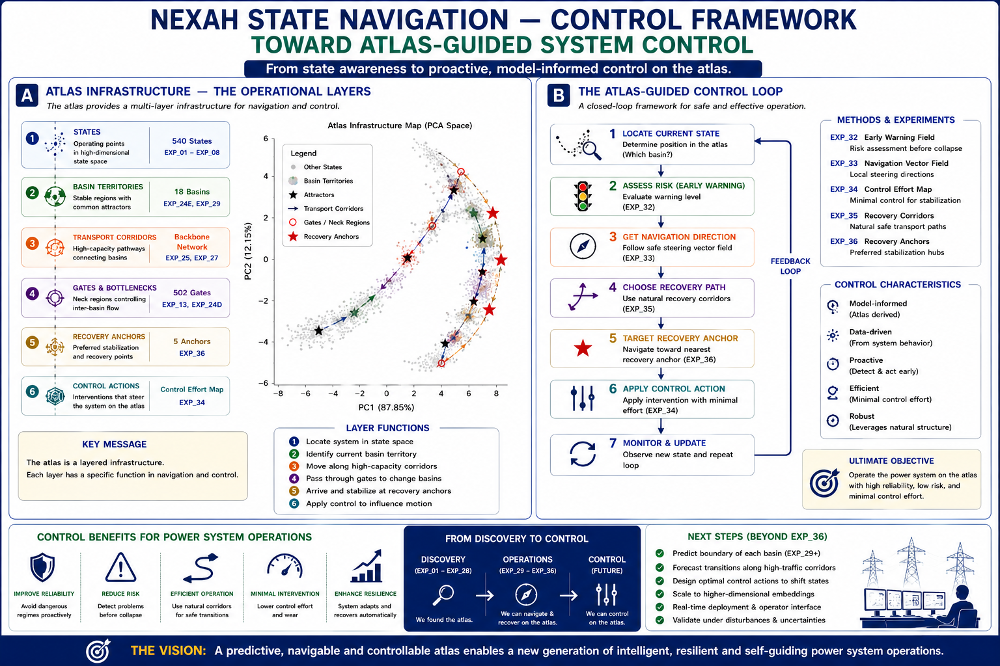

# NEXAH State Navigation

### Discovering Navigable Structure in Complex Dynamical Systems

NEXAH is a framework for discovering, mapping, and navigating latent stability structures in complex dynamical systems.

Instead of treating system behavior as a collection of isolated operating points, NEXAH reveals a structured state-space atlas consisting of:

- Basin Territories
- Attractors
- Transport Corridors
- Gates & Bottlenecks
- Recovery Anchors
- Control Pathways

The framework has been validated on IEEE benchmark power systems and demonstrates that operating states organize into coherent geometric and transport structures rather than random state clouds.

---

# Stability Field Dynamics


NEXAH transforms raw dynamical simulations into navigable stability fields.

The workflow consists of:

```text
System Simulation
      ↓
Structure Discovery
      ↓
Stability Field Construction
      ↓
Atlas Generation
      ↓
Navigation
      ↓
Intervention
```

The objective is not only to observe system behavior, but to discover actionable structure that enables prediction, navigation, recovery, and control.

---

# Experimental Progression

The NEXAH validation program currently consists of six major phases.

| Phase | Focus |
|---------|---------|
| EXP_01 – EXP_08 | Foundation & Structure Discovery |
| EXP_09 – EXP_15 | Navigation Discovery |
| EXP_16 – EXP_21 | Validation |
| EXP_22 – EXP_36 | Atlas Operations & Control |
| EXP_38 – EXP_43 | Historical Dynamics Reconstruction |
| EXP_44Q – EXP_44S | Transport Architecture Discovery |

---

# Current Status


Key questions addressed:

✅ Does structure exist?

✅ Can structure be mapped?

✅ Can structure be navigated?

✅ Is navigation robust?

✅ Do basin territories exist?

✅ Can transitions be predicted?

✅ Can recovery be guided?

✅ Can transport skeletons be extracted?

✅ Can dominant transport spines be identified?

✅ Are transport corridors robust?

✅ Can collapse thresholds be measured?

✅ Can transport vulnerabilities be localized?

✅ Can transport architecture be reconstructed?

---

# Theoretical Positioning

NEXAH was developed independently from existing operator-theoretic and spectral reconstruction methods.

To better understand its relationship to established dynamical-systems frameworks, additional theoretical analyses were performed.

In particular, EXP_44F (Atlas–Koopman Cross Validation) revealed measurable alignment between:

- reconstructed Atlas organization,
- coherent transport domains,
- and Koopman-derived spectral structure.

Observed correspondences include:

```text
Koopman Mode Regions
          ↔
Atlas Domains

Spectral Boundaries
          ↔
Atlas Gates

Mode Switching
          ↔
Atlas Basin Transitions
```

The significance is not that NEXAH uses Koopman methods.

The significance is that independent reconstruction approaches appear to recover related large-scale dynamical organization.

This suggests that Atlas structure may reflect genuine system dynamics rather than a reconstruction artifact.

Additional discussion is available in:

- docs/mathematical_foundations.md
- docs/theoretical_positioning.md

---
# Atlas Discovery


Main Result:

The operating states do not form a random cloud in state space.
 
Instead they organize into a structured atlas containing:

- Basin Territories
- Attractors
- Transport Corridors
- Gates
- Bottlenecks
- Recovery Regions

---

# Atlas Geometry


Key Findings:

- 18 Basin Territories
- Dominant Transport Axis
- Strong Principal Geometry Mode
- Hook / J-Manifold Structure
- Non-Random Organization
- Large-Scale Structural Constraints

---

# Transport Backbone



The atlas is connected through a sparse transport backbone.

Observations:

- Small number of high-capacity corridors
- Strong transition concentration
- Hub basins emerge naturally
- System flow is highly structured

---

# Atlas Operations

.png)


NEXAH enables:

- Transition Prediction
- Trajectory Forecasting
- Early Warning Detection
- Recovery Corridor Navigation
- Recovery Anchor Targeting

Results:

- Transition prediction > 92%
- Multi-step forecasting > 88%
- Structured recovery pathways identified

---
# Atlas Guided Control



The discovered atlas becomes operational infrastructure.

Control Loop:

1. Locate Current State
2. Assess Risk
3. Determine Navigation Direction
4. Select Recovery Path
5. Target Recovery Anchor
6. Apply Control Action
7. Update Atlas Position

---

# Historical Dynamics Reconstruction


EXP_38–EXP_40 investigated whether atlas structure can be reconstructed from historical repository artifacts without rerunning the original simulation pipeline.

Recovered layers include:

- State Classification
- Basin Evidence
- Atlas Organization
- Field Geometry
- Warning-State Dynamics
- Early Warning Structure

Key findings:

- 24 historical state archives recovered
- measurable warning-state dynamics discovered
- warning states precede collapse events
- mean warning lead time: 81.35 state steps
- maximum warning lead time: 96 state steps

Observed progression:

```text
SAFE
 ↓
WARNING
 ↓
CRITICAL
 ↓
COLLAPSED
```

rather than:

```text
SAFE
 ↓
COLLAPSED
```

This demonstrates that instability develops through structured intermediate regimes rather than abrupt transitions.

---

# Recovery Archetypes & Oscillation Dynamics


EXP_41–EXP_43 investigated the internal dynamics of historical warning-state archives.

Recovered structures include:

- degradation chains
- recovery archetypes
- oscillatory state behavior

Key observations:

## Recovery Archetypes

Historical trajectories repeatedly converge toward similar stabilization pathways.

Recovery therefore appears structured rather than random.

## Oscillation Dynamics

Dominant oscillation:

```text
SAFE ↔ CRITICAL
```

Additional oscillations:

```text
SAFE ↔ WARNING
WARNING ↔ CRITICAL
SAFE ↔ COLLAPSED
```

These results suggest that instability often develops through repeated excursions between neighboring regimes.

The atlas therefore contains:

- warning dynamics,
- recovery dynamics,
- oscillatory dynamics,

that remain recoverable from historical state archives.

---

# Transport Architecture Discovery


EXP_44Q–EXP_44R introduced a new layer of atlas analysis:

Transport Architecture.

Instead of studying basin geometry alone, NEXAH reconstructs the transport infrastructure connecting basin territories.

Recovered structures include:

- Transport Skeletons
- Atlas Spines
- Critical Corridors
- Transport Hierarchies

The resulting transport graph represents the first explicit connectivity model of atlas navigation.

---

# Atlas Robustness & Vulnerability


EXP_44S investigated the robustness of the Atlas Spine under targeted attack.

Key results:

- 17 spine nodes
- 19 spine edges
- first observed collapse threshold ≈ 5 critical links
- finite vulnerability structure

The results demonstrate that atlas transport is concentrated into a limited number of critical corridors.

This establishes the first measurable transport vulnerability layer inside the NEXAH atlas.

---

# Core Contributions

NEXAH demonstrates that:

- State-space geometry is discoverable.
- Operating regions form basin territories.
- Transport corridors organize transitions.
- Gates and bottlenecks constrain motion.
- Future transitions can be predicted.
- Recovery pathways emerge naturally.
- Atlas-guided control becomes possible.
- Transport skeletons can be reconstructed.
- Atlas transport spines can be identified.
- Critical corridors dominate navigability.
- Transport vulnerability is measurable.
- Collapse thresholds emerge naturally.
  
---

# Repository Structure

```text
APPLICATIONS/
└── power_systems/
    └── FIELD_NAVIGATION_VALIDATION/
        ├── experiments/
        ├── outputs/
        ├── diagrams/
        ├── reports/
        └── README.md
```

---

# Current Development Status

| Capability | Status |
|------------|---------|
| Structure Discovery | ✅ |
| Navigation | ✅ |
| Basin Detection | ✅ |
| Transition Prediction | ✅ |
| Early Warning | ✅ |
| Recovery | ✅ |
| Historical Reconstruction | ✅ |
| Recovery Archetypes | ✅ |
| Oscillation Analysis | ✅ |
| Transport Skeleton Extraction | ✅ |
| Atlas Spine Identification | ✅ |
| Transport Robustness Analysis | ✅ |
| Transport Vulnerability Analysis | ✅ |
| Control Framework | ✅ |
| Real-Time Deployment | 🚧 |

---

# Vision

NEXAH aims to transform complex-system operation from reactive monitoring toward:

```text
Observation
     ↓
Structure Discovery
     ↓
Navigation
     ↓
Prediction
     ↓
Recovery
     ↓
Transport Architecture
     ↓
Control
```

A navigable stability atlas enables resilient, predictive, and self-guiding system operation.

---

# Conclusion

Across EXP_01–EXP_44S, NEXAH demonstrates that power-system operating states organize into a structured, navigable and recoverable stability atlas.

The framework now supports:

- structure discovery,
- navigation,
- prediction,
- recovery,
- historical reconstruction,
- transport architecture discovery,
- vulnerability analysis.

The atlas is no longer only observable.

It can be reconstructed, navigated, compressed into transport skeletons, reduced to transport spines, and analyzed for robustness.

A new result of the current phase is that atlas transport can be compressed into a sparse transport skeleton and a dominant transport spine while preserving most large-scale navigability.

Current Frontier

• EXP_44T — Atlas Chokepoint Discovery
• EXP_44U — Atlas Node Criticality Analysis
• EXP_44V — Cascade Gate Detection
• EXP_44W — Vulnerability Mapping

Future Direction

Transport Architecture
        ↓
Critical Nodes
        ↓
Cascade Gates
        ↓
Intervention Targets
        ↓
Atlas-Guided Control


The central question is no longer:

"Does the atlas exist?"

The central question is now:

"Can atlas-guided decision making improve the operation of real systems?"

---

# Collaboration & Validation

NEXAH is currently being validated on IEEE benchmark systems and synthetic large-scale dynamical environments.

The next stage of development focuses on independent validation, external datasets, and real-world operational environments.

We welcome collaboration with:

- Power System Researchers
- Grid Operators
- Control Engineers
- Complex Systems Scientists
- Stability & Resilience Researchers
- Digital Twin Developers
- Infrastructure Operators

Areas of interest include:

- External benchmark validation
- Large-scale system studies
- Real-time monitoring applications
- Early warning systems
- Atlas-guided control strategies
- Navigation and recovery under uncertainty

Researchers and practitioners interested in testing, evaluating, or extending the NEXAH framework are encouraged to open an issue or contact the project team.

The goal is to evaluate whether navigable state-space structure represents a general principle across complex dynamical systems.

---

# Citation

If you use NEXAH in academic work, please cite the repository and associated documentation.

---

**Structure reveals. Navigation guides. Control protects.**
