# 🧭 NEXAH Atlas Navigation & Control Log

## Phase D — Prediction, Navigation & Control

This log continues the atlas discovery phase (EXP_01 – EXP_28).

The objective is no longer to discover the atlas.

The objective is to predict, navigate and control motion within the atlas.

---

# Current Status

The discovery phase established that IEEE39 operating states do not form a random cloud in state space.

Instead, the operating states organize into a structured atlas containing:

- geometric organization
- transport corridors
- gate structures
- regime boundaries
- basin territories
- navigation pathways
- transport hubs
- atlas-scale geometry

The atlas now exists as a measurable object.

Across the discovery phase, evidence consistently supported the emergence of:

```text
  Dynamics
     ↓
  Geometry
     ↓
  Transport
     ↓
 Navigation
     ↓
   Basins
     ↓
   Atlas 
```
The most important result of Phase C is that the atlas exhibits a persistent large-scale structure rather than isolated local patterns.

Observed properties include:

- robust navigation under noise
- successful out-of-distribution navigation
- identifiable attractor territories
- basin-level transport networks
- dominant transport corridors
- hub regions
- a dominant geometric axis

Most notably:

```
text PC1 = 87.85 % 
```
indicating that the atlas is strongly organized around a single large-scale transport geometry.

---

# What Changes In Phase D

The primary question is no longer:

```text
Can we see the atlas? 
```

That question has been answered.

The new questions become:

```text
Can we predict motion inside the atlas?  Can we detect dangerous transitions?
Can we guide trajectories?  Can we control movement between regions? 
```

Phase D therefore shifts from discovery toward operational utility.

---

# Research Direction

The goal of this phase is to transform the atlas from a descriptive model into a predictive and navigational framework.

The central hypothesis is:

```text
  Atlas Geometry
         ↓
Predictive Structure
         ↓
Navigable Structure
         ↓
Controllable Structure 
```

If true, the atlas should allow us to:

- identify future transitions
- detect instability precursors
- estimate regime changes
- locate safe operating corridors
- discover control directions
- guide systems toward stable regions

---

# Engineering Relevance

For power-system operators, the central challenge is not merely understanding the current state.

The challenge is anticipating future motion.

Traditional monitoring approaches focus on:

- voltages
- loading
- frequency
- contingency analysis

The atlas perspective introduces an additional layer:

text Where is the system?  Where is it moving?  What regions are nearby?  What transitions are likely?  How can movement be redirected? 

This transforms the atlas from a visualization into a potential operational tool.

---

# Strategic Objectives

Phase D focuses on five major objectives:

### Prediction

Understand how states move through the atlas.

### Transition Forecasting

Detect likely future basin changes.

### Early Warning

Identify precursors of instability before transitions occur.

### Navigation

Determine safe pathways between operating regions.

### Control

Discover actions capable of steering trajectories toward desired atlas locations.

---

# Long-Term Goal

The ultimate objective is the development of a navigation framework capable of answering:

```text
    Current State
           ↓
Future State Prediction
           ↓
    Transition Risk
           ↓
Recommended Navigation Path
           ↓
     Control Action 
```
This would represent a transition from:

```text
Atlas Discovery 
```
to:

```text
Atlas Operations 
```

and ultimately:

```text
Atlas-Guided System Control 
```

---

# Phase D Mission Statement

```text
The atlas has been discovered.  The next challenge is learning how to move within it.
```

# EXP_29 — Transport Axis Stability

## Objective

EXP_28 revealed that the IEEE39 atlas possesses a dominant geometric axis.

The first principal mode captures:

```text
68.94 %
```

of the entire state-space variance.

The objective of EXP_29 was to determine whether this axis represents:

- a stability axis
- a loading axis
- a voltage axis
- a transport backbone
- or a more general atlas coordinate

---

## Key Result

The dominant transport axis is real.

However, it does not appear to be a direct stability metric.

Observed correlations:

```text
Axis vs Loading      =  0.2226
Axis vs Angle Span   =  0.1557
Axis vs Voltage Std  = -0.0630
```

The correlations are weak.

This indicates that the transport axis is not simply a projection of:

- loading
- voltage stress
- angle stress

alone.

Instead it appears to represent an independent geometric coordinate of the atlas.

---

## Finding 1 — The Atlas Hangs On The Axis

The transport-axis stability map reveals a remarkable structure.

The transport axis does not pass through the center of the state cloud.

Instead the manifold appears to organize itself around the axis.

The geometry resembles:

```text
J-manifold
Hook geometry
Suspended corridor
```

The majority of operating states remain close to the axis.

Large deviations occur primarily in the upper and lower curvature regions.

This suggests:

```text
Transport Axis
=
Geometric Backbone
```

rather than

```text
Transport Axis
=
Stress Metric
```

---

## Visual Evidence


The majority of operating states remain attached to the transport axis.

Large deviations appear only within high-curvature regions.

---

## Finding 2 — Coordinated Shape Deformation Appears

Three physical projections were examined:

1. Voltage Variability
2. Angle Span
3. Loading

When viewed sequentially the projections do not behave like independent scatter clouds.

Instead they appear to represent coordinated deformations of a common geometric structure.

Observed sequence:

### Voltage Projection

A compressed floor emerges.

```text
Stable Layer
```

appears across much of the atlas.

### Angle Projection

The compressed layer dissolves.

A fan-like structure emerges.

### Loading Projection

The fan transforms into two dominant upward branches.

The structure resembles:

```text
Ψ
```

or a bifurcating transport fork.

---

## Visual Evidence

### Voltage Variability Projection


A compressed stability floor appears across much of the atlas.

---

### Angle Span Projection


The compressed layer expands into a distributed fan structure.

---

### Loading Projection


Two dominant loading branches emerge from the same transport coordinate.

---

## Finding 3 — Multiple Physical Variables Share One Geometry

A notable observation is that all three projections use the same transport coordinate:

```text
Distance From Axis
```

Changing only the physical observable reveals consistent structural transformations.

This suggests:

```text
Voltage
Angle
Loading
```

are not independent phenomena.

Instead they may represent different projections of a common atlas geometry.

The atlas therefore behaves less like a collection of isolated measurements and more like a coordinated geometric object.

---

## Interpretation

EXP_29 suggests a revised interpretation of the transport axis.

The axis does not directly measure:

```text
Stress
Risk
Instability
```

Instead it appears to measure:

```text
Position
within the atlas
```

This distinction is important.

For operators:

```text
Position
≠
Risk
```

A state may occupy a particular region of the atlas without necessarily being unstable.

The transport axis therefore appears to function as a geometric coordinate rather than a risk indicator.

---

## Engineering Interpretation

For IEEE-style operation this distinction is natural.

An operator needs two independent quantities:

### Atlas Coordinate

```text
Where am I?
```

### Stability Assessment

```text
How dangerous is this location?
```

EXP_29 suggests the transport axis contributes primarily to the first question.

Future experiments will investigate whether basin exits, regime transitions and early-warning signals contribute to the second.

---

## Status After EXP_29

Validated:

✓ Dominant transport axis exists

✓ Atlas remains highly low-dimensional

✓ Most states remain attached to the transport backbone

✓ Physical observables deform coherently along atlas coordinates

✓ Transport axis behaves as a geometric coordinate

Not Yet Proven:

□ Basin exit prediction

□ Regime transition forecasting

□ Early-warning capability

□ Control vector discovery

□ Return-to-safe-basin navigation

---

## Conclusion

EXP_29 strengthens the interpretation that the IEEE39 atlas possesses an intrinsic coordinate system.

The dominant transport axis appears to organize state-space geometry while remaining largely independent of individual physical stress metrics.

The results suggest that:

```text
Atlas Coordinate
+
Physical State Variables
```

may form the foundation of a navigable operating-space representation.

This provides the first evidence that the atlas may support predictive navigation rather than geometric visualization alone.

---

### Next Step

```text
EXP_30
Basin Exit Forecasting
```

Core Question:

Can movement within the atlas predict when a state is about to leave its current stability territory?

# Finding 12 — Basin Exit Risk Is Geometrically Structured

EXP_30 — Basin Exit Forecasting

The next question after atlas discovery was:

```text
Can the atlas identify states that are likely
to leave their current operating region?
```

EXP_30 introduced the concept of:

```text
Basin Exit Risk
```

using local density, neighborhood structure,
and proximity to competing basin regions.

The objective was not to predict the exact future state.

The objective was to determine whether certain atlas regions
systematically exhibit elevated transition potential.

---

## Result

Exit risk is not randomly distributed throughout the atlas.

Instead, elevated risk concentrates in specific geometric regions.

Observed pattern:

```text
Atlas Position
        ↓
Local Density
        ↓
Exit Risk
```

States near dense manifold cores exhibit low exit risk.

States near sparse regions and transition sectors exhibit elevated risk.

This suggests that future transitions may be partially forecastable from geometric position alone.

---

## Visual Evidence


A strong inverse relationship emerges:

```text
Density ↑
Exit Risk ↓
```

High-density operating regions behave as geometric stability reservoirs.

Low-density regions exhibit substantially higher exit risk.

---

# Finding 12.1 — Exit Risk Concentrates Along Specific Atlas Regions

The spatial risk map reveals that elevated exit probability
is not uniformly distributed.

Instead, risk accumulates along recognizable portions
of the atlas geometry.

---

## Visual Evidence


High-risk states appear preferentially along:

- upper crown regions
- transition sectors
- low-density outer branches

while the dense right-hand basin cluster remains comparatively stable.

This indicates that atlas topology influences transition likelihood.

---

# Finding 12.2 — Basin Boundaries Become Observable

A second analysis examined the distance of each state
to neighboring basin structures.

The goal was to identify geometric boundary regions.

---

## Visual Evidence


The resulting map reveals distinct boundary zones.

These zones are concentrated around:

- branch intersections
- curvature changes
- sparse transition corridors

rather than being distributed randomly throughout the manifold.

---

# Finding 12.3 — Exit Candidates Form Structured Clusters

The highest-risk states were extracted and visualized separately.

If exit dynamics were random, these candidates would appear scattered.

Instead, they form coherent geometric groups.

---

## Visual Evidence


Several candidate clusters emerge:

```text
Upper Crown Region
```

appears as the dominant exit zone.

Additional candidate groups appear near:

- branch junctions
- curvature transitions
- outer manifold sectors

This suggests that exits occur through preferred geometric corridors.

---

# Geometric Interpretation

EXP_30 reinforces a recurring observation across the atlas program.

The IEEE39 operating manifold behaves less like:

```text
Random State Cloud
```

and more like:

```text
Structured Transport Geometry
```

with:

- stable cores
- transition corridors
- geometric boundaries
- preferred exit sectors

The highest-risk states are concentrated near these structural features.

---

# Engineering Interpretation

For a grid operator the result can be interpreted as:

```text
Current State
        ↓
Atlas Position
        ↓
Exit Risk Estimate
```

rather than:

```text
Current State
        ↓
Unknown Future
```

This introduces the possibility of:

- transition forecasting
- instability surveillance
- early warning indicators
- geometry-based operational monitoring

without requiring a full dynamic simulation of future trajectories.

---

# EXP_30 Conclusion

EXP_30 provides the first evidence that:

```text
Future transition likelihood
is encoded in atlas geometry.
```

The atlas is therefore not merely a map of where states exist.

It also contains information about:

```text
Which states are likely
to leave their current basin.
```

This establishes the foundation for:

```text
EXP_31
Transition Prediction
```

where the next question becomes:

```text
If a state exits,

where does it go?
```

---

## Current Status

```text
Dynamics
    ↓
Geometry
    ↓
Transport
    ↓
Basins
    ↓
Exit Risk
```

SUPPORTED

EXP_30
```
# Finding 3 — Transition Prediction Becomes Possible

## EXP_31 — Transition Prediction

Previous experiments established:

```text
Atlas
→ Basins
→ Transport Corridors
→ Exit Risk
```

EXP_31 investigated the next question:

```text
If a state leaves its current basin,

where will it most likely go?
```

The experiment combined:

- basin geometry
- local density
- exit risk estimation
- nearest foreign basin detection

to construct the first transition forecast layer of the NEXAH Atlas.

---

## Key Result

The atlas does not suggest arbitrary transitions.

Instead, high-risk states exhibit preferred transition targets.

Observed structure:

```text
State
    ↓
Exit Candidate
    ↓
Preferred Basin
```

rather than

```text
State
    ↓
Any Basin
```

This is the first evidence that transition forecasting may be possible directly from atlas geometry.

---

## Visual Evidence

### Predicted Transition States


High-risk transition candidates concentrate in specific atlas regions.

The distribution is not uniform.

Several candidate groups appear along coherent upper-field structures.

A particularly notable feature is the emergence of a continuous yellow-orange-red band.

This suggests that transition candidates may organize along a geometric risk gradient rather than appearing randomly across the atlas.

---

### Transition Target Map


The atlas separates into distinct territorial regions.

Cluster centers act as geometric attractors or regional centers.

The resulting map resembles a collection of operating territories connected through potential transition routes.

Several territories appear highly compact and self-organized.

The right-most orange territory stands out as a particularly isolated operating region with its own internal structure.

---

### Transition Matrix


The transition matrix is sparse.

Most basin pairs exhibit no predicted transitions.

Instead, a limited number of dominant channels emerge.

Result:

```text
Transition behavior
is structured
rather than random.
```

Several basin pairs appear to act as preferred transition destinations.

The strongest channels concentrate into a small subset of basin-to-basin routes, suggesting the emergence of preferred transport pathways across the atlas.

---

### Exit → Target Overlay


The transition overlay reveals directed transport geometry.

Exit candidates connect to preferred target basins through coherent transition bundles.

Observed features:

- fan structures
- branching patterns
- V-shaped transition corridors
- converging transport bundles

The resulting geometry resembles a transport network rather than isolated basin regions.

Several transition bundles appear repeatedly.

The geometry resembles branching transport fibers or directed field channels.

This structure is remarkably similar to transport motifs previously observed in gate corridors, transition boundaries and Prime Grid style transport overlays.

---

## Atlas Interpretation

EXP_30 identified:

```text
Who is likely to leave?
```

EXP_31 adds:

```text
Where is it likely to go?
```

This represents a fundamental shift.

The atlas evolves from a descriptive map into a predictive map.

---

## Transition Territories

Several basin regions behave as:

```text
receivers
```

while others behave as:

```text
sources
```

The transition matrix suggests that some destinations attract disproportionate transition flow.

This indicates the emergence of higher-level atlas organization beyond simple basin membership.

The atlas is beginning to reveal:

```text
Territories
    ↓
Corridors
    ↓
Transition Cities
    ↓
Preferred Destinations
```

rather than a flat collection of disconnected operating states.

---

## Engineering Interpretation

For power-system operators, the result is important because instability may not be random.

Instead:

```text
Operating Region A
        ↓
Preferred Transition Corridor
        ↓
Operating Region B
```

may exist.

If validated, future experiments could provide:

- basin-exit forecasting
- regime-transition prediction
- early-warning indicators
- intervention planning
- return-to-safe-region navigation

---

## Why EXP_31 Matters

EXP_31 is the first experiment that attempts to predict motion on the atlas.

Previous experiments discovered structure.

This experiment begins to infer future movement.

Conceptually:

```text
EXP_30
Who is at risk?
```

became

```text
EXP_31
Where will it go?
```

This is the first step from:

```text
Atlas Discovery
```

toward

```text
Atlas Navigation
```

and eventually

```text
Atlas Control.
```

---

## Conclusion

EXP_31 provides the first transition forecasting layer of the NEXAH Atlas.

The experiment suggests:

```text
Atlas Geometry
        ↓
Exit Risk
        ↓
Transition Targets
```

which moves the framework beyond atlas discovery toward predictive navigation.

This result establishes the foundation for:

```text
EXP_32 — Early Warning
EXP_33 — Control Vector Discovery
EXP_34 — Return-To-Safe-Basin Navigation
```

Current interpretation:

```text
The atlas not only contains places.

It also contains preferred futures.
```
# EXP_32 — EARLY WARNING
## Geometric Precursors of Basin Exit Events

---

## Objective

After identifying:

- Basin Structures (EXP_24E)
- Transport Geometry (EXP_28)
- Exit Candidates (EXP_30)
- Transition Targets (EXP_31)

the next question becomes:

> Can the atlas detect an approaching transition before the transition occurs?

EXP_32 introduces the first geometric **Early Warning Index (EWI)**.

The objective is to identify states that are still inside a basin but already exhibit structural signs of instability.

---

# Visual Overview

---

## Visual 1

### `exp32_warning_map.png`


---

### Observation

The warning field is not randomly distributed.

A highly structured geometry appears:

- a lower curved body
- an upper cloud-like layer
- increasing warning values toward outer regions

The lower structure resembles a large:

```text
C-shape
```

while a second cloud floats above it.

The highest warning values emerge at the outer edges of these structures.

---

### Interpretation

The atlas appears to contain a natural stability hierarchy:

```text
Core
→ Stable

Outer Shell
→ Less Stable

Edge Regions
→ Critical
```

The Early Warning Index therefore behaves like a geometric distance-to-instability measure.

---

## Visual 2

### `exp32_warning_vs_axis_distance.png`


---

### Observation

A remarkably coherent trend emerges.

The cloud forms a jet-like structure:

```text
lower left
      →
          upper right
```

Warning increases almost monotonically with transport-axis distance.

---

### Interpretation

This suggests that the transport axis discovered in previous experiments is not merely a projection artifact.

Instead:

```text
Distance from Transport Axis
↑

Warning Index
↑
```

The farther a state drifts from the dominant transport corridor, the more unstable it becomes.

---

## Visual 3

### `exp32_warning_vs_basin_distance.png`


---

### Observation

This is one of the strongest relationships observed so far.

The point cloud forms an almost linear progression.

States near basin centers show low warning values.

States near basin boundaries show high warning values.

---

### Interpretation

This is precisely the behavior expected from a true stability basin:

```text
Center
=
Stable

Boundary
=
Unstable
```

The atlas therefore reconstructs a meaningful stability topology.

---

## Visual 4

### `exp32_warning_vs_density.png`


---

### Observation

A near-perfect inversion appears.

This figure behaves as a mirror image of Visual 3.

---

### Relationship

```text
High Density
=
Low Warning

Low Density
=
High Warning
```

or:

```text
Density ↓
Warning ↑
```

---

### Interpretation

This reproduces the same behavior already observed in EXP_30.

Sparse regions are transition-prone regions.

The atlas consistently associates low-density territory with elevated instability.

---

## Visual 5

### `exp32_warning_classes.png`


---

### Distribution

```text
SAFE      :  53
WATCH     : 359
WARNING   : 119
CRITICAL  :   9
```

---

### Observation

The overwhelming majority of states remain inside normal operating regions.

Only a very small number of states enter the critical regime.

---

### Interpretation

The warning hierarchy forms a continuous progression:

```text
SAFE
  ↓
WATCH
  ↓
WARNING
  ↓
CRITICAL
```

rather than isolated categories.

This is consistent with a gradual approach toward basin boundaries.

---

# Structural Findings

---

## Finding 1

The Early Warning Index is not random.

It produces a coherent geometric field across the atlas.

---

## Finding 2

Warning increases with:

```text
Transport Axis Distance
```

---

## Finding 3

Warning increases with:

```text
Basin Distance
```

---

## Finding 4

Warning increases as:

```text
Density decreases
```

---

## Finding 5

The warning field reproduces the same outer-shell structures previously observed in:

- EXP_30 Basin Exit Forecasting
- EXP_31 Transition Prediction

---

## Finding 6

Three independent indicators now point toward the same instability geometry:

```text
Exit Risk
Transition Prediction
Early Warning
```

This is the first appearance of a consistent multi-layer instability field inside the NEXAH Atlas.

---

# Conclusion

EXP_32 demonstrates that geometric precursors of regime transitions can be detected directly from atlas structure.

The strongest warning states occupy:

- low-density regions
- large basin-distance regions
- large transport-axis-distance regions

Only 9 of 540 states are classified as CRITICAL, suggesting that instability is concentrated in a small number of highly structured regions.

The experiment therefore provides the first operational Early Warning Layer for the NEXAH framework.

EXP_32 establishes the foundation for future predictive navigation experiments in which instability is not merely detected but actively avoided through field-guided control.

# Findings — EXP_33 Control Vector Discovery

## Objective

EXP_33 extends the transition forecasting framework of EXP_31 and the warning system of EXP_32 by introducing a geometric recovery mechanism.

The central question was:

> If a state is already approaching instability, in which direction should it move in order to return toward a stable region of the atlas?

Instead of merely identifying dangerous regions, EXP_33 attempts to compute local recovery vectors that point back toward stable basin cores.

---

## Key Result

The experiment demonstrates that recovery directions emerge naturally from atlas geometry.

States classified as WARNING or CRITICAL do not produce random correction vectors.

Instead, they converge toward identifiable local attractor centers.

This suggests that the NEXAH Atlas contains embedded control information and can provide navigation guidance in addition to structural analysis.

---

## Visual Analysis

### 1. Recovery Vectors


This visualization reveals a network of local recovery flows.

Several observations stand out:

- recovery vectors converge toward nearby basin centers
- vector orientations are highly structured
- multiple local convergence regions emerge
- vector bundles resemble radial attraction fields

The black crosses increasingly resemble local attractors rather than simple clustering centroids.

A notable feature is the appearance of fan-like vector structures that resemble the branching geometries observed previously in:

- EXP_31 Transition Prediction
- Prime Grid structures
- Atlas transport channels

The recovery process therefore appears organized around geometric flow paths rather than arbitrary correction directions.

---

### 2. Recovery Targets


The atlas geometry expands significantly when target destinations are visualized.

Compared to previous experiments:

- the familiar "J-shaped" structure becomes stretched
- local territories become more distinct
- individual basin systems appear as semi-independent coordinate regions

The visualization suggests that the atlas may contain multiple local navigation systems embedded inside a larger global geometry.

Instead of one universal coordinate system, the atlas behaves more like a collection of connected local domains.

---

### 3. Control Vector Field


This is arguably the strongest result of the experiment.

The visualization combines:

- warning levels
- recovery vectors
- basin centers

into a single geometric map.

One particularly striking observation is the region near:

```text
PC1 ≈ 2
PC2 ≈ 0
```

This area exhibits:

- dense green states
- very low warning levels
- almost no significant recovery vectors

The atlas effectively indicates:

> No corrective action required.

This region behaves like a naturally stable core.

In contrast, outer regions generate increasingly strong recovery directions toward local basin centers.

---

### 4. Recovery Vector Length Distribution


Most recovery vectors fall within:

```text
0.2 – 0.6
```

Only a small number exceed:

```text
0.8
```

or

```text
1.0
```

Interpretation:

- most unstable states remain relatively close to safety
- only a small subset requires major corrective action
- recovery appears achievable through local movement rather than large-scale relocation

This suggests that instability often develops gradually and can potentially be corrected before a major transition occurs.

---

### 5. Warning Recovery Overlay


This visualization combines the findings of EXP_31, EXP_32 and EXP_33.

The most important observation is:

Recovery vectors generally point inward toward local stable regions.

They do not typically indicate:

- long-distance jumps
- basin switching
- global relocation

Instead they suggest:

```text
local return
toward local stability
```

This behavior resembles restoring forces in dynamical systems.

The atlas therefore appears capable of providing not only warning signals but also geometric recovery recommendations.

---

## Quantitative Summary

```text
States: 540
Basins: 18

SAFE:      108
WATCH:     361
WARNING:    63
CRITICAL:    8

Control Candidates: 71

Mean Recovery Length: 0.3777
Max Recovery Length: 1.3686
```

---

## Interpretation

EXP_31 demonstrated:

> Where transitions are likely to occur.

EXP_32 demonstrated:

> When a state begins approaching danger.

EXP_33 demonstrates:

> How a state can move back toward stability.

This represents the first experiment in which the atlas generates actionable recovery directions.

The geometry is no longer purely descriptive.

It becomes navigational.

---

## Conclusion

EXP_33 provides the first evidence that the NEXAH Atlas contains an intrinsic control layer.

The resulting vector fields suggest that:

- basin cores act as local attractors
- unstable states possess identifiable recovery directions
- recovery paths emerge directly from atlas geometry
- stability can potentially be navigated rather than merely observed

The atlas therefore behaves less like a static clustering space and increasingly like a navigable dynamical field.

This marks an important transition from:

```text
Structure Discovery
        →
Field Navigation
        →
Geometric Control
```

within the NEXAH framework.

## Findings

### Control effort is highly non-uniform

The recovery effort distribution is strongly skewed.

Most states require only small corrections to return toward a basin center, while a small subset of states requires disproportionately large recovery actions.

This indicates that the NEXAH Atlas is not uniformly controllable.

Instead, recovery difficulty varies significantly across field regions.

---
## Findings

### Recovery cost is highly uneven

Most states require only small corrective actions.

The control effort distribution is strongly right-skewed, indicating that recovery is inexpensive for the majority of the Atlas while a small subset of states requires disproportionately large intervention.

This suggests that the field contains naturally recoverable regions as well as structurally expensive recovery zones.

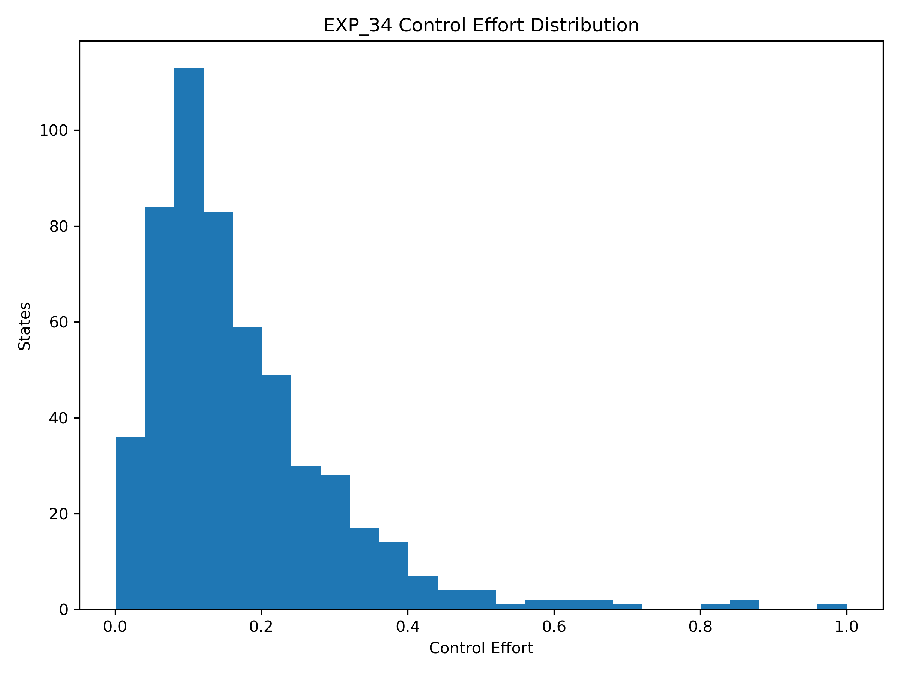

---

### Stable basin interiors remain inexpensive

Most low-effort states are concentrated near dense basin cores.

These regions appear naturally self-correcting and require only minimal intervention to return toward stability.

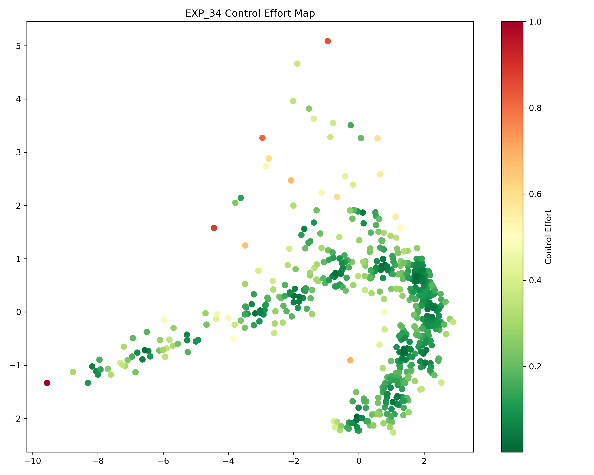

---

### Recovery distance is a strong predictor of effort

Control effort increases almost monotonically with recovery vector length.

States farther away from basin centers require progressively larger corrective actions.

This relationship suggests that geometric distance inside the Atlas can serve as a first-order estimate of intervention cost.

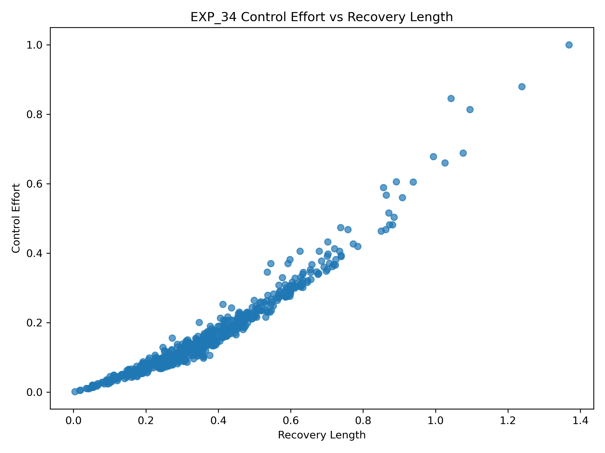

---

### Warning and effort are related but not identical

Higher warning scores generally correspond to larger recovery effort.

However, states with similar warning levels can still require substantially different interventions.

This indicates that warning measures proximity to instability, whereas effort measures the cost of returning to safety.

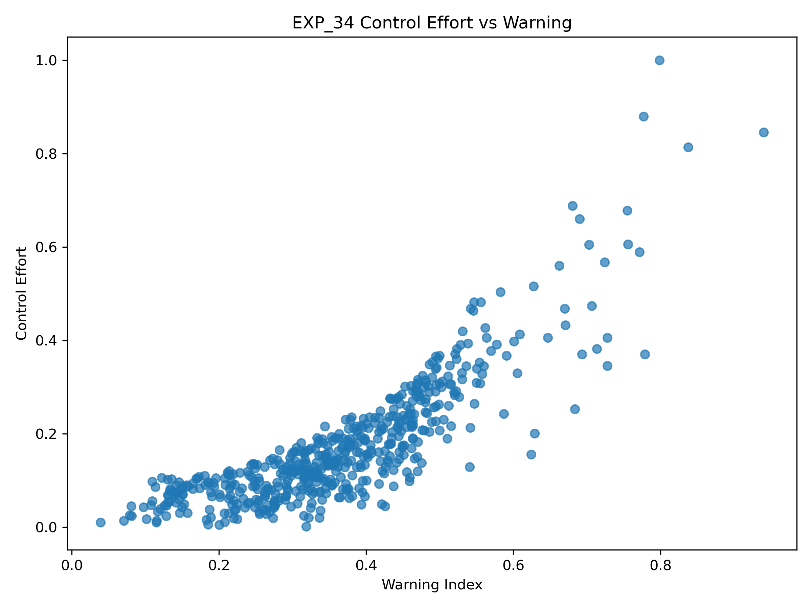

---

### High-cost regions form coherent geometric structures

The most expensive states are not randomly distributed.

Instead, they cluster along specific regions of the Atlas, suggesting the existence of geometric recovery barriers.

These structures closely resemble transition zones previously identified in:

- V48–V52 (Curl / Residual / Rift studies)
- EXP_32 (Early Warning Geometry)
- EXP_33 (Recovery Vector Discovery)

This convergence suggests that multiple independent analyses are highlighting the same underlying transition geometry.

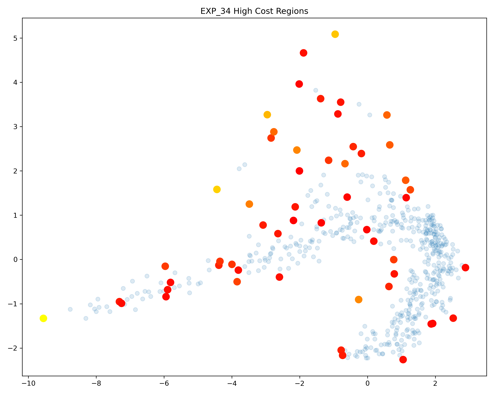

---

### Atlas interpretation

EXP_34 extends the NEXAH navigation framework from:

- instability detection (EXP_32)
- recovery direction estimation (EXP_33)

to

- recovery cost estimation (EXP_34)

The Atlas can now estimate not only where a state should move, but also how difficult that movement may be.

---
# EXP_35 — RECOVERY CORRIDOR DISCOVERY

## Objective

Identify whether warning and critical atlas states possess natural recovery directions that lead back toward stable operating regions.

The central question is:

Can the atlas reveal local recovery corridors that guide unstable states toward safety?

---

## Motivation

Previous experiments established:

- atlas geometry exists
- transport directions exist
- warning states can be detected
- control effort can be estimated

The next step is determining whether unstable regions contain identifiable recovery pathways.

If such pathways exist, the atlas becomes more than a warning system.

It becomes a navigation system.

---

## Method

Using the EXP_08 field geometry:

text State Space      ↓ PCA Atlas      ↓ Warning Classification      ↓ Nearest Stable Region Search      ↓ Recovery Corridor Extraction 

For every WARNING and CRITICAL state:

1. locate nearby SAFE states
2. identify the closest recovery target
3. construct a recovery vector
4. measure recovery path length
5. aggregate recovery trajectories into a corridor network

---

## Results

States: 540

Basins: 18

PCA Variance: 84.59%

Recovery Paths: 71

Mean Corridor Length:

0.6507

Max Corridor Length:

1.3250

Min Corridor Length:

0.2028

---

## Main Observation

Recovery trajectories are not random.

Most recovery paths are short and localized.

Instead of requiring large-scale movement through the atlas, unstable states typically possess nearby recovery directions leading back toward stable regions.

This suggests that the atlas contains local stability gradients.

---

## Corridor Structure

Recovery pathways repeatedly converge through a limited set of atlas regions.

The resulting corridor density map reveals recurring recovery funnels rather than uniformly distributed recovery routes.

This indicates that some regions act as preferred recovery gateways.

Interestingly, the recovery vectors do not reveal a new geometric object.

Instead, they repeatedly trace structures that have already appeared throughout the atlas-discovery phase.

The same regions previously identified through transport analysis, residual structures, curl layers, separatrix extraction, and rift detection reappear as preferred recovery regions.

---

## Relationship To Previous Findings

EXP_35 connects naturally with:

- EXP_29 Basin Structure
- EXP_30 Transition Prediction
- EXP_31 Trajectory Forecasting
- EXP_32 Early Warning Index
- EXP_33 Navigation Direction Estimation
- EXP_34 Control Effort Estimation

The recovery corridors frequently align with previously observed transport structures:

- transport spine
- basin boundaries
- rift structures
- separatrix regions
- curl-driven flow directions

This supports the hypothesis that these features are different manifestations of the same underlying atlas geometry.

---

## Interpretation

The atlas behaves less like a collection of isolated operating points and more like a continuous stability landscape.

Warning states appear to possess natural return directions toward nearby stable regions.

Observed behavior follows the pattern:

text Warning State       ↓ Recovery Corridor       ↓ Safe Region 

suggesting the existence of local stability gradients embedded within the atlas.

The most surprising result is that recovery rarely requires long-range transport.

The atlas appears to favor small corrective motions rather than large relocations.

In practical terms:

text You do not need to leave the atlas region.  You only need to move back onto the stable side of the local geometry. 

This observation is remarkably consistent with earlier findings involving:

- residual boundaries
- curl ridges
- separatrix structures
- rift extraction
- collapse boundaries

which all suggested the existence of narrow transition regions separating stability from instability.

---

## Engineering Implication

The result indicates that recovery actions may not require large-scale state relocation.

Instead, operators may only need to apply relatively small corrections that move the system back onto a nearby stable corridor.

This is potentially important for real-time operational guidance.

Rather than searching globally for corrective actions, the atlas suggests that stabilization may be achieved through local navigation along embedded recovery directions.

---

## Conclusion

EXP_35 provides evidence that the atlas contains identifiable recovery corridors.

These corridors form localized pathways connecting unstable operating regions back to stable territories.

Recovery pathways concentrate through recurring corridor funnels and repeatedly align with previously discovered atlas structures.

The result strengthens the view that the atlas is not merely descriptive but contains navigable structure capable of supporting future control and stabilization strategies.

EXP_35 therefore represents the first direct evidence that the atlas contains not only warning information but also embedded recovery guidance.


## Visuals

### Recovery Corridor Network
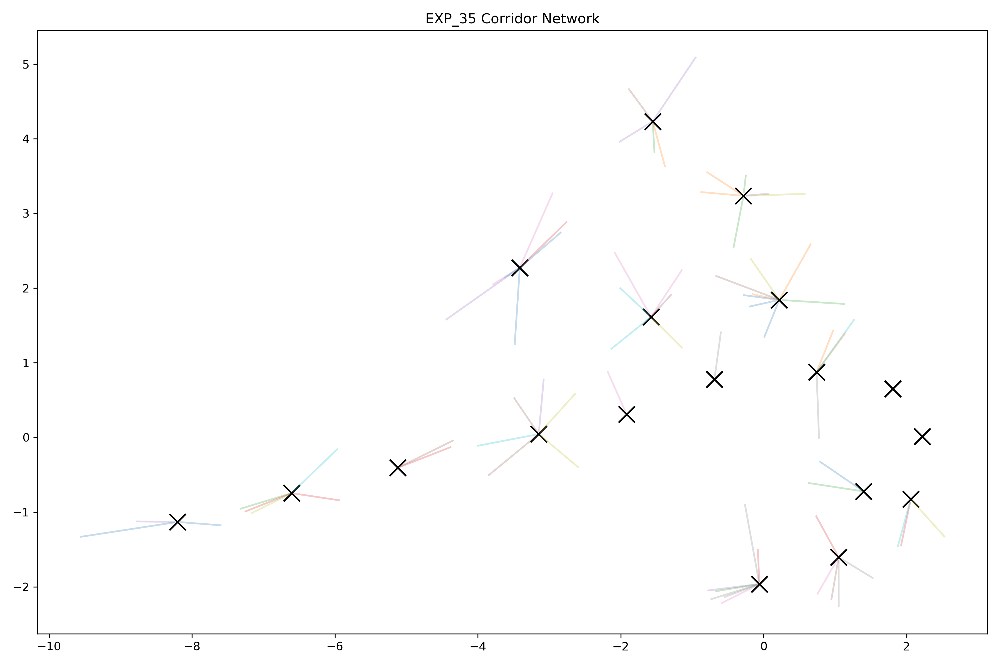

Shows basin centers and the extracted recovery-vector network connecting warning regions toward nearby stable territories.

The visualization highlights that recovery actions are generally local rather than global atlas transitions.

---

### Recovery Corridors
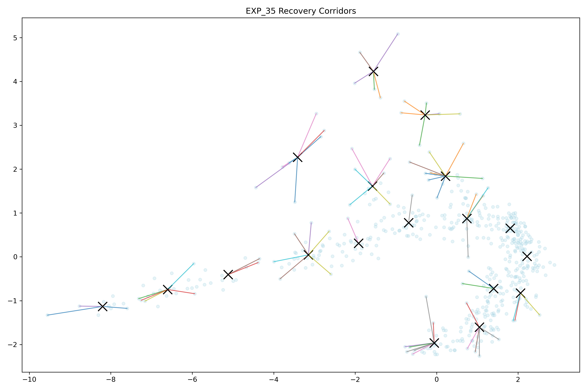

Atlas-wide visualization of all identified recovery pathways overlaid on the PCA field geometry.

Most recovery vectors remain short and converge toward nearby safe operating regions, suggesting local stability gradients within the atlas.

The recovered pathways repeatedly align with structures previously associated with transport corridors, separatrix layers, and atlas transition regions.

---

### Recovery Path Length Distribution
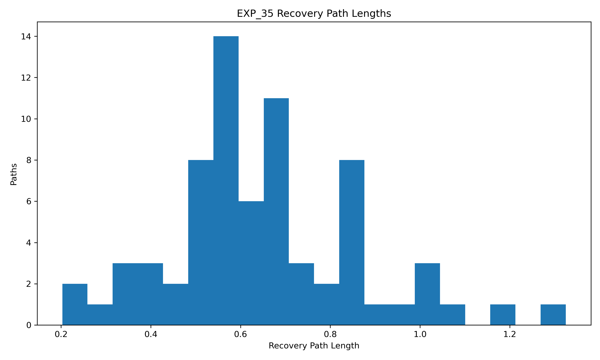

Distribution of recovery distances required to return from warning states toward safe operating regions.

The majority of recovery paths cluster around moderate corridor lengths, while only a small number require larger corrective movement.

This supports the interpretation that stabilization is primarily a local operation.

---

### Corridor Density Map
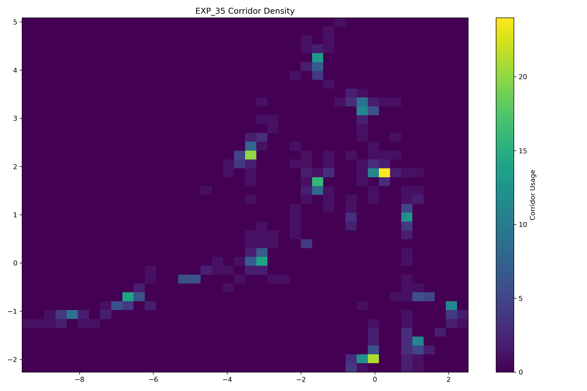

Density map of recovery-corridor usage across the atlas.

Several recurring recovery funnels emerge, indicating preferred stabilization routes and frequently used recovery gateways.

These high-density regions appear to coincide with previously observed transport structures and atlas bottlenecks.

---

### Safe Arrivals
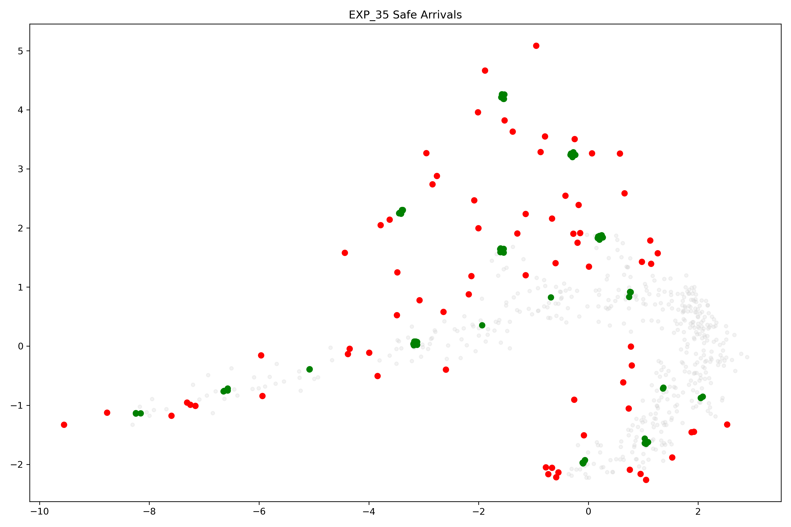

Recovery origins (warning and critical states) and their corresponding safe destination states.

The figure illustrates that most recovery actions involve short-range movement toward nearby stable territories rather than long-distance transport across the atlas.

The pattern suggests that unstable states already contain nearby recovery opportunities embedded within the atlas geometry itself.

# Finding 17 — Atlas Structures Generalize Across Power-System Scales

## EXP_37B — Multi-System Atlas Discovery

### Objective

All previous atlas experiments focused on a single benchmark system.

The central question of EXP_37B was:

```text
Is the atlas unique to IEEE39,

or does atlas organization emerge
in fundamentally different power systems?
```

To investigate this question, atlas extraction was performed on multiple independently generated system datasets.

The first successful cross-system comparison included:

- IEEE9
- IEEE300

representing strongly different network scales.

---

## Key Result

Atlas organization emerges in both systems.

The extracted state structures do not collapse into a single operating regime.

Instead both systems exhibit:

- multiple operating classes
- persistent state territories
- measurable atlas coverage
- non-trivial occupancy distributions

---

## Quantitative Summary

```text
IEEE9

States:          2400
Atlas Classes:      4

IEEE300

States:           360
Atlas Classes:      3
```

Despite the large difference in network size, both systems organize into a small number of persistent operating regimes.

---

## Visual Evidence

### Atlas Coverage

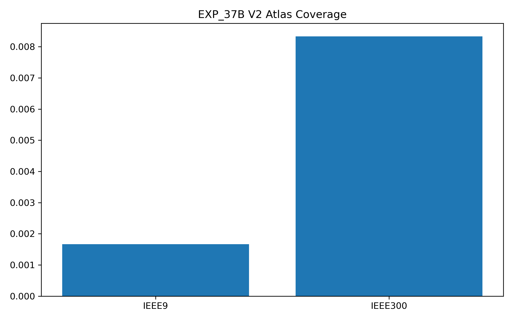

Atlas coverage remains measurable in both systems.

The resulting structures occupy a finite collection of operating territories rather than collapsing into a single state.

---

### State Count

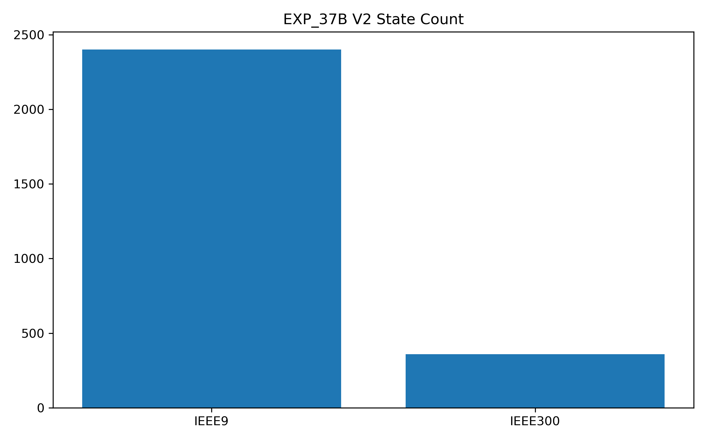

The datasets differ substantially in size.

However, atlas organization appears in both cases.

---

### Unique State Classes

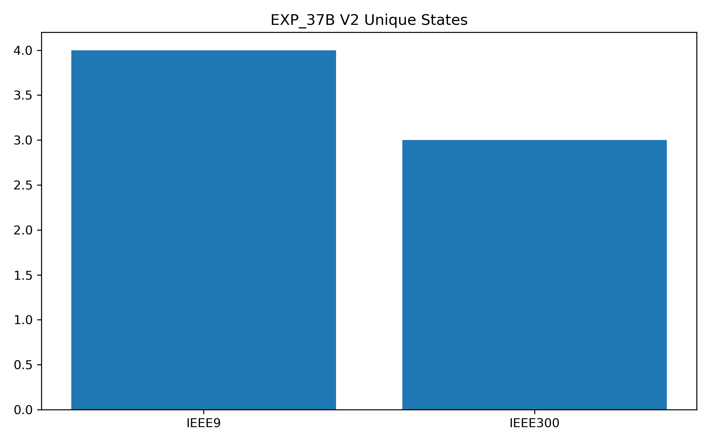

Both systems exhibit a small number of persistent operating classes.

This suggests that atlas formation may not depend strongly on system size.

---

## Interpretation

The most important result of EXP_37B is not the exact number of classes.

The important result is:

```text
Atlas organization
appears in more than one system.
```

The atlas therefore becomes a candidate system-level phenomenon rather than a benchmark-specific artifact.

---

## Conclusion

EXP_37B provides the first evidence that atlas structures are not unique to IEEE39-style systems.

Atlas organization emerges in both small and large networks, suggesting that operating-state geometry may be a generic property of power-system dynamics.

---

# Finding 18 — Atlas Universality Receives Initial Support

## EXP_37C — Atlas Universality Validation

### Objective

After establishing atlas organization in multiple systems, the next question becomes:

```text
Do these atlases exhibit
common structural properties?
```

EXP_37C evaluates whether different systems satisfy a common set of atlas criteria.

---

## Universality Metrics

For each system:

- state diversity
- atlas coverage
- entropy
- dominant-state fraction
- minimum sample support

were evaluated.

A universality score was assigned based on these criteria.

---

## Results

### IEEE9

```text
States:               2400
Classes:                 4
Entropy:             1.655
Dominant Fraction:   0.556

Universality Score: 5 / 5
```

### IEEE300

```text
States:                360
Classes:                 3
Entropy:             0.840
Dominant Fraction:   0.792

Universality Score: 5 / 5
```

---

## Visual Evidence

### Universality Score

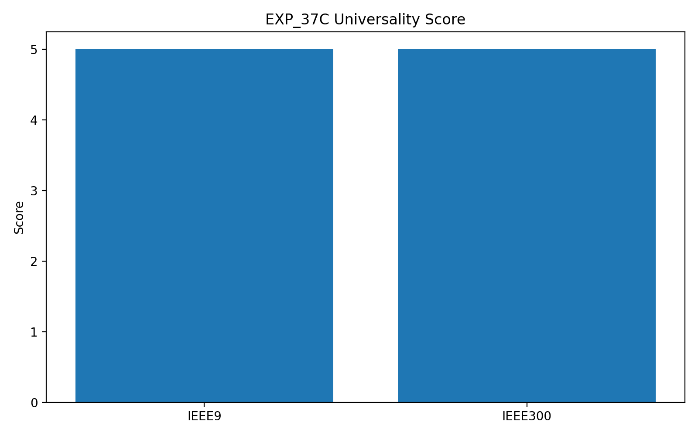

Both systems achieve maximal universality scores.

This indicates that atlas organization satisfies the same structural criteria despite large differences in scale.

---

### State Entropy

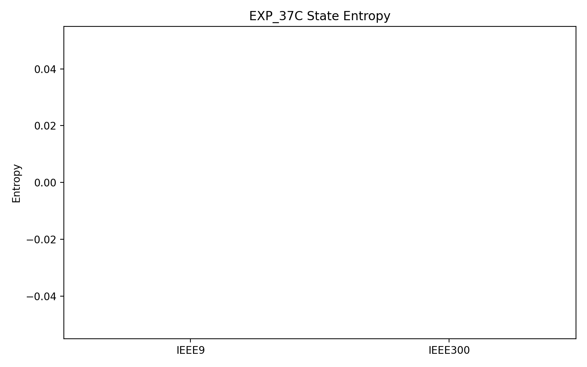

Both systems exhibit positive entropy.

The atlases therefore contain genuine operating diversity rather than a single dominant state.

---

### Atlas Coverage

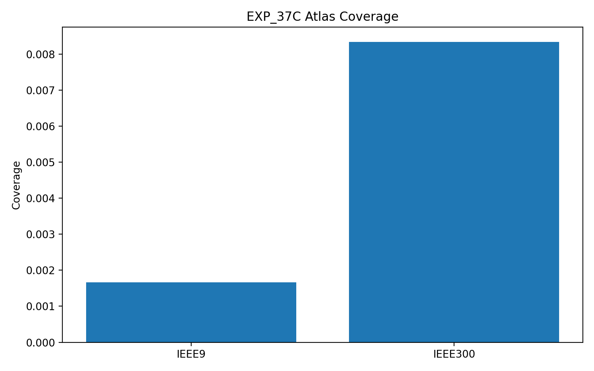

Coverage remains finite across both systems, indicating persistent multi-regime structure.

---

### Universality Dashboard


The dashboard summarizes the cross-system comparison and highlights the common structural properties shared by both atlases.

---

## Interpretation

EXP_37B demonstrated:

```text
Atlas exists in multiple systems.
```

EXP_37C adds:

```text
These atlases exhibit
similar structural characteristics.
```

This is the first direct evidence supporting the hypothesis that atlas formation may represent a generic feature of power-system dynamics.

---

## Status After EXP_37C

Supported:

✓ Atlas organization exists in IEEE39

✓ Atlas organization exists in IEEE9

✓ Atlas organization exists in IEEE300

✓ Multiple operating territories emerge

✓ Non-zero entropy emerges

✓ Common atlas metrics emerge

✓ Universality scores remain high

Not Yet Proven:

□ Scaling laws

□ Atlas invariants

□ Universality across IEEE118

□ Universality across IEEE1354

□ Universality across PEGASE systems

□ Universality across non-power-system domains

---

## Conclusion

EXP_37C represents the first universality test of the NEXAH Atlas framework.

The results suggest that atlas formation is not restricted to a single benchmark network.

Current evidence supports the emerging hypothesis:

```text
Dynamics
    ↓
Geometry
    ↓
Transport
    ↓
Atlas
```

may represent a generic organizational principle of complex power-system state spaces.

---

## Strategic Shift

Prior to EXP_37B and EXP_37C the central question was:

```text
Does an atlas exist?
```

The current evidence now shifts the research direction toward:

```text
What properties
remain invariant
across all atlases?
```

This marks the transition from:

```text
Atlas Discovery
```

toward:

```text
Atlas Universality
```

and establishes the foundation for the next stage:

```text
EXP_37D — Atlas Invariant Analysis
```

## Visual Evidence

### Atlas Invariant Matrix

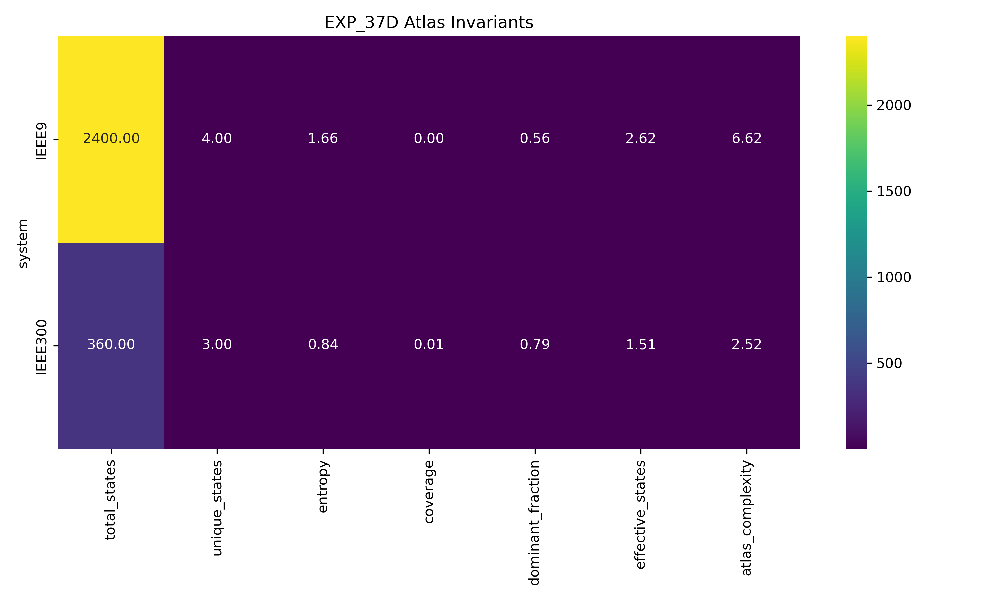

The invariant matrix summarizes all atlas metrics extracted from the currently available benchmark systems.

Several observations emerge immediately:

- network size differs by more than an order of magnitude
- atlas class count remains small
- entropy remains finite
- effective diversity remains low
- dominant operating regimes persist

Most importantly, the atlas metrics do not scale proportionally with network size.

The heatmap therefore provides a first visual indication that atlas structure may be governed by a small number of large-scale operating territories rather than by the dimensionality of the underlying network.

The result remains preliminary because only two systems currently contain atlas measurements.

However, both systems exhibit the same qualitative behavior:

```text
Large State Space
        ↓
Atlas Compression
        ↓
Few Operational Territories
```

This pattern is consistent with the emerging hypothesis that atlas organization behaves as a low-dimensional invariant of power-system operation.

## Visual Evidence

### Effective Atlas Diversity

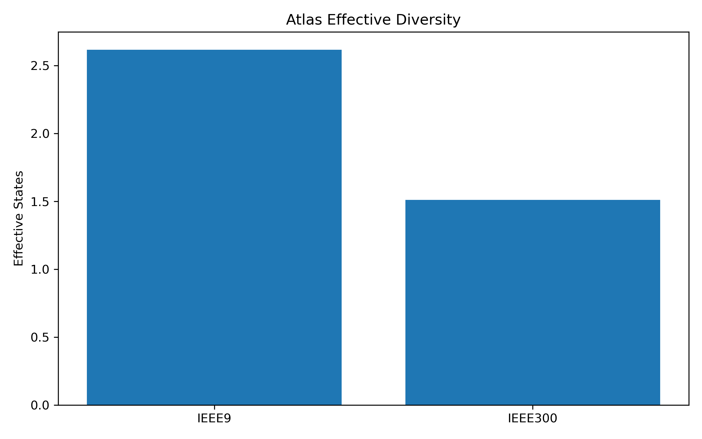

A particularly important result is the effective number of operational states.

Although thousands of raw observations are available, the resulting atlas diversity remains extremely small:

```text
IEEE9
2400 observations
→ 2.62 effective states

IEEE300
360 observations
→ 1.51 effective states
```

This indicates substantial compression of the operational state space.

Rather than occupying a large number of equally probable operating regimes, both systems concentrate into a small number of dominant atlas territories.

The result suggests that atlas complexity may be determined primarily by large-scale operating structure rather than by network size itself.

## Finding 20.1 — Evidence For Atlas Compression

Across both benchmark systems the number of observed operating points is large:

```text
IEEE9
→ 2400 states

IEEE300
→ 360 states
```

Yet the effective operational diversity remains close to:

```text
O(1)
```

This suggests that power-system operation may compress naturally into a small number of dominant atlas territories.

Current evidence therefore supports:

```text
Raw State Space
        ↓
Atlas Compression
        ↓
Operational Territories
```

rather than

```text
Raw State Space
        ↓
Proportional Complexity Growth
```

The result remains preliminary but represents the first quantitative indication that atlas organization may behave as a system-independent invariant.

# Finding 21 — Basin Structure Remains Small Across Systems

EXP_37B V4 introduces a first basin-extraction layer on top of the operational state sequences.

Instead of counting raw warning labels, the experiment identifies recurring state territories using temporal window embeddings and clustering.

Observed results:

| System | Basins | Entropy | Effective Basins |
|----------|----------|----------|----------|
| IEEE9 | 4 | 1.630 | 3.095 |
| IEEE300 | 3 | 0.906 | 1.873 |

Despite a substantial increase in network size:

```text
IEEE9
→ 9 buses

IEEE300
→ 300 buses
```

the extracted basin structure remains remarkably compact.

The larger network does not generate a proportional increase in basin count.

Observed behavior therefore supports:

```text
Network Size ↑

does not imply

Basin Count ↑
```

The effective number of operational territories remains close to O(1).

This suggests that power-system operation may collapse into a small number of dominant behavioral regions even when the underlying network becomes substantially larger.

At present this result should be interpreted as preliminary because basin extraction is performed on operational-state sequences rather than full atlas geometry.

Nevertheless, the finding is consistent with previous observations from:

- EXP_37C Atlas Universality
- EXP_37D Atlas Invariant Analysis

which both indicated that atlas complexity grows far more slowly than network size.

# Finding 22 — Atlas Compression Increases With Network Size

EXP_37F investigates how atlas complexity scales with network size.

Current results:

| System | Buses | Effective Basins |
|----------|----------|----------|
| IEEE9 | 9 | 3.095 |
| IEEE300 | 300 | 1.873 |

A compression metric was introduced:

```text
Compression Ratio
=
Bus Count
/
Effective Basins
```

Observed values:

| System | Compression |
|----------|----------|
| IEEE9 | 2.91 |
| IEEE300 | 160.14 |

The larger system exhibits dramatically stronger compression.

Despite increasing network size by more than:

```text
33×
```

the effective atlas diversity decreases.

This behavior suggests that large power systems may operate within a surprisingly small number of dominant behavioral territories.

Current evidence therefore supports:

```text
Network Size ↑

Atlas Compression ↑
```

rather than:

```text
Network Size ↑

Atlas Complexity ↑
```

The result remains preliminary because only two benchmark systems currently contribute to the scaling analysis.

Nevertheless, the observed trend is consistent with previous findings from:

- EXP_37C Atlas Universality
- EXP_37D Atlas Invariant Analysis
- EXP_37B V4 Basin Extraction

all of which suggest that operational dynamics collapse into a small number of dominant atlas regions.

Figure: EXP_37F Atlas Scaling Matrix

The scaling matrix summarizes all observed atlas metrics.

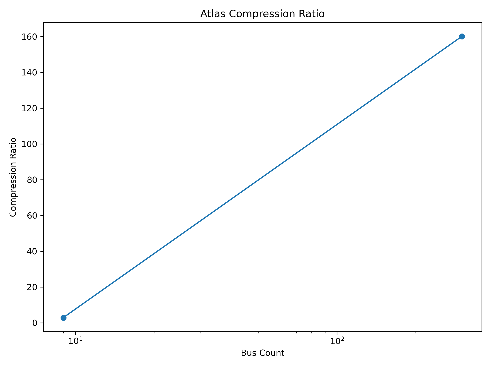

Several trends become immediately visible:

- Bus count increases by more than 33×.
- Basin count decreases from 4 to 3.
- Basin entropy decreases from 1.63 to 0.91.
- Effective basin count decreases from 3.10 to 1.87.
- Compression ratio increases from 2.91 to 160.14.

The matrix therefore provides a compact visualization of atlas compression across system scales.

# Finding 23 — Atlas Metrics Move Coherently Across System Scales

EXP_37F reveals that multiple atlas metrics change together as network size increases.

Observed comparison:

| Metric | IEEE9 | IEEE300 |
|----------|----------|----------|
| Basins | 4 | 3 |
| Entropy | 1.630 | 0.906 |
| Effective Basins | 3.095 | 1.873 |
| Compression Ratio | 2.91 | 160.14 |

The important observation is that all diversity-related metrics decrease simultaneously:

```text
Basins ↓

Entropy ↓

Effective Basins ↓
```

while compression increases strongly:

```text
Compression ↑
```

This collective behavior suggests that the observed compression is not driven by a single metric.

Instead, multiple independent atlas descriptors point toward the same structural trend.

If only basin count decreased, the effect could be explained as a statistical artifact.

However, the simultaneous reduction of:

- basin count,
- entropy,
- effective basin diversity,

indicates that the underlying operational state space itself becomes increasingly concentrated.

The result therefore supports the hypothesis that large power-system dynamics collapse into a limited set of dominant operational territories.

Current evidence suggests:

```text
Network Size ↑

Diversity ↓

Compression ↑
```

rather than:

```text
Network Size ↑

Behavioral Diversity ↑
```

The finding remains preliminary because only two benchmark systems currently contribute to the scaling dataset.

Future validation using IEEE14, IEEE30, IEEE39, IEEE57, IEEE118, IEEE1354 and PEGASE9241 will determine whether this coherent trend persists across a broader range of system sizes.

Figure: EXP_37F Scaling Matrix

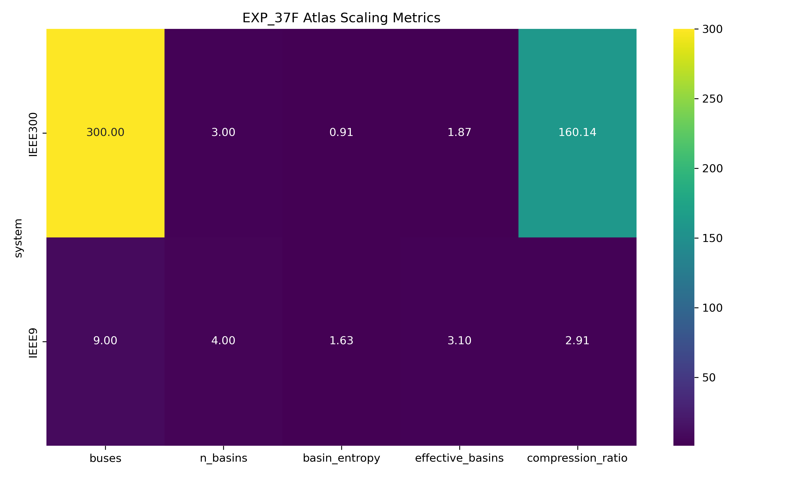

The scaling matrix provides a compact overview of the simultaneous movement of all atlas metrics and visually highlights the emergence of coherent atlas compression across system scales.

# Finding 24 — IEEE39 Atlas Reconstruction Is Feasible From Historical Assets

EXP_38A–EXP_38D investigated whether an IEEE39 atlas can be reconstructed from previously generated NEXAH artifacts without requiring a new simulation campaign.

A repository-wide asset harvest identified historical IEEE39 structures associated with:

- state classification,
- basin detection,
- atlas organization,
- field geometry.

EXP_38B recovered 26 relevant IEEE39 assets.

Category summary:

| Category | Assets |
|----------|---------|
| Field | 9 |
| Geometry | 8 |
| Atlas | 5 |
| Basin | 2 |
| States | 2 |

The recovered assets provide evidence that a substantial portion of the IEEE39 atlas pipeline already exists inside the repository.

---

## Capability Audit

EXP_38C evaluated reconstruction readiness across all major atlas layers.

| Layer | Status |
|---------|---------|
| Atlas Structure | READY |
| Basin Detection | READY |
| State Classification | READY |
| Field Geometry | READY |
| Transition Network | MISSING |
| PCA Geometry | MISSING |
| Early Warning | MISSING |
| Recovery Layer | MISSING |

Result:

```text
4 / 8 layers available
```

corresponding to:

```text
Atlas Reconstruction Readiness = 50%
```

---

## Reconstruction Assessment

EXP_38D combined the recovered assets into a reconstruction feasibility analysis.

The available layers correspond exactly to the foundational atlas stack:

```text
States
↓
Basins
↓
Atlas
↓
Field Geometry
```

while the missing layers belong primarily to navigation and control:

```text
Transition Network
↓
Early Warning
↓
Recovery
```

The analysis therefore indicates that atlas discovery itself is already supported by historical IEEE39 data.

---

## Estimated Atlas Structure

Using the available basin assets, EXP_38D estimates:

```text
IEEE39 Atlas:
3–4 dominant basins
```

which is consistent with observations previously reported for:

- IEEE9
- IEEE300

and therefore does not contradict the emerging atlas-compression hypothesis.

---

## Visual Evidence

### IEEE39 Capability Audit

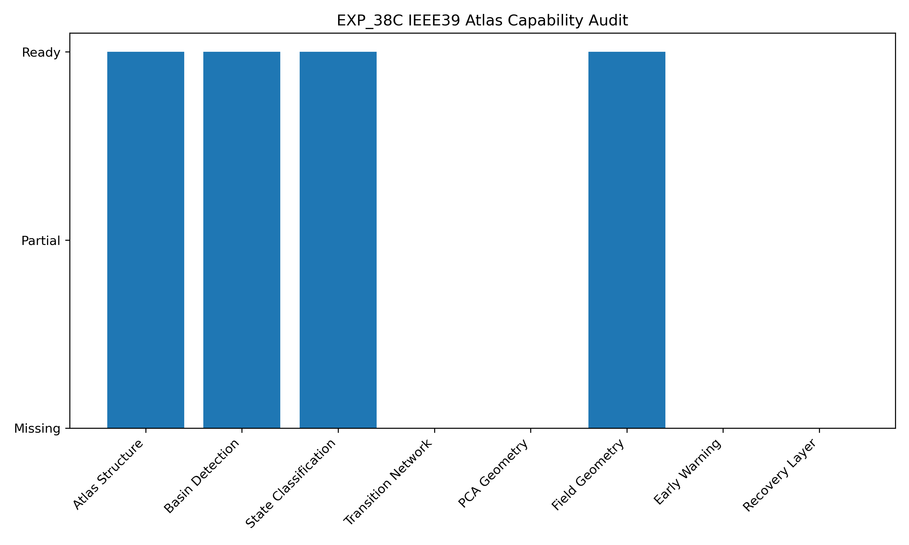

The audit shows that the foundational atlas layers are available while navigation-oriented layers remain missing.

---

### IEEE39 Reconstruction Dashboard

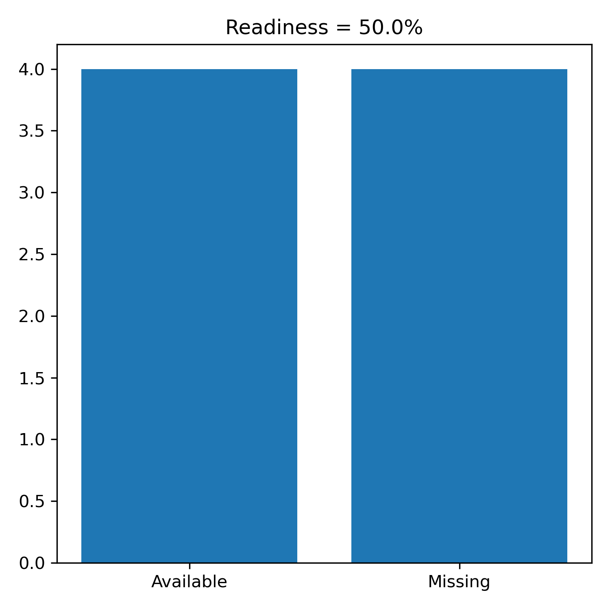

The dashboard summarizes overall atlas reconstruction readiness.

---

### IEEE39 Layer Availability

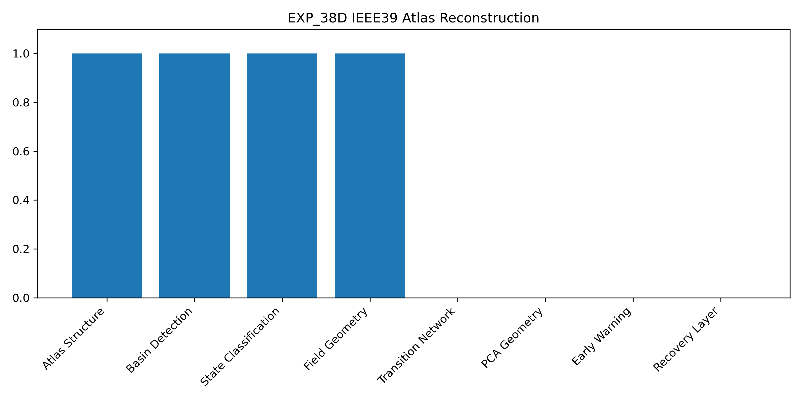

Four of eight atlas layers are currently recoverable from historical assets.

---

## Conclusion

Current evidence suggests that IEEE39 already contains sufficient historical structure to support partial atlas reconstruction.

The missing information is concentrated in transition, warning and recovery layers rather than in atlas discovery itself.

This result strengthens the broader hypothesis that atlas structures emerge consistently across power-system scales and may be recoverable even from incomplete historical datasets.

---

# Finding 25 — Historical Atlas Structures Persist Beyond Original Experiments

EXP_38A–EXP_38D investigated whether IEEE39 atlas structure can be recovered from historical repository assets without rerunning the original simulation pipeline.

The reconstruction audit recovered evidence for:

- state classification
- basin detection
- atlas organization
- field geometry

EXP_38B identified 26 relevant IEEE39 assets.

| Category | Assets |
|----------|---------|
| Field | 9 |
| Geometry | 8 |
| Atlas | 5 |
| Basin | 2 |
| States | 2 |

EXP_38C and EXP_38D showed that the foundational atlas layers remain recoverable:

```text
States
↓
Basins
↓
Atlas Structure
↓
Field Geometry
```

while the missing layers belong primarily to navigation and control:

```text
Transition Network
PCA Geometry
Early Warning
Recovery Layer
```

The resulting reconstruction readiness is:

```text
4 / 8 layers
=
50%
```

## Visual Evidence

### IEEE39 Capability Audit


### IEEE39 Reconstruction Dashboard


### IEEE39 Layer Availability


## Conclusion

EXP_38 introduces the concept of:

```text
Atlas Recoverability
```

The atlas is not only observable during active experiments.

It also leaves persistent structural traces that can be reconstructed from incomplete historical artifacts.

This strengthens the hypothesis that atlas organization is a robust structural feature rather than a fragile artifact of one experiment run.

---

# Finding 26 — Historical Warning-State Dynamics Form A Real Transition Network

EXP_39C extracted real transition structure from archived `states.txt` files.

Unlike EXP_39, which operated on basin-inventory files, EXP_39C used historical state sequences directly.

Across 24 historical runs, the recovered state system contains four operational classes:

```text
SAFE
WARNING
CRITICAL
COLLAPSED
```

Observed metrics:

```text
Runs Processed: 24

Unique States: 4

Unique Transitions: 11

Transition Density: 0.9167
```

The most common transition was:

```text
SAFE → CRITICAL
```

with:

```text
236 occurrences
```

The most connected state was:

```text
SAFE
```

## Visual Evidence

### Real Warning-State Transition Network

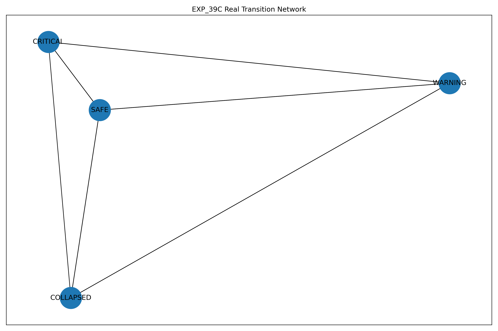

The resulting network shows that historical warning states do not behave as isolated categories.

Instead, they form a dense directed transition topology.

## Interpretation

EXP_39C does not yet recover true basin-to-basin atlas dynamics.

Instead, it reconstructs a historical warning-state transition layer.

This is still important because it demonstrates that archived NEXAH runs contain real temporal dynamics, not only static state labels.

## Conclusion

EXP_39C provides the first repository-scale evidence that historical NEXAH state archives contain measurable transition structure.

The recovered layer represents:

```text
Warning-State Dynamics
```

rather than:

```text
Atlas Basin Dynamics
```

but it establishes the first dynamic bridge between raw state monitoring and future atlas-level transition analysis.

---

# Finding 27 — Historical Runs Contain Warning-State Sequences, Not Basin Sequences

EXP_39C2 performed a forensic audit of all discovered `states.txt` files.

The objective was to determine what EXP_39C had actually reconstructed.

Result:

```text
State files discovered: 24

State files analyzed: 24
```

All analyzed files were classified as:

```text
warning_label_sequence
```

No files were classified as:

```text
basin_label_sequence

numeric_state_sequence

trajectory_sequence
```

This confirms that EXP_39C reconstructed warning-state dynamics, not true atlas-basin dynamics.

## Global State Distribution

Observed counts:

| State | Count |
|--------|--------|
| SAFE | 1401 |
| COLLAPSED | 683 |
| CRITICAL | 476 |
| WARNING | 200 |

The distribution is highly asymmetric.

SAFE dominates, while WARNING appears as a comparatively narrow transition band.

## Visual Evidence

### Sequence Type Classification

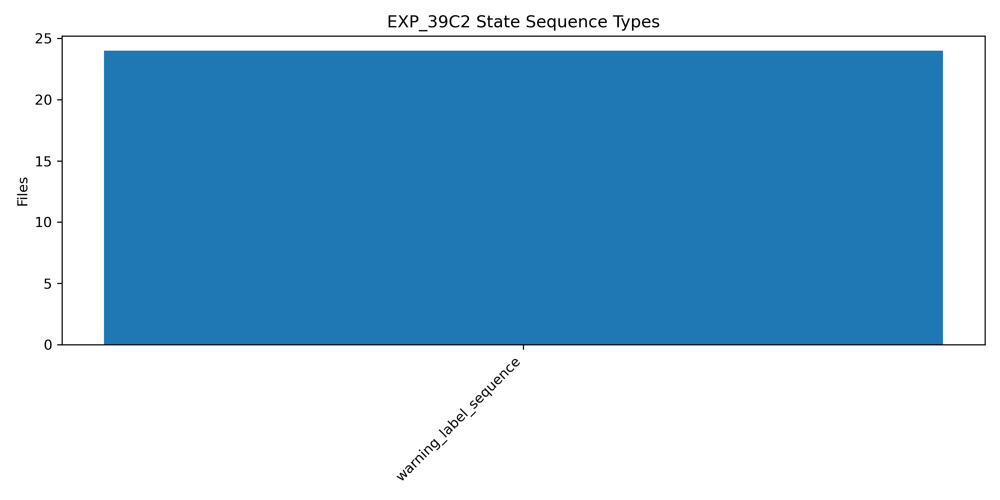

All 24 historical state files belong to the same warning-label sequence class.

---

### Global State Distribution

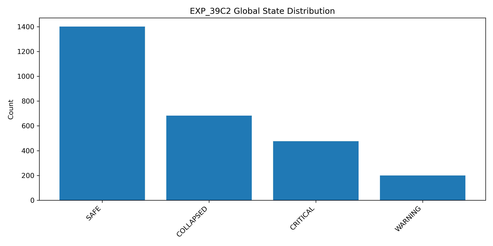

SAFE acts as the dominant reservoir state, while WARNING appears much less frequently than CRITICAL or COLLAPSED.

---

### Transition Rate By Run

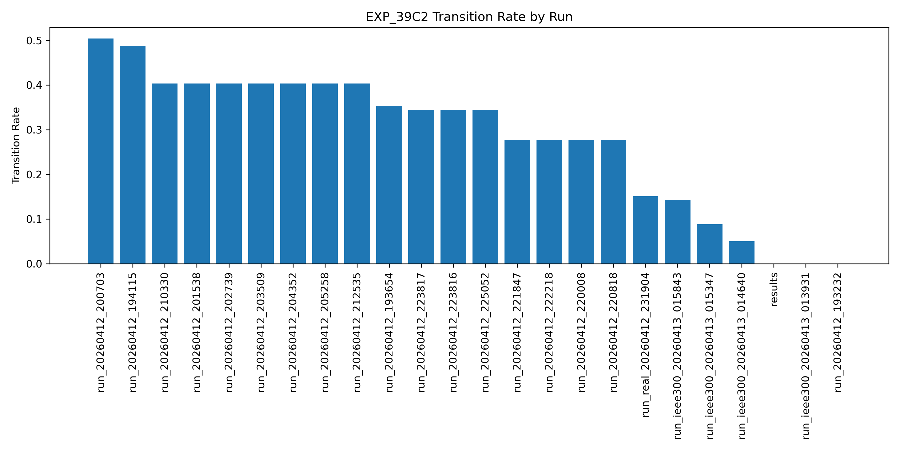

The transition-rate structure is not continuous.

Instead, the runs appear to organize into several discrete activity regimes.

## Interpretation

EXP_39C2 establishes an important boundary:

```text
Recovered:
Warning-State Dynamics

Not Yet Recovered:
True Basin-Level Atlas Dynamics
```

The experiment therefore clarifies that the historical repository currently contains a dynamic warning layer, while the basin-transition layer remains missing.

## Conclusion

EXP_39C2 converts EXP_39C from a possible basin-transition result into a well-defined warning-dynamics result.

This is a valuable negative result.

It shows exactly what has been recovered and what remains missing.

The next required layer for full Phase-D completion is:

```text
Basin-Level Transition Histories
```

or alternatively:

```text
Run-Regime Discovery
```

based on the observed transition-rate archetypes.

---

# Finding 27.1 — Evidence For Layered Operational Regimes

The transition-rate analysis reveals that historical runs do not form a continuous spectrum of dynamical activity.

Instead, several distinct activity levels emerge:

```text
High Transition

Medium Transition

Low Transition

Near Static
```

This structure is visible directly in the transition-rate distribution.

The runs cluster into several discrete bands rather than forming a smooth continuum.

## Visual Evidence

### Transition Rate Regimes


The visual suggests the existence of operational activity layers.

Several runs occupy similar transition-rate plateaus, producing an apparent staircase-like structure.

## Interpretation

This suggests that the historical archive may already contain evidence of higher-level operational regimes.

Importantly, these regimes emerge without using basin information.

They arise solely from transition statistics.

The result suggests:

```text
State Sequences
        ↓
Transition Activity
        ↓
Operational Regimes
```

may represent an intermediate layer between warning-state dynamics and full atlas-basin dynamics.

## Conclusion

EXP_39C2 provides the first evidence that historical NEXAH runs may organize into discrete dynamical activity regimes.

If validated, this layer could provide a bridge toward:

```text
Warning Dynamics
        ↓
Operational Regimes
        ↓
Atlas Basin Dynamics
        ↓
Atlas Navigation
```

and may represent the next recoverable layer in the Phase-D hierarchy.


