# 🧭 NEXAH Atlas Navigation & Control Log

## Phase D — Prediction, Navigation & Control

This log continues the atlas discovery phase (EXP_01 – EXP_28).

The objective is no longer to discover the atlas.

The objective is to predict, navigate and control motion within the atlas.

---

# Current Status

The discovery phase established that IEEE39 operating states do not form a random cloud in state space.

Instead, the operating states organize into a structured atlas containing:

- geometric organization
- transport corridors
- gate structures
- regime boundaries
- basin territories
- navigation pathways
- transport hubs
- atlas-scale geometry

The atlas now exists as a measurable object.

Across the discovery phase, evidence consistently supported the emergence of:

```text
  Dynamics
     ↓
  Geometry
     ↓
  Transport
     ↓
 Navigation
     ↓
   Basins
     ↓
   Atlas 
```
The most important result of Phase C is that the atlas exhibits a persistent large-scale structure rather than isolated local patterns.

Observed properties include:

- robust navigation under noise
- successful out-of-distribution navigation
- identifiable attractor territories
- basin-level transport networks
- dominant transport corridors
- hub regions
- a dominant geometric axis

Most notably:

```
text PC1 = 87.85 % 
```
indicating that the atlas is strongly organized around a single large-scale transport geometry.

---

# What Changes In Phase D

The primary question is no longer:

```text
Can we see the atlas? 
```

That question has been answered.

The new questions become:

```text
Can we predict motion inside the atlas?  Can we detect dangerous transitions?
Can we guide trajectories?  Can we control movement between regions? 
```

Phase D therefore shifts from discovery toward operational utility.

---

# Research Direction

The goal of this phase is to transform the atlas from a descriptive model into a predictive and navigational framework.

The central hypothesis is:

```text
  Atlas Geometry
         ↓
Predictive Structure
         ↓
Navigable Structure
         ↓
Controllable Structure 
```

If true, the atlas should allow us to:

- identify future transitions
- detect instability precursors
- estimate regime changes
- locate safe operating corridors
- discover control directions
- guide systems toward stable regions

---

# Engineering Relevance

For power-system operators, the central challenge is not merely understanding the current state.

The challenge is anticipating future motion.

Traditional monitoring approaches focus on:

- voltages
- loading
- frequency
- contingency analysis

The atlas perspective introduces an additional layer:

text Where is the system?  Where is it moving?  What regions are nearby?  What transitions are likely?  How can movement be redirected? 

This transforms the atlas from a visualization into a potential operational tool.

---

# Strategic Objectives

Phase D focuses on five major objectives:

### Prediction

Understand how states move through the atlas.

### Transition Forecasting

Detect likely future basin changes.

### Early Warning

Identify precursors of instability before transitions occur.

### Navigation

Determine safe pathways between operating regions.

### Control

Discover actions capable of steering trajectories toward desired atlas locations.

---

# Long-Term Goal

The ultimate objective is the development of a navigation framework capable of answering:

```text
    Current State
           ↓
Future State Prediction
           ↓
    Transition Risk
           ↓
Recommended Navigation Path
           ↓
     Control Action 
```
This would represent a transition from:

```text
Atlas Discovery 
```
to:

```text
Atlas Operations 
```

and ultimately:

```text
Atlas-Guided System Control 
```

---

# Phase D Mission Statement

```text
The atlas has been discovered.  The next challenge is learning how to move within it.
```

# EXP_29 — Transport Axis Stability

## Objective

EXP_28 revealed that the IEEE39 atlas possesses a dominant geometric axis.

The first principal mode captures:

```text
68.94 %
```

of the entire state-space variance.

The objective of EXP_29 was to determine whether this axis represents:

- a stability axis
- a loading axis
- a voltage axis
- a transport backbone
- or a more general atlas coordinate

---

## Key Result

The dominant transport axis is real.

However, it does not appear to be a direct stability metric.

Observed correlations:

```text
Axis vs Loading      =  0.2226
Axis vs Angle Span   =  0.1557
Axis vs Voltage Std  = -0.0630
```

The correlations are weak.

This indicates that the transport axis is not simply a projection of:

- loading
- voltage stress
- angle stress

alone.

Instead it appears to represent an independent geometric coordinate of the atlas.

---

## Finding 1 — The Atlas Hangs On The Axis

The transport-axis stability map reveals a remarkable structure.

The transport axis does not pass through the center of the state cloud.

Instead the manifold appears to organize itself around the axis.

The geometry resembles:

```text
J-manifold
Hook geometry
Suspended corridor
```

The majority of operating states remain close to the axis.

Large deviations occur primarily in the upper and lower curvature regions.

This suggests:

```text
Transport Axis
=
Geometric Backbone
```

rather than

```text
Transport Axis
=
Stress Metric
```

---

## Visual Evidence

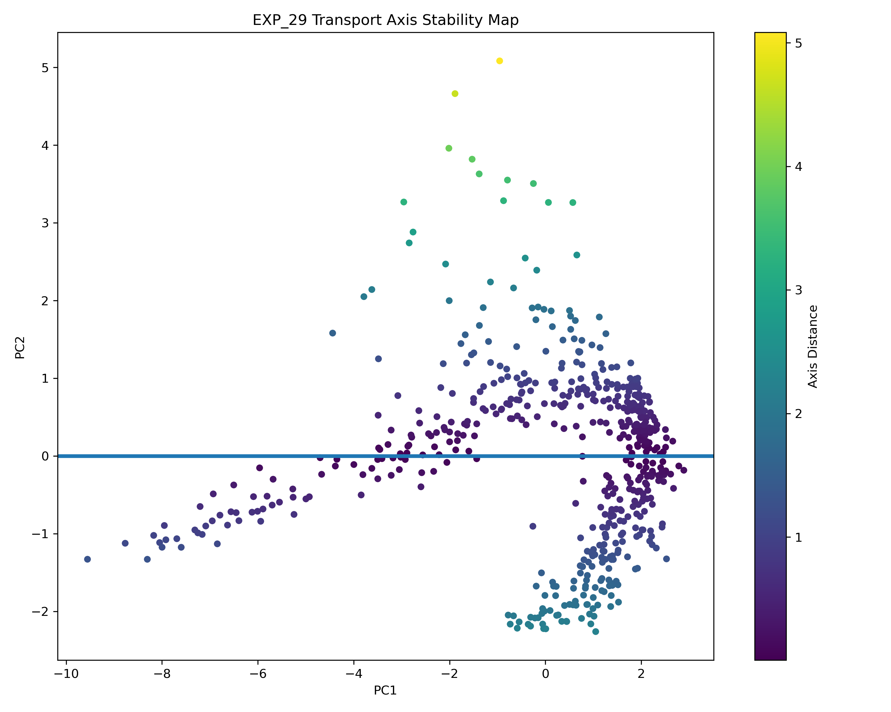

The majority of operating states remain attached to the transport axis.

Large deviations appear only within high-curvature regions.

---

## Finding 2 — Coordinated Shape Deformation Appears

Three physical projections were examined:

1. Voltage Variability
2. Angle Span
3. Loading

When viewed sequentially the projections do not behave like independent scatter clouds.

Instead they appear to represent coordinated deformations of a common geometric structure.

Observed sequence:

### Voltage Projection

A compressed floor emerges.

```text
Stable Layer
```

appears across much of the atlas.

### Angle Projection

The compressed layer dissolves.

A fan-like structure emerges.

### Loading Projection

The fan transforms into two dominant upward branches.

The structure resembles:

```text
Ψ
```

or a bifurcating transport fork.

---

## Visual Evidence

### Voltage Variability Projection

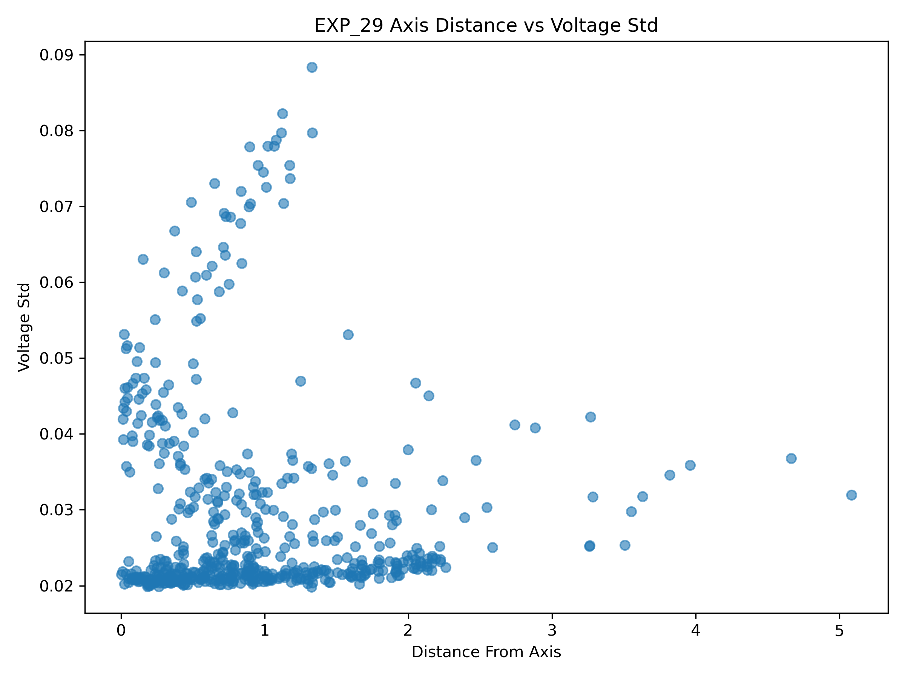

A compressed stability floor appears across much of the atlas.

---

### Angle Span Projection

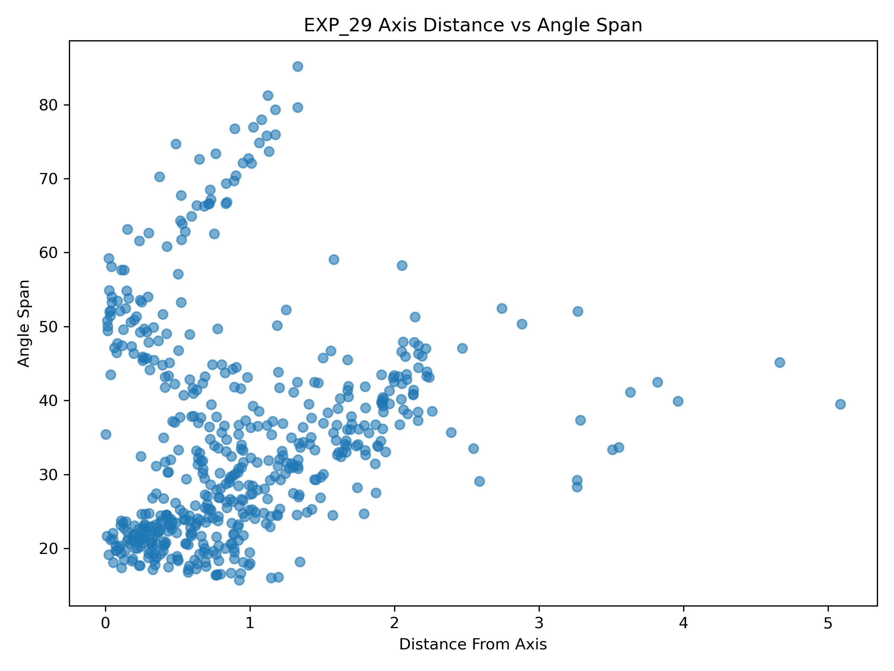

The compressed layer expands into a distributed fan structure.

---

### Loading Projection

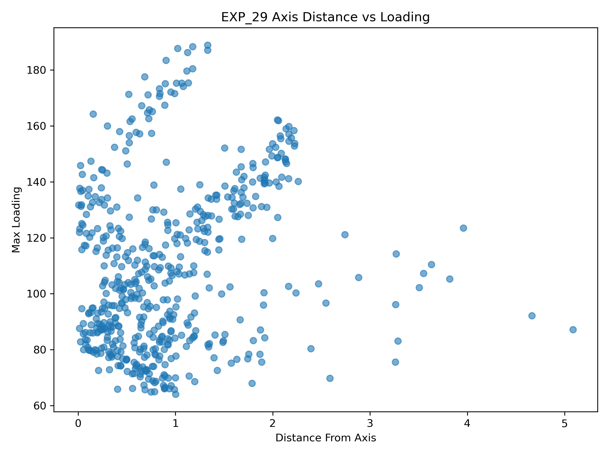

Two dominant loading branches emerge from the same transport coordinate.

---

## Finding 3 — Multiple Physical Variables Share One Geometry

A notable observation is that all three projections use the same transport coordinate:

```text
Distance From Axis
```

Changing only the physical observable reveals consistent structural transformations.

This suggests:

```text
Voltage
Angle
Loading
```

are not independent phenomena.

Instead they may represent different projections of a common atlas geometry.

The atlas therefore behaves less like a collection of isolated measurements and more like a coordinated geometric object.

---

## Interpretation

EXP_29 suggests a revised interpretation of the transport axis.

The axis does not directly measure:

```text
Stress
Risk
Instability
```

Instead it appears to measure:

```text
Position
within the atlas
```

This distinction is important.

For operators:

```text
Position
≠
Risk
```

A state may occupy a particular region of the atlas without necessarily being unstable.

The transport axis therefore appears to function as a geometric coordinate rather than a risk indicator.

---

## Engineering Interpretation

For IEEE-style operation this distinction is natural.

An operator needs two independent quantities:

### Atlas Coordinate

```text
Where am I?
```

### Stability Assessment

```text
How dangerous is this location?
```

EXP_29 suggests the transport axis contributes primarily to the first question.

Future experiments will investigate whether basin exits, regime transitions and early-warning signals contribute to the second.

---

## Status After EXP_29

Validated:

✓ Dominant transport axis exists

✓ Atlas remains highly low-dimensional

✓ Most states remain attached to the transport backbone

✓ Physical observables deform coherently along atlas coordinates

✓ Transport axis behaves as a geometric coordinate

Not Yet Proven:

□ Basin exit prediction

□ Regime transition forecasting

□ Early-warning capability

□ Control vector discovery

□ Return-to-safe-basin navigation

---

## Conclusion

EXP_29 strengthens the interpretation that the IEEE39 atlas possesses an intrinsic coordinate system.

The dominant transport axis appears to organize state-space geometry while remaining largely independent of individual physical stress metrics.

The results suggest that:

```text
Atlas Coordinate
+
Physical State Variables
```

may form the foundation of a navigable operating-space representation.

This provides the first evidence that the atlas may support predictive navigation rather than geometric visualization alone.

---

### Next Step

```text
EXP_30
Basin Exit Forecasting
```

Core Question:

Can movement within the atlas predict when a state is about to leave its current stability territory?

# Finding 12 — Basin Exit Risk Is Geometrically Structured

EXP_30 — Basin Exit Forecasting

The next question after atlas discovery was:

```text
Can the atlas identify states that are likely
to leave their current operating region?
```

EXP_30 introduced the concept of:

```text
Basin Exit Risk
```

using local density, neighborhood structure,
and proximity to competing basin regions.

The objective was not to predict the exact future state.

The objective was to determine whether certain atlas regions
systematically exhibit elevated transition potential.

---

## Result

Exit risk is not randomly distributed throughout the atlas.

Instead, elevated risk concentrates in specific geometric regions.

Observed pattern:

```text
Atlas Position
        ↓
Local Density
        ↓
Exit Risk
```

States near dense manifold cores exhibit low exit risk.

States near sparse regions and transition sectors exhibit elevated risk.

This suggests that future transitions may be partially forecastable from geometric position alone.

---

## Visual Evidence

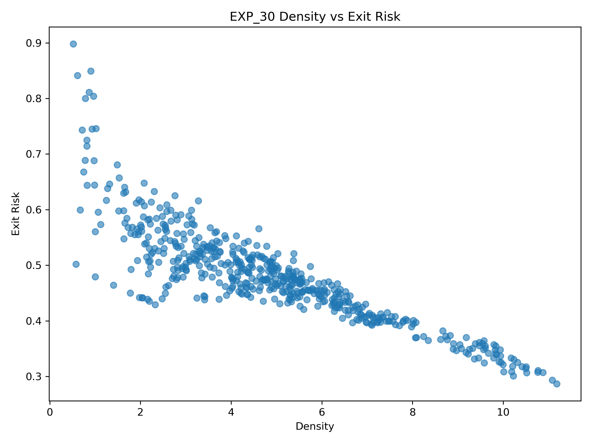

A strong inverse relationship emerges:

```text
Density ↑
Exit Risk ↓
```

High-density operating regions behave as geometric stability reservoirs.

Low-density regions exhibit substantially higher exit risk.

---

# Finding 12.1 — Exit Risk Concentrates Along Specific Atlas Regions

The spatial risk map reveals that elevated exit probability
is not uniformly distributed.

Instead, risk accumulates along recognizable portions
of the atlas geometry.

---

## Visual Evidence

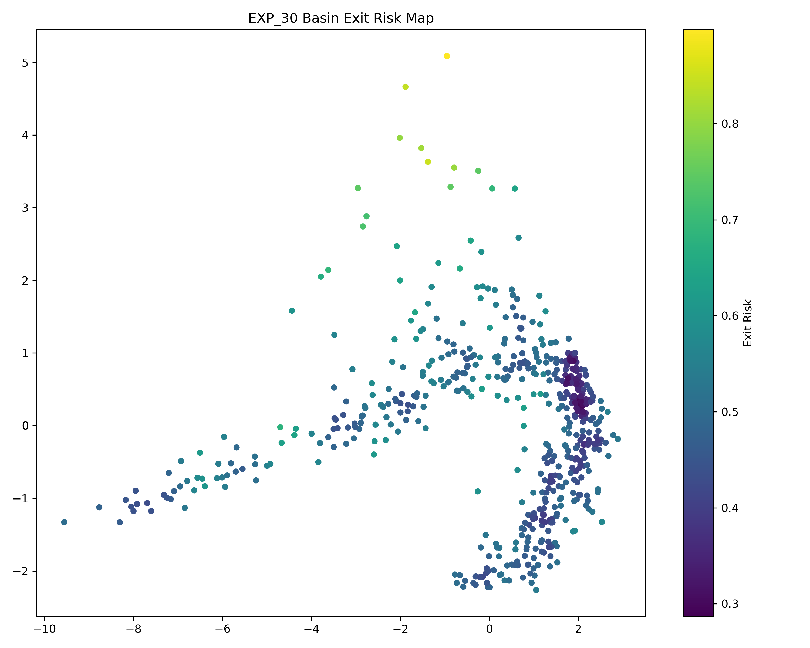

High-risk states appear preferentially along:

- upper crown regions
- transition sectors
- low-density outer branches

while the dense right-hand basin cluster remains comparatively stable.

This indicates that atlas topology influences transition likelihood.

---

# Finding 12.2 — Basin Boundaries Become Observable

A second analysis examined the distance of each state
to neighboring basin structures.

The goal was to identify geometric boundary regions.

---

## Visual Evidence

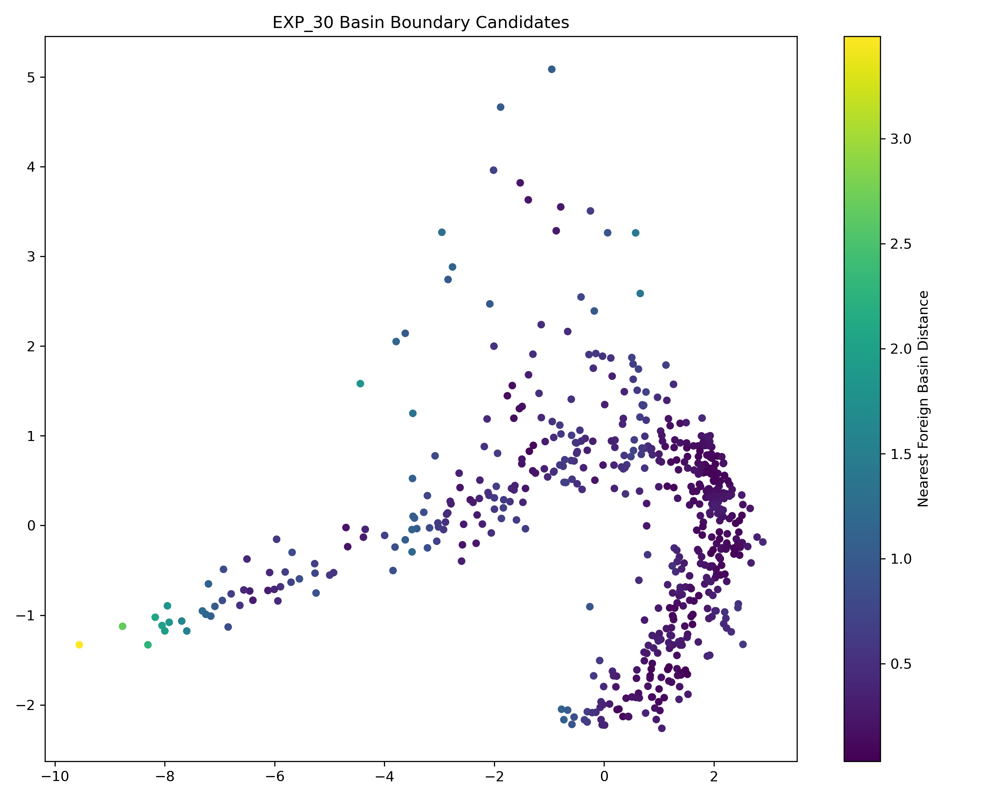

The resulting map reveals distinct boundary zones.

These zones are concentrated around:

- branch intersections
- curvature changes
- sparse transition corridors

rather than being distributed randomly throughout the manifold.

---

# Finding 12.3 — Exit Candidates Form Structured Clusters

The highest-risk states were extracted and visualized separately.

If exit dynamics were random, these candidates would appear scattered.

Instead, they form coherent geometric groups.

---

## Visual Evidence

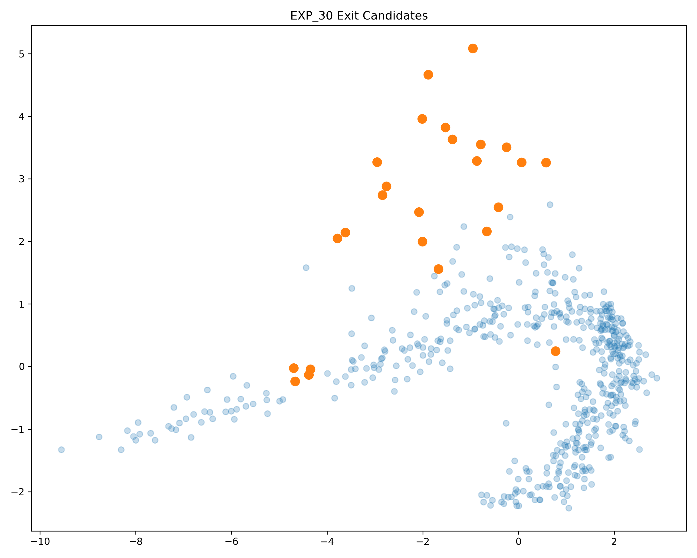

Several candidate clusters emerge:

```text
Upper Crown Region
```

appears as the dominant exit zone.

Additional candidate groups appear near:

- branch junctions
- curvature transitions
- outer manifold sectors

This suggests that exits occur through preferred geometric corridors.

---

# Geometric Interpretation

EXP_30 reinforces a recurring observation across the atlas program.

The IEEE39 operating manifold behaves less like:

```text
Random State Cloud
```

and more like:

```text
Structured Transport Geometry
```

with:

- stable cores
- transition corridors
- geometric boundaries
- preferred exit sectors

The highest-risk states are concentrated near these structural features.

---

# Engineering Interpretation

For a grid operator the result can be interpreted as:

```text
Current State
        ↓
Atlas Position
        ↓
Exit Risk Estimate
```

rather than:

```text
Current State
        ↓
Unknown Future
```

This introduces the possibility of:

- transition forecasting
- instability surveillance
- early warning indicators
- geometry-based operational monitoring

without requiring a full dynamic simulation of future trajectories.

---

# EXP_30 Conclusion

EXP_30 provides the first evidence that:

```text
Future transition likelihood
is encoded in atlas geometry.
```

The atlas is therefore not merely a map of where states exist.

It also contains information about:

```text
Which states are likely
to leave their current basin.
```

This establishes the foundation for:

```text
EXP_31
Transition Prediction
```

where the next question becomes:

```text
If a state exits,

where does it go?
```

---

## Current Status

```text
Dynamics
    ↓
Geometry
    ↓
Transport
    ↓
Basins
    ↓
Exit Risk
```

SUPPORTED

EXP_30
```
# Finding 3 — Transition Prediction Becomes Possible

## EXP_31 — Transition Prediction

Previous experiments established:

```text
Atlas
→ Basins
→ Transport Corridors
→ Exit Risk
```

EXP_31 investigated the next question:

```text
If a state leaves its current basin,

where will it most likely go?
```

The experiment combined:

- basin geometry
- local density
- exit risk estimation
- nearest foreign basin detection

to construct the first transition forecast layer of the NEXAH Atlas.

---

## Key Result

The atlas does not suggest arbitrary transitions.

Instead, high-risk states exhibit preferred transition targets.

Observed structure:

```text
State
    ↓
Exit Candidate
    ↓
Preferred Basin
```

rather than

```text
State
    ↓
Any Basin
```

This is the first evidence that transition forecasting may be possible directly from atlas geometry.

---

## Visual Evidence

### Predicted Transition States

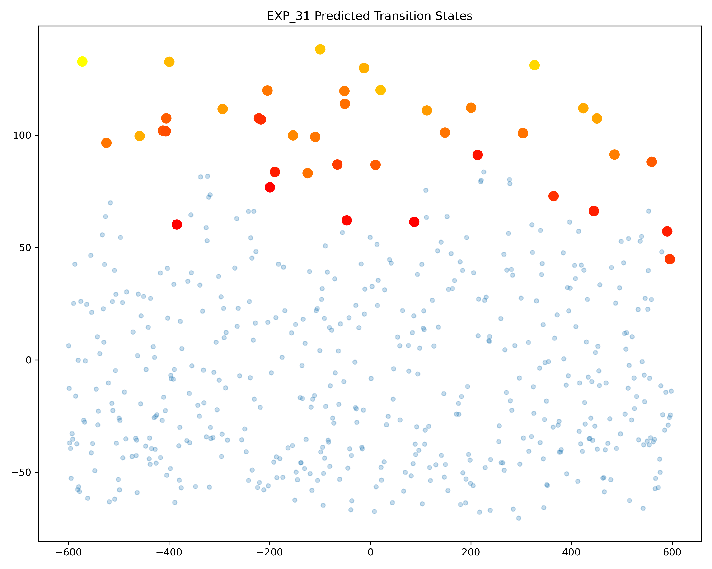

High-risk transition candidates concentrate in specific atlas regions.

The distribution is not uniform.

Several candidate groups appear along coherent upper-field structures.

A particularly notable feature is the emergence of a continuous yellow-orange-red band.

This suggests that transition candidates may organize along a geometric risk gradient rather than appearing randomly across the atlas.

---

### Transition Target Map

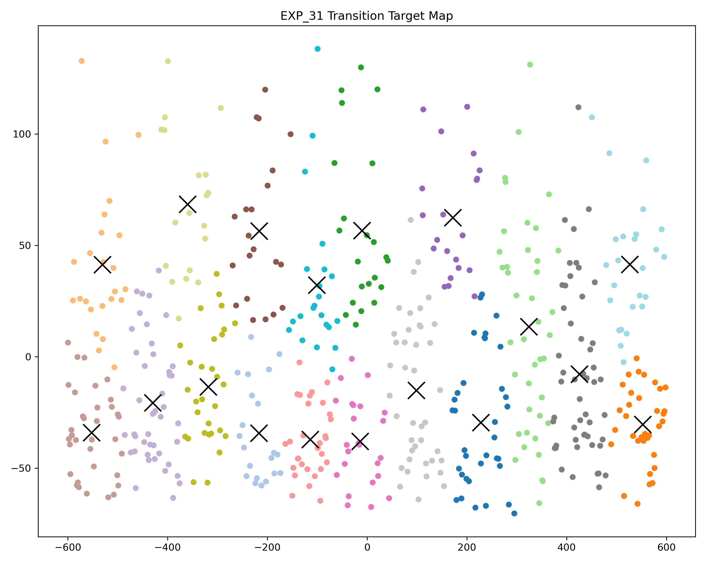

The atlas separates into distinct territorial regions.

Cluster centers act as geometric attractors or regional centers.

The resulting map resembles a collection of operating territories connected through potential transition routes.

Several territories appear highly compact and self-organized.

The right-most orange territory stands out as a particularly isolated operating region with its own internal structure.

---

### Transition Matrix

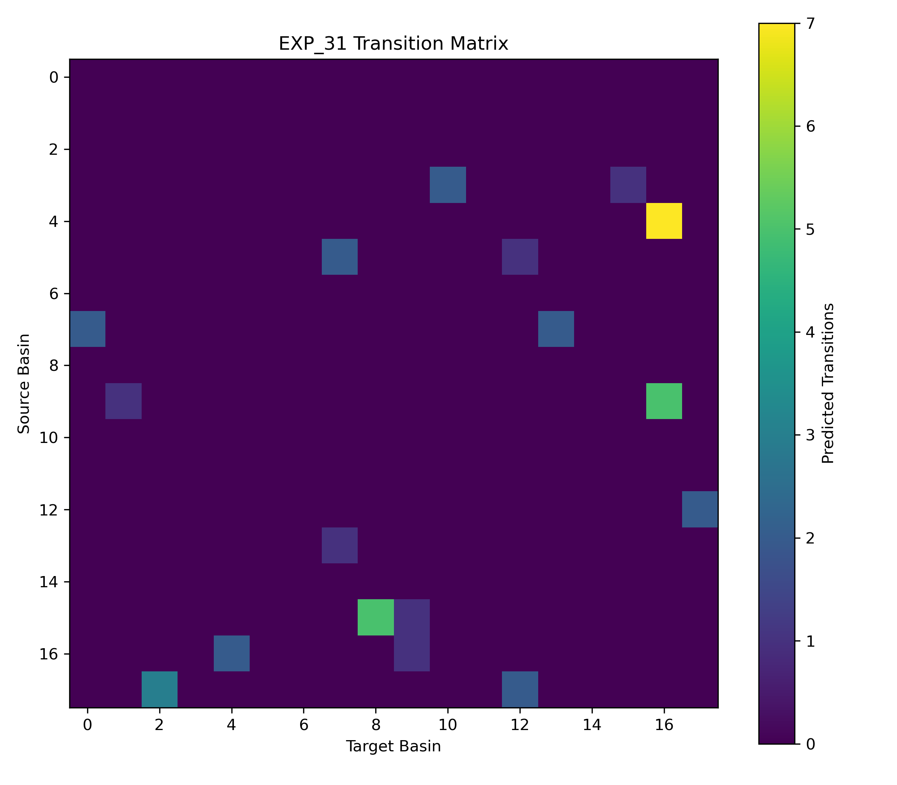

The transition matrix is sparse.

Most basin pairs exhibit no predicted transitions.

Instead, a limited number of dominant channels emerge.

Result:

```text
Transition behavior
is structured
rather than random.
```

Several basin pairs appear to act as preferred transition destinations.

The strongest channels concentrate into a small subset of basin-to-basin routes, suggesting the emergence of preferred transport pathways across the atlas.

---

### Exit → Target Overlay

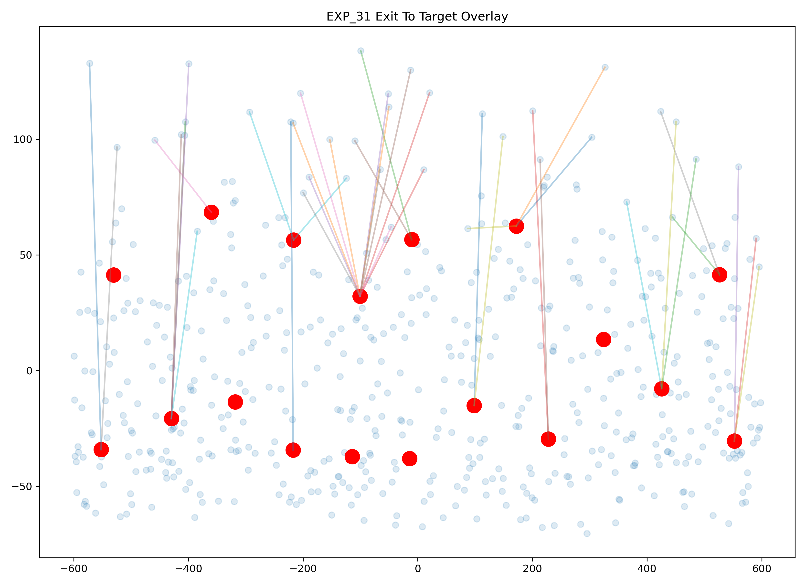

The transition overlay reveals directed transport geometry.

Exit candidates connect to preferred target basins through coherent transition bundles.

Observed features:

- fan structures
- branching patterns
- V-shaped transition corridors
- converging transport bundles

The resulting geometry resembles a transport network rather than isolated basin regions.

Several transition bundles appear repeatedly.

The geometry resembles branching transport fibers or directed field channels.

This structure is remarkably similar to transport motifs previously observed in gate corridors, transition boundaries and Prime Grid style transport overlays.

---

## Atlas Interpretation

EXP_30 identified:

```text
Who is likely to leave?
```

EXP_31 adds:

```text
Where is it likely to go?
```

This represents a fundamental shift.

The atlas evolves from a descriptive map into a predictive map.

---

## Transition Territories

Several basin regions behave as:

```text
receivers
```

while others behave as:

```text
sources
```

The transition matrix suggests that some destinations attract disproportionate transition flow.

This indicates the emergence of higher-level atlas organization beyond simple basin membership.

The atlas is beginning to reveal:

```text
Territories
    ↓
Corridors
    ↓
Transition Cities
    ↓
Preferred Destinations
```

rather than a flat collection of disconnected operating states.

---

## Engineering Interpretation

For power-system operators, the result is important because instability may not be random.

Instead:

```text
Operating Region A
        ↓
Preferred Transition Corridor
        ↓
Operating Region B
```

may exist.

If validated, future experiments could provide:

- basin-exit forecasting
- regime-transition prediction
- early-warning indicators
- intervention planning
- return-to-safe-region navigation

---

## Why EXP_31 Matters

EXP_31 is the first experiment that attempts to predict motion on the atlas.

Previous experiments discovered structure.

This experiment begins to infer future movement.

Conceptually:

```text
EXP_30
Who is at risk?
```

became

```text
EXP_31
Where will it go?
```

This is the first step from:

```text
Atlas Discovery
```

toward

```text
Atlas Navigation
```

and eventually

```text
Atlas Control.
```

---

## Conclusion

EXP_31 provides the first transition forecasting layer of the NEXAH Atlas.

The experiment suggests:

```text
Atlas Geometry
        ↓
Exit Risk
        ↓
Transition Targets
```

which moves the framework beyond atlas discovery toward predictive navigation.

This result establishes the foundation for:

```text
EXP_32 — Early Warning
EXP_33 — Control Vector Discovery
EXP_34 — Return-To-Safe-Basin Navigation
```

Current interpretation:

```text
The atlas not only contains places.

It also contains preferred futures.
```
# EXP_32 — EARLY WARNING
## Geometric Precursors of Basin Exit Events

---

## Objective

After identifying:

- Basin Structures (EXP_24E)
- Transport Geometry (EXP_28)
- Exit Candidates (EXP_30)
- Transition Targets (EXP_31)

the next question becomes:

> Can the atlas detect an approaching transition before the transition occurs?

EXP_32 introduces the first geometric **Early Warning Index (EWI)**.

The objective is to identify states that are still inside a basin but already exhibit structural signs of instability.

---

# Visual Overview

---

## Visual 1

### `exp32_warning_map.png`

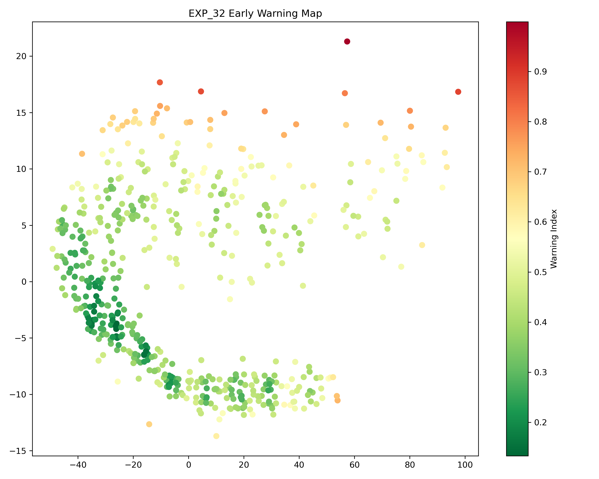

---

### Observation

The warning field is not randomly distributed.

A highly structured geometry appears:

- a lower curved body
- an upper cloud-like layer
- increasing warning values toward outer regions

The lower structure resembles a large:

```text
C-shape
```

while a second cloud floats above it.

The highest warning values emerge at the outer edges of these structures.

---

### Interpretation

The atlas appears to contain a natural stability hierarchy:

```text
Core
→ Stable

Outer Shell
→ Less Stable

Edge Regions
→ Critical
```

The Early Warning Index therefore behaves like a geometric distance-to-instability measure.

---

## Visual 2

### `exp32_warning_vs_axis_distance.png`

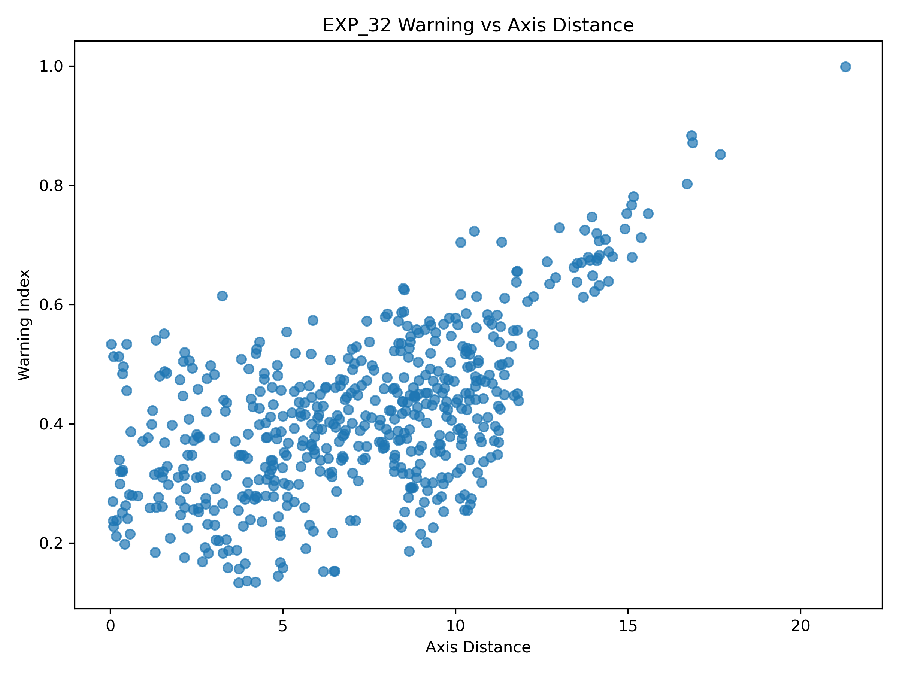

---

### Observation

A remarkably coherent trend emerges.

The cloud forms a jet-like structure:

```text
lower left
      →
          upper right
```

Warning increases almost monotonically with transport-axis distance.

---

### Interpretation

This suggests that the transport axis discovered in previous experiments is not merely a projection artifact.

Instead:

```text
Distance from Transport Axis
↑

Warning Index
↑
```

The farther a state drifts from the dominant transport corridor, the more unstable it becomes.

---

## Visual 3

### `exp32_warning_vs_basin_distance.png`

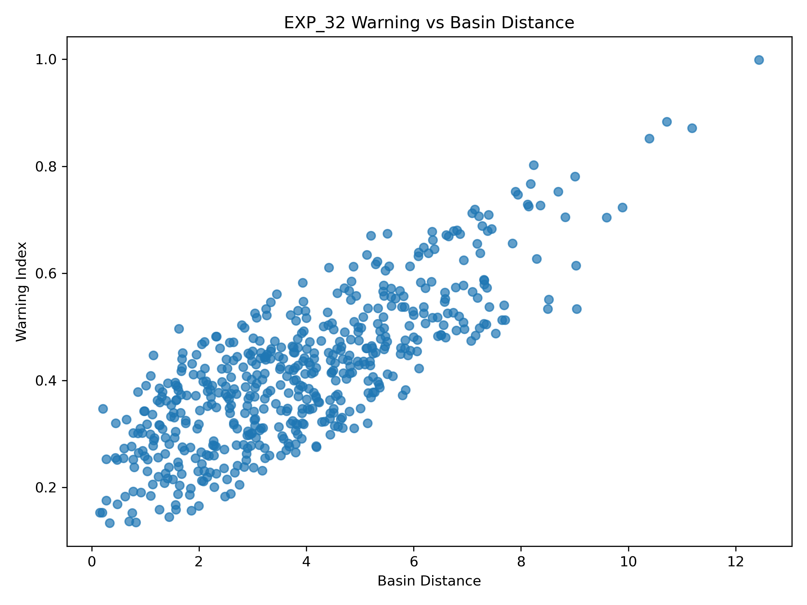

---

### Observation

This is one of the strongest relationships observed so far.

The point cloud forms an almost linear progression.

States near basin centers show low warning values.

States near basin boundaries show high warning values.

---

### Interpretation

This is precisely the behavior expected from a true stability basin:

```text
Center
=
Stable

Boundary
=
Unstable
```

The atlas therefore reconstructs a meaningful stability topology.

---

## Visual 4

### `exp32_warning_vs_density.png`

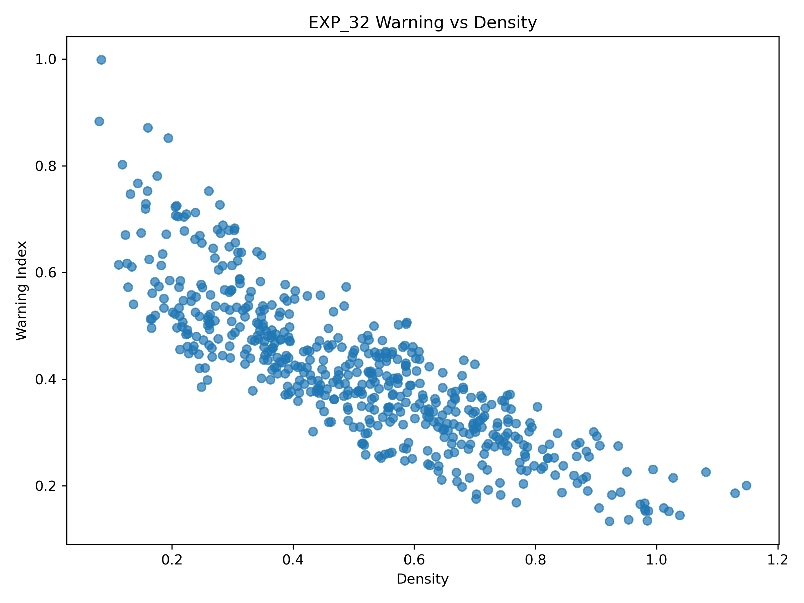

---

### Observation

A near-perfect inversion appears.

This figure behaves as a mirror image of Visual 3.

---

### Relationship

```text
High Density
=
Low Warning

Low Density
=
High Warning
```

or:

```text
Density ↓
Warning ↑
```

---

### Interpretation

This reproduces the same behavior already observed in EXP_30.

Sparse regions are transition-prone regions.

The atlas consistently associates low-density territory with elevated instability.

---

## Visual 5

### `exp32_warning_classes.png`

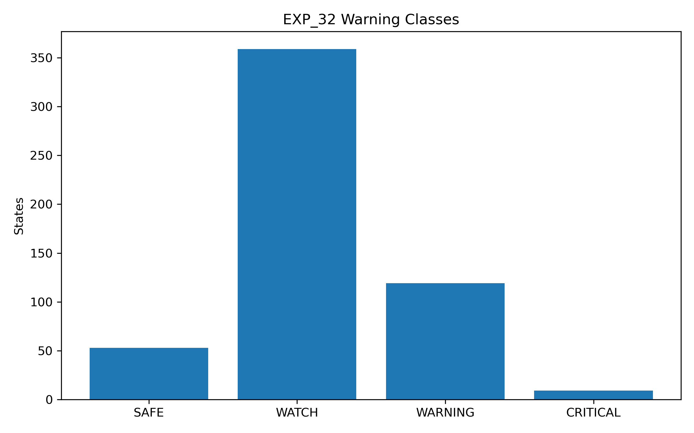

---

### Distribution

```text
SAFE      :  53
WATCH     : 359
WARNING   : 119
CRITICAL  :   9
```

---

### Observation

The overwhelming majority of states remain inside normal operating regions.

Only a very small number of states enter the critical regime.

---

### Interpretation

The warning hierarchy forms a continuous progression:

```text
SAFE
  ↓
WATCH
  ↓
WARNING
  ↓
CRITICAL
```

rather than isolated categories.

This is consistent with a gradual approach toward basin boundaries.

---

# Structural Findings

---

## Finding 1

The Early Warning Index is not random.

It produces a coherent geometric field across the atlas.

---

## Finding 2

Warning increases with:

```text
Transport Axis Distance
```

---

## Finding 3

Warning increases with:

```text
Basin Distance
```

---

## Finding 4

Warning increases as:

```text
Density decreases
```

---

## Finding 5

The warning field reproduces the same outer-shell structures previously observed in:

- EXP_30 Basin Exit Forecasting
- EXP_31 Transition Prediction

---

## Finding 6

Three independent indicators now point toward the same instability geometry:

```text
Exit Risk
Transition Prediction
Early Warning
```

This is the first appearance of a consistent multi-layer instability field inside the NEXAH Atlas.

---

# Conclusion

EXP_32 demonstrates that geometric precursors of regime transitions can be detected directly from atlas structure.

The strongest warning states occupy:

- low-density regions
- large basin-distance regions
- large transport-axis-distance regions

Only 9 of 540 states are classified as CRITICAL, suggesting that instability is concentrated in a small number of highly structured regions.

The experiment therefore provides the first operational Early Warning Layer for the NEXAH framework.

EXP_32 establishes the foundation for future predictive navigation experiments in which instability is not merely detected but actively avoided through field-guided control.

# Findings — EXP_33 Control Vector Discovery

## Objective

EXP_33 extends the transition forecasting framework of EXP_31 and the warning system of EXP_32 by introducing a geometric recovery mechanism.

The central question was:

> If a state is already approaching instability, in which direction should it move in order to return toward a stable region of the atlas?

Instead of merely identifying dangerous regions, EXP_33 attempts to compute local recovery vectors that point back toward stable basin cores.

---

## Key Result

The experiment demonstrates that recovery directions emerge naturally from atlas geometry.

States classified as WARNING or CRITICAL do not produce random correction vectors.

Instead, they converge toward identifiable local attractor centers.

This suggests that the NEXAH Atlas contains embedded control information and can provide navigation guidance in addition to structural analysis.

---

## Visual Analysis

### 1. Recovery Vectors

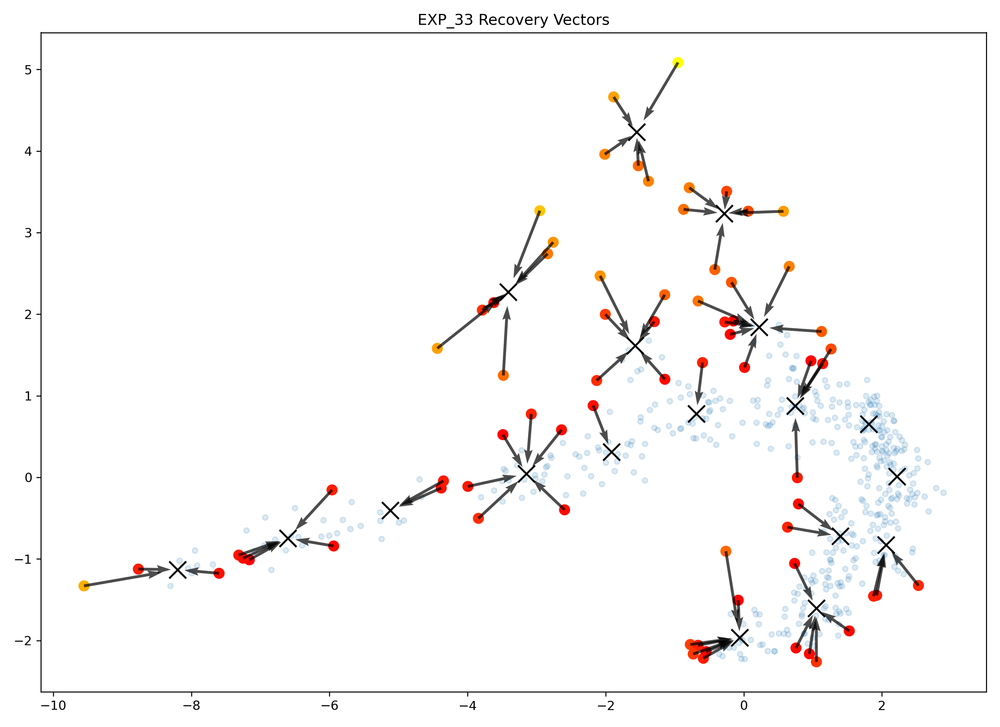

This visualization reveals a network of local recovery flows.

Several observations stand out:

- recovery vectors converge toward nearby basin centers
- vector orientations are highly structured
- multiple local convergence regions emerge
- vector bundles resemble radial attraction fields

The black crosses increasingly resemble local attractors rather than simple clustering centroids.

A notable feature is the appearance of fan-like vector structures that resemble the branching geometries observed previously in:

- EXP_31 Transition Prediction
- Prime Grid structures
- Atlas transport channels

The recovery process therefore appears organized around geometric flow paths rather than arbitrary correction directions.

---

### 2. Recovery Targets

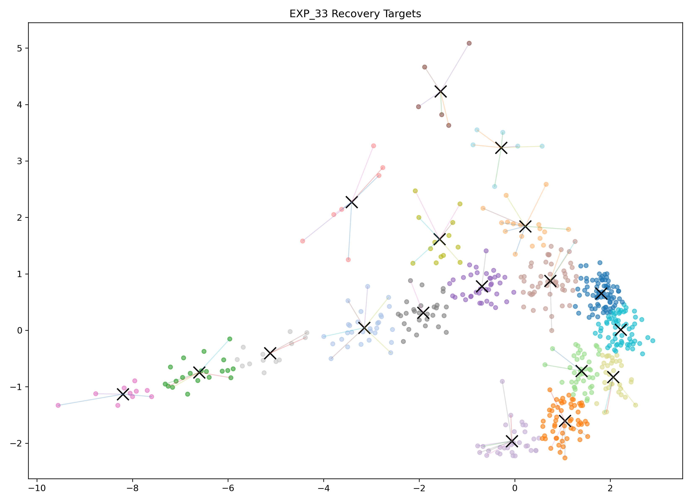

The atlas geometry expands significantly when target destinations are visualized.

Compared to previous experiments:

- the familiar "J-shaped" structure becomes stretched
- local territories become more distinct
- individual basin systems appear as semi-independent coordinate regions

The visualization suggests that the atlas may contain multiple local navigation systems embedded inside a larger global geometry.

Instead of one universal coordinate system, the atlas behaves more like a collection of connected local domains.

---

### 3. Control Vector Field

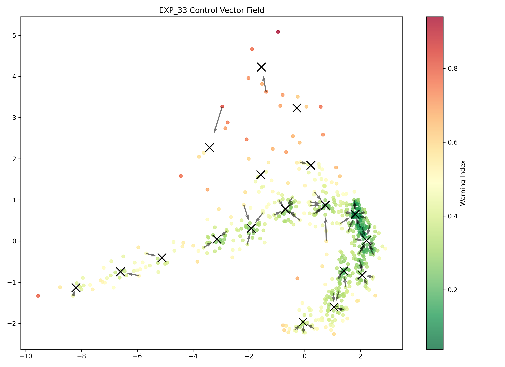

This is arguably the strongest result of the experiment.

The visualization combines:

- warning levels
- recovery vectors
- basin centers

into a single geometric map.

One particularly striking observation is the region near:

```text
PC1 ≈ 2
PC2 ≈ 0
```

This area exhibits:

- dense green states
- very low warning levels
- almost no significant recovery vectors

The atlas effectively indicates:

> No corrective action required.

This region behaves like a naturally stable core.

In contrast, outer regions generate increasingly strong recovery directions toward local basin centers.

---

### 4. Recovery Vector Length Distribution

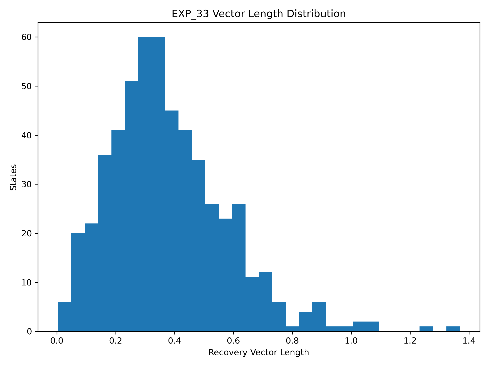

Most recovery vectors fall within:

```text
0.2 – 0.6
```

Only a small number exceed:

```text
0.8
```

or

```text
1.0
```

Interpretation:

- most unstable states remain relatively close to safety
- only a small subset requires major corrective action
- recovery appears achievable through local movement rather than large-scale relocation

This suggests that instability often develops gradually and can potentially be corrected before a major transition occurs.

---

### 5. Warning Recovery Overlay

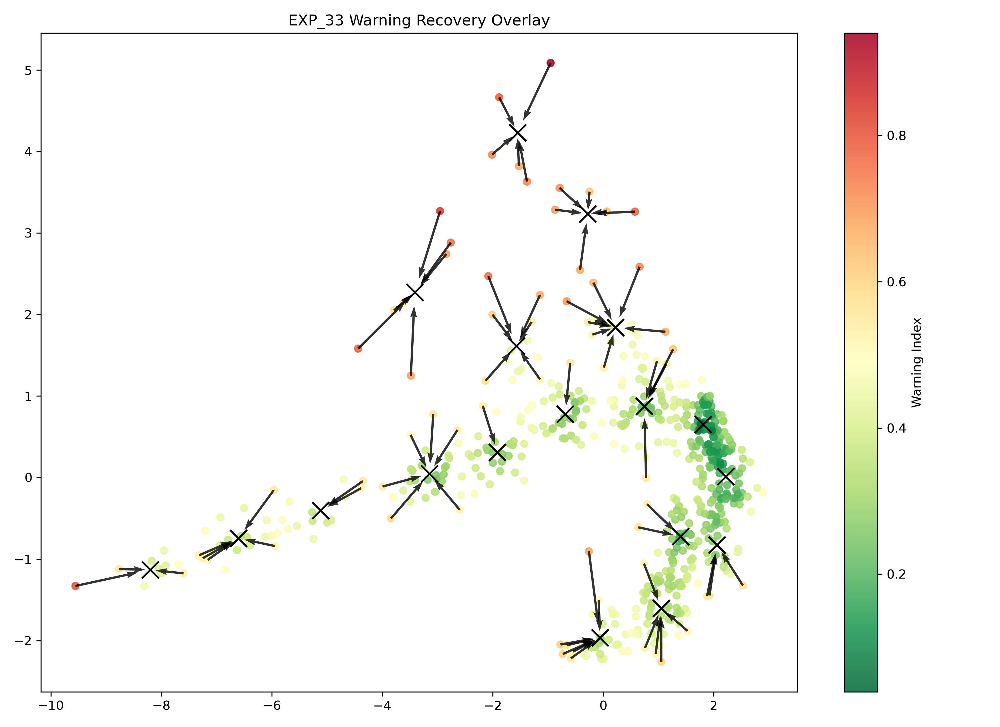

This visualization combines the findings of EXP_31, EXP_32 and EXP_33.

The most important observation is:

Recovery vectors generally point inward toward local stable regions.

They do not typically indicate:

- long-distance jumps
- basin switching
- global relocation

Instead they suggest:

```text
local return
toward local stability
```

This behavior resembles restoring forces in dynamical systems.

The atlas therefore appears capable of providing not only warning signals but also geometric recovery recommendations.

---

## Quantitative Summary

```text
States: 540
Basins: 18

SAFE:      108
WATCH:     361
WARNING:    63
CRITICAL:    8

Control Candidates: 71

Mean Recovery Length: 0.3777
Max Recovery Length: 1.3686
```

---

## Interpretation

EXP_31 demonstrated:

> Where transitions are likely to occur.

EXP_32 demonstrated:

> When a state begins approaching danger.

EXP_33 demonstrates:

> How a state can move back toward stability.

This represents the first experiment in which the atlas generates actionable recovery directions.

The geometry is no longer purely descriptive.

It becomes navigational.

---

## Conclusion

EXP_33 provides the first evidence that the NEXAH Atlas contains an intrinsic control layer.

The resulting vector fields suggest that:

- basin cores act as local attractors
- unstable states possess identifiable recovery directions
- recovery paths emerge directly from atlas geometry
- stability can potentially be navigated rather than merely observed

The atlas therefore behaves less like a static clustering space and increasingly like a navigable dynamical field.

This marks an important transition from:

```text
Structure Discovery
        →
Field Navigation
        →
Geometric Control
```

within the NEXAH framework.
