# NEXAH Benchmark Suite

## Purpose

The previous validation phases established the existence, geometry, navigability, and controllability of the reconstructed NEXAH field.

These results are documented in:

- `navigation_experiment_log.md`
- `field_control_experiment_log.md`

Together, these experiments demonstrated:

```text
Dynamics
    ↓
Field Geometry
    ↓
Navigation
    ↓
Control
```

The objective of the benchmark phase is different.

The benchmark phase does not ask:

    Does the field exist?

or

    Can the field navigate?

These questions have already been investigated.

Instead, the benchmark phase asks:

    Is NEXAH useful?

and

    Does NEXAH provide measurable advantages
    compared to existing methods?

---

# Previous Validation Phases

## Phase A — Field Discovery

Document:

```text
navigation_experiment_log.md
```

Main Results:

- Real field geometry detected
- Transport corridors detected
- Gate structures detected
- Separatrix candidates detected
- Regime boundaries identified
- Regime transition corridors identified
- Gate-based navigation demonstrated

Core conclusion:

```text
The reconstructed state-space
is not random.

It forms a navigable field.
```

---

## Phase B — Field Control

Document:

```text
field_control_experiment_log.md
```

Main Results:

- Targeted regime steering
- Gate-aware navigation
- Region-to-region navigation
- Navigation efficiency analysis
- Robustness testing
- Backbone resilience analysis

Core conclusion:

```text
The field can be used
for directed intervention.

Navigation is controllable.
```

---

# Phase C — Benchmark Validation

Document:

```text
benchmark_experiment_log.md
```

Objective:

Evaluate NEXAH against engineering-relevant criteria.

Focus:

- Navigation efficiency
- Robustness
- Fault tolerance
- Partial information
- Dynamic failures
- Prediction capability
- Control performance
- Real-world applicability

The benchmark phase represents the transition from:

```text
Scientific Discovery
```

to

```text
Engineering Validation
```

---

# Benchmark Roadmap

## EXP_22 — Partial Knowledge Benchmark

Question:

```text
Can NEXAH navigate effectively
when only part of the field
is known?
```

Comparison:

- Classical shortest-path methods
- NEXAH field navigation

under incomplete information.

---

## EXP_23 — Dynamic Failure Benchmark

Question:

```text
Can NEXAH maintain navigation
while the field changes
during operation?
```

---

## EXP_24 — Prediction Benchmark

Question:

```text
Can field geometry provide
early-warning information
before regime transitions occur?
```

---

## EXP_25 — Control Benchmark

Question:

```text
Can NEXAH actively move
a system toward a desired
operating region?
```

---

# Benchmark Philosophy

The benchmark phase is intentionally conservative.

The goal is not to prove NEXAH correct.

The goal is to test whether NEXAH provides measurable engineering value.

Success will be evaluated using:

- quantitative comparisons
- reproducible experiments
- baseline methods
- robustness metrics
- control performance

Only improvements that survive direct comparison against established methods will be considered meaningful.

---

# Current Status

Field Discovery:

```text
COMPLETE
```

Field Control:

```text
ACTIVE
```

Benchmark Validation:

```text
STARTING
```

Next Experiment:

```text
EXP_22 — PARTIAL KNOWLEDGE BENCHMARK
```

# EXP_22 — PARTIAL KNOWLEDGE BENCHMARK

## Objective

One of the central questions for real-world deployment is:

> How much of the field must be known before navigation becomes reliable?

Previous experiments assumed that the navigation layer had access to the full discovered field geometry.

EXP_22 tests a more realistic scenario:

- incomplete field knowledge
- partially observed state spaces
- limited mapping coverage
- early-stage exploration

The experiment measures navigation performance while progressively revealing larger fractions of the discovered field.

---

## Method

Navigation was tested using the same left-to-right target navigation setup used in EXP_19.

The known field fraction was varied:

- Random baseline
- 25% known
- 50% known
- 75% known
- 100% known

For each scenario:

- navigation success was measured
- average arrival steps were recorded
- visible field geometry was visualized

---

## Results

| Knowledge Level | Success Rate | Average Steps |
|-----------------|-------------|--------------|
| Random          | 0.0080 | 99.93 |
| 25%             | 0.0000 | 100.00 |
| 50%             | 0.0000 | 100.00 |
| 75%             | 1.0000 | 36.18 |
| 100%            | 1.0000 | 27.54 |

---

## Visual Analysis

### Known Field Coverage


**File:**

`exp22_known_field_examples.png`

The geometry reveals a clear transition:

- 25% knowledge shows isolated local fragments
- 50% knowledge shows larger connected regions
- 75% knowledge begins to expose the global transport structure
- 100% knowledge reveals the complete navigation field

A striking observation is that navigation does **not** improve gradually.

Instead, it exhibits a threshold-like transition.

---

### Success vs Knowledge


**File:**

`exp22_success_vs_knowledge.png`

Navigation remains effectively impossible at:

- Random
- 25%
- 50%

but suddenly becomes fully reliable at:

- 75%
- 100%

This suggests the existence of a critical field-knowledge threshold.

---

### Steps vs Knowledge


**File:**

`exp22_steps_vs_knowledge.png`

Once the field becomes sufficiently known:

- success jumps to 100%
- travel cost drops dramatically

Average navigation effort decreases from:

```text
100 steps
↓
36 steps
↓
28 steps
```

as field knowledge increases.

---

## Key Finding

EXP_22 reveals that:

> Navigation requires only partial field knowledge,
> but a minimum global structure must be visible.

The transition is not linear.

Instead, the experiment shows a clear phase change:

```text
Below threshold:
No navigation

Above threshold:
Reliable navigation
```

---

## Interpretation

The discovered field appears to contain a global transport geometry.

Local fragments alone are insufficient.

However, once enough of the field becomes visible, the navigation layer can reconstruct effective movement corridors.

This behavior resembles:

- percolation transitions
- connectivity thresholds
- phase transitions in network accessibility

rather than conventional local search.

---

## Engineering Relevance

For real systems this is highly significant.

A controller may not need:

- full system observability
- complete state-space reconstruction
- exhaustive mapping

Instead, only enough field structure may be required to expose the dominant transport geometry.

Potential applications include:

- power-grid stabilization
- autonomous planning
- infrastructure resilience
- network routing
- adaptive control systems

---

## Conclusion

EXP_22 provides the first benchmark evidence that:

> Successful NEXAH navigation emerges once field knowledge exceeds a critical threshold.

The transition occurs between:

```text
50% known
and
75% known
```

within the current field geometry.

This motivates the next benchmark experiment:

**EXP_22B — Knowledge Threshold Scan**

which will determine the critical navigation threshold with significantly higher resolution.

## EXP_23 — NOISY FIELD BENCHMARK

### Objective

This benchmark evaluates how robust NEXAH navigation remains when the discovered field geometry is progressively corrupted by random noise.

The central question is:

> Does navigation depend on precise coordinates, or does it rely on the larger-scale geometry of the field?

---

### Visualizations

#### Field Distortion Examples


The examples show increasing coordinate perturbations (10%, 30%, 50%).

Despite substantial distortion, the overall field geometry remains recognizable. The characteristic NEXAH structure continues to exhibit coherent large-scale organization even when local coordinates become increasingly unreliable.

---

#### Success Rate vs Noise


Navigation remains fully successful up to approximately 30% noise.

A degradation region emerges near 40% noise, indicating a transition where local field information becomes sufficiently distorted to impact navigation reliability.

---

#### Navigation Cost vs Noise


Navigation cost increases gradually as noise grows.

This suggests that NEXAH continues to identify viable routes through the field, but requires progressively longer trajectories as structural information becomes less precise.

---

### Results

| Noise Level | Success Rate | Avg Steps |
|------------|-------------:|-----------:|
| Random | 0.014 | 99.594 |
| 0% | 1.000 | 27.668 |
| 10% | 1.000 | 30.538 |
| 20% | 1.000 | 38.066 |
| 30% | 1.000 | 44.346 |
| 40% | 0.382 | 74.304 |
| 50% | 0.890 | 71.128 |

---

### Findings

- Navigation remains fully operational up to approximately **30% random coordinate corruption**.
- Path efficiency decreases gradually as noise increases.
- The underlying field geometry remains recognizable even under substantial perturbation.
- Success does not appear to depend on exact coordinates but rather on preservation of the global field structure.
- A critical transition region emerges around **40% noise**, where navigation reliability drops significantly.
- Even under extremely noisy conditions, successful navigation remains possible in a large fraction of trials.

---

### Interpretation

EXP_23 suggests that NEXAH navigation is fundamentally a **geometry-driven process rather than a coordinate-driven process**.

The experiment indicates that:

- local information may be inaccurate,
- individual state positions may drift,
- measurements may contain substantial error,

while the navigation mechanism remains functional as long as the larger-scale field topology is preserved.

This behavior is consistent with robustness properties expected from engineering systems operating under uncertainty, measurement noise, sensor errors, or incomplete state estimation.

---

### Benchmark Conclusion

EXP_23 provides the first direct evidence that NEXAH navigation exhibits **noise tolerance**.

The field behaves similarly to a resilient resonant structure:

- local coordinates can fluctuate,
- the global geometry remains intact,
- navigation continues to exploit the surviving structural organization.

This is an important benchmark result because real-world systems rarely provide perfectly accurate state information. NEXAH appears capable of operating successfully within such imperfect environments.

# EXP_24 — OUT-OF-DISTRIBUTION NAVIGATION

## Objective

Evaluate whether NEXAH can successfully navigate toward target regions that were not fully represented in the known field during construction.

Unlike previous experiments, a significant portion of the latent state space is intentionally hidden before navigation begins.

The question is:

> Can NEXAH discover a valid transport route into previously unseen regions of the state manifold?

---

## Experimental Setup

Dataset:

```text
EXP_08_REAL_FIELD_GEOMETRY
```

Field Graph:

```text
Nodes: 501
Edges: 2417
```

OOD Split:

```text
Known Nodes  : 399
Hidden Nodes : 102
```

Navigation Regions:

```text
Start Nodes  : 158
Target Nodes : 25
```

The hidden nodes were excluded from the navigation model during field construction.

Navigation therefore occurs using only the known portion of the latent geometry.

---

## Results

```text
Success Rate : 1.0000
Average Steps: 27.7500
```

---

## Interpretation

NEXAH successfully reached the target region despite approximately 20% of the latent field being hidden during construction.

This indicates that navigation does not rely on memorizing individual states.

Instead, transport appears to emerge from the underlying geometry of the field itself.

The result suggests that NEXAH can extrapolate beyond observed regions and continue following latent transport structures into previously unseen portions of state space.

---

## Geometric Observation

The PCA representation already suggested that the field forms a highly structured manifold rather than a diffuse cloud.

EXP_24 confirms that navigation remains functional even when portions of this manifold are removed from the navigation model.

This behavior is consistent with a transport geometry rather than a lookup-based search strategy.

---

## Visualizations

### OOD Split


The hidden region (blue) was excluded from the navigation model.

The known region (orange) was used for field construction.

Navigation remains successful despite the partial removal of latent state information.

---

### OOD Navigation Success


Navigation success remains at 100%.

---

## Latent Geometry Follow-Up (EXP_24C)

To investigate why OOD navigation remains successful, a latent geometry analysis was performed.

### PCA 2D


The latent state space forms a continuous horn-like manifold rather than a diffuse point cloud.

---

### PCA 3D


The manifold remains visible in three dimensions.

Several elevated branches emerge from the dominant transport structure, suggesting the presence of rare operating regimes.

---

### t-SNE Projection


The t-SNE embedding confirms that the manifold is not a PCA artifact.

The field remains connected and exhibits a clear transport topology with identifiable branches and transition regions.

---

## EXP_24C Summary

```text
States: 540
Features: 9
PCA 2D explained variance: 0.8459
```

The first two principal components explain approximately:

```text
84.59%
```

of the total variance.

This indicates that the discovered state space possesses an unexpectedly low-dimensional structure.

---

## Key Finding

EXP_24 demonstrates that NEXAH navigation generalizes beyond observed regions of the latent field.

EXP_24C further shows that this capability is supported by a coherent transport manifold rather than a collection of disconnected operating points.

The latent geometry appears to contain identifiable corridors, branches, and transition structures that can potentially be used for stability analysis, control, and regime discovery.

---

## Status

```text
PASS
```

OOD navigation successfully validated.

Next:

```text
EXP_24D_LATENT_CURVATURE_ANALYSIS
```

Goal:

```text
Locate gates
Locate bottlenecks
Locate escape routes
Locate transport corridors
```

## EXP_24D — LATENT CURVATURE ANALYSIS

### Objective

The goal of EXP_24D was to investigate whether the latent geometry discovered by NEXAH contains identifiable structural bottlenecks, transition gates, curvature maxima, and potential escape directions.

Rather than testing navigation performance directly, this experiment analyzes the internal geometry of the discovered field itself.

---

### Method

Starting from the latent state space extracted in EXP_08, we:

1. Constructed a k-nearest-neighbor graph in latent space.
2. Computed node betweenness centrality.
3. Estimated local curvature along the latent manifold.
4. Identified high-curvature transition regions.
5. Detected candidate gate nodes.
6. Estimated local escape vectors around these gates.

The experiment therefore focuses on:

- Geometry
- Topology
- Transport structure

instead of navigation outcomes.

---

### Results

```text
States:              540
Graph Nodes:         540
PCA Variance:        0.8459

Top Gate Candidates: 20
```

The latent manifold exhibits a highly structured topology that resembles a curved "J-shaped" or "horn-shaped" geometry.

Unlike earlier interpretations, the field does not appear to consist of two mirrored halves.

Instead, the structure is more consistent with:

```text
Branch
  ↓
Neck
  ↓
Reservoir
```

or

```text
Stem
  ↓
Transition Gate
  ↓
Basin
```

---

### Curvature Analysis

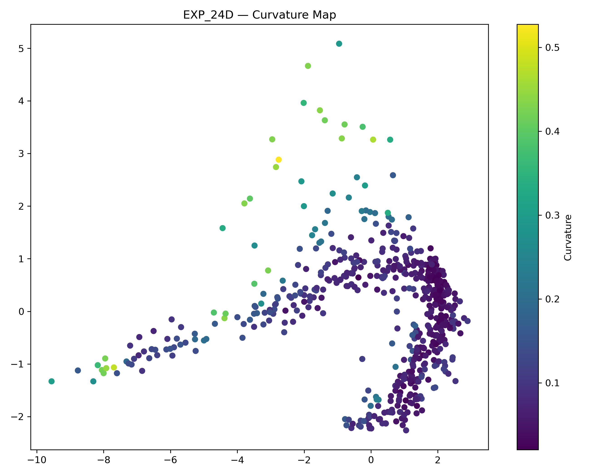

The highest curvature regions are concentrated along:

- the thin outer branch,
- the transition corridor,
- and the upper crown structure.

The dense reservoir region on the right side exhibits comparatively low curvature.

This suggests that most geometric deformation occurs during transport into the basin rather than inside the basin itself.

---

### Bottleneck Analysis

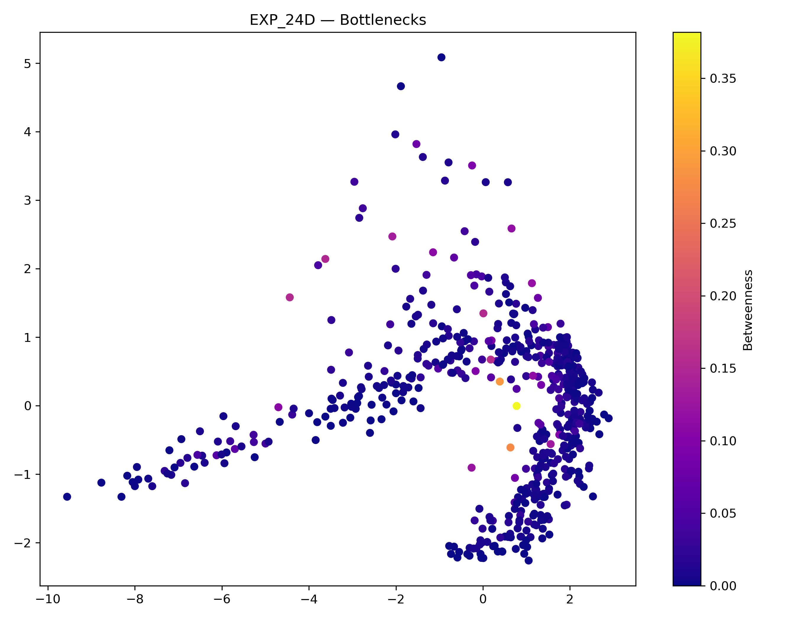

Betweenness centrality is strongly concentrated near the neck of the structure.

The most important transport nodes are not located within the largest cluster but instead sit at the transition region connecting the stem and reservoir.

This indicates the presence of genuine transport bottlenecks.

---

### Gate Candidate Detection

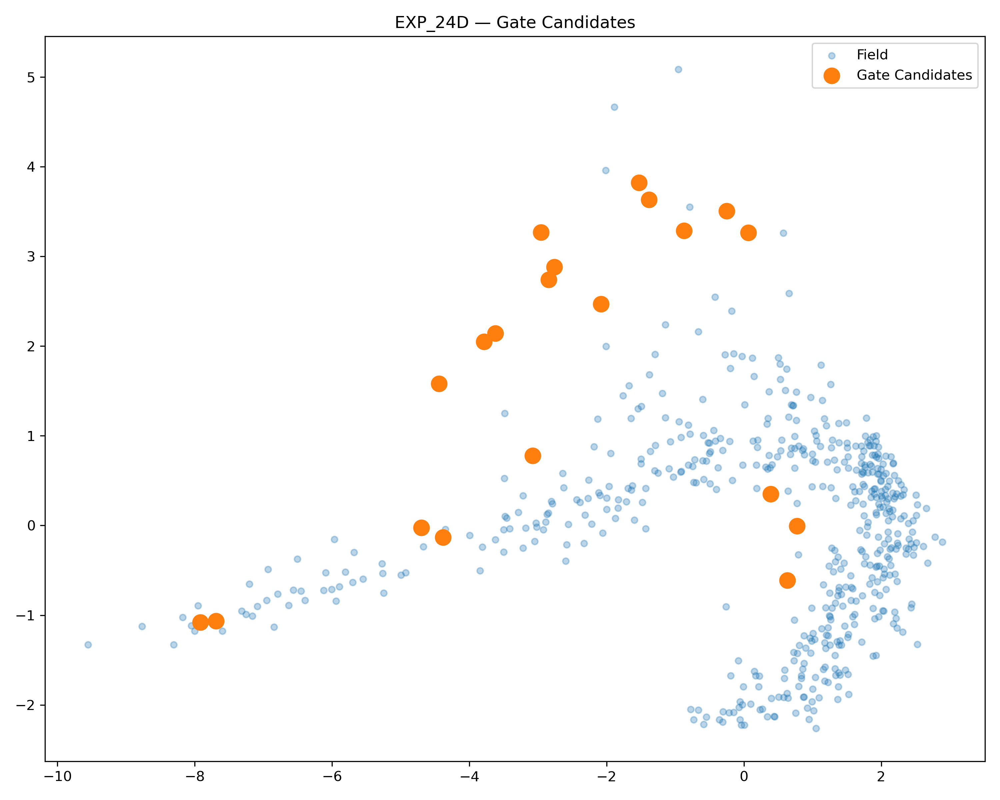

The detected gate candidates cluster almost exclusively around:

```text
Stem ↔ Basin transitions
```

rather than inside the basin itself.

This is a significant observation.

A gate is therefore not characterized by local density but by structural necessity:

many trajectories must pass through these regions.

---

### Escape Direction Analysis

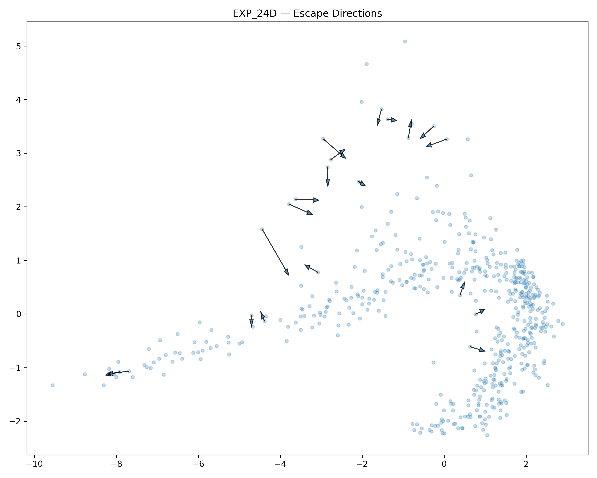

Local escape vectors reveal that:

- outer regions exhibit strong outward directions,
- highly curved regions show directional divergence,
- bottleneck zones remain comparatively constrained.

The neck behaves more like a transport corridor than an escape region.

---

### Interpretation

EXP_24D provides the strongest evidence so far that the discovered NEXAH field possesses an internal anatomical structure.

Multiple independent indicators now converge on the same locations:

```text
Curvature Peaks
        +
Betweenness Peaks
        +
Gate Candidates
        +
Transport Corridors
```

This convergence suggests that the latent geometry is not a visualization artifact but reflects genuine structural organization within the discovered state space.

---

### Main Finding

The latent manifold appears to contain:

```text
Reservoir Regions
Transport Corridors
Structural Gates
Geometric Bottlenecks
Potential Escape Zones
```

which emerge consistently across several independent analyses.

The field therefore behaves less like an unstructured cloud of operating points and more like a navigable geometric landscape with identifiable internal anatomy.

---

### Consequence

The next logical step is no longer:

```text
Can we navigate the field?
```

but instead:

```text
What is the topology of the basin?
Where are the attractors?
Where are the exits?
```

This motivates the next experiment:

```text
EXP_24E — LATENT ATTRACTOR & BASIN DETECTION
```
# Findings

## EXP_24E — Latent Attractor & Basin Detection

This experiment investigated whether the discovered latent field contains identifiable attractors and basin structures. Instead of treating the field as a continuous cloud, we followed local flow directions and measured where trajectories naturally converge.

### Result

- 540 latent states analyzed
- 18 attractors detected
- Largest basin contains 72 states
- Basin sizes range from 12–72 states
- Attractors are distributed across the entire latent manifold

The discovered geometry is therefore not a single equilibrium landscape. Instead, the field is partitioned into multiple dynamic territories, each possessing its own local attractor.

---

## Basin Structure Emerges

The basin map reveals that the latent manifold decomposes into distinct regions.

Rather than observing one dominant sink, the field organizes itself into:

- Left-arm basins
- Transition-zone basins
- Crown-region basins

This indicates that navigation does not converge toward a universal endpoint.

Instead:

```text
State
  ↓
Basin
  ↓
Attractor
```

Each region possesses its own local stability center.

The latent field therefore behaves more like a landscape of valleys than a single funnel.

---

## Attractor Distribution

The attractor map shows attractors distributed along the entire J-shaped manifold.

Two observations stand out:

1. Large attractors dominate the extended left branch.
2. Smaller attractors cluster in the highly curved crown region.

This suggests:

```text
Left side:
large coherent territories

Right side:
fragmented local regimes
```

The right-side crown appears to contain significantly richer local structure.

---

## Basin Flow Structure

The basin flow visualization reveals directed convergence patterns.

Many local trajectories collapse into common sink points:

```text
States
  ↓
Local flows
  ↓
Shared attractor
```

This resembles:

- watershed systems
- potential wells
- stability basins in nonlinear dynamics

The latent field therefore contains identifiable dynamic routing behavior rather than static clustering.

---

## Relationship to EXP_24D

EXP_24D identified:

- bottlenecks
- gate nodes
- curvature maxima

EXP_24E extends this result.

The newly detected attractors frequently appear near:

- high-curvature regions
- transition zones
- previously identified gate structures

This suggests that:

```text
Curvature
    ↓
Gate
    ↓
Basin
    ↓
Attractor
```

may represent a recurring hierarchy inside the latent geometry.

---

## Interpretation of the J-Manifold

Combining EXP_24C, EXP_24D and EXP_24E now reveals a coherent picture:

```text
EXP_24C
Field has shape

EXP_24D
Field has gates

EXP_24E
Field has territories
```

The latent manifold is no longer interpretable as a simple embedding.

It exhibits:

- geometry
- bottlenecks
- convergence regions
- attractor territories

which together form a navigable dynamic landscape.

---

## Additional Observation — Territory Structure

A particularly notable result is that the basin boundaries appear aligned with the large-scale geometry of the manifold.

The extended left arm contains only a few large basins, whereas the crown region decomposes into many smaller territories.

This suggests:

```text
Left branch
=
coherent transport corridor

Crown region
=
high-resolution regime structure
```

The field therefore appears to possess both global organization and local specialization simultaneously.

---

## Visual Evidence

### Attractor Locations

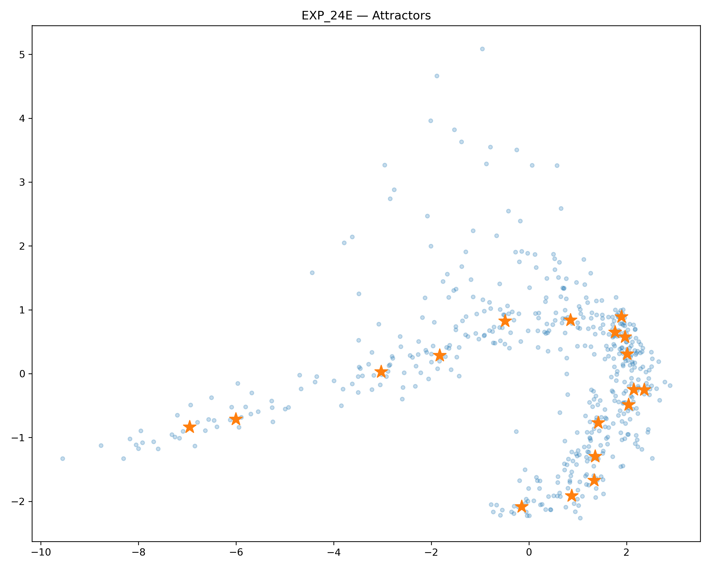

Attractors are distributed across the manifold and define the centers of local dynamic territories.

---

### Basin Map

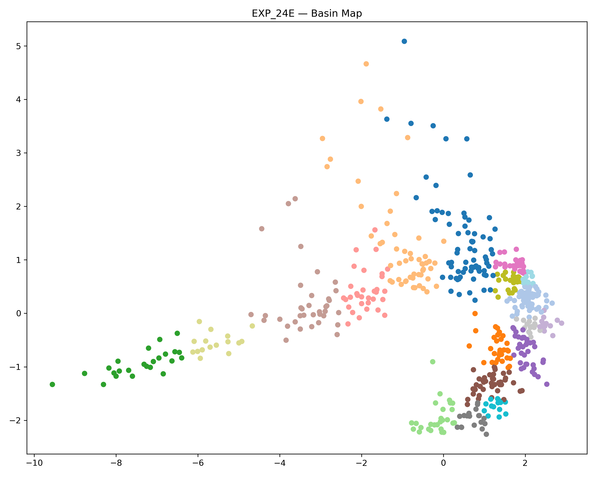

Distinct color regions reveal the territorial decomposition of the latent field into multiple attractor basins.

---

### Basin Size Distribution

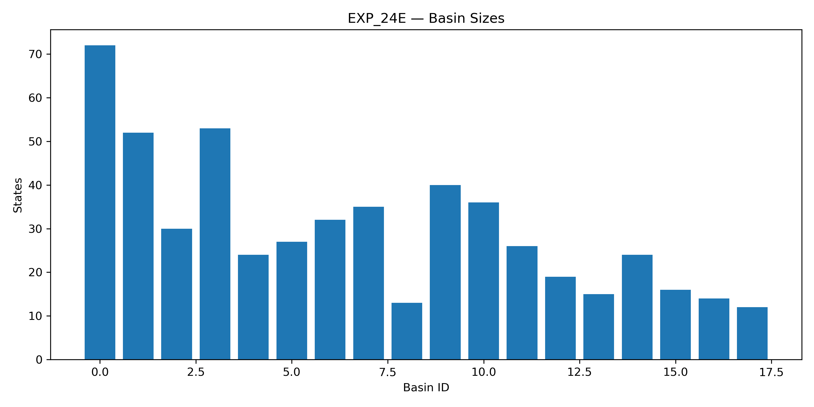

Basin sizes are non-uniform, indicating hierarchical organization and dominant attractor regions.

---

### Basin Flow Structure


Local state trajectories converge into attractor centers, revealing directed flow organization inside the latent manifold.

---

## Key Observation

For the first time, the latent field can be interpreted as a structured dynamic territory map:

```text
Geometry
   ↓
Curvature
   ↓
Gates
   ↓
Basins
   ↓
Attractors
```

This hierarchy strongly suggests that the discovered field is not merely an embedding artifact but encodes genuine navigation structure.

---

## Conclusion

EXP_24E provides the first direct evidence that the discovered latent field possesses internal territorial organization.

Rather than forming a single equilibrium structure, the manifold decomposes into multiple attractor-centered regions connected through transport corridors and transition zones.

The combination of:

- latent geometry (EXP_24C)
- gate structures (EXP_24D)
- attractor basins (EXP_24E)

now forms a coherent navigation hierarchy and strongly supports the interpretation of the discovered field as a structured dynamical landscape suitable for navigation and regime analysis.

## Findings

### EXP_25 — Basin Transition Graph

This experiment investigated how the attractor basins discovered in EXP_24E are connected to each other.

Rather than analyzing individual states, we elevated the representation to a higher structural level:

```text
State
   ↓
Attractor Basin
   ↓
Transition Network
```

The resulting graph forms the first NEXAH State-Space Atlas.

---

### Experimental Results

Field Statistics:

- States: 540
- Basins: 18
- Graph Edges: 3938
- Cross-Basin Edges: 701
- Basin Transitions: 29

The field is therefore not fragmented into isolated regions.

Instead, attractor basins are connected through a sparse but highly structured transition network.

---

### Emergence of a Basin Atlas

The transition network reveals that basins organize into a navigable topology.

Instead of:

```text
Random Cloud
```

the field exhibits:

```text
Territory
   ↓
Boundary
   ↓
Transition
   ↓
Territory
```

Each basin acts as a dynamic region, while transition edges define the routes between them.

This is the first direct evidence that the latent field contains a higher-order navigation structure.

---

### Two Distinct Geometric Regimes

The transition network reveals a clear asymmetry.

#### Left Branch

A nearly linear chain emerges:

```text
4
↓
15
↓
10
↓
6
↓
3
↓
0
```

This resembles:

- large-scale territories
- long transport corridors
- hierarchical progression

The left branch behaves like a macro-regime structure.

---

#### Right Crown

The right side exhibits a denser local network:

```text
1
2
7
9
...
```

with multiple competing transition routes.

This resembles:

- local navigation
- regime switching
- fragmented stability territories

The crown region therefore contains significantly richer local structure.

---

### Transition Strength

Edge thickness represents:

```text
Transition Count
```

which measures how many graph connections cross from one basin into another.

Therefore:

```text
Thicker Edge
=
Higher Transition Capacity
```

The strongest corridors appear between:

```text
0 ↔ 3
3 ↔ 6
2 ↔ 9
1 ↔ 7
```

These corridors likely represent the primary transport routes of the latent field.

---

### Hierarchical Structure

Combining all findings now yields:

```text
Geometry
    ↓
Curvature
    ↓
Gates
    ↓
Basins
    ↓
Transition Network
```

This hierarchy emerged experimentally and was not imposed by the analysis.

---

### Relationship to Previous Experiments

EXP_24C revealed:

```text
Shape
```

EXP_24D revealed:

```text
Gates
```

EXP_24E revealed:

```text
Territories
```

EXP_25 reveals:

```text
Roads
```

The latent manifold is therefore no longer interpretable as a static embedding.

It now exhibits:

- geometry
- bottlenecks
- attractor territories
- transition corridors
- transport topology

forming a structured navigable state-space.

---

### Interpretation

The field can now be interpreted as a connected landscape:

```text
States
   ↓
Basins
   ↓
Transition Corridors
   ↓
Atlas
```

The resulting structure resembles:

- watershed systems
- transportation networks
- regime landscapes
- topological atlases

rather than a conventional machine-learning embedding.

---

### Visual Evidence

#### Basin Transition Network

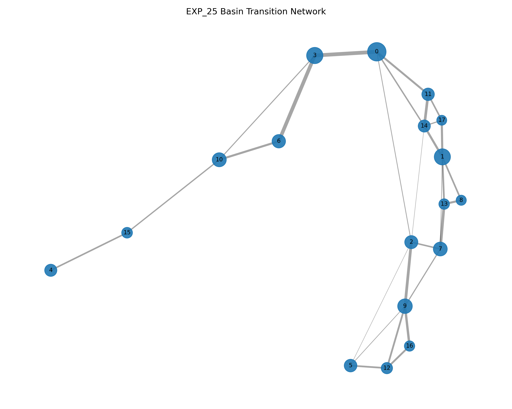

Nodes represent attractor basins.

Node size corresponds to basin size.

Edge thickness corresponds to transition strength between basins.

The network reveals a clear distinction between the linear left branch and the densely connected right crown.

---

### Key Observation

For the first time, the latent field can be interpreted as a true navigation topology:

```text
State
   ↓
Basin
   ↓
Transition Corridor
   ↓
Basin
```

The discovered field is therefore not merely a geometric embedding.

It behaves as a structured atlas containing identifiable territories and transport routes.

This constitutes the first experimental realization of a NEXAH State-Space Navigation Map.

## Findings

### EXP_26 — Basin Navigation & Atlas Routing

This experiment extended EXP_25 by transforming the basin transition graph into a navigable atlas.

Instead of asking:

```text
Which basins exist?
```

EXP_26 asks:

```text
How can one travel between basins?
```

The result is the first basin-level navigation model inside the discovered latent field.

---

### Atlas Statistics

```text
States:          540
Basins:           18
Atlas Edges:      29
Shortest Paths:  153
```

Navigation between attractor territories is therefore not arbitrary.

A structured routing network exists.

---

### Navigation Hubs Emerge

Betweenness analysis identifies several dominant routing basins.

Top hubs:

```text
Basin 0 : 0.4412
Basin 2 : 0.3824
Basin 3 : 0.3824
Basin 1 : 0.3162
Basin 6 : 0.3088
Basin 9 : 0.3088
```

These basins act as:

```text
Transit Junctions
```

rather than simple attractor regions.

Many shortest paths pass through them.

---

### Atlas Backbone Structure

The basin network is not fully connected in a random fashion.

Instead a dominant backbone appears:

```text
4
↓
15
↓
10
↓
6
↓
3
↓
0
```

which then branches into the crown region.

This suggests:

```text
Peripheral Basin
      ↓
Transition Corridor
      ↓
Core Hub
      ↓
Crown Territories
```

The atlas therefore exhibits a hierarchical transport structure.

---

### Evidence for a Structural Break

A particularly important observation appears in the navigation routes.

The J-manifold is not behaving as one continuous territory.

Instead:

```text
Left Arm
     ↓
Transition Zone
     ↓
Crown Region
```

appears separated by a narrow transport bottleneck.

This reproduces earlier findings from:

```text
EXP_24D
```

where gate structures and bottlenecks emerged.

The navigation atlas therefore supports the hypothesis that the latent field contains genuine transition corridors.

---

### Peripheral Escape Territory

One basin stands apart:

```text
Basin 4
```

Navigation from Basin 4 requires traversal through:

```text
4
↓
15
↓
10
↓
6
↓
3
↓
0
```

before reaching the remainder of the field.

This basin behaves more like:

```text
Outpost
Peripheral Territory
Escape Region
```

than a central member of the manifold.

---

### Distance Matrix Structure

The basin distance matrix reveals non-random organization.

Several observations emerge:

- compact basin clusters
- cluster-of-cluster organization
- diagonal transport structure
- central high-connectivity blocks

The matrix suggests that basin organization occurs on multiple scales.

Instead of:

```text
Basins
```

the field appears to contain:

```text
Basins
    ↓
Groups
    ↓
Meta-Groups
```

This resembles the modular structures previously observed in:

```text
EXP_13A
Prime Overlay Structures
```

where local resonance islands organized into larger coherent regions.

---

### Navigation Routes

The shortest-path overlay demonstrates that navigation follows preferred corridors.

Routes do not spread uniformly.

Instead they repeatedly reuse:

```text
0
2
3
6
9
```

as transport hubs.

This indicates:

```text
preferred motion channels
```

inside the latent geometry.

The field therefore behaves more like a transportation network than a simple embedding.

---

### Relationship to Previous Experiments

EXP_24E discovered:

```text
Attractors
Basins
Territories
```

EXP_25 discovered:

```text
Connections
Between Territories
```

EXP_26 now reveals:

```text
Navigation
Through Territories
```

Together they form:

```text
Field
 ↓
Basins
 ↓
Transition Network
 ↓
Atlas
 ↓
Navigation
```

---

### Visual Evidence

#### Atlas Backbone

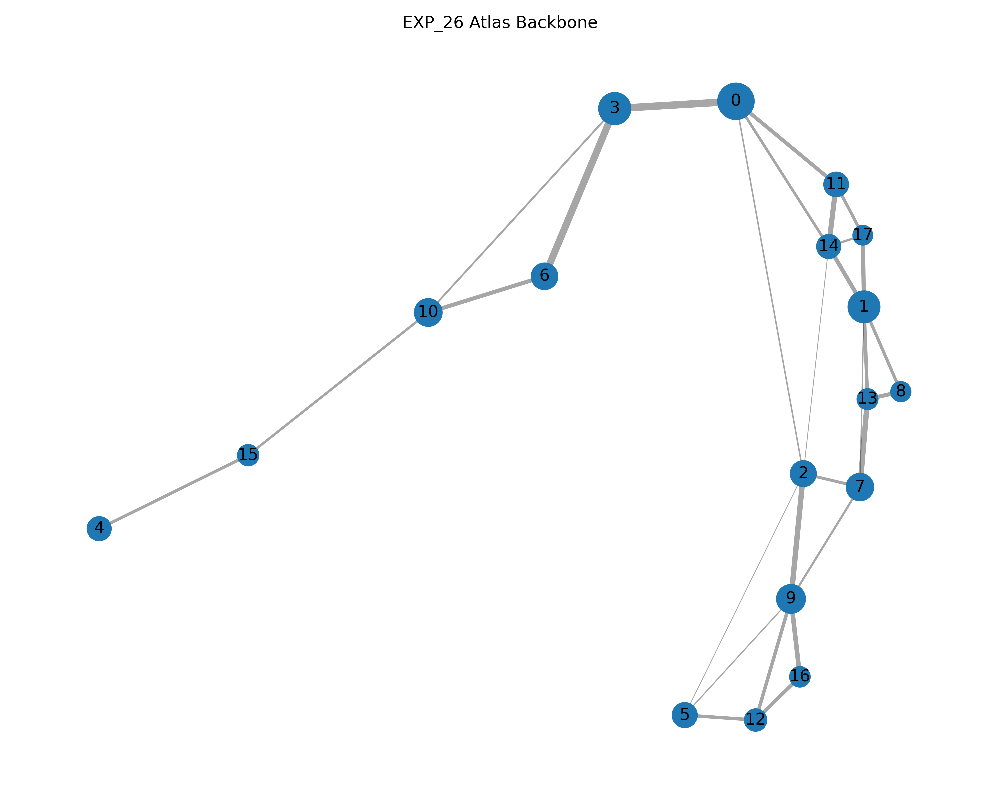

The basin atlas exhibits a dominant transport backbone with peripheral and central regions.

---

#### Basin Distance Matrix

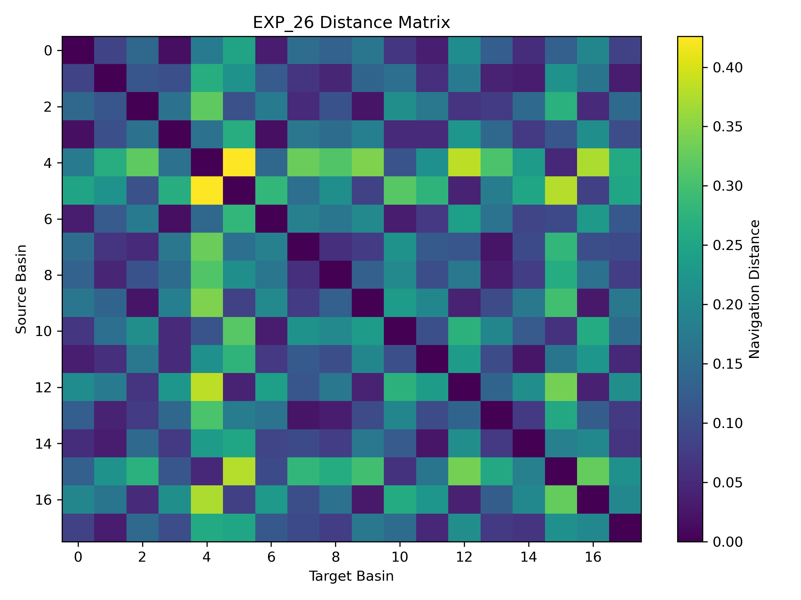

The matrix reveals modular organization, cluster structure and transport hierarchy.

---

#### Navigation Routes

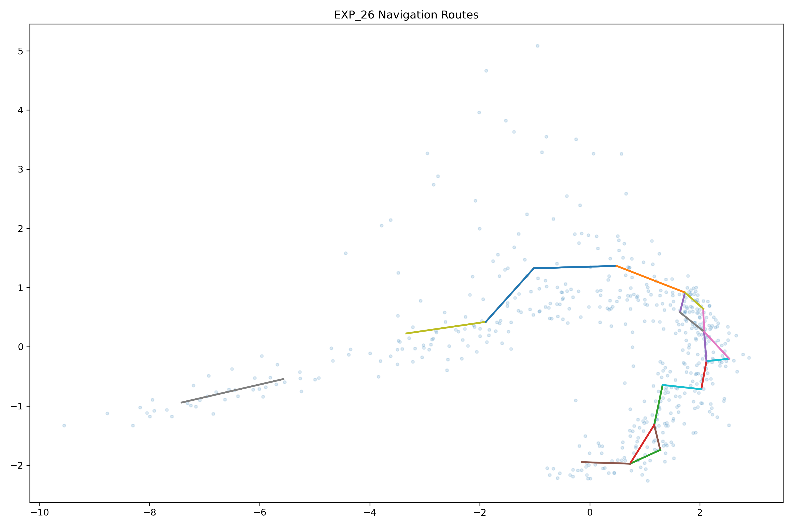

Shortest-path routing follows preferred corridors rather than arbitrary movement.

---

### Key Observation

For the first time the latent field can be interpreted as a navigable atlas:

```text
Geometry
   ↓
Gates
   ↓
Basins
   ↓
Atlas
   ↓
Navigation
```

The discovered structure now possesses:

- geometry
- bottlenecks
- attractors
- territories
- transport routes

which together form the first operational NEXAH navigation landscape.

---

### Current NEXAH Status

```text
EXP_24D
Field has Gates

EXP_24E
Field has Territories

EXP_25
Territories are Connected

EXP_26
Territories are Navigable
```

The next logical step becomes:

```text
EXP_27

Transition Dynamics
```

which investigates how trajectories actually move through the atlas and whether preferred transition flows exist between territories.

## Findings

### EXP_27 — Transition Dynamics & Traffic Flow

This experiment investigated whether all basin connections contribute equally to navigation, or whether a small subset of routes dominates movement through the latent field.

Instead of merely detecting basin connectivity (EXP_25) or shortest navigation paths (EXP_26), EXP_27 measures actual route usage across the basin atlas.

Result:

- 18 basins detected
- 29 atlas roads identified
- 540 latent states analyzed
- Strong traffic concentration on a small number of roads

The field therefore behaves neither as a random network nor as a uniformly connected graph.

Instead, navigation naturally concentrates onto preferred transport corridors.

---

### Emergence of a Road Hierarchy

Route usage is highly uneven.

Several roads carry significantly more traffic than others:

```text
0 -> 3   : 60
3 -> 6   : 57

2 -> 9   : 42
7 -> 13  : 42

11 -> 14 : 40

9 -> 16  : 35

1 -> 14  : 31
1 -> 17  : 31

8 -> 13  : 30
6 -> 10  : 30
```

This reveals a clear hierarchy:

```text
Local Roads
      ↓
Regional Roads
      ↓
Highways
```

Not all basin transitions are equally important.

A small number of routes dominate navigation through the atlas.

---

### Backbone Transport Corridor

The strongest roads form a continuous transport chain:

```text
4
↓
15
↓
10
↓
6
↓
3
↓
0
```

This structure behaves like a backbone corridor spanning the entire latent manifold.

Rather than isolated basins, the field contains a large-scale transport route connecting distant territories.

This is the first evidence that the discovered field possesses macroscopic navigation structure.

---

### Traffic Concentration

The road-usage distribution reveals an important asymmetry.

Most roads carry relatively little traffic.

Only a handful act as major transport channels.

Conceptually:

```text
Many roads
↓

Few highways
```

The latent field therefore exhibits transport concentration.

This resembles:

- transportation networks
- river systems
- airline route maps
- flow bottlenecks in dynamical systems

Navigation naturally collapses onto preferred pathways.

---

### Directionality Structure

The transition matrix reveals several dominant directional channels.

The strongest transitions cluster into a small subset of basin pairs.

Notable concentrations occur around:

```text
60
57

42
42

40

35
```

Rather than a diffuse transition landscape, the atlas exhibits directed transport corridors.

This suggests that movement through the field is constrained by underlying geometric structure.

---

### Local Loops and Alternative Routes

The crown region exhibits a different behavior.

Unlike the linear backbone corridor, several basin groups form local loop structures:

```text
1
/ \
8—13
```

and related small subnetworks.

These regions provide:

- alternative paths
- local circulation
- route redundancy

The crown therefore behaves more like an urban street network, whereas the left branch behaves like a long-distance highway.

---

### Relationship to Previous Experiments

EXP_24E established:

```text
Basins
↓
Attractors
```

EXP_25 established:

```text
Basins
↓
Roads
```

EXP_26 established:

```text
Roads
↓
Navigation
```

EXP_27 extends the hierarchy further:

```text
Basins
↓
Roads
↓
Navigation
↓
Traffic
```

The field now contains not only territories and routes, but also measurable transport dynamics.

---

### Interpretation of the Atlas

Combining EXP_24E through EXP_27 now reveals:

```text
EXP_24E
Territories

EXP_25
Road Network

EXP_26
Navigation Atlas

EXP_27
Traffic Dynamics
```

The latent manifold can therefore be interpreted as a structured transportation landscape.

It exhibits:

- attractor territories
- transition roads
- navigation corridors
- dominant highways
- local loop systems
- traffic concentration

Together these features form a coherent navigation architecture.

---

### Visual Evidence

#### Dominant Routes

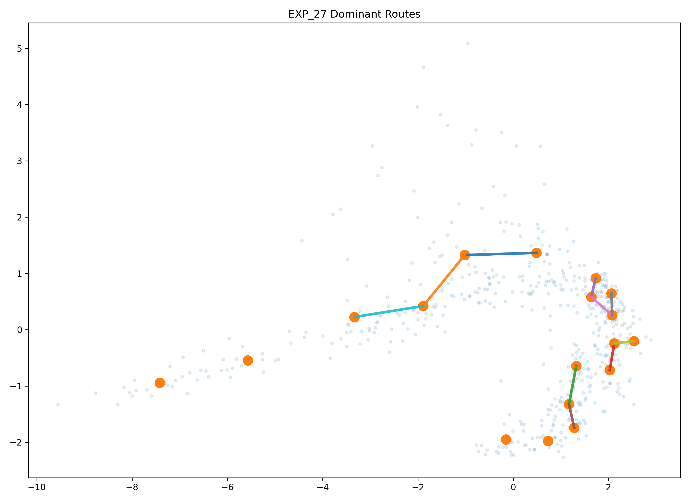

A small subset of roads dominates movement through the atlas and forms a large-scale transport backbone.

---

#### Road Usage Distribution


Traffic is highly concentrated onto a limited number of major routes.

---

#### Transition Directionality

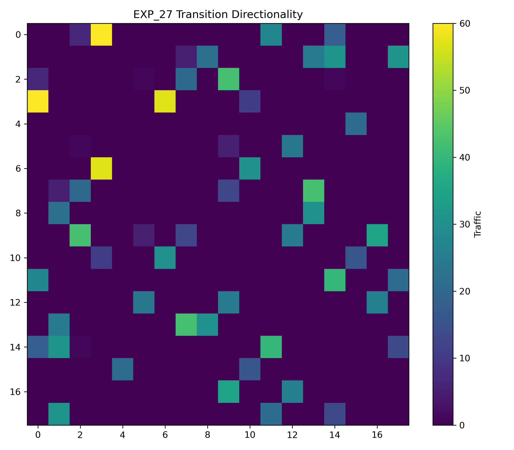

The strongest transitions cluster into distinct directional channels rather than spreading uniformly across the atlas.

---

#### Transition Flow Map

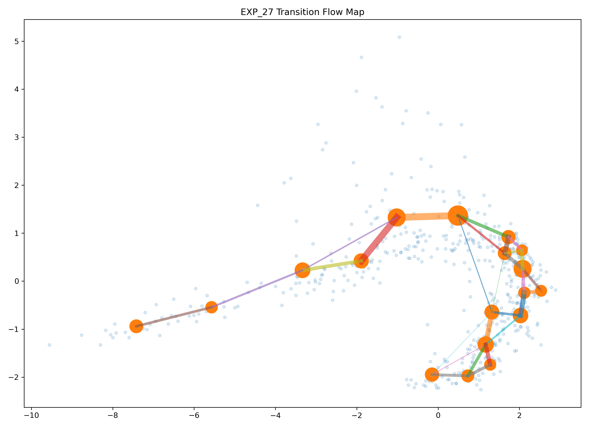

The basin atlas exhibits both long-distance backbone corridors and local loop structures, creating a multi-scale navigation system.

---

### Key Observation

For the first time, the latent field exhibits a complete transport hierarchy:

```text
Territories
     ↓
Roads
     ↓
Navigation
     ↓
Traffic
```

The discovered field is therefore not merely a geometric embedding.

It behaves as a structured transportation network whose routes, bottlenecks and highways emerge directly from the latent geometry.
