# NEXAH Benchmark Suite

## Purpose

The previous validation phases established the existence, geometry, navigability, and controllability of the reconstructed NEXAH field.

These results are documented in:

- `navigation_experiment_log.md`
- `field_control_experiment_log.md`

Together, these experiments demonstrated:

```text
Dynamics
    ↓
Field Geometry
    ↓
Navigation
    ↓
Control
```

The objective of the benchmark phase is different.

The benchmark phase does not ask:

    Does the field exist?

or

    Can the field navigate?

These questions have already been investigated.

Instead, the benchmark phase asks:

    Is NEXAH useful?

and

    Does NEXAH provide measurable advantages
    compared to existing methods?

---

# Previous Validation Phases

## Phase A — Field Discovery

Document:

```text
navigation_experiment_log.md
```

Main Results:

- Real field geometry detected
- Transport corridors detected
- Gate structures detected
- Separatrix candidates detected
- Regime boundaries identified
- Regime transition corridors identified
- Gate-based navigation demonstrated

Core conclusion:

```text
The reconstructed state-space
is not random.

It forms a navigable field.
```

---

## Phase B — Field Control

Document:

```text
field_control_experiment_log.md
```

Main Results:

- Targeted regime steering
- Gate-aware navigation
- Region-to-region navigation
- Navigation efficiency analysis
- Robustness testing
- Backbone resilience analysis

Core conclusion:

```text
The field can be used
for directed intervention.

Navigation is controllable.
```

---

# Phase C — Benchmark Validation

Document:

```text
benchmark_experiment_log.md
```

Objective:

Evaluate NEXAH against engineering-relevant criteria.

Focus:

- Navigation efficiency
- Robustness
- Fault tolerance
- Partial information
- Dynamic failures
- Prediction capability
- Control performance
- Real-world applicability

The benchmark phase represents the transition from:

```text
Scientific Discovery
```

to

```text
Engineering Validation
```

---

# Benchmark Roadmap

## EXP_22 — Partial Knowledge Benchmark

Question:

```text
Can NEXAH navigate effectively
when only part of the field
is known?
```

Comparison:

- Classical shortest-path methods
- NEXAH field navigation

under incomplete information.

---

## EXP_23 — Dynamic Failure Benchmark

Question:

```text
Can NEXAH maintain navigation
while the field changes
during operation?
```

---

## EXP_24 — Prediction Benchmark

Question:

```text
Can field geometry provide
early-warning information
before regime transitions occur?
```

---

## EXP_25 — Control Benchmark

Question:

```text
Can NEXAH actively move
a system toward a desired
operating region?
```

---

# Benchmark Philosophy

The benchmark phase is intentionally conservative.

The goal is not to prove NEXAH correct.

The goal is to test whether NEXAH provides measurable engineering value.

Success will be evaluated using:

- quantitative comparisons
- reproducible experiments
- baseline methods
- robustness metrics
- control performance

Only improvements that survive direct comparison against established methods will be considered meaningful.

---

# Current Status

Field Discovery:

```text
COMPLETE
```

Field Control:

```text
ACTIVE
```

Benchmark Validation:

```text
STARTING
```

Next Experiment:

```text
EXP_22 — PARTIAL KNOWLEDGE BENCHMARK
```

# EXP_22 — PARTIAL KNOWLEDGE BENCHMARK

## Objective

One of the central questions for real-world deployment is:

> How much of the field must be known before navigation becomes reliable?

Previous experiments assumed that the navigation layer had access to the full discovered field geometry.

EXP_22 tests a more realistic scenario:

- incomplete field knowledge
- partially observed state spaces
- limited mapping coverage
- early-stage exploration

The experiment measures navigation performance while progressively revealing larger fractions of the discovered field.

---

## Method

Navigation was tested using the same left-to-right target navigation setup used in EXP_19.

The known field fraction was varied:

- Random baseline
- 25% known
- 50% known
- 75% known
- 100% known

For each scenario:

- navigation success was measured
- average arrival steps were recorded
- visible field geometry was visualized

---

## Results

| Knowledge Level | Success Rate | Average Steps |
|-----------------|-------------|--------------|
| Random          | 0.0080 | 99.93 |
| 25%             | 0.0000 | 100.00 |
| 50%             | 0.0000 | 100.00 |
| 75%             | 1.0000 | 36.18 |
| 100%            | 1.0000 | 27.54 |

---

## Visual Analysis

### Known Field Coverage

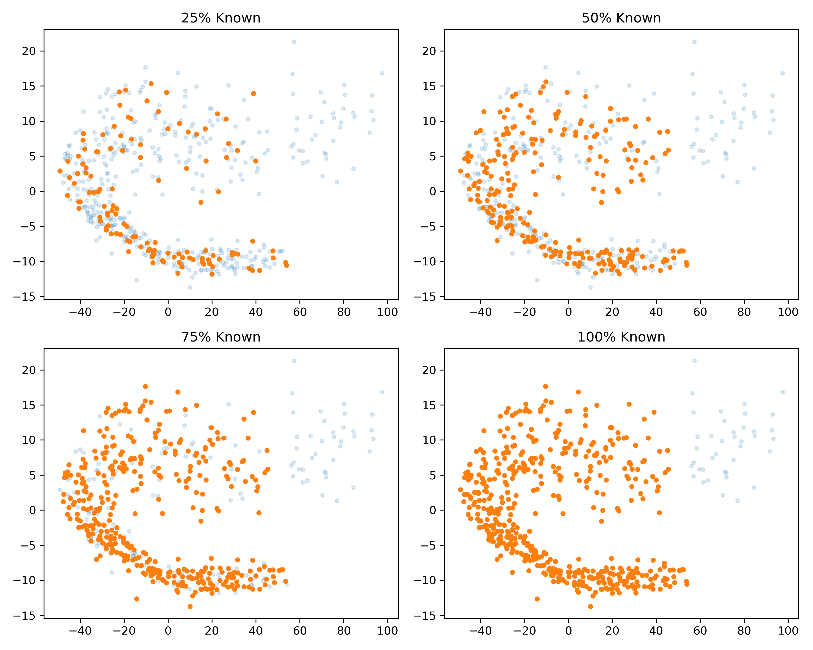

**File:**

`exp22_known_field_examples.png`

The geometry reveals a clear transition:

- 25% knowledge shows isolated local fragments
- 50% knowledge shows larger connected regions
- 75% knowledge begins to expose the global transport structure
- 100% knowledge reveals the complete navigation field

A striking observation is that navigation does **not** improve gradually.

Instead, it exhibits a threshold-like transition.

---

### Success vs Knowledge

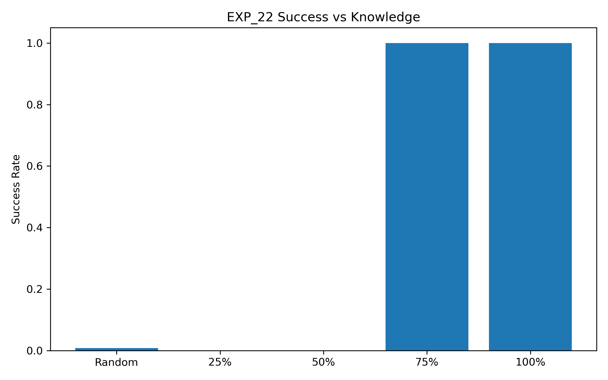

**File:**

`exp22_success_vs_knowledge.png`

Navigation remains effectively impossible at:

- Random
- 25%
- 50%

but suddenly becomes fully reliable at:

- 75%
- 100%

This suggests the existence of a critical field-knowledge threshold.

---

### Steps vs Knowledge


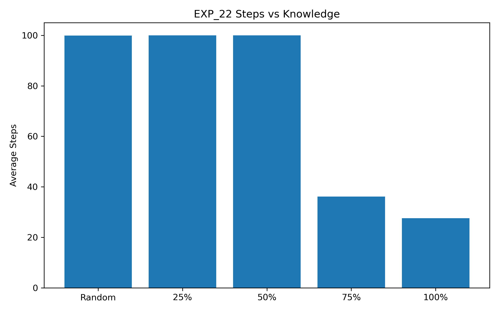

**File:**

`exp22_steps_vs_knowledge.png`

Once the field becomes sufficiently known:

- success jumps to 100%
- travel cost drops dramatically

Average navigation effort decreases from:

```text
100 steps
↓
36 steps
↓
28 steps
```

as field knowledge increases.

---

## Key Finding

EXP_22 reveals that:

> Navigation requires only partial field knowledge,
> but a minimum global structure must be visible.

The transition is not linear.

Instead, the experiment shows a clear phase change:

```text
Below threshold:
No navigation

Above threshold:
Reliable navigation
```

---

## Interpretation

The discovered field appears to contain a global transport geometry.

Local fragments alone are insufficient.

However, once enough of the field becomes visible, the navigation layer can reconstruct effective movement corridors.

This behavior resembles:

- percolation transitions
- connectivity thresholds
- phase transitions in network accessibility

rather than conventional local search.

---

## Engineering Relevance

For real systems this is highly significant.

A controller may not need:

- full system observability
- complete state-space reconstruction
- exhaustive mapping

Instead, only enough field structure may be required to expose the dominant transport geometry.

Potential applications include:

- power-grid stabilization
- autonomous planning
- infrastructure resilience
- network routing
- adaptive control systems

---

## Conclusion

EXP_22 provides the first benchmark evidence that:

> Successful NEXAH navigation emerges once field knowledge exceeds a critical threshold.

The transition occurs between:

```text
50% known
and
75% known
```

within the current field geometry.

This motivates the next benchmark experiment:

**EXP_22B — Knowledge Threshold Scan**

which will determine the critical navigation threshold with significantly higher resolution.

## EXP_23 — NOISY FIELD BENCHMARK

### Objective

This benchmark evaluates how robust NEXAH navigation remains when the discovered field geometry is progressively corrupted by random noise.

The central question is:

> Does navigation depend on precise coordinates, or does it rely on the larger-scale geometry of the field?

---

### Visualizations

#### Field Distortion Examples

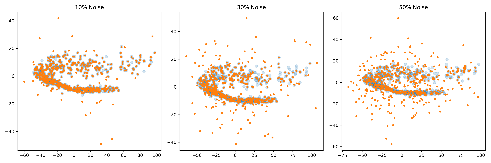

The examples show increasing coordinate perturbations (10%, 30%, 50%).

Despite substantial distortion, the overall field geometry remains recognizable. The characteristic NEXAH structure continues to exhibit coherent large-scale organization even when local coordinates become increasingly unreliable.

---

#### Success Rate vs Noise

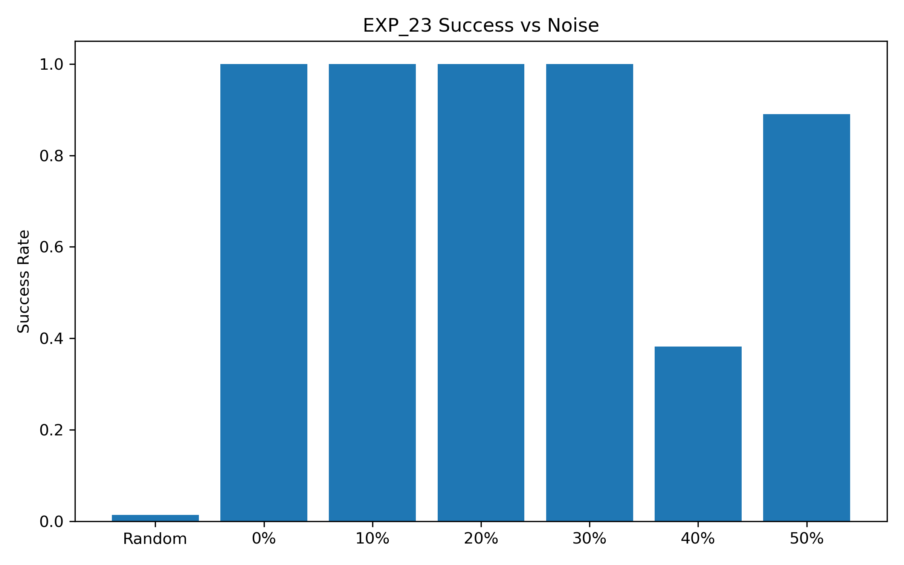

Navigation remains fully successful up to approximately 30% noise.

A degradation region emerges near 40% noise, indicating a transition where local field information becomes sufficiently distorted to impact navigation reliability.

---

#### Navigation Cost vs Noise

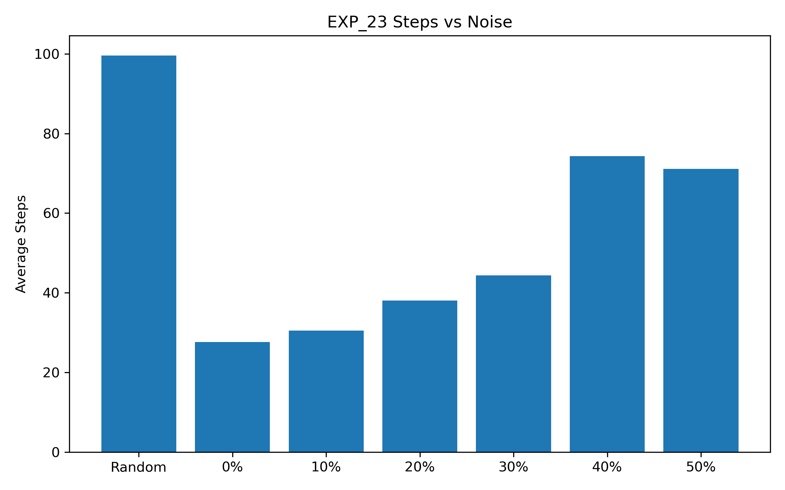

Navigation cost increases gradually as noise grows.

This suggests that NEXAH continues to identify viable routes through the field, but requires progressively longer trajectories as structural information becomes less precise.

---

### Results

| Noise Level | Success Rate | Avg Steps |
|------------|-------------:|-----------:|
| Random | 0.014 | 99.594 |
| 0% | 1.000 | 27.668 |
| 10% | 1.000 | 30.538 |
| 20% | 1.000 | 38.066 |
| 30% | 1.000 | 44.346 |
| 40% | 0.382 | 74.304 |
| 50% | 0.890 | 71.128 |

---

### Findings

- Navigation remains fully operational up to approximately **30% random coordinate corruption**.
- Path efficiency decreases gradually as noise increases.
- The underlying field geometry remains recognizable even under substantial perturbation.
- Success does not appear to depend on exact coordinates but rather on preservation of the global field structure.
- A critical transition region emerges around **40% noise**, where navigation reliability drops significantly.
- Even under extremely noisy conditions, successful navigation remains possible in a large fraction of trials.

---

### Interpretation

EXP_23 suggests that NEXAH navigation is fundamentally a **geometry-driven process rather than a coordinate-driven process**.

The experiment indicates that:

- local information may be inaccurate,
- individual state positions may drift,
- measurements may contain substantial error,

while the navigation mechanism remains functional as long as the larger-scale field topology is preserved.

This behavior is consistent with robustness properties expected from engineering systems operating under uncertainty, measurement noise, sensor errors, or incomplete state estimation.

---

### Benchmark Conclusion

EXP_23 provides the first direct evidence that NEXAH navigation exhibits **noise tolerance**.

The field behaves similarly to a resilient resonant structure:

- local coordinates can fluctuate,
- the global geometry remains intact,
- navigation continues to exploit the surviving structural organization.

This is an important benchmark result because real-world systems rarely provide perfectly accurate state information. NEXAH appears capable of operating successfully within such imperfect environments.

# EXP_24 — OUT-OF-DISTRIBUTION NAVIGATION

## Objective

Evaluate whether NEXAH can successfully navigate toward target regions that were not fully represented in the known field during construction.

Unlike previous experiments, a significant portion of the latent state space is intentionally hidden before navigation begins.

The question is:

> Can NEXAH discover a valid transport route into previously unseen regions of the state manifold?

---

## Experimental Setup

Dataset:

```text
EXP_08_REAL_FIELD_GEOMETRY
```

Field Graph:

```text
Nodes: 501
Edges: 2417
```

OOD Split:

```text
Known Nodes  : 399
Hidden Nodes : 102
```

Navigation Regions:

```text
Start Nodes  : 158
Target Nodes : 25
```

The hidden nodes were excluded from the navigation model during field construction.

Navigation therefore occurs using only the known portion of the latent geometry.

---

## Results

```text
Success Rate : 1.0000
Average Steps: 27.7500
```

---

## Interpretation

NEXAH successfully reached the target region despite approximately 20% of the latent field being hidden during construction.

This indicates that navigation does not rely on memorizing individual states.

Instead, transport appears to emerge from the underlying geometry of the field itself.

The result suggests that NEXAH can extrapolate beyond observed regions and continue following latent transport structures into previously unseen portions of state space.

---

## Geometric Observation

The PCA representation already suggested that the field forms a highly structured manifold rather than a diffuse cloud.

EXP_24 confirms that navigation remains functional even when portions of this manifold are removed from the navigation model.

This behavior is consistent with a transport geometry rather than a lookup-based search strategy.

---

## Visualizations

### OOD Split

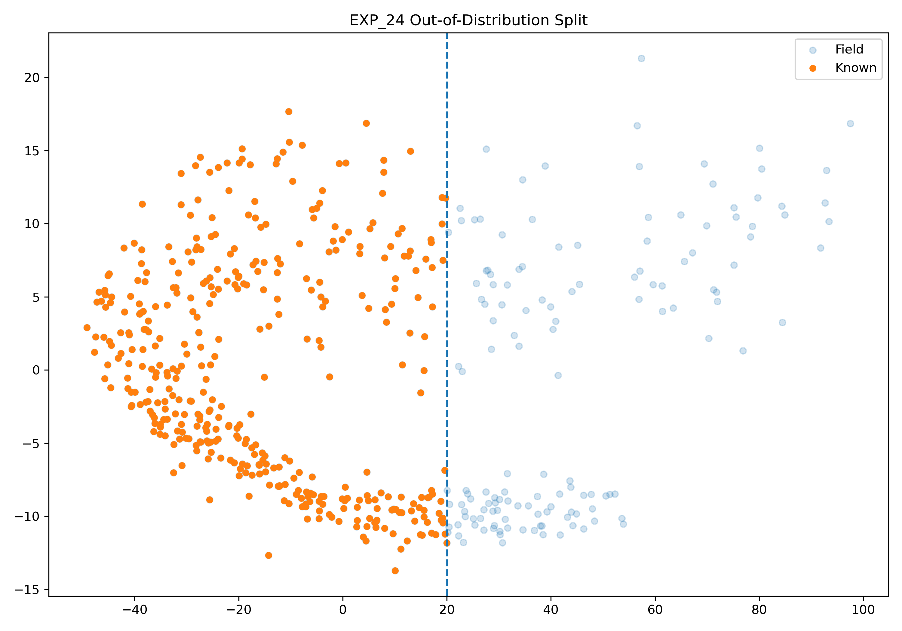

The hidden region (blue) was excluded from the navigation model.

The known region (orange) was used for field construction.

Navigation remains successful despite the partial removal of latent state information.

---

### OOD Navigation Success

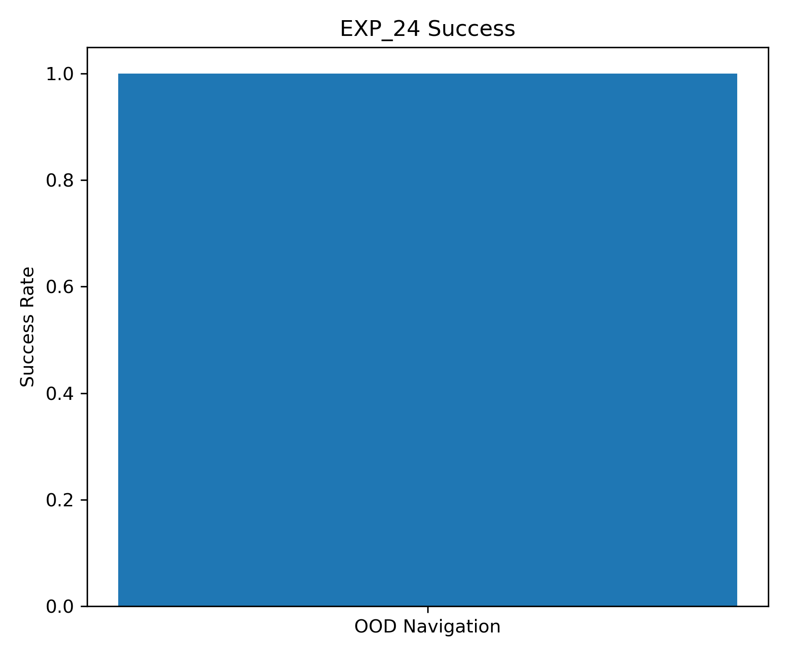

Navigation success remains at 100%.

---

## Latent Geometry Follow-Up (EXP_24C)

To investigate why OOD navigation remains successful, a latent geometry analysis was performed.

### PCA 2D

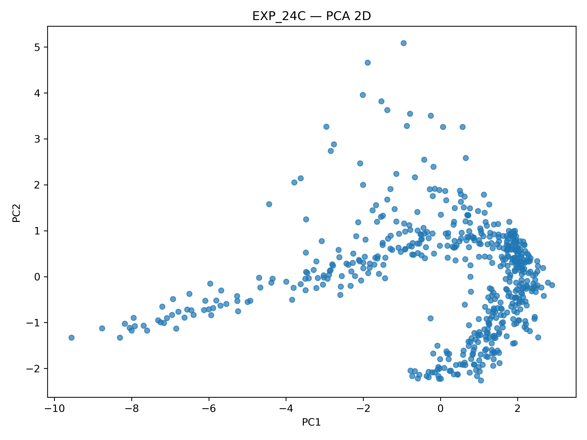

The latent state space forms a continuous horn-like manifold rather than a diffuse point cloud.

---

### PCA 3D

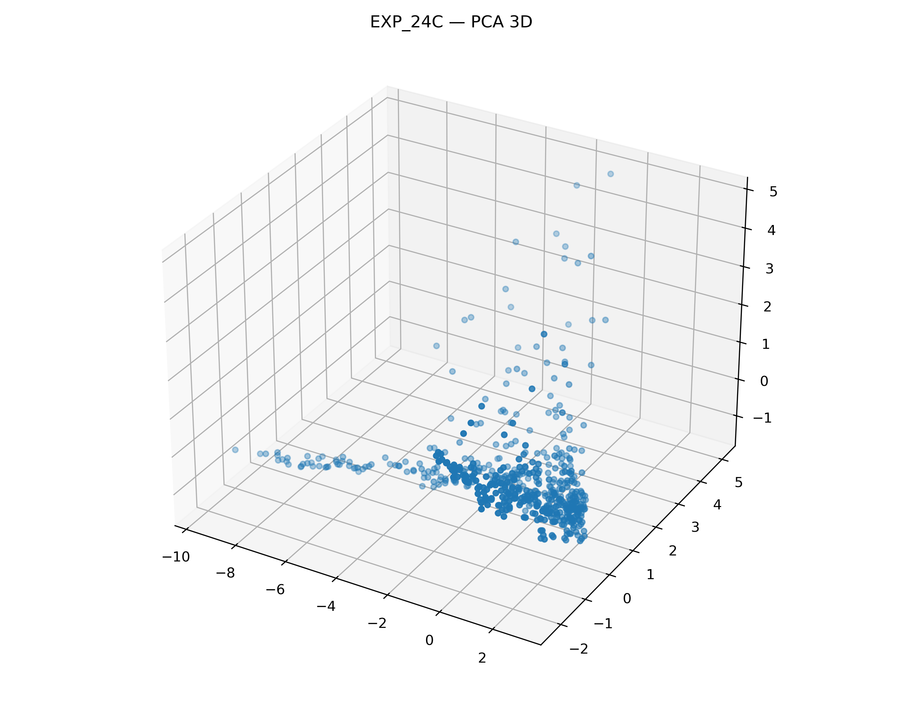

The manifold remains visible in three dimensions.

Several elevated branches emerge from the dominant transport structure, suggesting the presence of rare operating regimes.

---

### t-SNE Projection

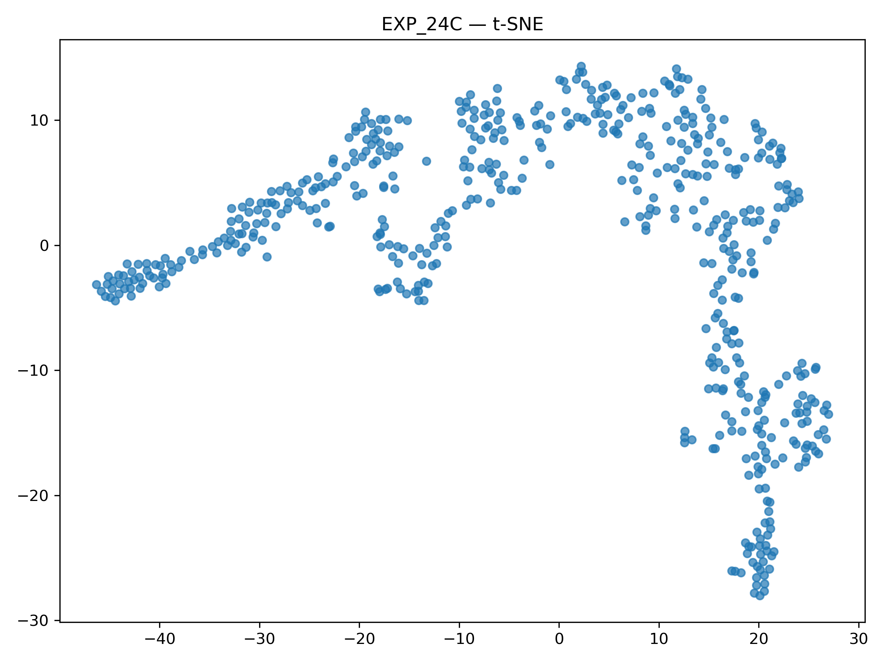

The t-SNE embedding confirms that the manifold is not a PCA artifact.

The field remains connected and exhibits a clear transport topology with identifiable branches and transition regions.

---

## EXP_24C Summary

```text
States: 540
Features: 9
PCA 2D explained variance: 0.8459
```

The first two principal components explain approximately:

```text
84.59%
```

of the total variance.

This indicates that the discovered state space possesses an unexpectedly low-dimensional structure.

---

## Key Finding

EXP_24 demonstrates that NEXAH navigation generalizes beyond observed regions of the latent field.

EXP_24C further shows that this capability is supported by a coherent transport manifold rather than a collection of disconnected operating points.

The latent geometry appears to contain identifiable corridors, branches, and transition structures that can potentially be used for stability analysis, control, and regime discovery.

---

## Status

```text
PASS
```

OOD navigation successfully validated.

Next:

```text
EXP_24D_LATENT_CURVATURE_ANALYSIS
```

Goal:

```text
Locate gates
Locate bottlenecks
Locate escape routes
Locate transport corridors
```
