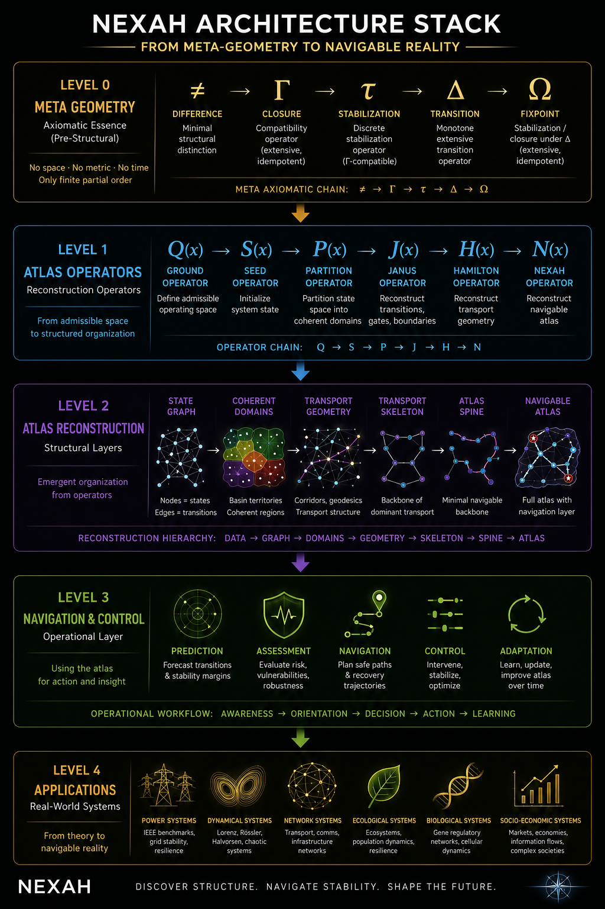

# NEXAH Architecture Stack

## From Meta-Geometry to Navigable Reality

Thomas Hofmann

---

# Purpose

This document summarizes the layered architecture of NEXAH.

It connects:

- Meta-Geometry,
- Atlas Operators,
- Atlas Reconstruction,
- Navigation & Control,
- Applications.

The goal is to clarify how the theoretical, mathematical, experimental and applied layers of NEXAH relate to each other.

---

# Figure 1 — NEXAH Architecture Stack

The figure summarizes the full NEXAH architecture from pre-structural meta-geometry to real-world applications.

The stack connects Meta-Geometry, Atlas Operators, Atlas Reconstruction, Navigation & Control, and IEEE Power-System applications into a single conceptual framework.

---

# Level 0 — Meta-Geometry

Meta-Geometry describes the pre-structural foundation.

It operates before metric space, topology or time are introduced.

Core chain:

≠ → Γ → τ → Δ → Ω

Interpretation:

- ≠ : Difference
- Γ : Closure
- τ : Stabilization
- Δ : Transition
- Ω : Fixpoint / Stabilized closure

This layer provides the axiomatic ground.

---

# Level 1 — Atlas Operators

The Atlas Operator Framework describes how admissible structure becomes reconstructable.

Operator chain:

Q → S → P → J → H → N

Interpretation:

- Q(x) : Ground Operator
- S(x) : Seed Operator
- P(x) : Partition Operator
- J(x) : Janus Operator
- H(x) : Hamilton Transport Operator
- N(x) : Nexah Reconstruction Operator

This layer translates meta-structural assumptions into reconstruction operators.

---

# Level 2 — Atlas Reconstruction

Atlas reconstruction transforms observations into a navigable structure.

Reconstruction hierarchy:

Trajectory Data

↓

State Graph

↓

Coherent Domains

↓

Transport Geometry

↓

Transport Skeleton

↓

Atlas Spine

↓

Navigable Atlas

This layer corresponds directly to the experimental reconstruction pipeline developed throughout EXP_01–EXP_44S.

---

# Level 3 — Navigation and Control

Once the Atlas is reconstructed, it becomes operational.

Core functions:

- transition prediction,
- risk assessment,
- recovery navigation,
- control guidance,
- adaptation and learning.

This layer turns structural reconstruction into actionable system navigation.

---

# Level 4 — Applications

The NEXAH architecture is currently validated most strongly in power-system benchmarks.

Primary application:

- IEEE benchmark power systems.

Potential future domains:

- dynamical systems,
- transportation networks,
- communication networks,
- ecological systems,
- biological systems,
- socio-economic systems.

---

# Architecture Summary

The full stack can be summarized as:

Meta-Geometry

↓

Atlas Operators

↓

Atlas Reconstruction

↓

Navigation & Control

↓

Applications

In compact form:

≠ → Γ → τ → Δ → Ω

↓

Q → S → P → J → H → N

↓

Domains → Gates → Corridors → Skeleton → Spine → Atlas

↓

Prediction → Recovery → Control

↓

Power Systems and Beyond

---

# Relationship to Existing Documents

This document serves as the architectural entry point for the NEXAH framework.

Related documents:

- [Atlas Operator Framework](./atlas_operator_framework.md)
- [Mathematical Foundations](./mathematical_foundations.md)
- [Theoretical Positioning](./theoretical_positioning.md)
- [IEEE Technical Summary](../IEEE_TECHNICAL_SUMMARY.md)

It serves as the architectural bridge between the theoretical foundation and the applied validation pipeline.

---

# Status

Current status:

- Meta-Geometry: conceptually defined
- Atlas Operators: initial framework documented
- Atlas Reconstruction: experimentally validated across EXP_01–EXP_44S
- Navigation & Control: demonstrated conceptually and experimentally
- Applications: strongest evidence currently in IEEE benchmark systems

---

# Conclusion

The NEXAH Architecture Stack provides a compact view of the full framework.

It shows how NEXAH moves from minimal structural assumptions toward reconstructable, navigable and actionable system organization.

The architecture does not claim finality.

It provides a working scaffold for future formalization, validation and application.
