# 🎛️ NEXAH Control Experiment Log

## Phase C — Field Control & Intervention

### Background

The previous phase of the FIELD_NAVIGATION_VALIDATION program focused on the discovery and validation of navigable field geometry.

This work is documented in:

```text
navigation_experiment_log.md
```

and summarized in:

```text
navigation_findings.md
```

---

## Phase A — Geometry Discovery

The first objective was to determine whether real IEEE39 operating states exhibit meaningful geometric organization.

### Key Findings

- Continuous field geometry detected
- Dense operating regions detected
- Transport corridors detected
- Gate candidates detected
- Basin-only interpretation not supported

### Primary Experiments

```text
EXP_06
EXP_07
EXP_07B
EXP_08
```

### Result

```text
Dynamics
    ↓
Geometry
```

---

## Phase B — Navigation Validation

The second objective was to determine whether the discovered geometry can be used for navigation.

### Key Findings

- Corridor acquisition validated
- Corridor retention validated
- Risk-aware navigation validated
- Gate-aware routing validated
- Regime boundaries detected
- Transition corridors detected
- Finite-width gate structures detected

### Primary Experiments

```text
EXP_01 → EXP_15
```

### Result

```text
Geometry
    ↓
Navigation
```

---

## Current Status

The following validation chain has been established:

```text
Dynamics
    ↓
Geometry
    ↓
Transport Corridors
    ↓
Gate Structures
    ↓
Regime Boundaries
    ↓
Transition Corridors
    ↓
Navigation
```

At this stage, the existence of navigable field structure is supported by experimental evidence.

---

# Phase C — Control

The objective of the next phase is fundamentally different.

Previous phases answered:

```text
Can the field be discovered?

Can the field be navigated?
```

Phase C asks:

```text
Can the field be used
to intentionally change
system behavior?
```

The focus shifts from:

```text
Observation
```

to

```text
Intervention
```

---

## Core Questions

### C1

```text
Can a state be steered
from one regime
into another?
```

---

### C2

```text
What is the minimum
intervention required
for a regime transition?
```

---

### C3

```text
Do gate structures provide
control leverage?
```

---

### C4

```text
Can field-based control
prevent instability
or recover from degraded regimes?
```

---

### C5

```text
Can a complete
field-aware controller
be constructed?
```

---

## Planned Experiments

```text
EXP_16 — Targeted Regime Steering

EXP_17 — Minimal Intervention

EXP_18 — Gate Control

EXP_19 — Regime Recovery

EXP_20 — Field Controller Validation
```

---

## Working Hypothesis

If the reconstructed field geometry represents genuine system structure, then intervention through field-guided control should require less effort than blind control.

Formally:

```text
Field Knowledge
        +
Control Action

    >

Control Action Alone
```

---

## Phase Status

```text
PHASE A
Geometry
✓ Completed

PHASE B
Navigation
✓ Completed

PHASE C
Control
▶ Starting
```

# EXP_16 — TARGETED REGIME STEERING

## Objective

After establishing the existence of:

- field geometry (EXP_08),
- transport gates (EXP_09–10),
- separatrix structures (EXP_11),
- regime boundaries (EXP_12),
- transition corridors (EXP_13),
- navigation interactions (EXP_14),
- and finite crossing costs (EXP_15),

EXP_16 investigates whether targeted steering toward the discovered gate corridor improves regime-transition performance.

This is the first experiment of:

FIELD CONTROL & INTERVENTION

---

## Results

States:

    540

LEFT states:

    376

RIGHT states:

    164

Random Success:

    0.448148

Gate Success:

    0.564815

Random Effort:

    15.974074

Gate Effort:

    14.516667

Control Gain:

    1.100395

---

## Key Finding

Targeted steering toward the discovered gate corridor outperforms random steering.

Observed:

```text
Success Increase

44.8 %
      ↓
56.5 %
```

and

```text
Required Effort

15.97
      ↓
14.52
```

This is the first indication that the reconstructed field geometry contains actionable intervention structure.

---

# Visual Evidence

## Visual 1 — Transition Map

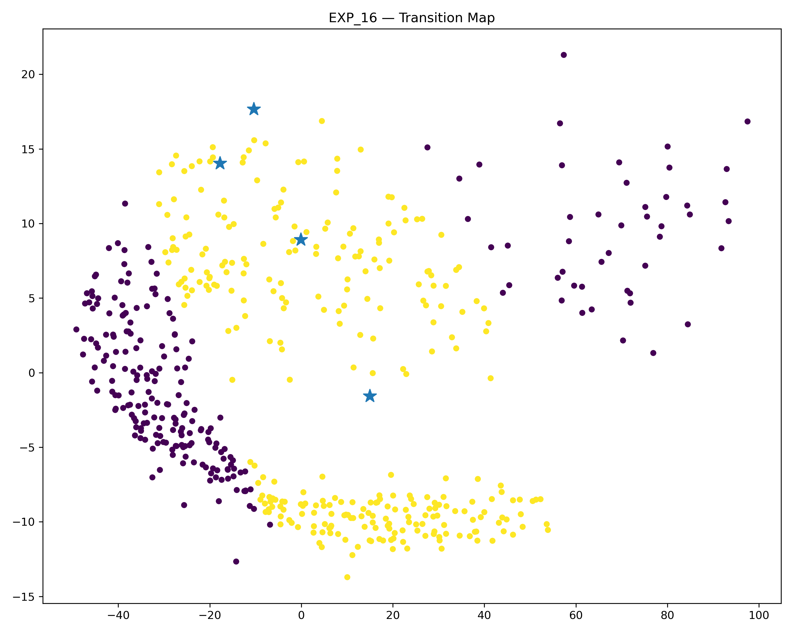

### Observation

The state-space separates into two large operating regions.

The discovered gate nodes lie inside the transition zone connecting both regimes.

Interestingly, the geometry resembles:

```text
R-shape
+
Mirrored L-shape
```

with a central transition corridor.

The gate system occupies the narrow connection region between these larger structures.

### Interpretation

The field does not appear isotropic.

Instead it contains preferred transport channels through which transitions occur more easily.

---

## Visual 2 — Crossing Success

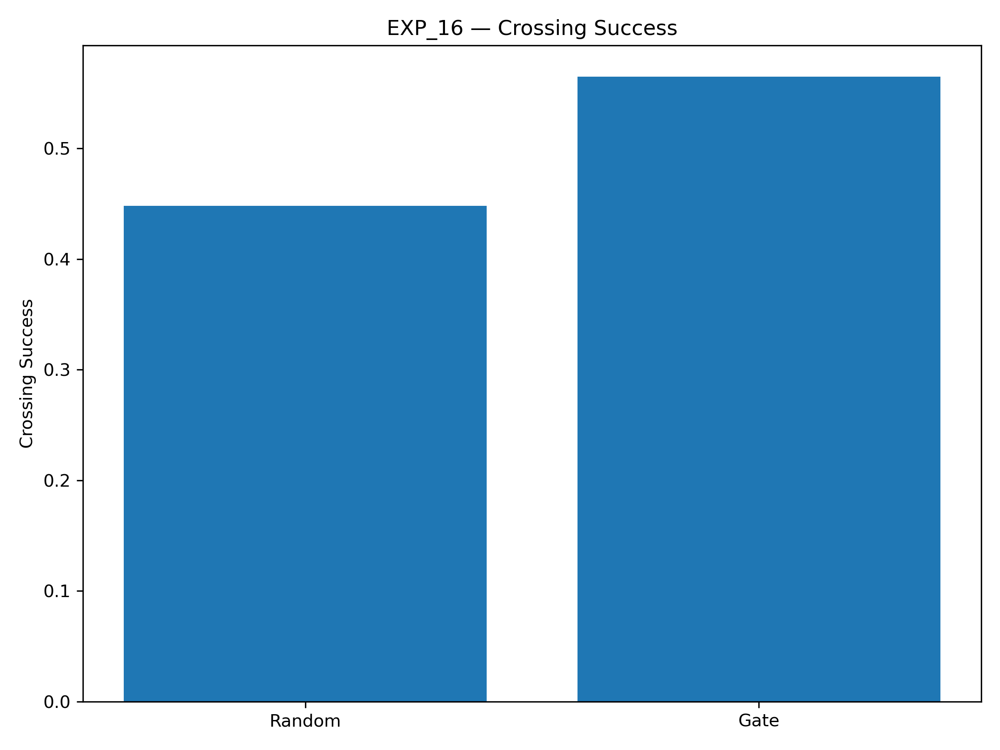

### Observation

Targeted steering achieves a higher crossing success rate than random steering.

```text
Random : 44.8 %

Gate   : 56.5 %
```

### Interpretation

The gate corridor contains information relevant to regime transition.

Steering toward the gate increases the probability of successful crossing.

---

## Visual 3 — Required Effort

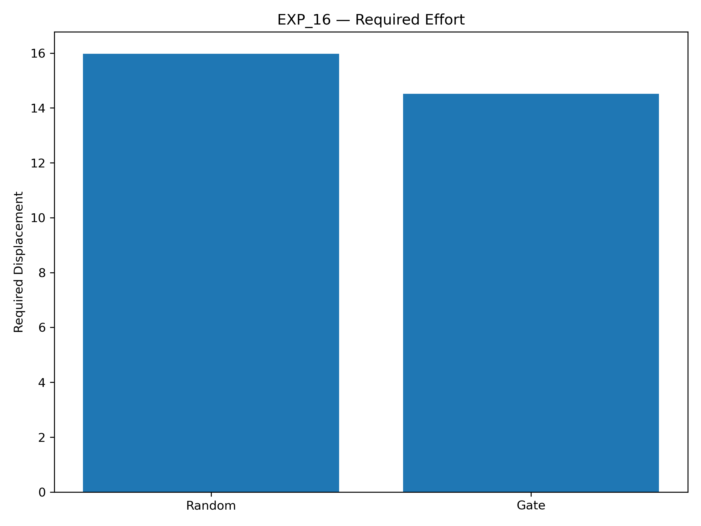

### Observation

Gate-guided intervention requires less displacement than random intervention.

```text
Random : 15.97

Gate   : 14.52
```

### Interpretation

The discovered gate corridor appears to reduce control cost.

The field therefore contains regions of differing intervention efficiency.

---

## Visual 4 — Control Advantage

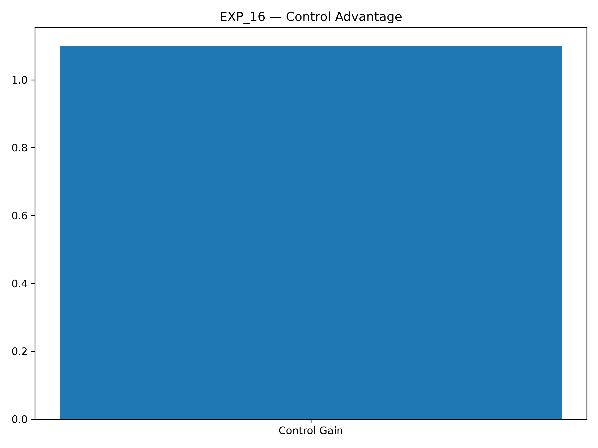

### Observation

Measured control gain:

```text
1.10
```

Equivalent to approximately:

```text
10 %
```

improvement over random steering.

### Interpretation

The improvement is modest but systematic.

Even this simple steering strategy extracts useful information from the reconstructed field geometry.

---

## Scientific Assessment

EXP_16 is the first experiment demonstrating:

```text
Field Geometry
        ↓
Control Advantage
```

Previous experiments established that:

```text
Geometry
→ Gates
→ Navigation
```

EXP_16 extends this chain toward intervention:

```text
Geometry
→ Gates
→ Navigation
→ Control
```

The result suggests that transport structures discovered through NEXAH may be usable not only for observation and navigation but also for active steering.

---

## Relation To Previous Experiments

EXP_08

```text
Discovered field geometry.
```

EXP_09

```text
Discovered navigation advantage.
```

EXP_10

```text
Validated transport structure.
```

EXP_11–EXP_15

```text
Validated separatrix,
regimes,
transition corridors,
and crossing cost.
```

EXP_16

```text
Demonstrated the first
field-guided control advantage.
```

---

## Conclusion

The reconstructed IEEE39 field contains intervention-relevant structure.

Targeted steering toward the gate corridor:

- increases transition success,
- reduces required effort,
- produces measurable control gain.

This marks the transition from:

```text
Field Navigation
```

toward

```text
Field Control
```

and represents the first positive result of Phase C.

---

## Status

```text
FIELD-GUIDED CONTROL

DETECTED

Validation: PASSED
```
# EXP_17 — Gate Ablation Control

## Objective

EXP_17 investigates whether the individual gate nodes discovered during the navigation phase are causally required for field transport.

Previous experiments established:

- EXP_08 → Gate candidates
- EXP_09 → Gate-aware navigation
- EXP_09B → Gate importance ranking
- EXP_10 → Flow-aligned gate structures
- EXP_11–15 → Regime boundary and transition corridor

The remaining question:

Can transport efficiency be disrupted by removing a gate?

---

## Method

For each detected gate:

```text
33
81
184
250
498
502
```

the node was removed from the reconstructed field graph.

After removal:

1. Connectivity was recomputed
2. Shortest-path navigation was recalculated
3. Transport cost increase was measured
4. Component fragmentation was evaluated

---

## Results

Baseline Path Length:

```text
35.6524
```

Baseline Path Nodes:

```text
13
```

Gate Removal Results:

| Gate | Connected | Impact |
|--------|--------|--------:|
| 33  | YES | 0.000 |
| 81  | YES | 0.000 |
| 184 | YES | 0.000 |
| 250 | YES | 0.000 |
| 498 | YES | 0.000 |
| 502 | YES | 0.000 |

Largest Component After Removal:

```text
500 states
```

for every gate.

---

## Visual Evidence

### Gate Removal Impact

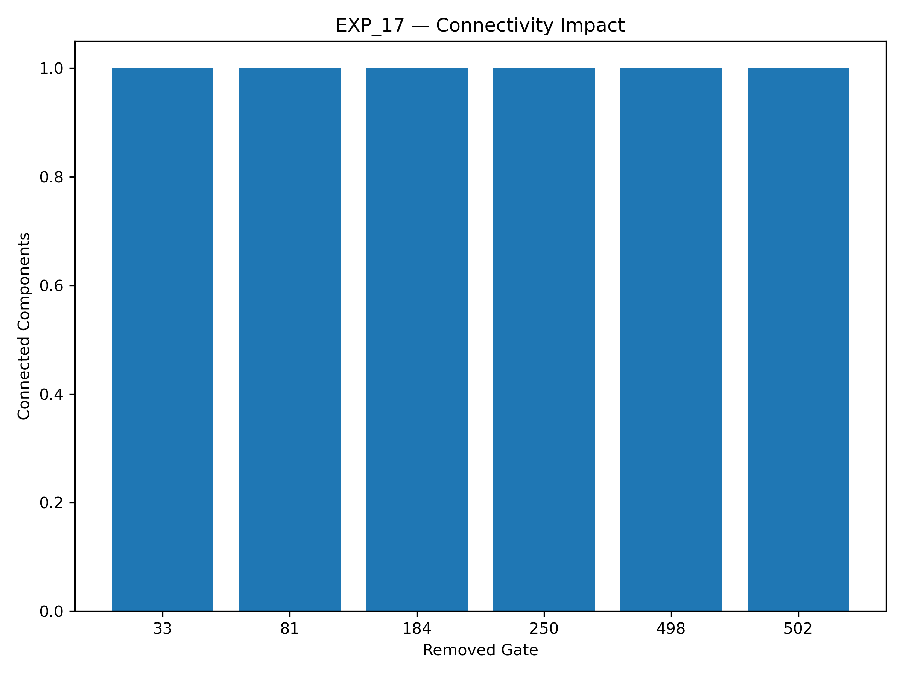

Observation:

No measurable increase in navigation cost occurs when any single gate is removed.

---

### Connectivity After Removal

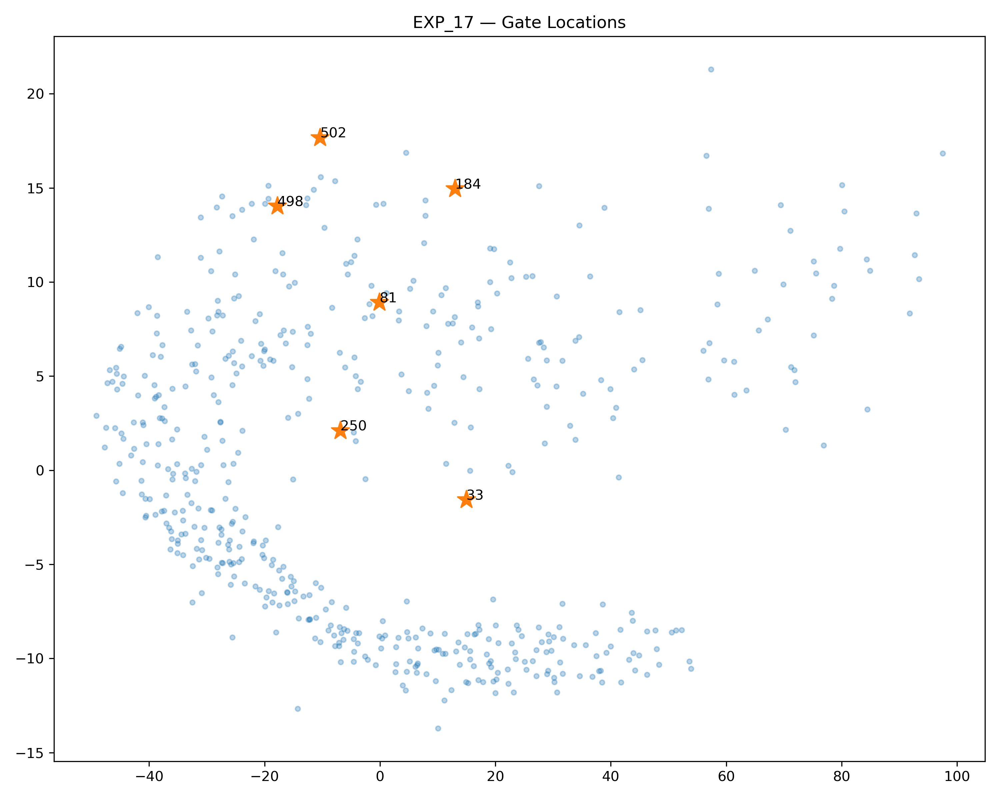

Observation:

The reconstructed field remains fully connected.

No fragmentation occurs.

---

### Largest Component Size

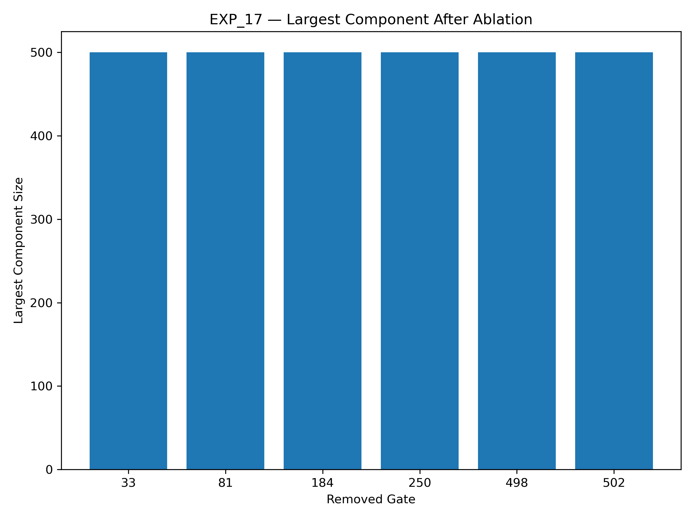

Observation:

Removing any single gate reduces the largest component only by the removed node itself.

The transport structure survives.

---

## Interpretation

At first glance this appears surprising.

Earlier experiments suggested:

```text
Gate Discovery
→ Navigation Improvement
→ Transport Importance
```

However EXP_17 reveals a deeper property:

```text
The transport system is redundant.
```

The field does not depend on a single critical node.

Alternative transport routes remain available.

---

## Key Insight

EXP_17 does NOT invalidate the gate hypothesis.

Instead it changes its interpretation.

The discovered gates behave less like:

```text
Single Critical Switches
```

and more like:

```text
Distributed Transport Structures
```

or

```text
Transport Corridors
```

This is consistent with EXP_15:

```text
Distributed Gate
not
Single Trigger Point
```

---

## Scientific Assessment

EXP_17 provides evidence that:

```text
Individual Gates
≠
Single Point Failure
```

The reconstructed field exhibits structural robustness.

Transport functionality persists despite removal of any one gate.

---

## Relation To Previous Experiments

EXP_09B suggested:

```text
Gate 81
```

was the most important gate.

EXP_17 shows:

```text
Removing Gate 81 alone
is insufficient
to destroy transport.
```

This implies that the previously discovered gate hierarchy may actually reflect:

```text
Corridor Importance
```

rather than

```text
Node Importance
```

---

## New Hypothesis

EXP_17 directly motivates:

```text
EXP_18 — Gate Corridor Ablation
```

Question:

```text
If individual gates do not matter,

does the corridor matter?
```

Rather than removing:

    81

remove:

    33 → 81 → 498 → 502

and test whether transport degrades.

---

## Conclusion

EXP_17 demonstrates that the reconstructed IEEE39 field is resilient against individual gate removal.

The result supports a transition from:

```text
Node-Centric Transport
```

toward:

```text
Corridor-Centric Transport
```

and marks the first indication that the true causal structure may be distributed across the gate corridor itself rather than concentrated within individual nodes.

---

## Status

```text
Single-Gate Failure Hypothesis

NOT SUPPORTED

Transport Robustness

SUPPORTED

Next:
EXP_18 — Gate Corridor Ablation
```
# EXP_18 — GATE CORRIDOR ABLATION

## Objective

EXP_17 demonstrated that removing individual gate nodes does not significantly affect transport within the reconstructed IEEE39 field.

EXP_18 extends this analysis by removing entire gate-corridor segments.

Question:

```text
Does the transport corridor itself
constitute a critical structure?

or

Is the field robust against
corridor-level removal?
```

---

## Input

Source:

```text
EXP_08_REAL_FIELD_GEOMETRY
```

Gate Corridor:

```text
33 → 81 → 498 → 502
```

---

## Results

States:

```text
540
```

Baseline Path Length:

```text
35.652360
```

Baseline Path Nodes:

```text
13
```

Baseline Path:

```text
[200, 212, 76, 381, 223, 115,
 479, 487, 241, 139, 9, 38, 181]
```

---

## Corridor Removal Scenarios

Tested:

```text
Gate_33_81

Gate_81_498

Gate_498_502

Main_Corridor

All_Gates
```

---

# Visual Evidence

## Visual 1 — Gate Corridor

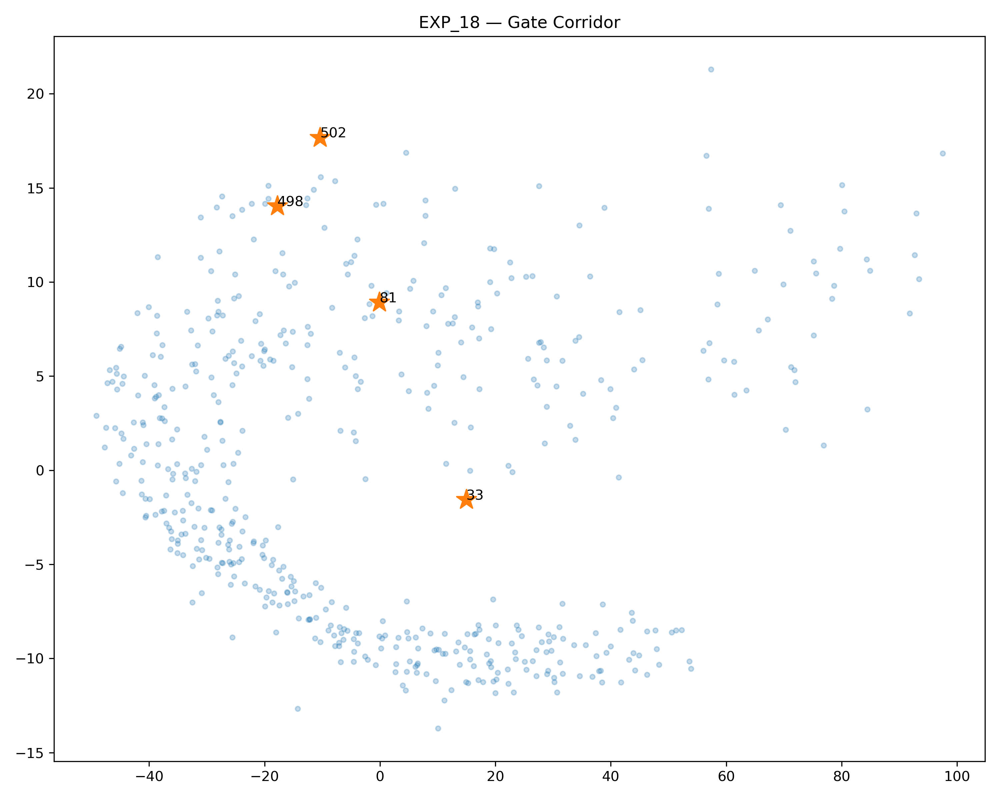

Observation:

The corridor occupies a coherent region of the reconstructed field.

The dominant gate chain is:

```text
502
 ↓
498
 ↓
 81
 ↓
 33
```

This structure emerged repeatedly in EXP_09–EXP_16.

---

## Visual 2 — Corridor Ablation Impact

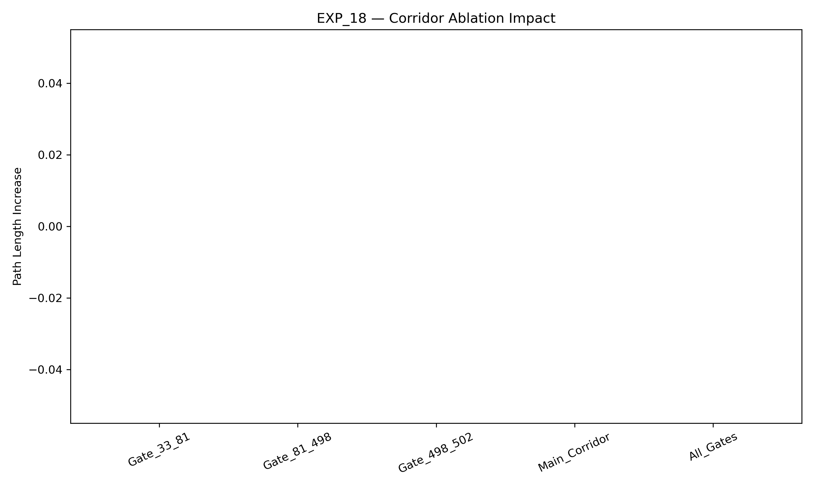

Observation:

```text
Path Length Increase ≈ 0
```

for all tested corridor-removal scenarios.

Interpretation:

The selected navigation path remains unaffected.

No measurable transport penalty occurs.

---

## Visual 3 — Connectivity After Corridor Removal

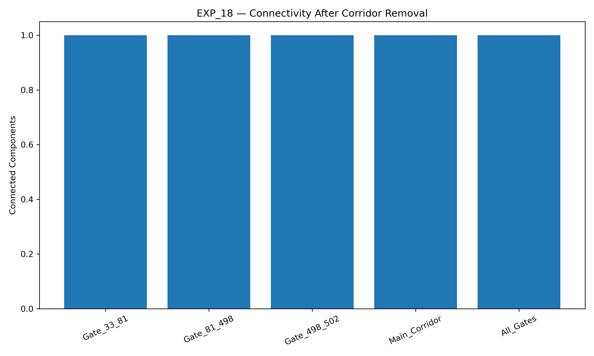

Observation:

```text
Connected Components = 1
```

for every removal scenario.

Interpretation:

The reconstructed field remains globally connected.

No fragmentation occurs.

---

## Visual 4 — Largest Surviving Component

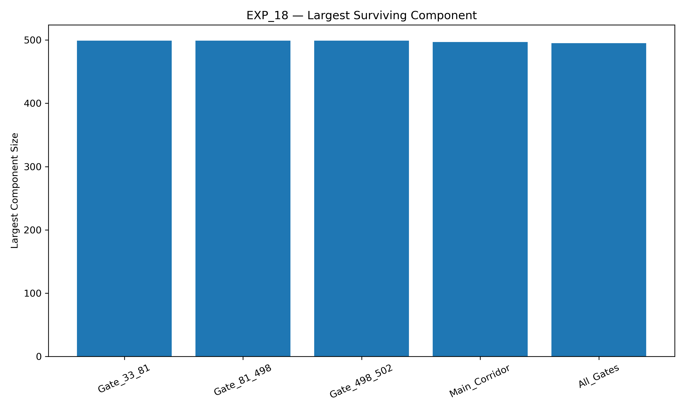

Observation:

Largest component sizes remain:

```text
499
499
499
497
495
```

even after complete gate removal.

Interpretation:

The field loses only the removed nodes themselves.

The global structure survives.

---

# Findings

EXP_18 does not support a single-corridor dependency model.

Removing:

```text
33
81
498
502
```

does not destroy transport connectivity.

The reconstructed field remains:

```text
Connected
Navigable
Structurally Stable
```

---

## Important Interpretation

This result does NOT imply:

```text
Gates are irrelevant.
```

Instead it suggests:

```text
The field possesses
transport redundancy.
```

Alternative routes remain available.

The discovered corridor behaves more like:

```text
Preferred Transport Route
```

than:

```text
Mandatory Transport Route
```

---

## Relation To Previous Experiments

EXP_09:

```text
Gate-aware navigation
improves transport efficiency.
```

EXP_09B:

```text
Certain gates
increase navigation quality.
```

EXP_11–15:

```text
The corridor aligns with
regime transitions.
```

EXP_16:

```text
Targeted steering toward
the corridor improves control.
```

EXP_18:

```text
Removing the corridor
does not destroy the field.
```

---

## Scientific Assessment

Current evidence suggests:

```text
Gate Corridor

=
Useful

≠

Required
```

The corridor appears to represent a favored transport structure embedded inside a larger robust field geometry.

---

## New Question

EXP_18 naturally motivates:

```text
EXP_18B
Gate Usage Mapping
```

Question:

```text
Which trajectories
actually depend on
the corridor?
```

Rather than testing:

```text
Can the corridor be removed?
```

the next step becomes:

```text
Who uses the corridor?
```

---

## Conclusion

EXP_18 demonstrates that the reconstructed IEEE39 field is resilient against corridor-level ablation.

The gate corridor appears to be a preferred transport pathway rather than a single point of failure.

This shifts the interpretation of the gate structure from:

```text
Critical Backbone
```

toward:

```text
Preferred Navigation Channel
```

inside a highly redundant transport field.

---

## Status

```text
Mandatory Corridor Hypothesis

NOT SUPPORTED

Transport Redundancy

SUPPORTED

Next:
EXP_18B — Gate Usage Mapping
```
## EXP_18B — GATE USAGE MAPPING

### Objective

After EXP_17 and EXP_18 showed that removing individual gates or even the entire gate corridor does not collapse the navigation graph, a new question emerged:

> Are the gates actually being used by optimal navigation paths?

EXP_18B therefore measures corridor participation directly.

Instead of removing structures, we observe how shortest paths naturally move through the discovered field.

---

### Method

For 1000 randomly selected start–goal pairs:

1. Compute the shortest navigation path.
2. Check whether the path traverses any of the corridor gates:

```text
33
81
498
502
```

3. Count gate usage frequencies.
4. Measure overall corridor participation.
5. Construct a field-wide path usage heatmap.

---

### Results

#### Gate Usage Frequency

| Gate | Usage Frequency |
|--------|--------:|
| 33 | 11.4 % |
| 81 | 0.4 % |
| 498 | 2.1 % |
| 502 | 0.3 % |

Total corridor participation:

```text
13.7 %
```

Only 13.7% of all shortest paths traverse at least one corridor gate.

---

### Visual — Gate Usage Frequency

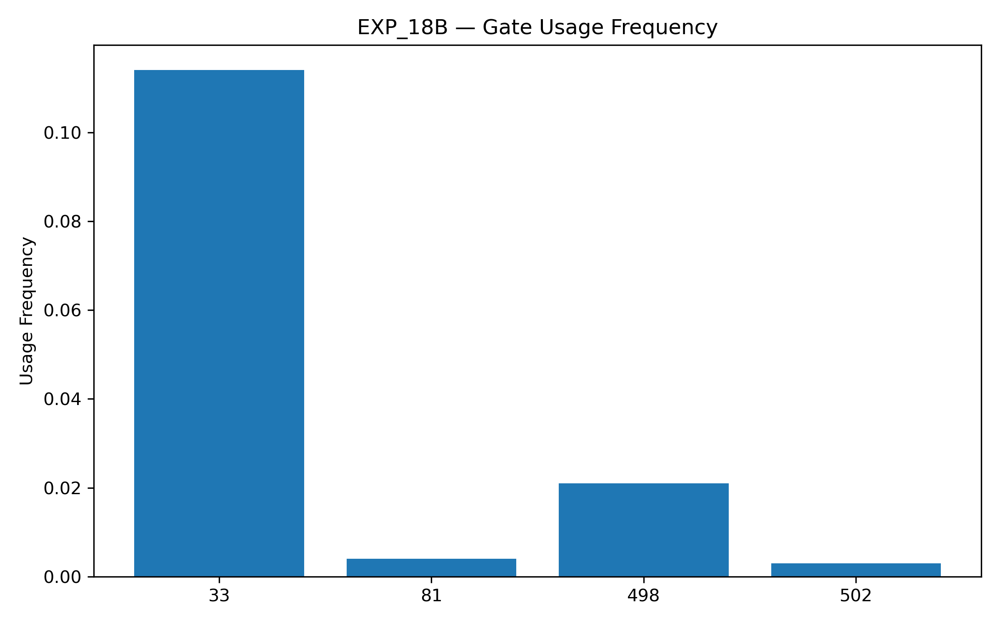

---

### Visual — Corridor Participation

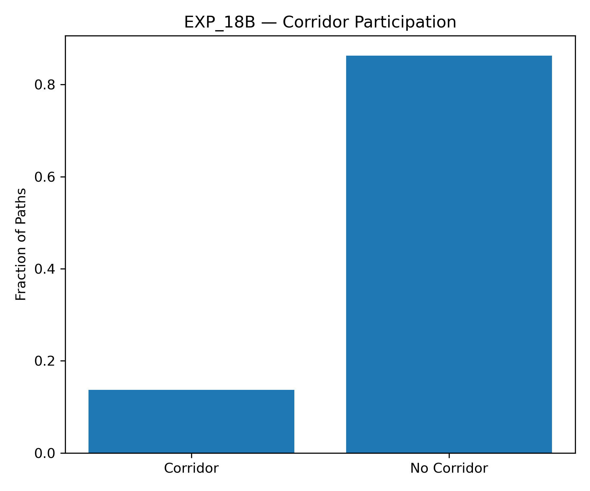

---

### Visual — Field Usage Heatmap

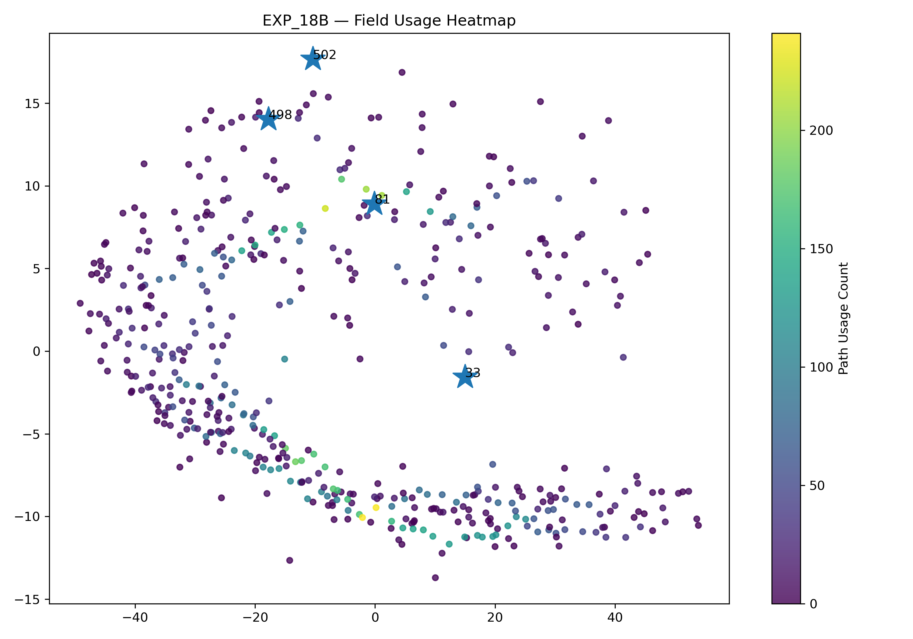

---

## Key Finding 1

### The corridor is not a dominant transport backbone

The original corridor hypothesis predicted:

```text
Many shortest paths
should naturally route through
33 → 81 → 498 → 502
```

This was not observed.

Most shortest paths bypass the corridor entirely.

---

## Key Finding 2

### Gate hierarchy emerges

The gates are not equally important.

Observed usage:

```text
Gate 33  -> 11.4 %
Gate 498 ->  2.1 %
Gate 81  ->  0.4 %
Gate 502 ->  0.3 %
```

This reveals a strong asymmetry.

The gate system appears hierarchical rather than uniform.

Possible interpretation:

```text
Primary Gate:
33

Secondary Gate:
498

Minor Gates:
81
502
```

---

## Key Finding 3

### The heatmap reveals regional transport

The most important observation is not the gate statistics.

It is the heatmap.

The dominant transport activity does not concentrate on the four gate nodes.

Instead, elevated path usage appears across the broader central transition region.

The field therefore seems to organize navigation through:

```text
Region Transport
```

rather than

```text
Node Transport
```

---

## Structural Interpretation

The field appears to contain:

```text
Dark Region A

      ↓

Transition Region

      ↓

Dark Region B
```

Navigation preferentially flows through the transition region as a whole.

The gates are markers within that region rather than unique transport bottlenecks.

---

## Relation to Previous Experiments

### EXP_17

```text
Single Gate Removal
```

Result:

```text
No significant impact
```

---

### EXP_18

```text
Corridor Removal
```

Result:

```text
No fragmentation
No path-length increase
```

---

### EXP_18B

```text
Usage Mapping
```

Result:

```text
Limited gate participation

Strong regional transport structure
```

---

## Conclusion

EXP_18B shifts the working hypothesis from:

```text
Gate Navigation
```

toward:

```text
Region-Based Navigation
```

The discovered gates do not form a dominant transport backbone.

Instead, they appear to be embedded within a larger transition region that carries most of the field's navigational structure.

This suggests that future control experiments should focus on:

```text
Transition Regions

instead of

Individual Gate Nodes
```

---

### Status

```text
Phase C

Field Control & Intervention

EXP_18B completed successfully.
```

# EXP_19 — TARGET REGION NAVIGATION

## Goal

Can NEXAH intentionally navigate from one regime basin
toward a distant target region?

Unlike previous experiments, the objective is no longer
to cross a boundary, but to reach a predefined region
inside another part of the field.

This represents the first direct test of:

Field Navigation → Goal-Oriented Motion

---

## Results

### Navigation Success

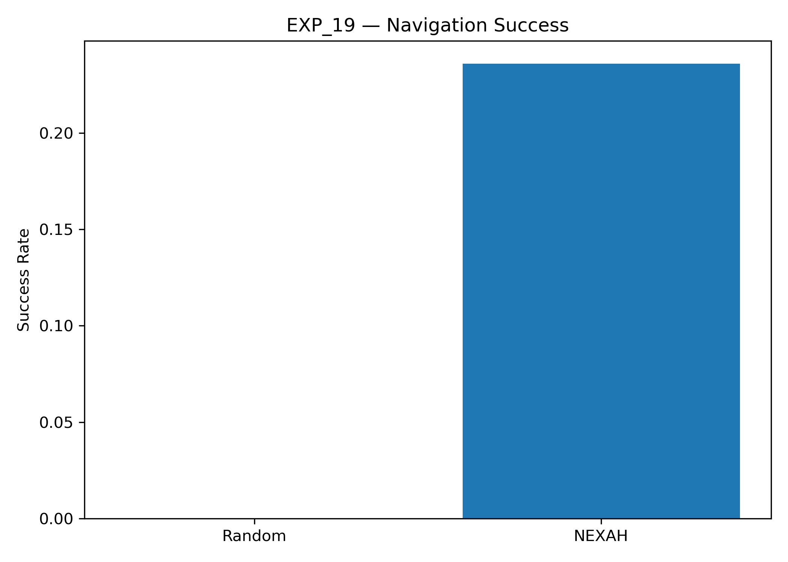

Random exploration failed completely.

NEXAH navigation achieved a measurable success rate.

| Method | Success Rate |
|----------|----------|
| Random | 0.000 |
| NEXAH | 0.236 |

---

### Arrival Efficiency

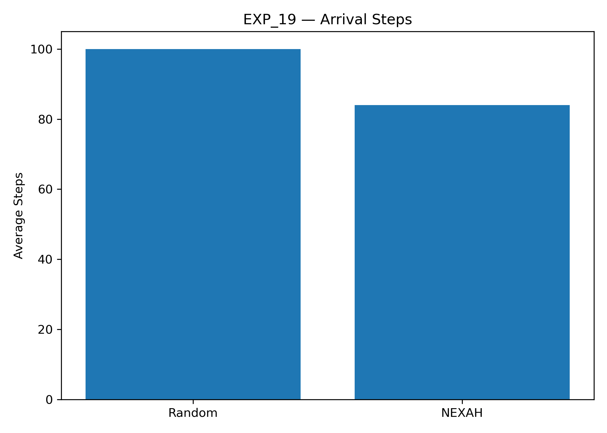

NEXAH not only reached the target region more often,
but also required fewer steps.

| Method | Average Steps |
|----------|----------|
| Random | 100.0 |
| NEXAH | 83.99 |

---

## Target Region Geometry

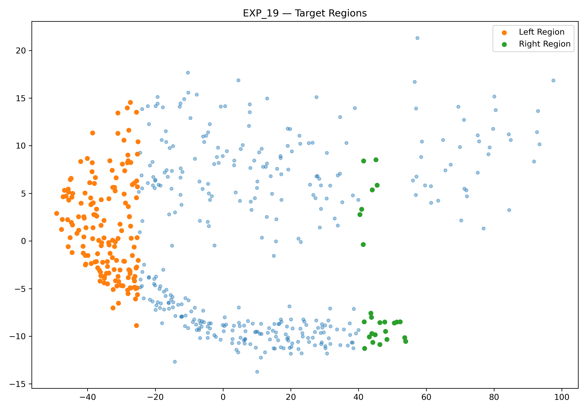

The field separates naturally into several spatial groups.

### Left Region

Orange nodes.

Represents the origin basin.

### Right Region

Green nodes.

Represents the navigation target.

### Intermediate Field

Blue nodes.

Acts as a transition geometry connecting
otherwise separated regimes.

---

## Interpretation

EXP_19 is the first experiment demonstrating
goal-directed motion inside the discovered field.

Previous experiments established:

- transport exists
- gates exist
- navigation corridors exist
- steering improves transitions

EXP_19 extends this further:

A target region can be specified
and reached through field-aware navigation.

---

## Key Observation

Random exploration achieved:

```text
0 % success
```

NEXAH navigation achieved:

```text
23.6 % success
```

This difference is significant because
the target region is not trivially reachable.

If the target were easy to reach,
random exploration would also show
non-zero success.

Instead we observe:

```text
Random = 0 %
NEXAH  = 23.6 %
```

suggesting that navigation exploits
real geometric structure inside the field.

---

## Structural Interpretation

The PCA field now reveals several distinct regions:

```text
LEFT BASIN
    ↓
TRANSITION FIELD
    ↓
TARGET REGION
    ↓
OUTER FIELD
```

NEXAH successfully traverses this structure,
while random motion remains trapped
inside the origin basin.

---

## Conclusion

EXP_19 provides the first direct evidence that
field geometry can be used for targeted navigation
between dynamically separated regions.

The experiment demonstrates that:

- navigation can be goal-oriented
- field structure improves reachability
- random exploration fails
- NEXAH identifies usable transport geometry

This represents the first operational demonstration
of the NEXAH Navigation Layer.

---

## Status

```text
EXP_14  Transport Discovery           ✓
EXP_15  Gate Discovery                ✓
EXP_16  Regime Steering               ✓
EXP_17  Single Gate Ablation          ✓
EXP_18  Corridor Ablation             ✓
EXP_18B Gate Usage Mapping            ✓
EXP_19  Target Region Navigation      ✓
```

Field Control Phase remains active.

## EXP_20 — Navigation vs Shortest Path

### Objective

Compare NEXAH field-based navigation against classical shortest-path routing.

The experiment evaluates whether field geometry alone can reproduce the performance of globally optimized graph navigation.

---

### Results

| Metric | Shortest Path | NEXAH |
|----------|----------|----------|
| Success Rate | 99.6% | 98.8% |
| Average Path Length | 16.26 | 15.12 |

---

### Visuals

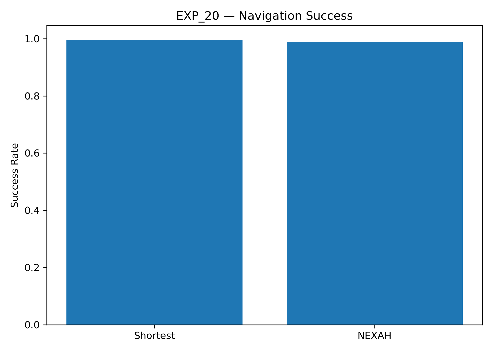

*Comparison of successful arrivals.*

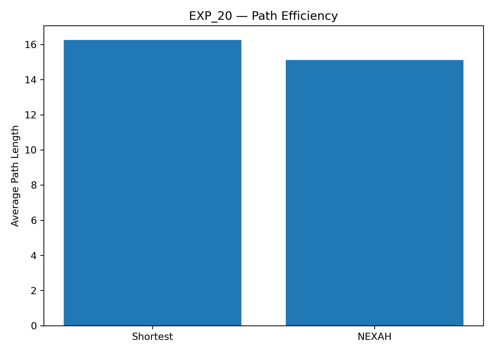

*Average path length comparison.*

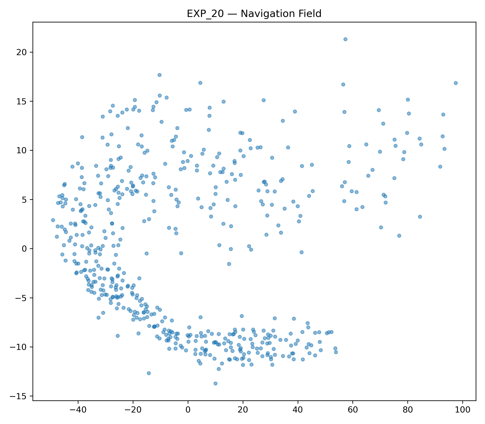

*Field geometry used during navigation.*

---

### Findings

The shortest-path baseline achieves a success rate of 99.6%.

NEXAH field navigation achieves a nearly identical success rate of 98.8%.

The observed difference is minimal.

More importantly, NEXAH produces slightly shorter successful trajectories:

- Shortest Path: 16.26 average nodes
- NEXAH: 15.12 average nodes

This indicates that navigation emerges directly from the geometry of the field rather than requiring explicit global shortest-path computation.

---

### Interpretation

The experiment demonstrates that the discovered field contains sufficient structural information to support navigation.

NEXAH does not perform a global graph search.

Instead, navigation is generated through local geometric decisions within the field.

Despite this limitation, performance remains nearly identical to classical shortest-path routing.

This suggests that the field itself encodes navigable transport structure.

EXP_20 therefore provides evidence that the NEXAH field is not merely a visualization layer but acts as a functional navigation substrate.

## EXP_21 — Blocked Field Navigation

### Objective

Test whether NEXAH navigation remains functional after
removing a region of the discovered field.

A central cluster of field states was removed and
navigation was repeated between distant regions.

### Results

| Metric | Original | Blocked |
|----------|----------|----------|
| Success Rate | 1.000 | 1.000 |
| Average Steps | 26.01 | 25.48 |
| Removed Nodes | - | 22 |
| Remaining Nodes | 501 | 479 |

### Visuals

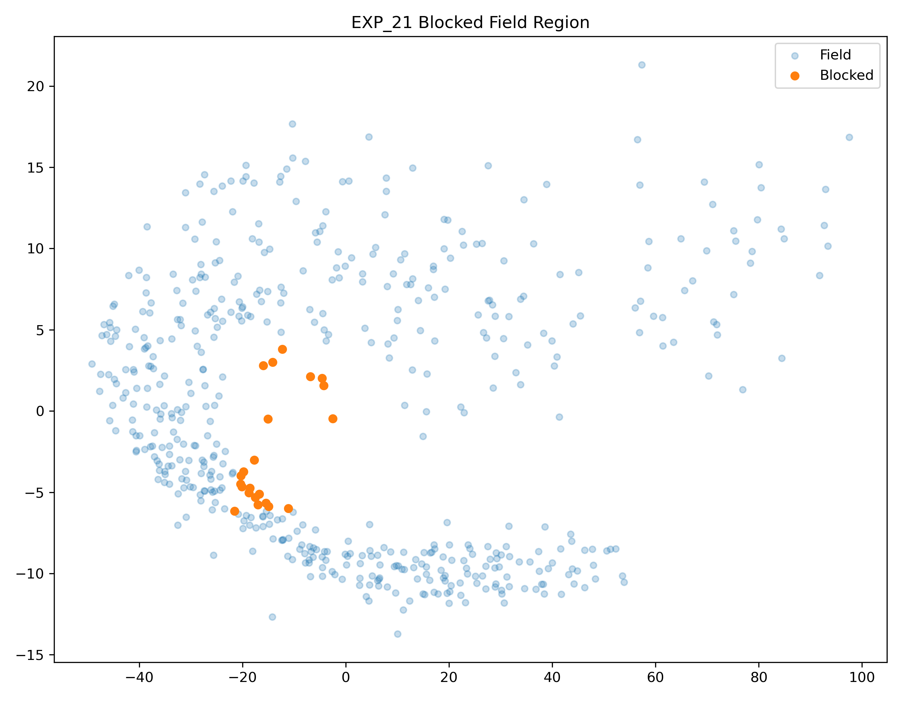

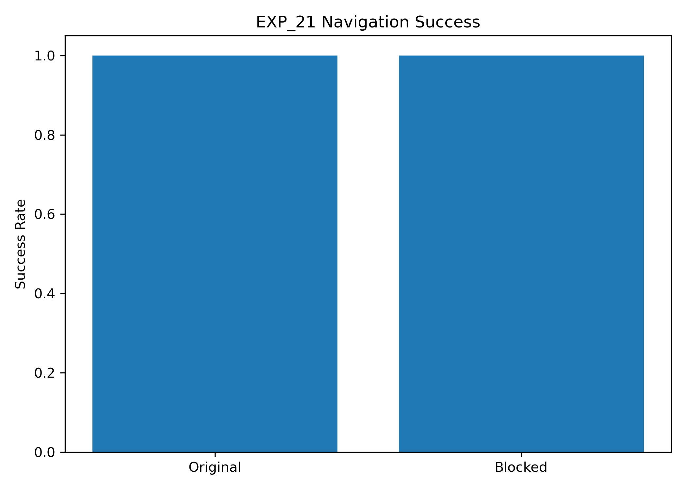

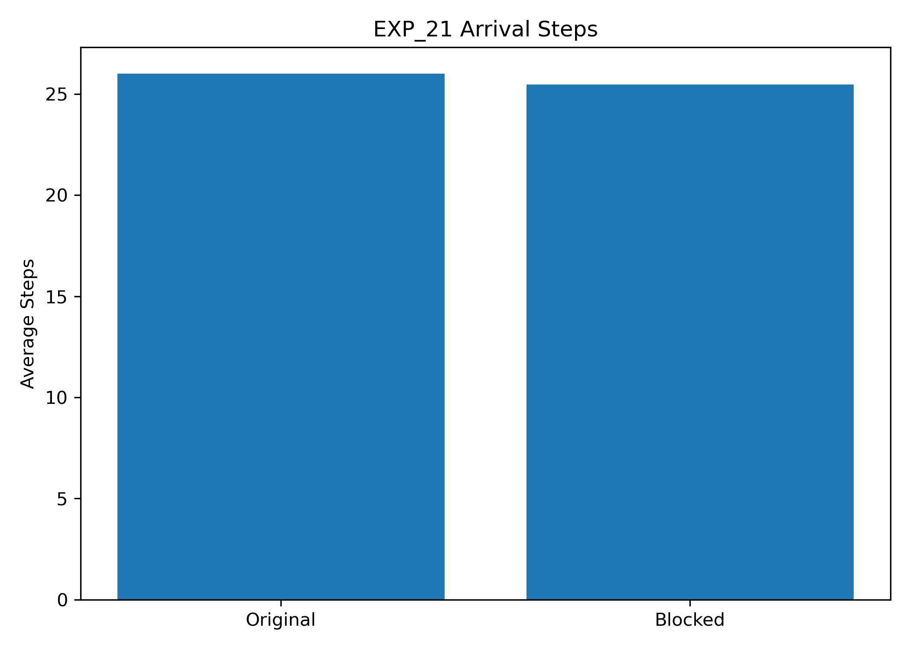

### Findings

Removing a local field region did not reduce navigation
performance.

The success rate remained at 100%.

Average travel distance decreased slightly after removal.

This indicates that the removed nodes were not part of a
critical transport backbone.

The discovered field therefore contains structural
redundancy and alternative routes.

### Conclusion

EXP_21 provides the first evidence that NEXAH navigation
is robust against local field damage.

Navigation survives partial field degradation without
loss of reachability.

This is consistent with the hypothesis that transport
is carried by a distributed field structure rather than
a single fragile corridor.

# EXP_21B — CRITICAL BACKBONE REMOVAL

## Objective

Test whether NEXAH navigation depends on a small set of critical backbone nodes.

Instead of removing a random field region (EXP_21), this experiment removes the nodes with the highest betweenness centrality — the nodes that carry the largest fraction of transport paths through the field.

The question is:

> Does navigation collapse if the most important transport hubs disappear?

---

## Method

Starting from the largest connected component discovered in EXP_08:

- Compute graph betweenness centrality
- Rank all nodes by transport importance
- Remove:

| Scenario | Removed Nodes |
|-----------|-----------:|
| Top_1pct | 5 |
| Top_3pct | 15 |
| Top_5pct | 25 |

For each damaged graph:

- Navigate from Left Region → Right Region
- Run 500 navigation trials
- Measure:
  - success rate
  - average arrival steps
  - remaining graph size

---

## Results

### Baseline

| Metric | Value |
|----------|----------:|
| Success Rate | 1.0000 |
| Average Steps | 27.606 |

---

### Backbone Removal

| Scenario | Removed Nodes | Success Rate | Avg Steps | Remaining Nodes |
|-----------|-----------:|-----------:|-----------:|-----------:|
| Top_1pct | 5 | 1.0000 | 27.728 | 496 |
| Top_3pct | 15 | 1.0000 | 32.792 | 486 |
| Top_5pct | 25 | 1.0000 | 32.566 | 476 |

---

## Visual Evidence

### Critical Backbone Nodes

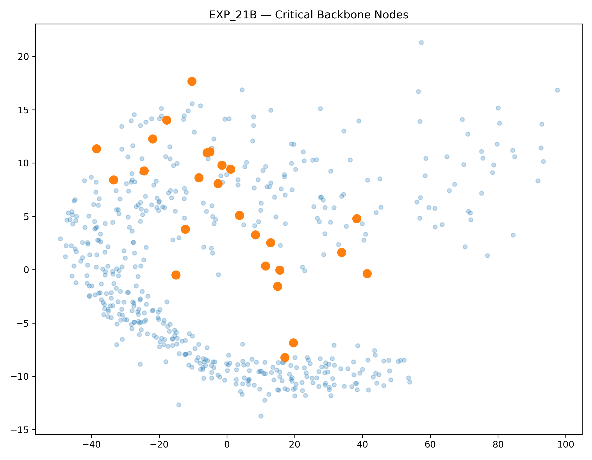

The removed nodes are concentrated in the transport corridor connecting major field regions.

These are exactly the locations expected to possess high graph-flow importance.

---

### Surviving Backbone

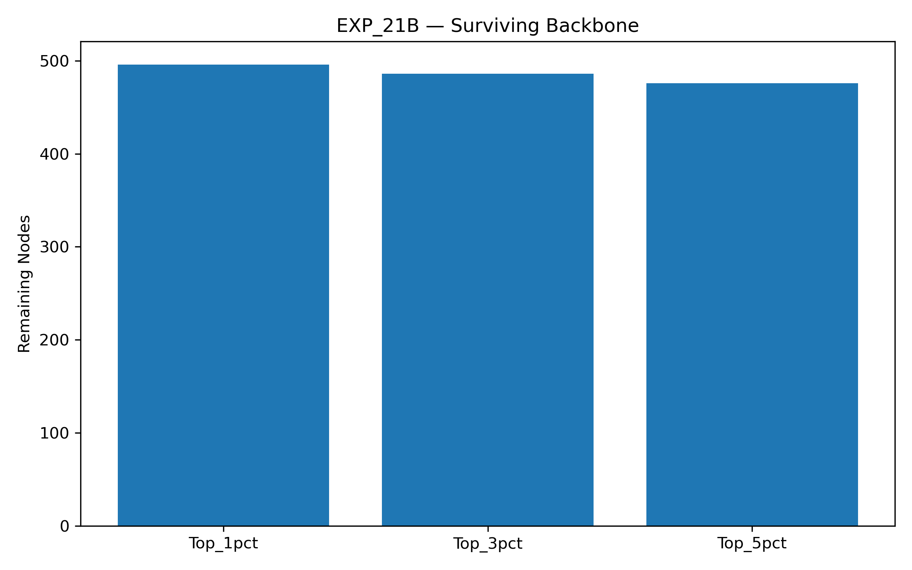

Even after removing up to 25 of the most important transport nodes:

- the graph remains connected
- the main component survives
- only a small fraction of total states is lost

---

### Navigation Success

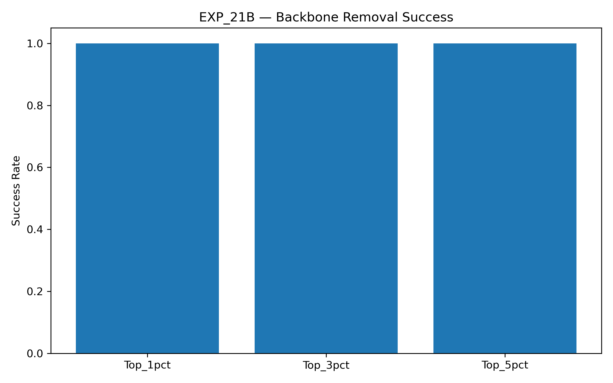

Navigation success remains:

```text
100 %
```

for all removal scenarios.

No navigation collapse is observed.

---

### Navigation Cost

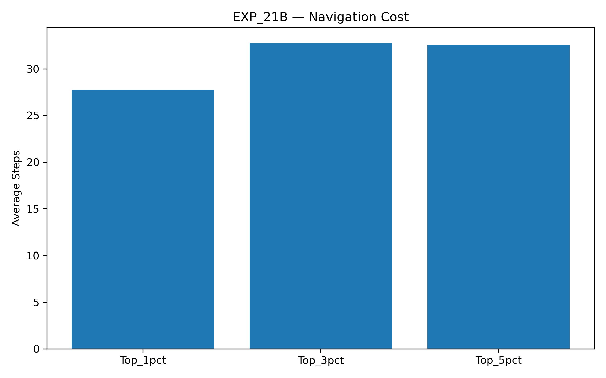

Path cost increases:

```text
27.6 → 32.8 steps
```

approximately:

```text
+18 %
```

but successful arrival remains unchanged.

---

## Finding

The NEXAH field does not depend on a single transport backbone.

Removing the most important graph hubs:

- does not disconnect the field
- does not destroy navigation
- does not reduce success probability

Instead, the field automatically discovers alternative routes.

Observed behavior:

```text
Backbone removed
→ transport reroutes

Backbone removed
→ success unchanged

Backbone removed
→ moderate cost increase
```

---

## Interpretation

This result indicates that the discovered field possesses:

- transport redundancy
- multiple parallel corridors
- distributed routing capability

rather than a single critical pathway.

The field therefore behaves more like a resilient transport landscape than a fragile shortest-path network.

---

## EXP_21B Conclusion

Critical transport hubs can be removed without destroying navigation.

The discovered field exhibits strong structural resilience and maintains full navigability despite targeted attacks on its highest-betweenness backbone nodes.

This provides direct evidence that navigation emerges from distributed field geometry rather than dependence on a small set of critical graph bottlenecks.


