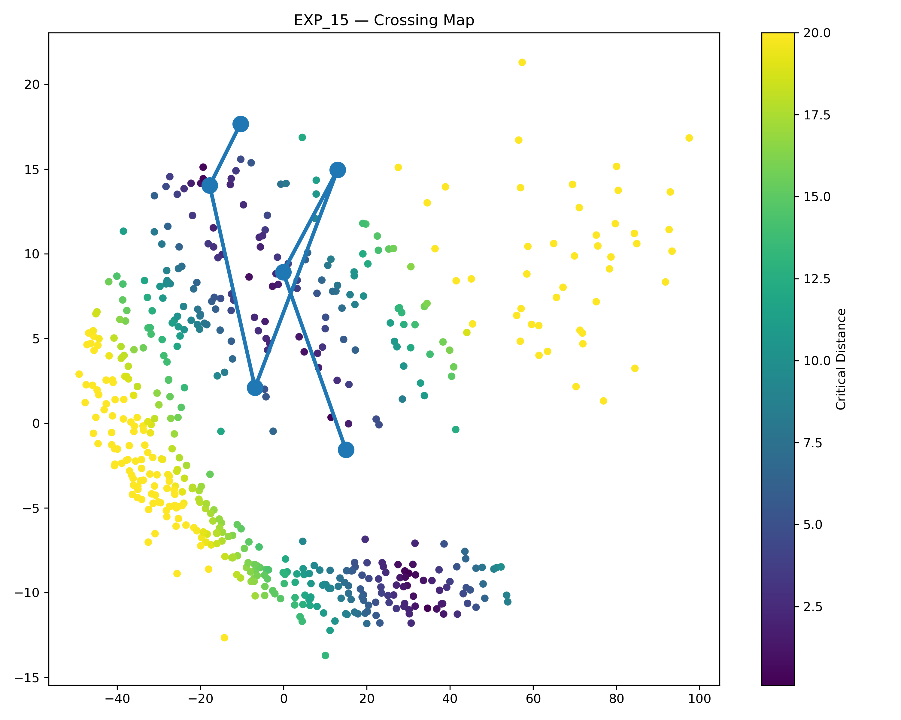

# 🧭 NEXAH Navigation Findings

## Executive Summary

The FIELD_NAVIGATION_VALIDATION program investigated whether real IEEE39 operating states form a navigable geometric structure.

Across fifteen experiments, evidence consistently supports the emergence of:

- field geometry
- transport corridors
- gate structures
- regime boundaries
- transition corridors
- navigable operating regions

The results suggest that power-system operating states are not distributed randomly in state space.

Instead they organize into a structured transport manifold.

---

# Finding 1 — Real Field Geometry Exists

EXP_07B → EXP_08

The original basin hypothesis was not confirmed.

No discrete dynamical basins emerged from clustering analysis.

Instead, Monte-Carlo operating states formed a continuous geometric structure.

EXP_08 revealed:

- dense operating regions
- transport corridors
- bottlenecks
- gate candidates

Result:

```text
Dynamics
    ↓
Geometry
```

became directly observable.

---

## Visual Evidence


Six gate candidates emerged naturally from the reconstructed field.

---

# Finding 2 — Gates Influence Navigation

EXP_09 → EXP_10

Gate-aware navigation produced shorter transport paths than standard shortest-path routing.

Observed improvement:

```text
≈ 11 %
```

Gate-removal experiments further showed that only a subset of gates contributes significantly to transport efficiency.

Flow reconstruction independently confirmed that the same gates sit on coherent transport structures.

Result:

```text
Geometry
    ↓
Transport
    ↓
Navigation
```

---

# Finding 3 — A Regime Boundary Exists

EXP_11 → EXP_12

A gate corridor:

```text
502 → 498 → 81 → 33
```

was discovered.

The corridor separates two physically distinct operating regimes.

Strongest discriminator:

```text
angle_span

effect size = -2.577
```

Additional differences:

- loading
- voltage structure
- density
- operating stress

Result:

The gate corridor behaves as a regime boundary rather than a geometric artifact.

---

## Visual Evidence


The gate corridor separates statistically distinct operating conditions.

---

# Finding 4 — The Boundary Has Finite Width

EXP_13 → EXP_15

The regime boundary is not a sharp separator.

Observed:

- crossing density around the gate corridor
- limited spontaneous transitions
- finite crossing distances
- distributed gate sensitivity

EXP_15 measured:

```text
Mean Critical Distance:
10.15

Median Critical Distance:
9.65
```

States require measurable displacement before a regime transition occurs.

Result:

```text
Regime A
    ⇄
Transition Corridor
    ⇄
Regime B
```

rather than

```text
Regime A | Regime B
```

---

## Visual Evidence



Critical crossing distance increases with distance from the gate corridor.

---

# Finding 5 — Navigation Becomes Possible

EXP_01 → EXP_15

The complete validation chain now exists:

```text
Dynamics
    ↓
Geometry
    ↓
Transport Corridors
    ↓
Gate Structures
    ↓
Regime Boundaries
    ↓
Transition Corridors
    ↓
Navigation
```

This is the central result of the FIELD_NAVIGATION_VALIDATION program.

The reconstructed field is not merely descriptive.

It can be used as a navigational object.

---

# Overall Assessment

Current evidence supports:

✓ Real field geometry

✓ Transport corridors

✓ Gate structures

✓ Regime separation

✓ Transition corridors

✓ Field-guided navigation

The strongest current interpretation is:

```text
IEEE39 operating states form

a navigable transport manifold

rather than

a collection of isolated basins.
```

---

## Current Status

```text
NEXAH Navigation Hypothesis

SUPPORTED

EXP_01 → EXP_15
```
