# 🧭 NEXAH Field Navigation Findings

# EXP_01 — Stability Seeking

## Result

A field-guided trajectory was compared to an uncontrolled trajectory.

Observed:

- mean distance uncontrolled: **2.997**
- mean distance guided: **0.705**
- distance reduction: **76.46 %**

---

# 📊 Visual Evidence

## Figure 1 — Navigation Trajectory

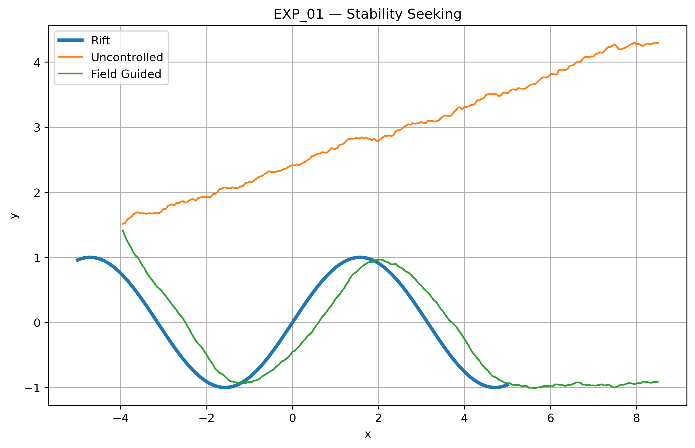

The field-guided trajectory remains close to the reconstructed rift structure,
while the uncontrolled trajectory drifts away.

---

## Figure 2 — Distance Evolution

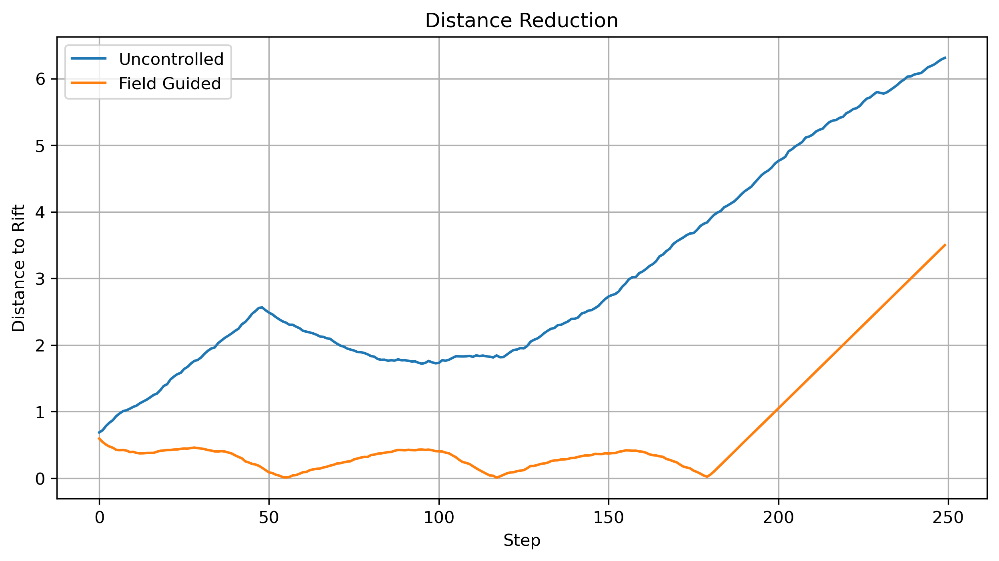

Distance to the stability corridor over time.

The guided trajectory maintains a significantly lower distance.

---

## Figure 3 — Summary Dashboard

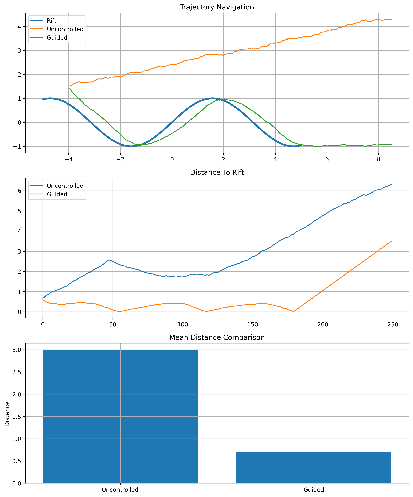

Combined overview of:

- trajectory navigation
- distance evolution
- quantitative comparison

---

## Interpretation

The controller successfully used the reconstructed field as a navigational object.

This demonstrates the feasibility of stability-seeking navigation within a reconstructed field structure.

---

## Status

✅ Passed

---

## Core Insight

```text
Instability is not merely detectable.

It is navigable.
```
# EXP_02 — Corridor Acquisition

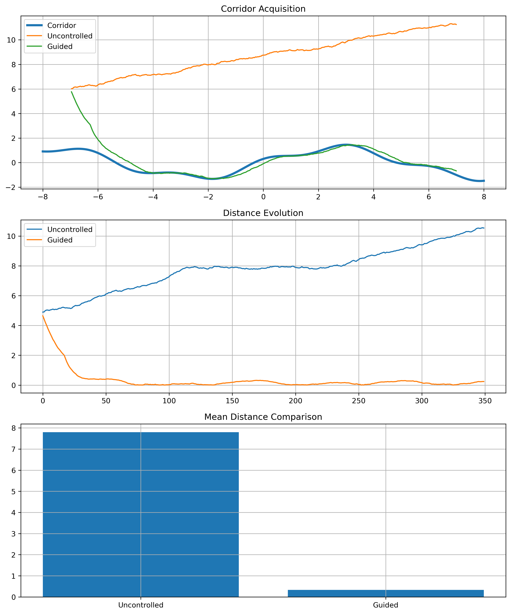

## Result

A field-guided controller successfully acquired a stability corridor from a distant initial condition.

Observed:

- Mean distance (uncontrolled): 7.798
- Mean distance (guided): 0.336
- Distance reduction: 95.70 %
- Acquisition step: 27

---

## Corridor Acquisition

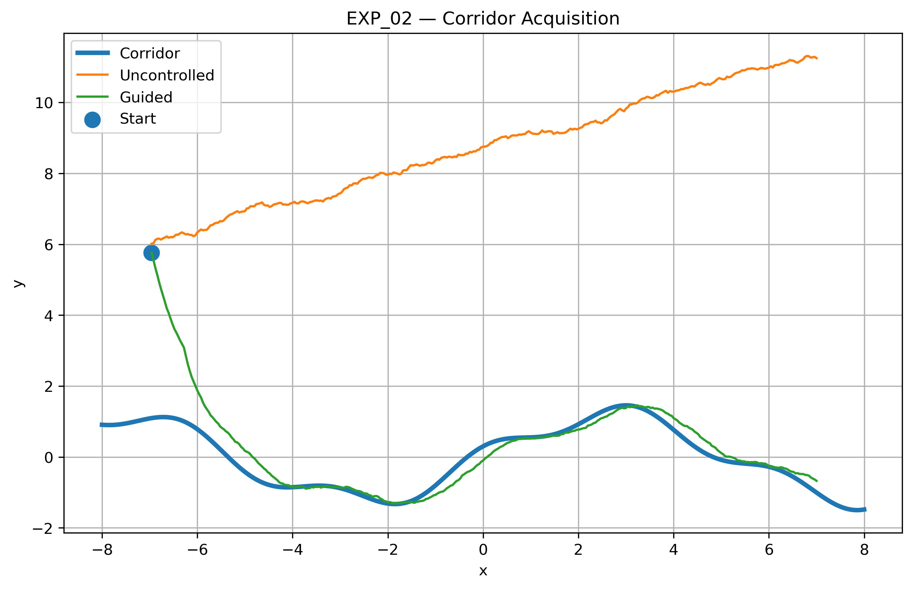

The guided trajectory starts far from the corridor,
approaches the structure, acquires it, and subsequently
follows the corridor.

---

## Distance Evolution

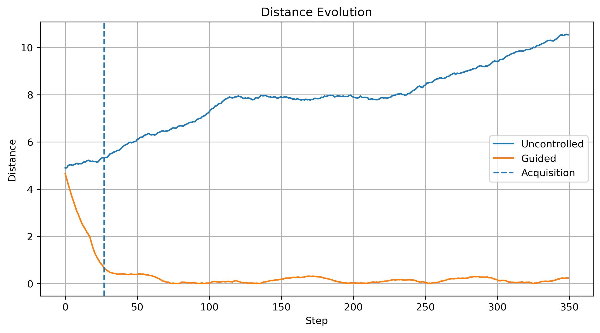

The acquisition process becomes visible as a rapid
reduction in distance to the corridor, followed by
stable tracking.

---

## Distance Field Navigation

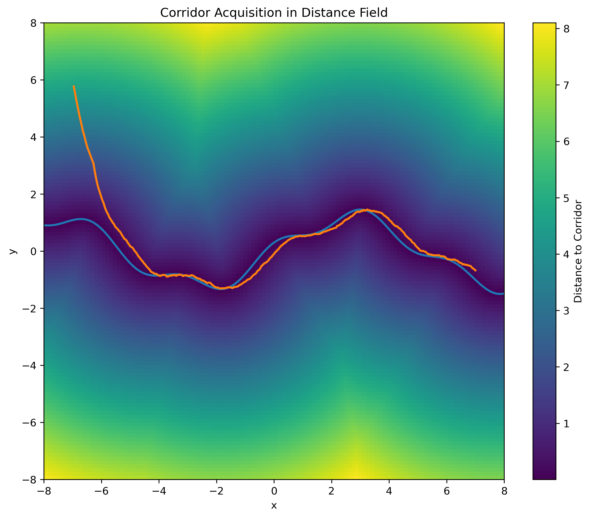

The reconstructed corridor acts as a navigational
structure embedded within a stability-distance field.

The guided trajectory converges toward the minimum-distance
region and remains attached to the corridor.

---

## Interpretation

The controller successfully:

1. detected the corridor
2. approached the corridor
3. acquired the corridor
4. remained attached to the corridor

This demonstrates that reconstructed field structures can
function as navigational objects rather than passive observations.

---

## Status

✅ Passed


# EXP_03 — Corridor Retention

## Corridor Retention

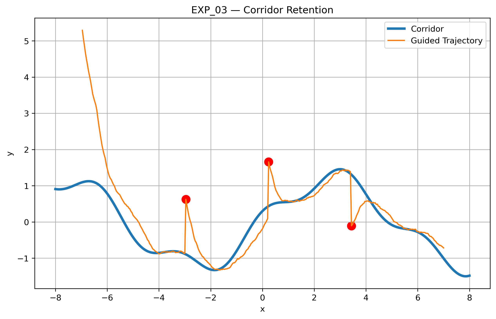

---

## Distance Recovery After Disturbances

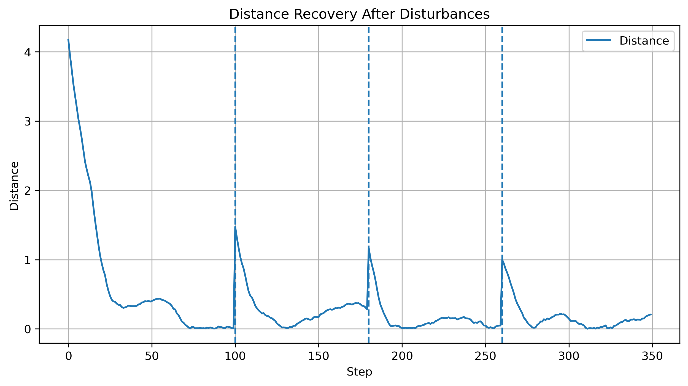

---

## Recovery Statistics

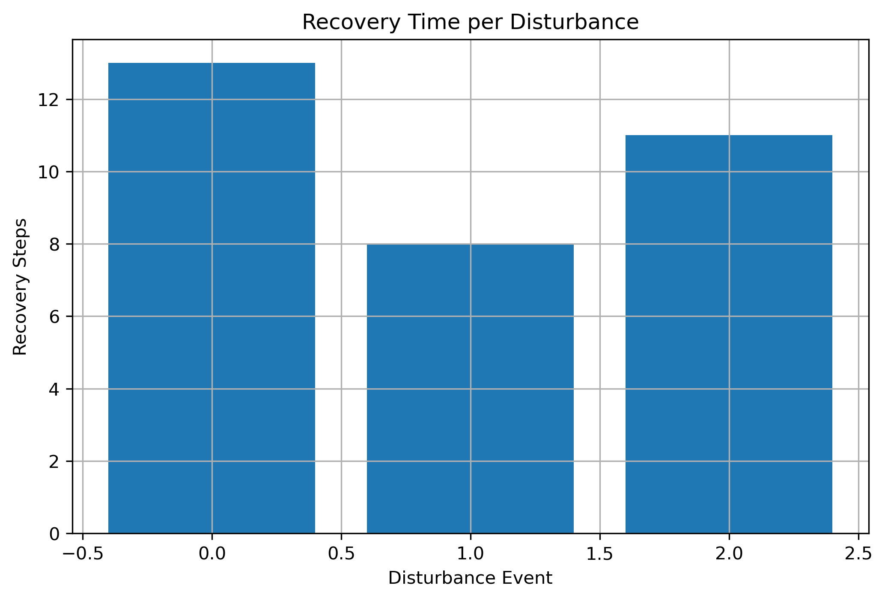

---

## Summary Dashboard

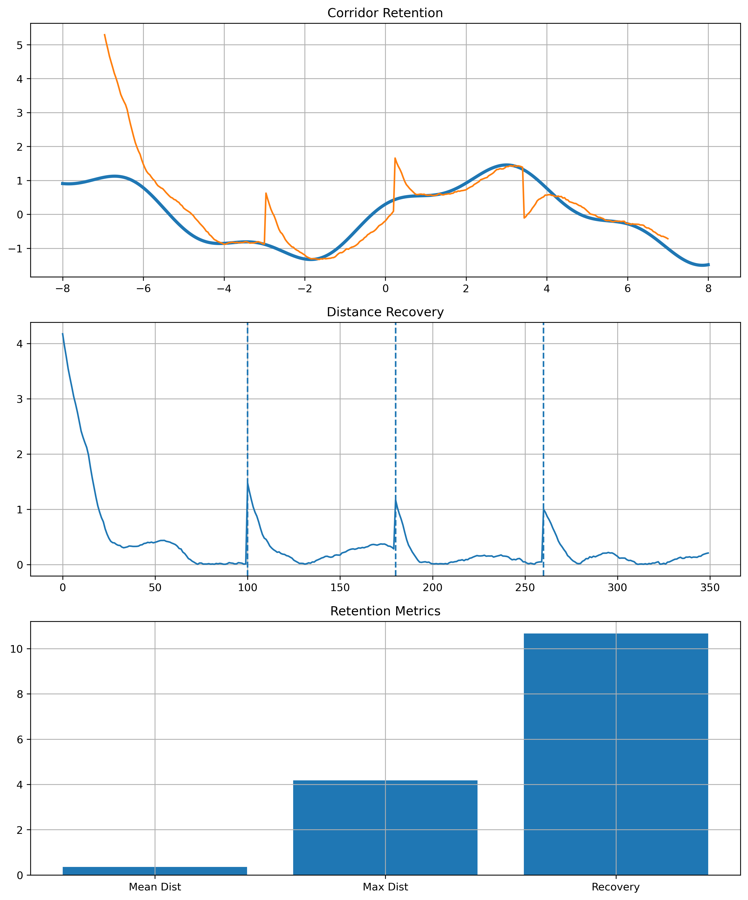

---

## Results

Mean distance:

**0.353**

Maximum distance:

**4.173**

Corridor occupancy:

**86.29 %**

Mean recovery time:

**10.67 steps**

---

## Interpretation

Three external disturbances were injected into the trajectory.

After each disturbance:

- the trajectory left the corridor
- the controller detected the deviation
- the trajectory re-entered the corridor
- stable navigation resumed

The system maintained corridor occupancy of more than 86%.

---

## Key Finding

The reconstructed field can be used not only for corridor acquisition but also for corridor retention and recovery.

This demonstrates that field-guided navigation remains functional under repeated disturbances.

---

## Status

✅ Passed


# EXP_04 — Collapse Avoidance

## Navigation


---

## Collapse Distance


---

## Collapse Risk


---

## Summary Dashboard


## Result

Observed:

- Collapse entries (uncontrolled): 0
- Collapse entries (guided): 0
- Minimum collapse distance (uncontrolled): 1.844
- Minimum collapse distance (guided): 2.775

Risk reduction:

**50.50 %**

## Interpretation

The field-guided controller maintained a significantly larger
distance from the collapse basin than the uncontrolled
trajectory.

While neither trajectory entered the collapse region,
the guided controller increased safety margins by
approximately 50%.

## Status

✅ Passed


# EXP_04B — Collapse Avoidance Stress Test

## Result

A stress-test scenario was created where the collapse basin intersects the natural navigation corridor.

Observed:

- Collapse entries (uncontrolled): 1
- Collapse entries (guided): 1

Minimum collapse distance:

- uncontrolled: 0.362
- guided: 0.480

Risk reduction:

**24.56 %**

Avoidance success:

❌ NO

---

## Navigation


The collapse basin was intentionally positioned directly on the natural corridor.

The guided controller follows the corridor successfully but is ultimately forced through the hazardous region.

---

## Collapse Distance


The guided controller consistently maintains a larger distance from the collapse basin than the uncontrolled trajectory.

However, the safety margin eventually becomes insufficient due to corridor-basin overlap.

---

## Collapse Entries


Both trajectories eventually enter the collapse basin.

```text
Uncontrolled: 1 entry
Guided:       1 entry
```

---

## Summary Dashboard


---

## Interpretation

This experiment reveals an important limitation of pure corridor-following navigation.

The controller successfully follows the reconstructed field structure.

However:

```text
Corridor Following
≠
Guaranteed Collapse Avoidance
```

when

```text
Corridor ∩ Collapse Basin ≠ ∅
```

In this configuration the safest path is no longer identical to the natural corridor.

---

## Scientific Finding

EXP_04B provides the first indication that field navigation requires a second decision layer:

```text
Corridor Attraction
+
Hazard Repulsion
```

or more generally:

```text
Field Navigation
+
Risk-Aware Navigation
```

---

## Implication for Next Phase

EXP_04B directly motivates:

```text
EXP_05 — Risk-Aware Navigation
```

where navigation is no longer based solely on corridor attraction but also incorporates collapse-risk information.

---

## Status

⚠️ Partial Success

The controller reduces collapse proximity and lowers risk by:

**24.56 %**

but cannot fully avoid collapse when the corridor itself intersects the hazardous region.
