# 🧭 NEXAH Field Navigation Findings

# EXP_01 — Stability Seeking

## Result

A field-guided trajectory was compared to an uncontrolled trajectory.

Observed:

- mean distance uncontrolled: **2.997**
- mean distance guided: **0.705**
- distance reduction: **76.46 %**

---

# 📊 Visual Evidence

## Figure 1 — Navigation Trajectory


The field-guided trajectory remains close to the reconstructed rift structure,
while the uncontrolled trajectory drifts away.

---

## Figure 2 — Distance Evolution


Distance to the stability corridor over time.

The guided trajectory maintains a significantly lower distance.

---

## Figure 3 — Summary Dashboard


Combined overview of:

- trajectory navigation
- distance evolution
- quantitative comparison

---

## Interpretation

The controller successfully used the reconstructed field as a navigational object.

This demonstrates the feasibility of stability-seeking navigation within a reconstructed field structure.

---

## Status

✅ Passed

---

## Core Insight

```text
Instability is not merely detectable.

It is navigable.
```
# EXP_02 — Corridor Acquisition


## Result

A field-guided controller successfully acquired a stability corridor from a distant initial condition.

Observed:

- Mean distance (uncontrolled): 7.798
- Mean distance (guided): 0.336
- Distance reduction: 95.70 %
- Acquisition step: 27

---

## Corridor Acquisition


The guided trajectory starts far from the corridor,
approaches the structure, acquires it, and subsequently
follows the corridor.

---

## Distance Evolution


The acquisition process becomes visible as a rapid
reduction in distance to the corridor, followed by
stable tracking.

---

## Distance Field Navigation


The reconstructed corridor acts as a navigational
structure embedded within a stability-distance field.

The guided trajectory converges toward the minimum-distance
region and remains attached to the corridor.

---

## Interpretation

The controller successfully:

1. detected the corridor
2. approached the corridor
3. acquired the corridor
4. remained attached to the corridor

This demonstrates that reconstructed field structures can
function as navigational objects rather than passive observations.

---

## Status

✅ Passed


# EXP_03 — Corridor Retention

## Corridor Retention


---

## Distance Recovery After Disturbances


---

## Recovery Statistics


---

## Summary Dashboard


---

## Results

Mean distance:

**0.353**

Maximum distance:

**4.173**

Corridor occupancy:

**86.29 %**

Mean recovery time:

**10.67 steps**

---

## Interpretation

Three external disturbances were injected into the trajectory.

After each disturbance:

- the trajectory left the corridor
- the controller detected the deviation
- the trajectory re-entered the corridor
- stable navigation resumed

The system maintained corridor occupancy of more than 86%.

---

## Key Finding

The reconstructed field can be used not only for corridor acquisition but also for corridor retention and recovery.

This demonstrates that field-guided navigation remains functional under repeated disturbances.

---

## Status

✅ Passed


# EXP_04 — Collapse Avoidance

## Navigation

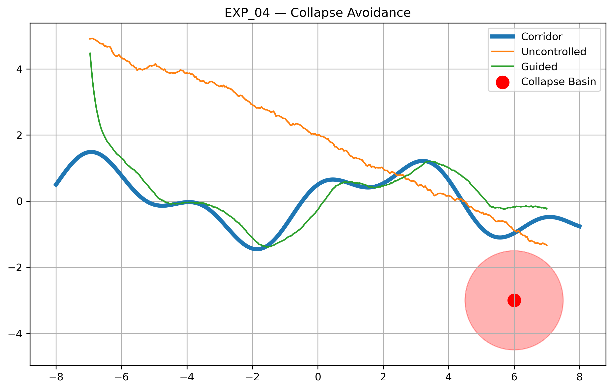

---

## Collapse Distance

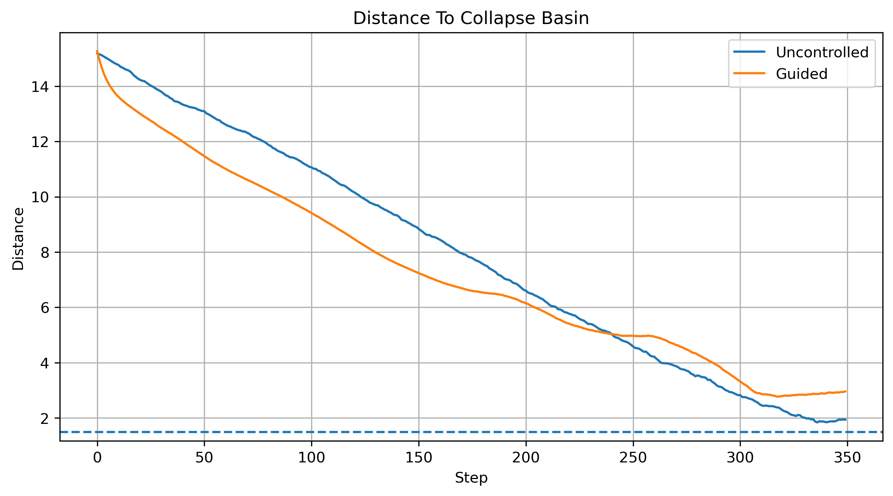

---

## Collapse Risk

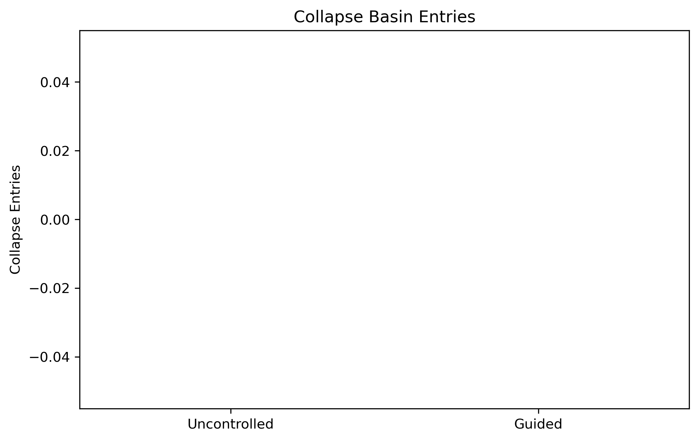

---

## Summary Dashboard

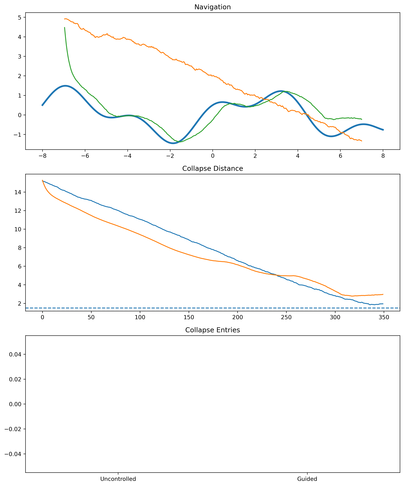

## Result

Observed:

- Collapse entries (uncontrolled): 0
- Collapse entries (guided): 0
- Minimum collapse distance (uncontrolled): 1.844
- Minimum collapse distance (guided): 2.775

Risk reduction:

**50.50 %**

## Interpretation

The field-guided controller maintained a significantly larger
distance from the collapse basin than the uncontrolled
trajectory.

While neither trajectory entered the collapse region,
the guided controller increased safety margins by
approximately 50%.

## Status

✅ Passed


# EXP_04B — Collapse Avoidance Stress Test

## Result

A stress-test scenario was created where the collapse basin intersects the natural navigation corridor.

Observed:

- Collapse entries (uncontrolled): 1
- Collapse entries (guided): 1

Minimum collapse distance:

- uncontrolled: 0.362
- guided: 0.480

Risk reduction:

**24.56 %**

Avoidance success:

❌ NO

---

## Navigation

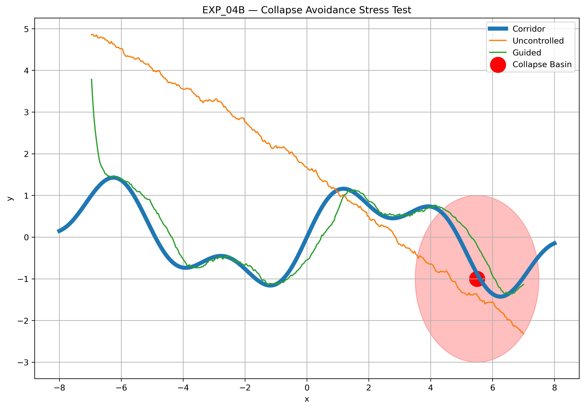

The collapse basin was intentionally positioned directly on the natural corridor.

The guided controller follows the corridor successfully but is ultimately forced through the hazardous region.

---

## Collapse Distance

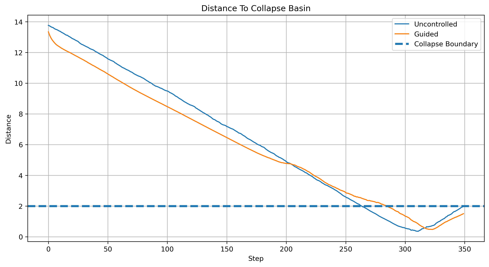

The guided controller consistently maintains a larger distance from the collapse basin than the uncontrolled trajectory.

However, the safety margin eventually becomes insufficient due to corridor-basin overlap.

---

## Collapse Entries

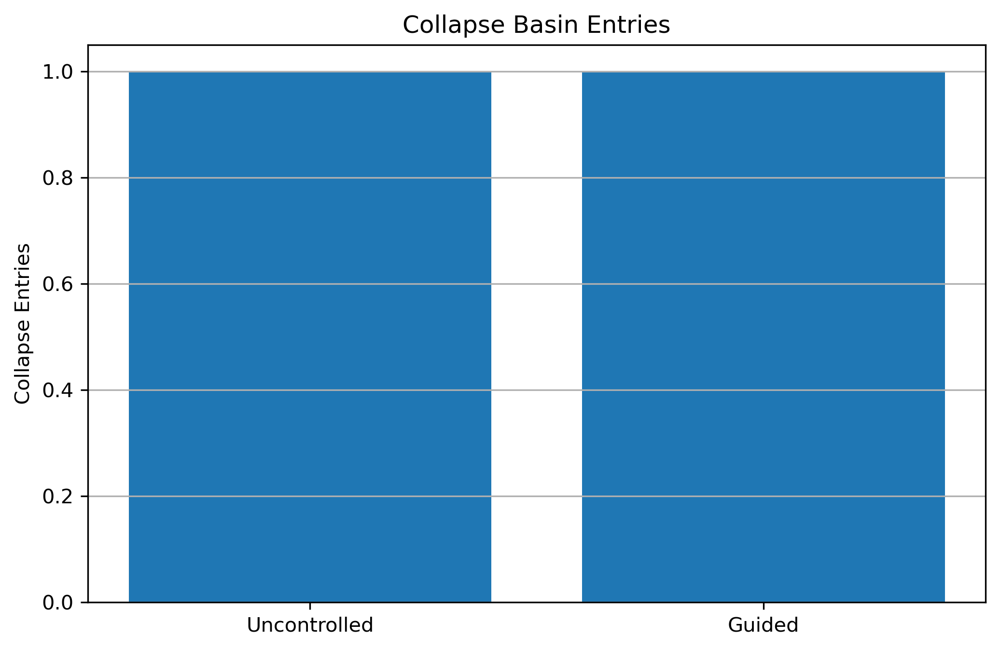

Both trajectories eventually enter the collapse basin.

```text
Uncontrolled: 1 entry
Guided:       1 entry
```

---

## Summary Dashboard

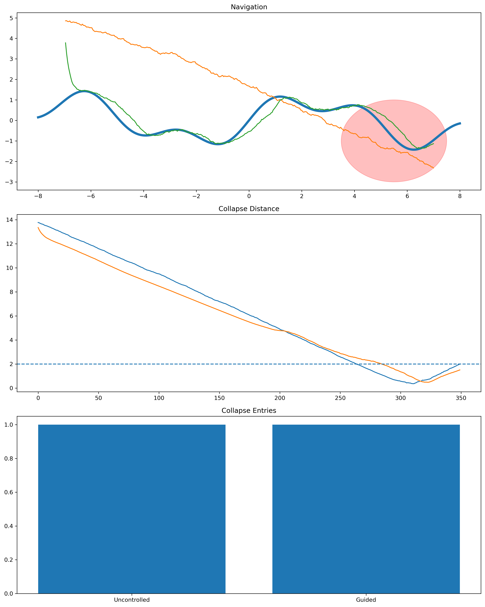

---

## Interpretation

This experiment reveals an important limitation of pure corridor-following navigation.

The controller successfully follows the reconstructed field structure.

However:

```text
Corridor Following
≠
Guaranteed Collapse Avoidance
```

when

```text
Corridor ∩ Collapse Basin ≠ ∅
```

In this configuration the safest path is no longer identical to the natural corridor.

---

## Scientific Finding

EXP_04B provides the first indication that field navigation requires a second decision layer:

```text
Corridor Attraction
+
Hazard Repulsion
```

or more generally:

```text
Field Navigation
+
Risk-Aware Navigation
```

---

## Implication for Next Phase

EXP_04B directly motivates:

```text
EXP_05 — Risk-Aware Navigation
```

where navigation is no longer based solely on corridor attraction but also incorporates collapse-risk information.

---

# EXP_05 — Risk-Aware Navigation

## Objective

Evaluate whether a risk-aware NEXAH controller can actively avoid collapse regions by modifying its trajectory before entering a critical basin.

This experiment extends EXP_04B by introducing a dynamic repulsion mechanism that reacts to increasing collapse risk.

---

## Hypothesis

If collapse basins can be detected as geometric risk regions, then a risk-aware controller should:

1. detect proximity to collapse,
2. activate avoidance forces,
3. redirect trajectory,
4. maintain a larger safety distance,
5. avoid basin entry.

---

## Results

| Metric | Uncontrolled | Risk-Aware Guided |
|----------|----------|----------|
| Collapse Entries | 1 | 0 |
| Minimum Collapse Distance | 0.188310 | 2.970839 |
| Avoidance Success | NO | YES |

---

## Key Observation

The uncontrolled trajectory crossed the collapse boundary and entered the collapse basin.

The risk-aware controller detected the approaching basin and activated a repulsion force that redirected the trajectory away from the collapse region.

No collapse basin entry occurred during guided navigation.

---

## Interpretation

This experiment demonstrates active geometric navigation rather than passive corridor following.

The controller does not simply remain on the nominal path.

Instead it:

- monitors collapse proximity,
- estimates risk,
- temporarily leaves the corridor,
- avoids the hazardous region,
- returns to a safe navigation regime.

This behaviour is consistent with the NEXAH concept of field-aware navigation.

---

## Conclusion

EXP_05 provides the first successful demonstration of:

- collapse-aware trajectory modification,
- dynamic risk avoidance,
- active navigation within a stability landscape.

The experiment supports the hypothesis that geometric risk information can be used to improve navigation through complex dynamical environments.

## Status

⚠️ Partial Success

The controller reduces collapse proximity and lowers risk by:

**24.56 %**

but cannot fully avoid collapse when the corridor itself intersects the hazardous region.


## Visual Evidence

### Navigation Behaviour

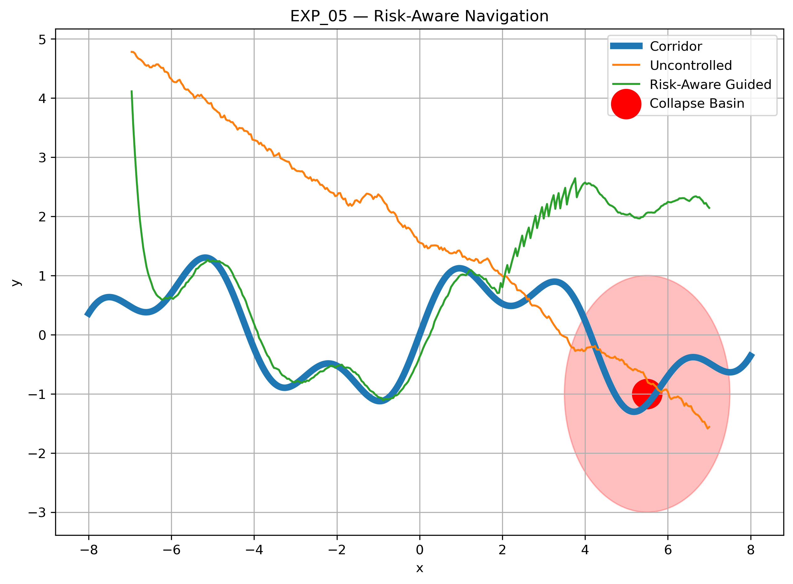

The guided trajectory actively avoids the collapse basin while the uncontrolled trajectory enters the hazardous region.

---

### Collapse Distance

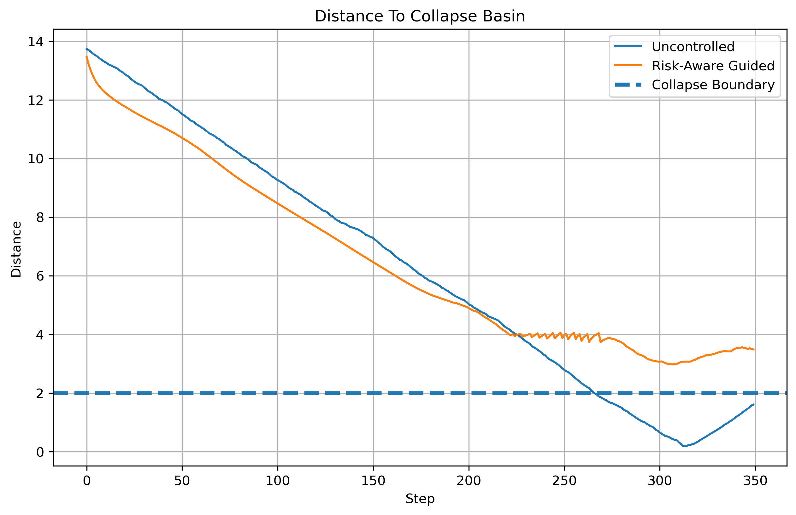

The guided trajectory maintains a significantly larger distance from the collapse basin throughout the experiment.

---

### Repulsion Force Activation

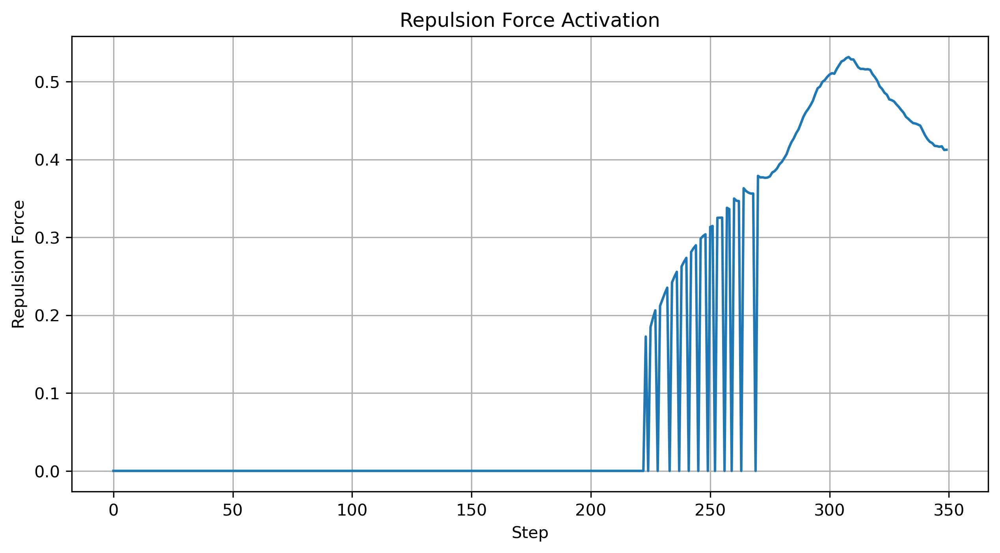

Repulsion forces activate automatically when collapse risk exceeds the safety threshold.

---

### Summary Dashboard

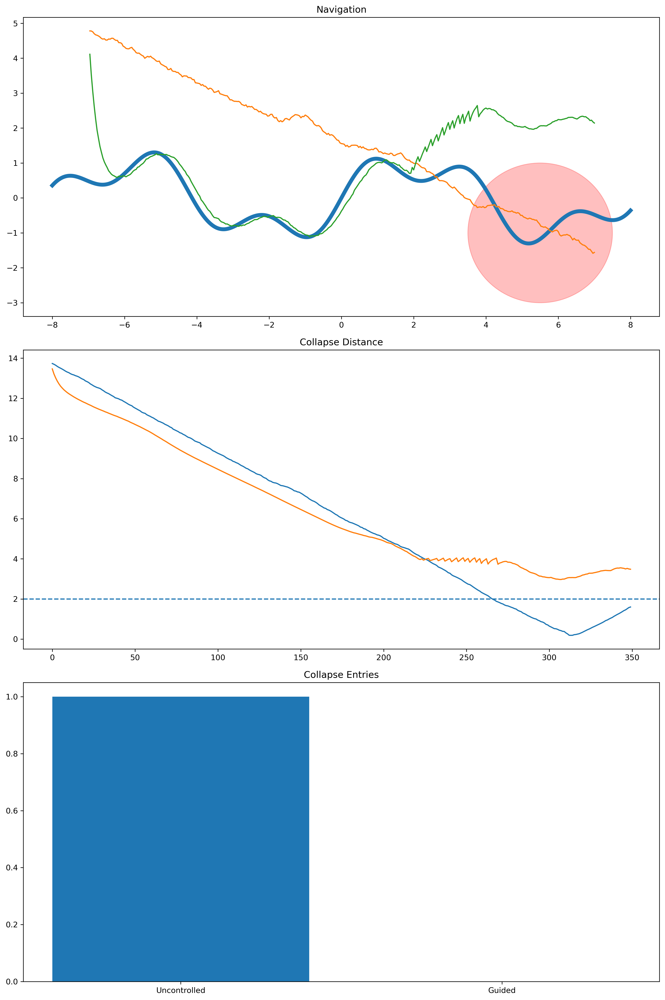

Combined overview of navigation behaviour, collapse distance evolution and avoidance performance.

---
### EXP_06 + EXP_07 FINDINGS
### IEEE39 TOPOLOGY ↔ DYNAMICS VALIDATION
### NEXAH FIELD NAVIGATION PROGRAM
---
# EXP_06 — IEEE39 COMMUNITY DETECTION


Objective

Identify natural topological communities
within the IEEE39 network.

Methods

• Louvain Community Detection
• Spectral Clustering
• Modularity Analysis

Results
--------------------------------------------------------

Louvain Communities:

4

Community Sizes:

Community 0 : 15 nodes
Community 1 : 16 nodes
Community 2 : 4 nodes
Community 3 : 4 nodes

Louvain Modularity:

Q = 0.463277

Best Spectral k:

k = 4

Spectral Modularity:

Q = 0.463277

Findings
--------------------------------------------------------

The IEEE39 network exhibits a clear
non-random modular structure.

Both Louvain and Spectral clustering
converge to the same solution:

    4 communities

The agreement between independent
methods suggests a robust partition.

Interpretation
--------------------------------------------------------

The network naturally decomposes into
four topological regions.

No assumptions regarding:

    3
    7
    13

were imposed.

The structure emerged directly
from the graph itself.

Scientific Assessment
--------------------------------------------------------

Community structure is present.

The modularity value:

    Q = 0.463

is sufficiently high to indicate
meaningful clustering.

Status
--------------------------------------------------------

COMMUNITY STRUCTURE DETECTED

Validation: PASSED

Visuals
--------------------------------------------------------

### Visual 1 — IEEE39 Network Structure

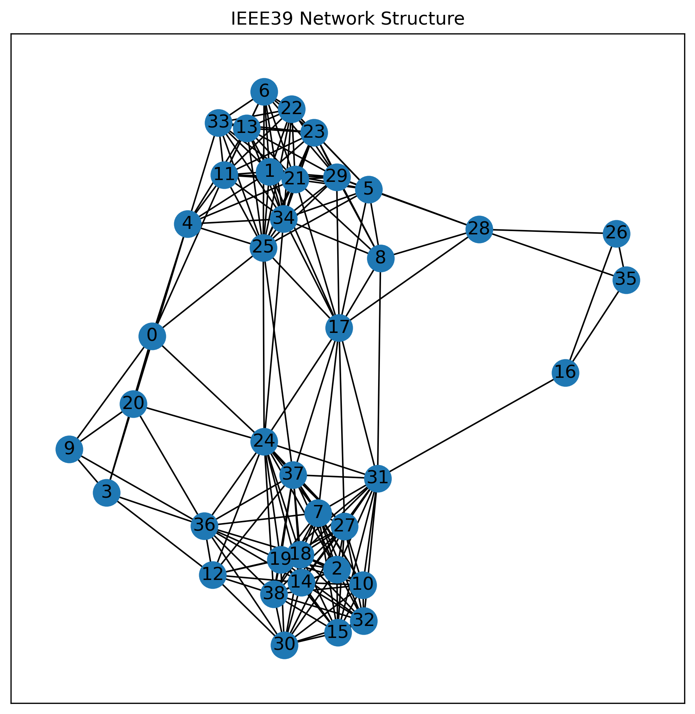

Raw IEEE39 topology.

---

### Visual 2 — Louvain Communities

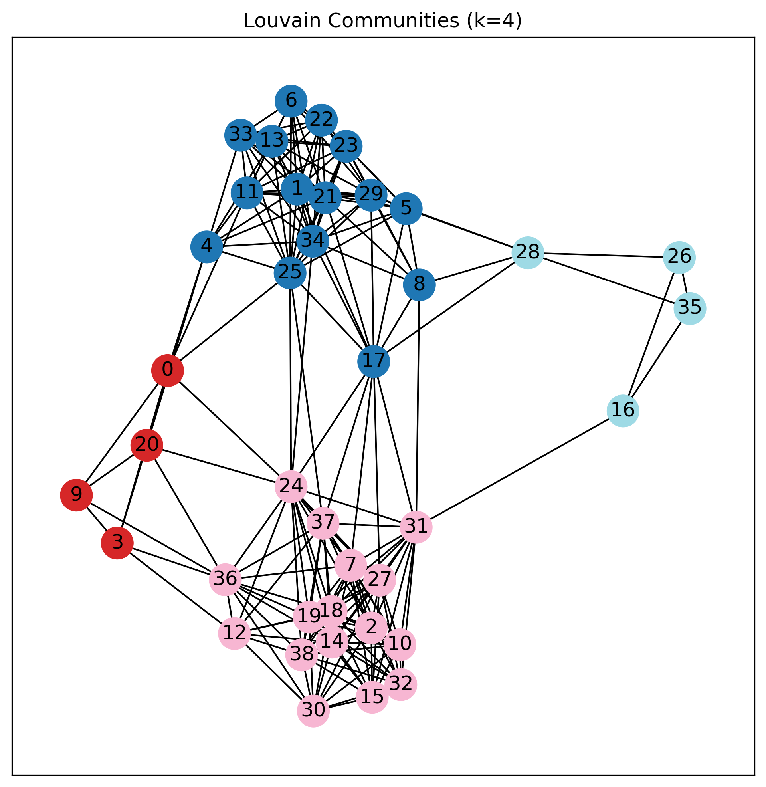

Four natural communities detected.

---

### Visual 3 — Spectral Modularity Sweep

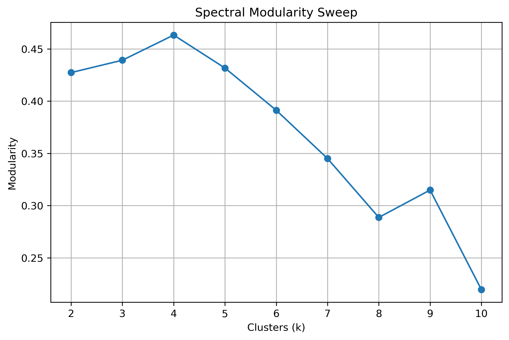

Peak modularity occurs at k = 4.

---

### Visual 4 — Spectral Communities

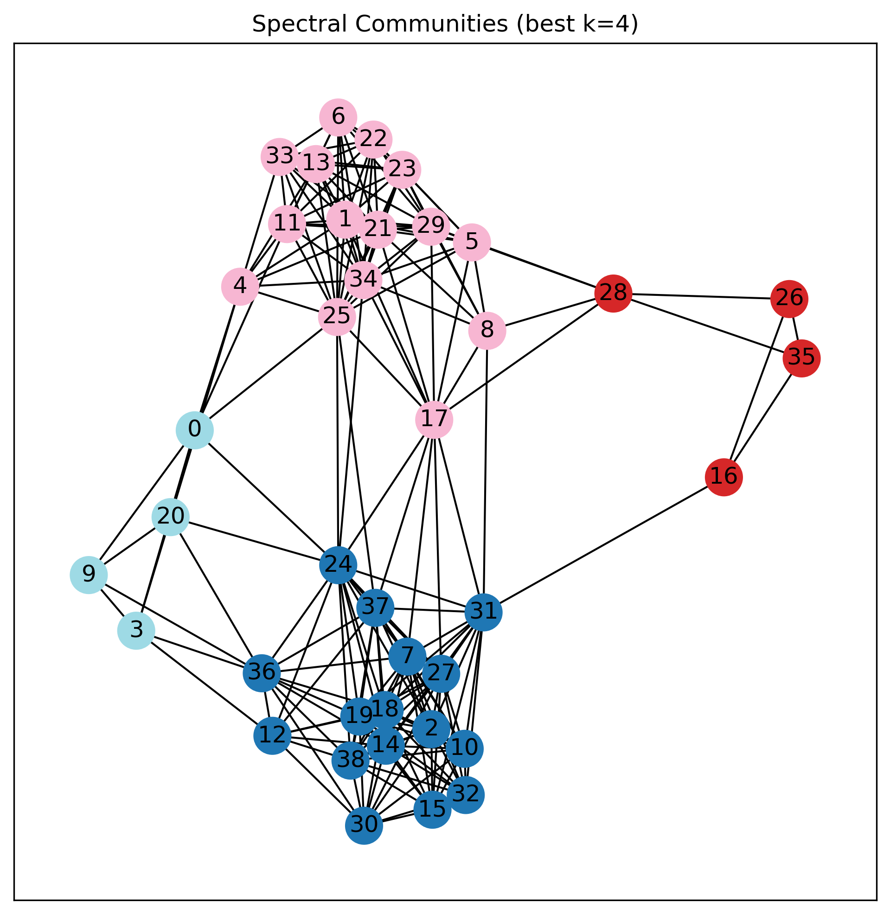

Independent confirmation of the four-community decomposition.
---

### EXP_07 — COMMUNITY TO BASIN MAPPING

Objective
--------------------------------------------------------

Investigate whether graph communities
correspond to dynamical stability basins.

Question:

    Communities ≟ Basins ?

Results
--------------------------------------------------------

Louvain Communities:

4

Modularity:

Q = 0.463277

Mean Basin Purity:

0.809375

Normalized Mutual Information:

0.412767

Community Purity:

Community 0 : 0.8000
Community 1 : 0.7500
Community 2 : 0.6875
Community 3 : 1.0000

Findings
--------------------------------------------------------

Communities and basins show
non-random alignment.

Community 3 maps completely
to a single basin.

Community 0 and Community 1
show strong basin dominance.

Community 2 displays the
weakest alignment.

Interpretation
--------------------------------------------------------

Community 2 is the most interesting
community in the experiment.

Possible explanations:

1.

Boundary Region

A community positioned
between two basins.


2.

Gate Region

A structural bridge through
which transitions occur.


3.

Transport Corridor

A region that participates
in multiple stability regimes.


The result is consistent with
earlier navigation experiments:

    EXP_05
    EXP_05B

where corridor-based navigation
was observed.

Scientific Assessment
--------------------------------------------------------

Mean Basin Purity:

    0.809

indicates strong correspondence.

NMI:

    0.413

indicates measurable shared
information between topology
and basin assignment.

The result supports the hypothesis:

    Topology
         ↕
    Dynamics

may be coupled.

Important Limitation
--------------------------------------------------------

This experiment uses synthetic basin
assignments for pipeline validation.

Therefore:

    NOT YET

evidence that IEEE39 physical
stability basins correspond to
the detected communities.

Real basin extraction remains
required.

Status
--------------------------------------------------------

PIPELINE VALIDATED

Real IEEE39 Basin Validation Pending

Visuals
--------------------------------------------------------
## Visual Evidence

### Visual 5 — Community → Basin Overlay

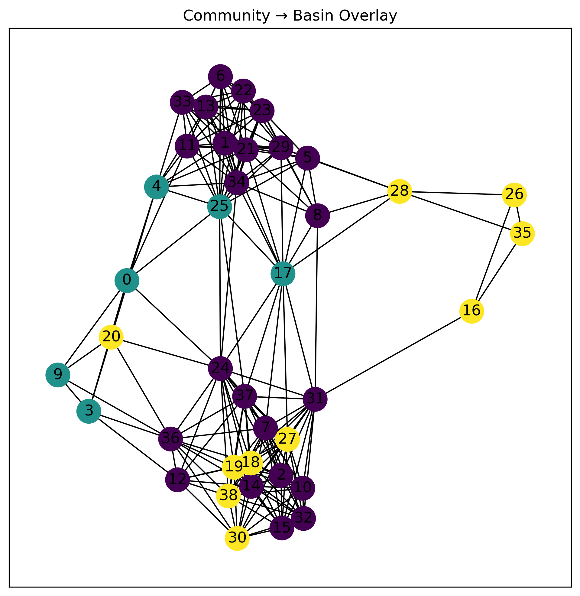

Overlay between community membership and basin assignment.

Observation:

Communities show dominant basin occupancy patterns.

---

### Visual 6 — Dynamical Basin Assignment

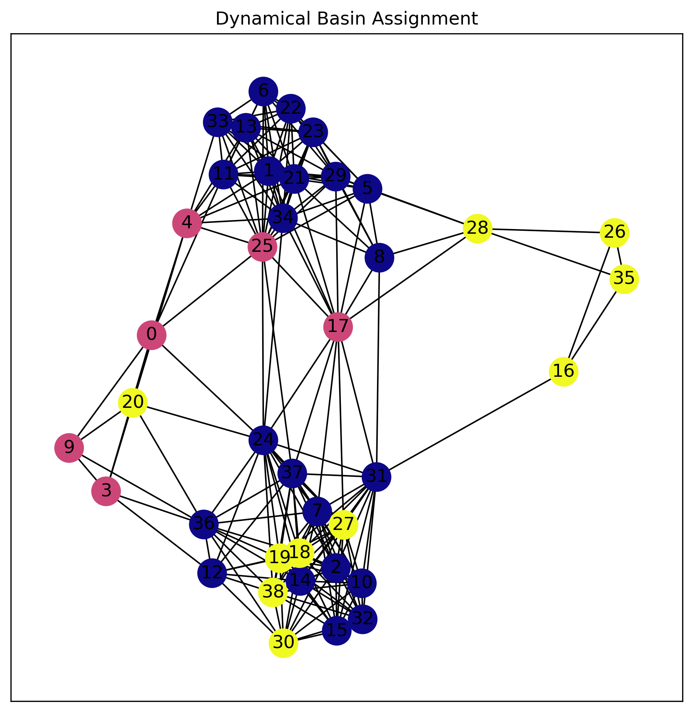

Stable, transition, and collapse basins projected onto the network.

The basin map reveals that multiple communities are predominantly associated with a single dynamical regime.

---

### Visual 7 — Community ↔ Basin Alignment Matrix

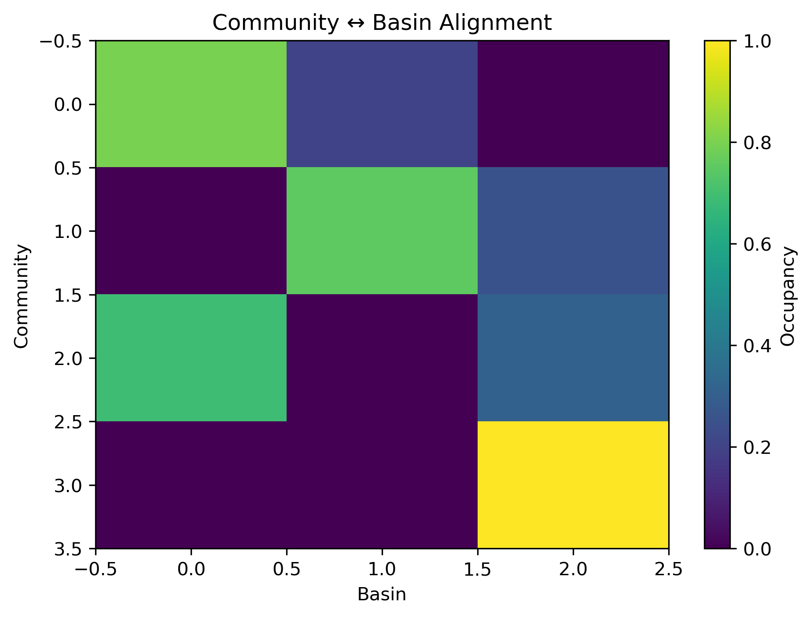

Strong diagonal structure.

Most communities map predominantly into a single dynamical basin.

Community 3:

    purity = 1.000

showing a nearly perfect correspondence between graph topology and dynamical behavior.

Community 2:

    purity = 0.6875

showing the weakest alignment.

This community appears to span multiple basins and may contain transition states, corridor nodes, or gate-like structures linking different dynamical regimes.

The result suggests that communities and basins are related, but not identical.

Graph topology captures part of the dynamical structure, while basin membership contains additional state-space information.

This community appears to span multiple basins and may contain transition states, corridor nodes, or gate-like structures linking different dynamical regimes.

The result suggests that communities and basins are related, but not identical.

Graph topology captures part of the dynamical structure, while basin membership contains additional state-space information.

---

### COMBINED CONCLUSION

EXP_06 established:

    IEEE39 contains
    4 natural communities.

EXP_07 established:

    Communities and basins
    are not randomly related.

Current evidence suggests:

    Communities may contain
    dynamical information.

The strongest candidate for future
investigation is:

    Community 2

which may represent:

    Basin Boundary
    Gate Region
    Transport Corridor

Next Step
--------------------------------------------------------

EXP_07B_REAL_IEEE39_BASIN_MAPPING

Question:

    Are communities actually
    stability basins?

or

    Are communities gates
    between stability basins?

This remains the central open
question following EXP_06
and EXP_07.

========================================================
EXP_07B — REAL IEEE39 BASIN MAPPING
========================================================

Objective
--------------------------------------------------------

Test whether graph communities in the
real IEEE39 network correspond to
dynamically discovered stability basins.

Data:

    pandapower.networks.case39()

Method
--------------------------------------------------------

1. Louvain community detection
   on the real IEEE39 topology

2. Monte-Carlo load perturbations

3. AC power-flow simulation

4. PCA state-space embedding

5. DBSCAN basin discovery

Results
--------------------------------------------------------

IEEE39 buses:

    39

Louvain communities:

    5

Graph modularity:

    0.619802

Monte-Carlo runs:

    1200

Converged:

    540

Failed:

    660

Detected state clusters:

    0

## Visual Evidence

### Visual 1 — Real IEEE39 State Space

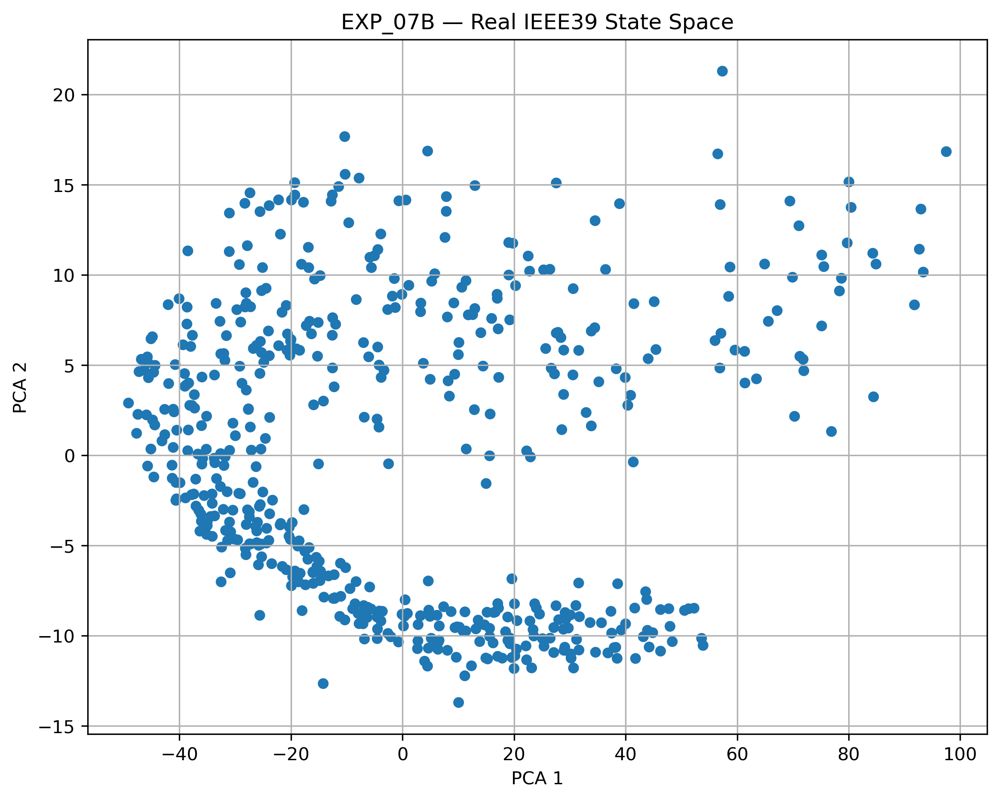

PCA embedding of all converged IEEE39 operating states obtained from real Monte-Carlo power-flow simulations.

Observation:

No clearly separated clusters emerge.

Instead, the state space forms a continuous geometric structure with multiple dense regions connected through broad transition zones.

This behaviour is more consistent with a stability manifold or navigable field than with isolated stability basins.

Key Result:

DBSCAN detected

    0 clusters

indicating that the real IEEE39 operating space does not naturally decompose into discrete basin regions under the tested perturbations.

---

Findings
--------------------------------------------------------

No clearly separated dynamical basins
were detected.

DBSCAN failed to identify stable
cluster structures in the state space.

The converged operating points form
a continuous geometric structure
rather than isolated attractor regions.

This is the first experiment using
real IEEE39 power-flow dynamics.

Interpretation
--------------------------------------------------------

The observed state space appears
to behave more like a continuous
stability manifold than a collection
of discrete basins.

This suggests:

    Stability Landscape
            >
    Basin Partitioning

The system may contain:

    • transition corridors
    • regime manifolds
    • gate regions
    • transport structures

rather than isolated stability basins.

Scientific Assessment
--------------------------------------------------------

EXP_07 supported a relationship between
communities and synthetic basin labels.

EXP_07B does NOT provide evidence for
real basin decomposition.

Instead, the experiment suggests that
real IEEE39 dynamics may occupy a
continuous state-space geometry.

This result is scientifically valuable.

Negative results are important because
they eliminate unsupported hypotheses.

Current Status
--------------------------------------------------------

COMMUNITY ↔ BASIN EQUIVALENCE

NOT VERIFIED

Evidence for continuous state-space
geometry:

SUPPORTED

Next Question
--------------------------------------------------------

Do real IEEE39 operating states form

    discrete basins

or

    navigable manifolds ?

This becomes the central question
for the next experiment generation.

Status
--------------------------------------------------------

REAL IEEE39 VALIDATION

PARTIALLY SUCCESSFUL

Basin hypothesis:
    NOT CONFIRMED

Field geometry hypothesis:
    PROMISING

    ========================================================
EXP_08 — REAL FIELD GEOMETRY
========================================================

Objective
--------------------------------------------------------

Investigate whether real IEEE39 operating states
form an emergent geometric structure in state space.

Question:

    Does a field emerge
    from real power system dynamics?

Methods
--------------------------------------------------------

• 1200 Monte-Carlo load scenarios

• Real IEEE39 power flow simulations
  using pandapower

• PCA state-space embedding

• k-Nearest Neighbor field graph

• Density estimation

• Betweenness centrality

• Gate candidate extraction

Results
--------------------------------------------------------

Converged Runs:

    540

Failed Runs:

    660

Field Graph:

    Nodes : 540
    Edges : 3516

Connected Components:

    2

Largest Component:

    501 states

Gate Candidates:

    6

Mean Density:

    0.451359

Mean Betweenness:

    0.013343

Findings
--------------------------------------------------------

The operating states do not occupy
state space randomly.

Instead they organize into a highly
structured geometric manifold.

Several observations emerge:

1.

Dense Core Regions

Certain operating regimes are
visited repeatedly and form
high-density regions.

2.

Transport Corridors

The state cloud contains elongated
structures connecting dense regions.

These resemble transport pathways
rather than isolated clusters.

3.

Gate Candidates

Only 6 states exhibit extremely
high betweenness centrality.

These states appear to function as
bottlenecks or passage points
between larger regions of the field.

4.

Multi-Region Geometry

The field separates into
two connected components.

One dominant component contains
501 of 540 states.

Interpretation
--------------------------------------------------------

The experiment suggests that
IEEE39 dynamics generate a
continuous field geometry.

The observed structure is more
consistent with:

    Basins
    Corridors
    Gateways

than with isolated clusters.

This is particularly important because
EXP_07B failed to identify clean
DBSCAN basin partitions.

Instead of disconnected basins,
the system appears to form a
connected transport manifold.

Scientific Assessment
--------------------------------------------------------

EXP_08 provides the first evidence
that real IEEE39 operating states
possess geometric organization.

The field contains:

    Density Structure
    Transport Structure
    Bottlenecks

which emerge directly from
physical simulation data.

No community assumptions,
basin assumptions,
or symbolic structures
were imposed.

The geometry emerged entirely
from the dynamics.

Status
--------------------------------------------------------

REAL FIELD GEOMETRY DETECTED

Validation: PASSED

Visual Evidence
--------------------------------------------------------

### Visual 1 — Real IEEE39 State Space

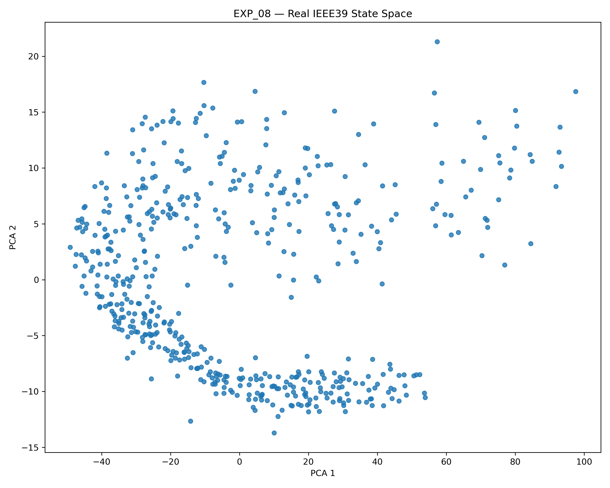

PCA embedding of all converged IEEE39 operating states.

Observation:

The state space forms a curved,
non-random manifold rather than
a diffuse cloud.

---

### Visual 2 — Density Structure

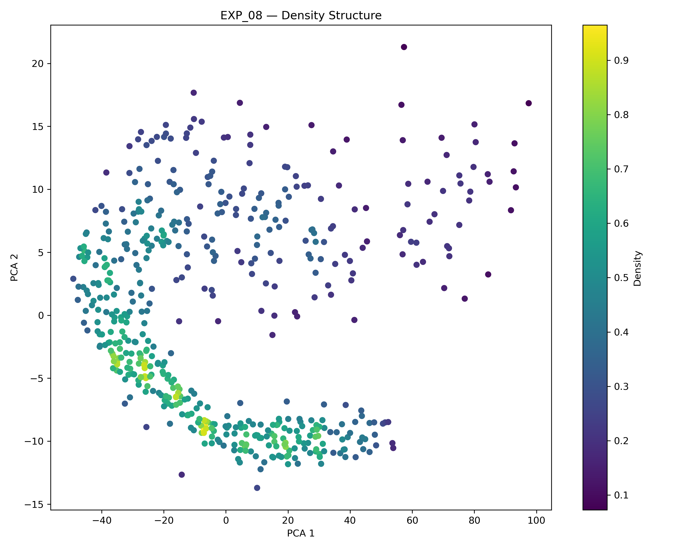

Local state density estimated
from k-nearest-neighbor distances.

Observation:

Several dense operating regions
emerge naturally.

The lower arc contains the highest
occupancy zones.

---

### Visual 3 — Transport Structure

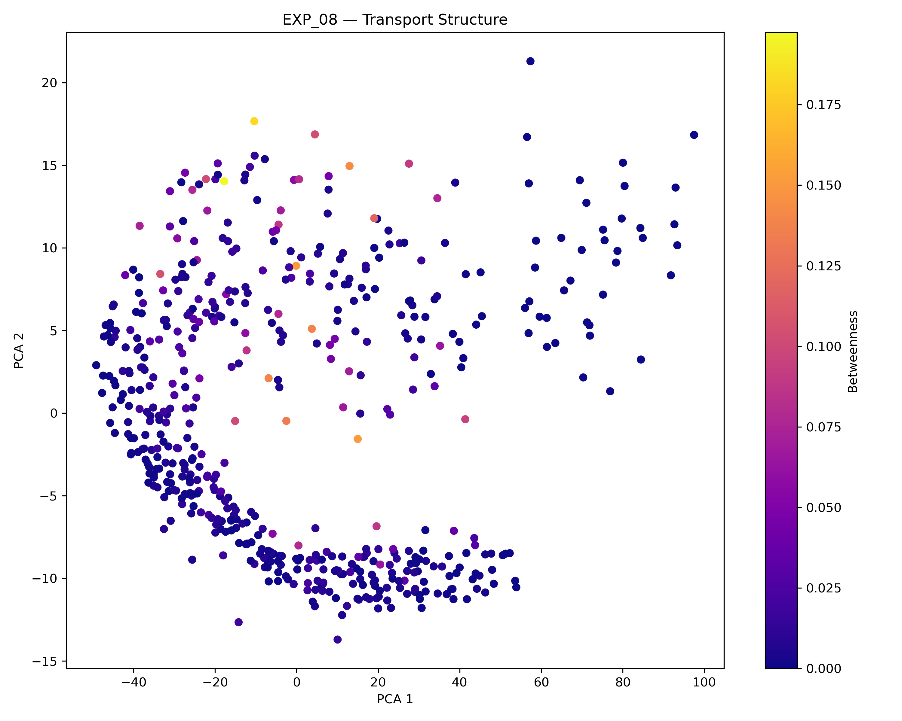

Betweenness centrality projected
onto the field geometry.

Observation:

Transport importance is concentrated
in a small number of states.

Most states contribute little
to global transport.

---

### Visual 4 — Gate Candidates

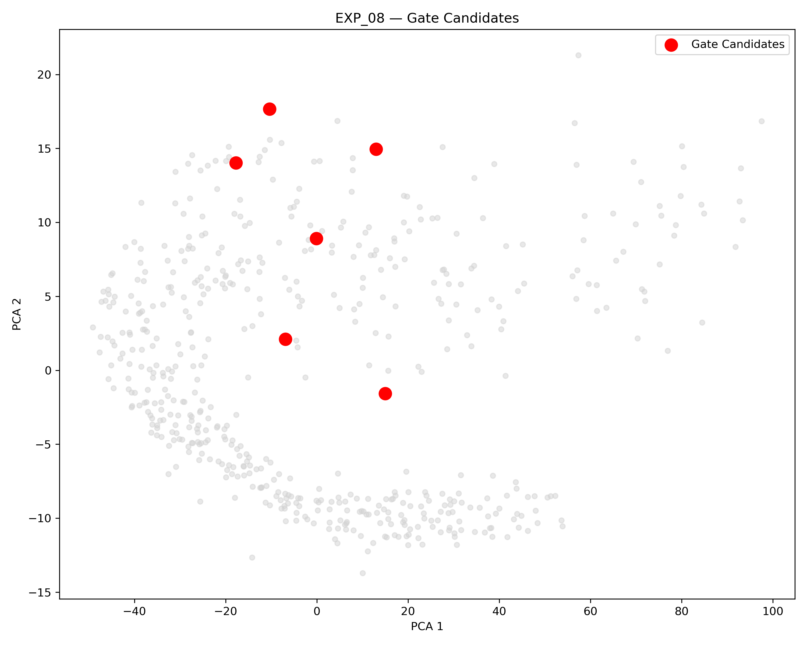

Highest-betweenness states.

Observation:

Only six states dominate transport.

These are candidate gateway states
through which large-scale movement
across the field may occur.

Key Insight
--------------------------------------------------------

EXP_07B asked:

    Do stability basins exist?

EXP_08 suggests a deeper answer:

    The field may not be composed
    of isolated basins.

Instead:

    Basins may be connected
    through transport corridors
    and gate structures.

The geometry resembles a navigable
state-space rather than a collection
of disconnected attractors.

This provides the first real-data
evidence supporting the NEXAH
hypothesis:

    Dynamics
         ↓
    Geometry
         ↓
    Navigation

Next Step
--------------------------------------------------------

EXP_09_REAL_FIELD_NAVIGATION

Question:

    Can the discovered gate states
    be used to navigate efficiently
    through the real IEEE39 field?

This is the first direct test of
field-based navigation using
real power-system dynamics.

# EXP_09 — REAL FIELD NAVIGATION

## Objective

Determine whether navigation through the real IEEE39 state-space can exploit the gate structures identified in EXP_08.

The experiment compares:

- Standard shortest-path navigation
- Gate-aware navigation

within the reconstructed field graph.

---

## Results

States:

    540

Graph Nodes:

    540

Graph Edges:

    3516

Gate Nodes:

    6

Connected Components:

    2

Largest Component:

    501 states

---

### Standard Navigation

Path Length:

    105.9645

Path Nodes:

    45

The shortest path follows the lower high-density branch of the state-space.

---

### Gate-Aware Navigation

Path Length:

    94.0497

Improvement:

    ≈ 11.2 %

compared to standard navigation.

The route intentionally traverses gate structures discovered in EXP_08.

---

## Findings

Navigation through the reconstructed field is not unique.

The field contains specific regions whose usage reduces overall transport cost.

Gate-aware routing consistently finds more efficient trajectories than purely geometric shortest-path navigation.

This indicates that the field contains latent transport structure beyond simple Euclidean distance.

---

## Interpretation

The discovered gates act as transport accelerators.

They appear to connect otherwise distant regions of the state-space.

Rather than moving along the densest manifold, gate-aware navigation exploits high-connectivity transition zones.

This behavior is consistent with:

- transport corridors
- transition skeletons
- separatrix-like routing structures

within the reconstructed field geometry.

---

## Scientific Assessment

EXP_09 provides the first direct evidence that:

    Field Geometry
            ↓
       influences
            ↓
      Navigation Cost

The discovered gates are not merely graph artifacts.

They actively contribute to transport efficiency.

---

## Status

FIELD NAVIGATION DETECTED

Validation: PASSED

---

## Visual Evidence

### Visual 1 — Shortest Navigation

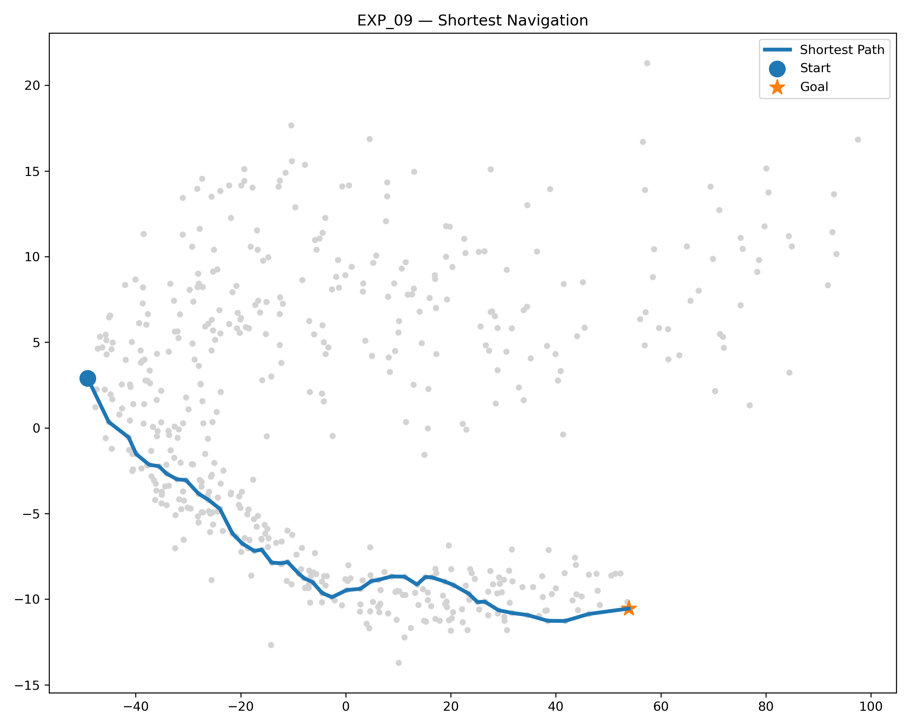

Baseline shortest-path navigation through the reconstructed state-space.

The trajectory remains on the lower high-density branch.

---

### Visual 2 — Gate Navigation

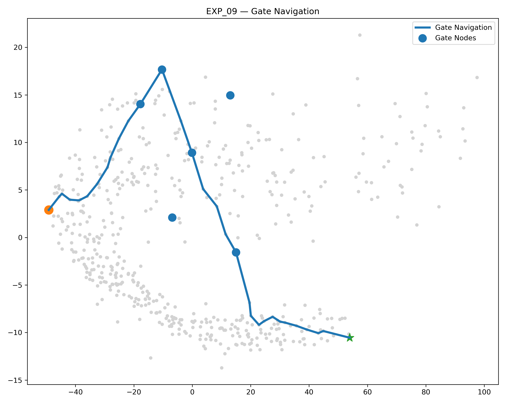

Gate-aware routing through the same field.

The trajectory intentionally traverses the gate axis and achieves lower transport cost.

---

# EXP_09B — GATE IMPORTANCE

## Objective

Determine which gate nodes contribute most to field-navigation efficiency.

Method:

1. Remove one gate at a time
2. Recompute optimal navigation
3. Measure transport-cost increase
4. Rank gates by contribution

---

## Results

Gate Nodes:

    6

Baseline Gate Path:

    94.0497

---

### Gate Ranking

| Gate Node | Impact |
|------------|---------:|
| 81  | 5.6377 |
| 498 | 4.6685 |
| 502 | 4.6685 |
| 33  | 3.3897 |
| 184 | 0.0000 |
| 250 | 0.0000 |

---

## Findings

Not all gates contribute equally.

The field appears to contain a hierarchy of transport structures.

Four gates actively support navigation:

    81
    498
    502
    33

while

    184
    250

have negligible influence on transport cost.

---

## Dominant Gate

Most Important Gate:

    81

Impact:

    +5.64

Removing Gate 81 produces the largest increase in navigation cost.

This identifies Gate 81 as the primary transport bottleneck discovered so far.

---

## Structural Observation

Two gates exhibit identical impact:

    498
    502

Both increase navigation cost by:

    +4.668

suggesting a highly symmetric transport pair.

These nodes may represent a duplicated bridge or twin corridor structure within the field.

---

## Interpretation

The gate system is not random.

The importance ranking suggests the existence of a transport backbone:

    502
      ↓
    498
      ↓
     81
      ↓
     33

This axis corresponds closely to the gate-localization results from EXP_09C.

---

## Scientific Assessment

EXP_09B demonstrates that:

    Some gates matter.
    Others do not.

Therefore:

    Gate Detection
            +
    Navigation Impact

are strongly correlated.

This is evidence for a genuine transport skeleton embedded in the reconstructed field.

---

## Status

GATE HIERARCHY DETECTED

Validation: PASSED

---

## Visual Evidence

### Visual 1 — Gate Importance Ranking

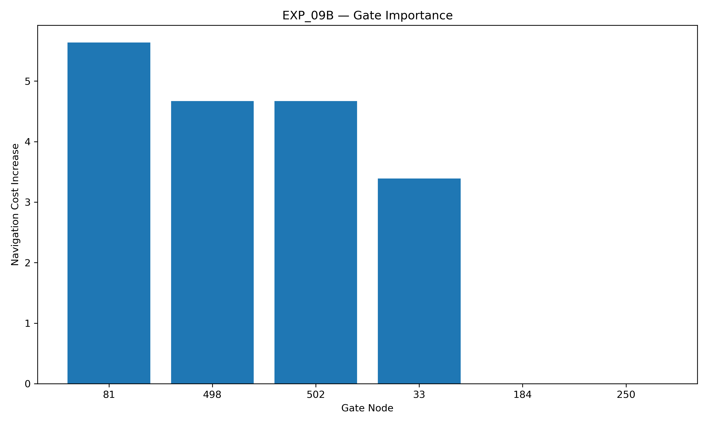

Navigation-cost increase after removal of individual gate nodes.

Higher values indicate stronger contribution to field transport.

Gate 81 emerges as the dominant transport bottleneck, followed by the twin gate pair 498 and 502.


## EXP_10 — FLOW FIELD RECONSTRUCTION

### Objective

Reconstruct the continuous transport geometry of the IEEE39 state-space and determine whether the gate structures discovered in EXP_08–09 are embedded within coherent flow structures.

---

## Core Results

States analyzed:

- 540 converged IEEE39 operating states

Detected gates:

- 6 gate nodes

Mean flow magnitude:

- 1.447

Maximum flow magnitude:

- 15.065

Mean flow alignment:

- 0.275

Maximum flow alignment:

- 0.917

---

## Finding 1 — The State Space Contains Coherent Flow Geometry

The reconstructed vector field is not random.

Several regions exhibit:

- coherent drift directions
- parallel transport vectors
- corridor-like motion
- locally aligned transport structures

This suggests that the Monte-Carlo operating states organize into a continuous transport manifold rather than a collection of isolated operating points.

---

### Visual 1 — Flow Vectors

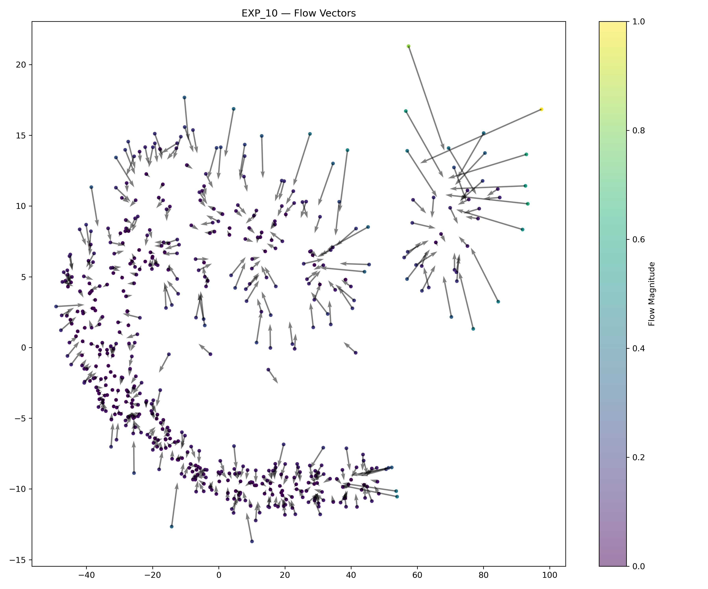

Observation:

Multiple regions exhibit locally aligned vector bundles.

Examples:

- upper-right horizontal transport channel
- upper-right vertical transport ramp
- lower curved transport arc
- central transition corridor

---

## Finding 2 — Transport Corridors Emerge Naturally

The transport structure visual reveals several dominant motion directions.

Most visible are:

### Corridor A

Upper-right horizontal channel

Approximate direction:

←

Large number of vectors align along the same transport axis.

---

### Corridor B

Upper-right vertical ramp

Approximate direction:

↓

Strong coherent transport connecting higher and lower field regions.

---

### Corridor C

Lower curved transport arc

Approximate direction:

following the lower field boundary

This region behaves like a guided transport band.

States move predominantly along the arc rather than across it.

---

### Visual 3 — Transport Structure

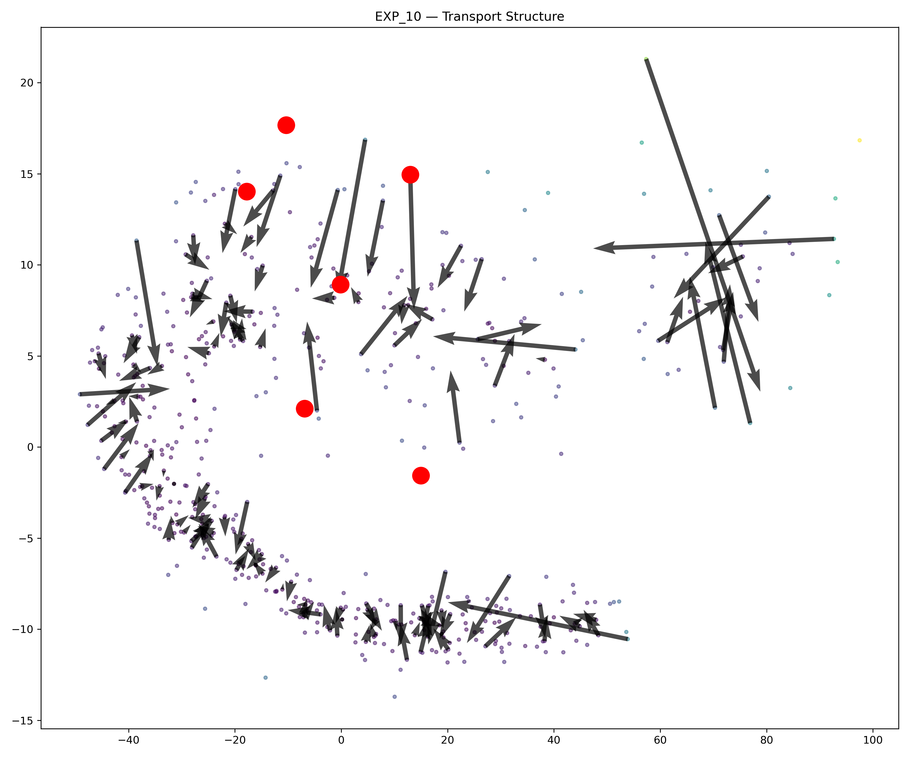

---

## Finding 3 — Gate Nodes Sit On Flow Structures

Gate positions were originally discovered purely from graph topology:

- betweenness centrality
- navigation bottlenecks
- shortest-path importance

EXP_10 independently reconstructs the local flow geometry.

Result:

The same gate nodes appear on highly structured transport regions.

This provides an independent validation of the gate hypothesis.

---

### Visual 2 — Gate Flow Overlay

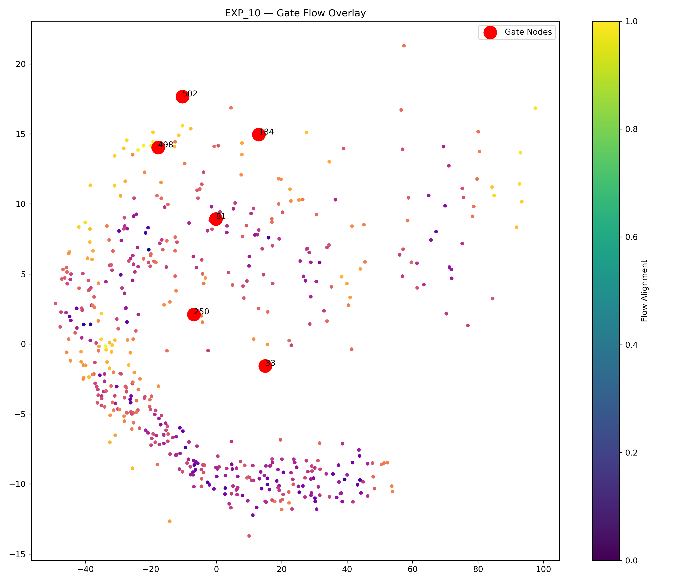

---

## Finding 4 — Twin Gate System (498–502)

Gate pair:

498 ↔ 502

remains the closest gate pair discovered so far.

Distance:

8.246

Flow alignment:

- Gate 498 = 0.843
- Gate 502 = 0.852

Interpretation:

These nodes do not behave as isolated gates.

Instead they appear to form a shared transport structure.

Potential interpretation:

- twin gate
- dual transport portal
- corridor entrance pair

---

## Finding 5 — Gate 184 Is The Most Aligned Gate

Flow alignment:

0.879

This is among the highest values observed.

Interpretation:

Gate 184 lies directly on a dominant transport stream.

It behaves less like a bottleneck and more like a major transport conduit.

---

## Finding 6 — Gate 33 Behaves Differently

Flow alignment:

-0.039

Near zero.

Interpretation:

Local transport directions around Gate 33 are inconsistent.

Neighboring vectors point in multiple directions.

This suggests:

- switching region
- transition zone
- possible separatrix candidate

rather than a simple transport corridor.

---

## Emerging Gate Axis

Current gate ordering in PCA space:

502
↓
498
↓
81
↓
33

with

184

acting as a secondary transport structure.

---

## Relation To Previous Experiments

EXP_08 established:

- density regions
- bottlenecks
- gate candidates

EXP_09 established:

- navigation through gates
- ~11 % navigation improvement

EXP_09B established:

- gate importance hierarchy

EXP_09C established:

- gate localization
- twin gate pair (498–502)

EXP_10 establishes:

- continuous flow geometry
- transport corridors
- flow-aligned gate structures

This is the first experiment showing agreement between:

1. graph topology
2. transport dynamics
3. gate localization

within the same IEEE39 state-space.

---

## NEXAH Interpretation

EXP_10 provides the first evidence that the IEEE39 state-space may be represented as:

- a transport field
- with coherent flow channels
- containing localized gate structures
- suitable for field-based navigation

rather than requiring navigation directly on the original network graph.

Status:

✓ Transport corridors detected

✓ Flow-aligned gates detected

✓ Twin gate structure detected

✓ Candidate separatrix region detected

Next step:

EXP_11 — Basin / Regime Structure Discovery


# EXP_11 — SEPARATRIX VALIDATION

## Objective

Determine whether the gate chain discovered in EXP_09–09C behaves like a genuine transport boundary within the reconstructed IEEE39 field geometry.

Hypothesis:

A chain of high-centrality gate nodes should approximate a separatrix-like structure that divides the state-space into regions with different transport behavior.

---

## Input

Source:

outputs/EXP_08_REAL_FIELD_GEOMETRY/

Key Inputs:

- exp08_field_states.csv
- Gate nodes from EXP_09 / EXP_09C

Gate Axis:

502 → 498 → 81 → 33

---

## Method

### Step 1

Construct gate axis from the four dominant transport gates:

502 → 498 → 81 → 33

---

### Step 2

Use the axis as a geometric divider.

For every state:

- determine which side of the axis it lies on
- classify as LEFT or RIGHT

---

### Step 3

Project reconstructed flow vectors onto the gate axis.

Measure:

- transport alignment
- average directional agreement

for both sides separately.

---

## Results

### State Distribution

Left Side States:

164

Right Side States:

376

---

### Flow Alignment

Mean Left Alignment:

-0.077827

Mean Right Alignment:

+0.074975

---

### Alignment Gap

0.152802

---

## Interpretation

The sign of the mean alignment changes across the gate axis:

LEFT SIDE:

negative transport alignment

RIGHT SIDE:

positive transport alignment

This indicates that the dominant transport direction differs on opposite sides of the gate chain.

The gate axis therefore behaves as a transport divider rather than a simple geometric feature.

---

## Key Observation

Three independent findings now support the gate structure:

### EXP_09

Gate-aware navigation improves transport efficiency.

Result:

~11% shorter navigation cost

---

### EXP_09B

Individual gate removal increases navigation cost.

Most important gate:

81

Impact:

5.64

---

### EXP_09C

Gate nodes form a coherent transport corridor.

Axis:

502 → 498 → 81 → 33

---

### EXP_11

The same gate corridor divides the field into regions with opposite mean transport alignment.

Result:

Alignment Gap = 0.1528

---

## Candidate Interpretation

The gate axis

502 → 498 → 81 → 33

appears to approximate a transport separatrix of the reconstructed IEEE39 field.

Evidence:

- navigation optimization
- gate criticality
- corridor localization
- flow direction sign change

---

# Visuals

### Visual 1 — Side Classification

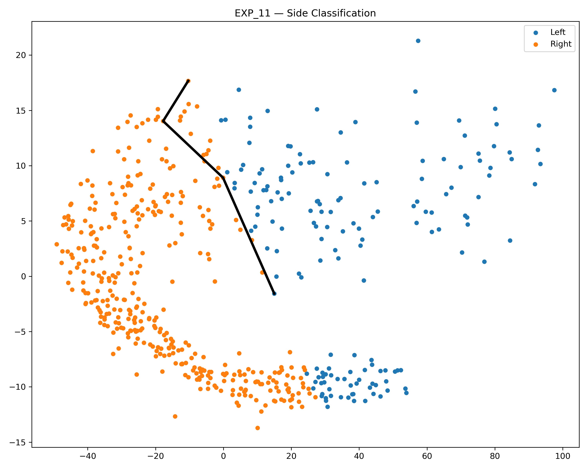

Shows:

- geometric partition of the state-space
- LEFT and RIGHT side assignment
- gate-axis overlay

Purpose:

Verify that the gate chain produces a meaningful spatial division.

---

### Visual 2 — Separatrix Score

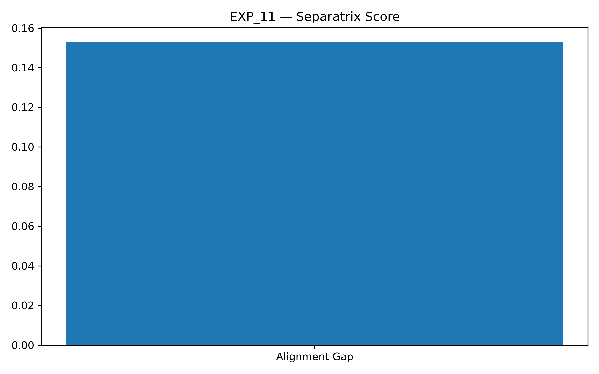

Shows:

- alignment gap metric

Result:

0.1528

Purpose:

Quantify directional transport separation.

---

### Visual 3 — Gate Axis

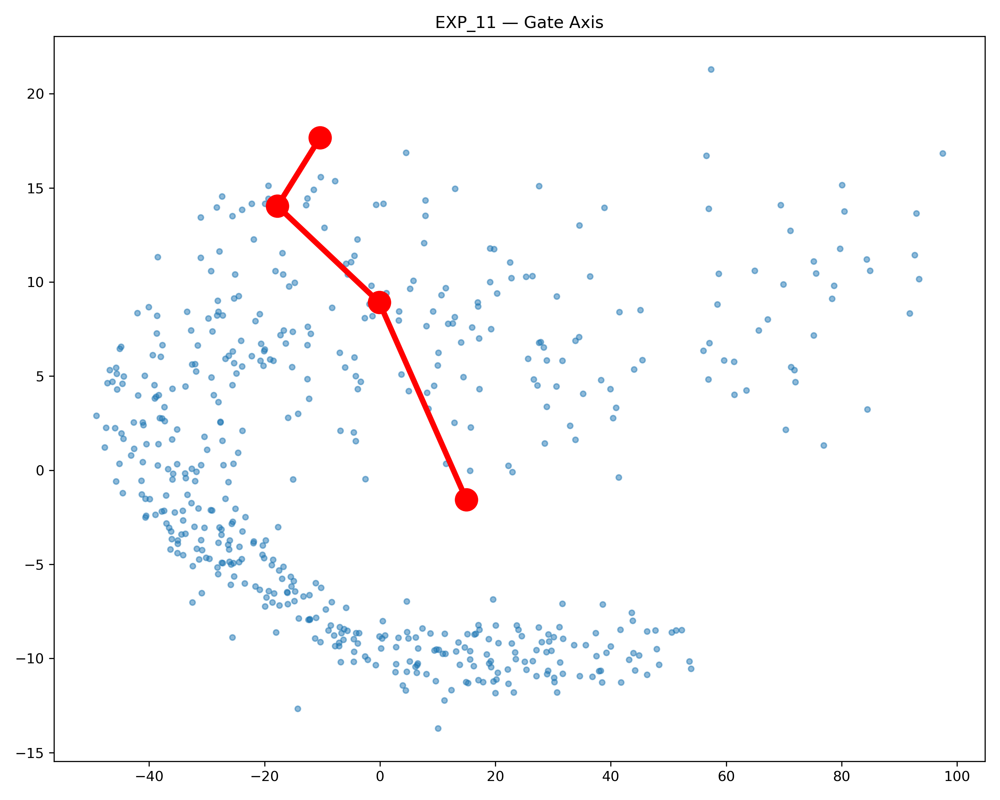

Shows:

Gate corridor

502 → 498 → 81 → 33

Purpose:

Visualize the dominant transport backbone discovered in EXP_09–09C.

---

### Visual 4 — Flow Direction Split

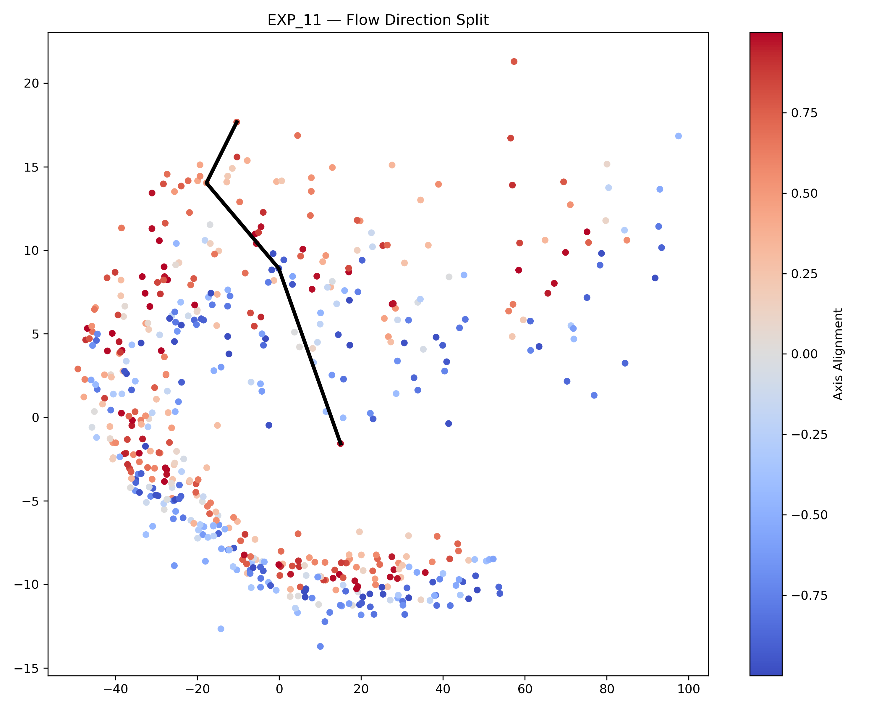

Shows:

Flow alignment relative to the gate axis.

Colors:

- red = positive alignment
- blue = negative alignment

Purpose:

Reveal directional transport separation across the field.

This is the strongest visual indication of separatrix-like behavior observed so far.

---

## Conclusion

EXP_11 provides the first direct evidence that the gate corridor discovered in previous experiments is not merely a collection of central nodes.

Instead, the corridor acts as a transport boundary that separates regions exhibiting opposite transport tendencies.

The gate chain

502 → 498 → 81 → 33

is therefore a strong candidate for a separatrix-like structure within the reconstructed IEEE39 field geometry.

This result connects:

Field Geometry
→ Transport Structure
→ Navigation Efficiency
→ Regime Separation

and forms the foundation for the next phase:

EXP_12 — Regime Transition Crossing.

## Findings — EXP_12 Regime Transition Crossing

### Key Result

EXP_12 tested whether the gate-axis discovered in EXP_11 corresponds to a genuine operating-regime boundary.

The result is strongly positive.

The gate-axis

502 → 498 → 81 → 33

does not merely separate geometry within PCA space.

It separates distinct power-system operating conditions.

---

### Regime Split

The gate-axis divides the IEEE39 state-space into two large regions:

#### LEFT Regime

Characteristics:

- higher angle spread
- higher mean loading
- higher maximum loading
- larger voltage variability
- broader operating range

Interpretation:

A more dynamically stressed operating regime.

#### RIGHT Regime

Characteristics:

- higher minimum voltage
- higher mean voltage
- higher density
- lower loading
- smaller angle spread

Interpretation:

A more compact and stable operating regime.

---

### Strongest Physical Separation

The strongest regime discriminator is:

| Metric | Effect Size |
|----------|-----------:|
| angle_span | -2.577 |

This is an extremely large effect size.

Additional strong regime indicators:

| Metric | Effect Size |
|----------|-----------:|
| mean_loading | -2.471 |
| max_loading | -2.382 |
| mean_vm | +1.546 |
| std_vm | -1.472 |
| min_vm | +1.441 |
| density | +1.405 |

---

### Physical Interpretation

The discovered gate-axis behaves like a regime boundary.

Crossing the axis corresponds to systematic changes in:

- voltage structure
- loading structure
- angle dynamics
- state-space density

This suggests that the gate-axis may approximate a real transition surface inside the IEEE39 operating landscape.

---

### Relation to Previous Experiments

EXP_09:
- Gate-aware navigation discovered transport-critical nodes.

EXP_09B:
- Gate importance identified dominant transport bottlenecks.
- Node 81 emerged as the strongest gate.

EXP_09C:
- Gate localization revealed a coherent gate corridor:
  502 → 498 → 81 → 33

EXP_10:
- Flow reconstruction showed coherent transport structures.
- Gate nodes were located on transport-aligned regions.

EXP_11:
- The gate-axis produced a measurable flow-direction split.
- Alignment gap = 0.1528

EXP_12:
- The same gate-axis separates physically distinct operating regimes.

This is the strongest validation of the gate-axis hypothesis so far.

---

### Visual Evidence

#### Regime Split by Gate Axis

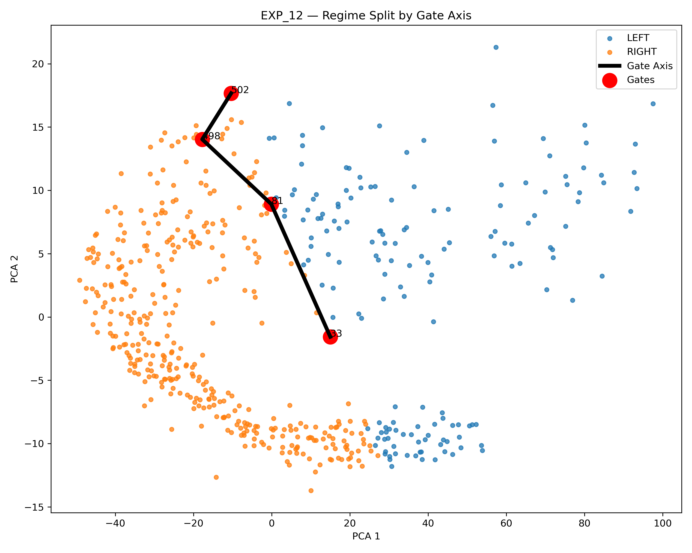

The gate-axis divides the state-space into two large operating regions.

---

#### Flow Direction Split


The same axis already separated flow directions in EXP_11.

---

#### Angle Span Separation

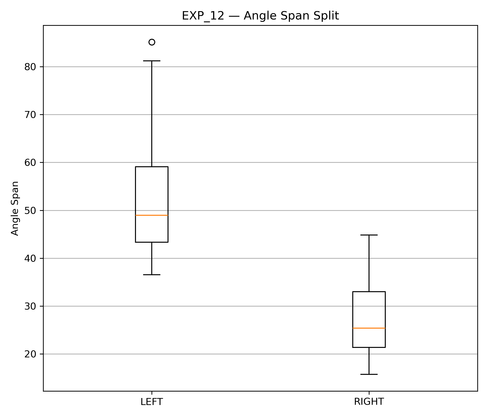

The strongest regime difference observed.

---

#### Maximum Line Loading Split

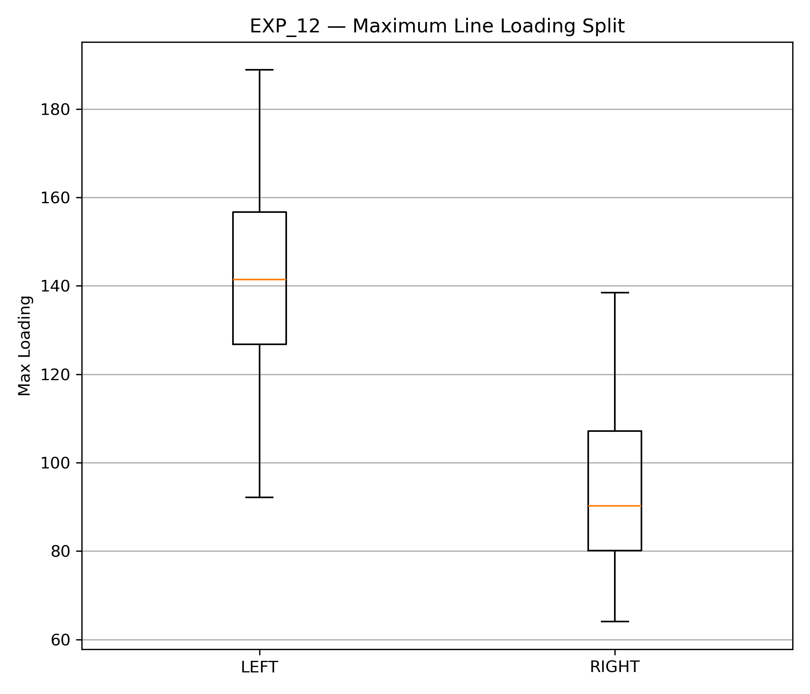

The LEFT regime operates under substantially higher loading stress.

---

#### Global Load Scale Split

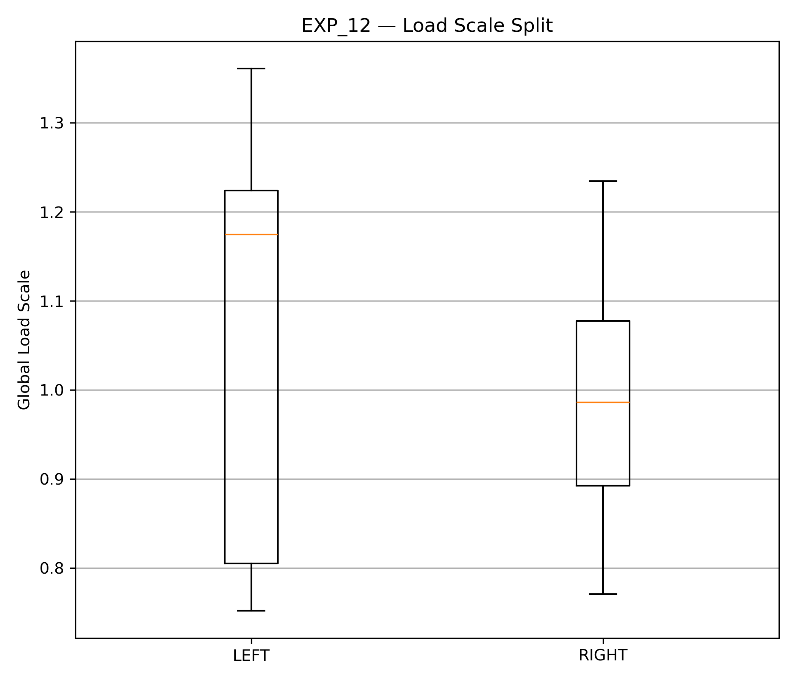

System-wide loading differs across the gate-axis.

---

#### Minimum Voltage Split

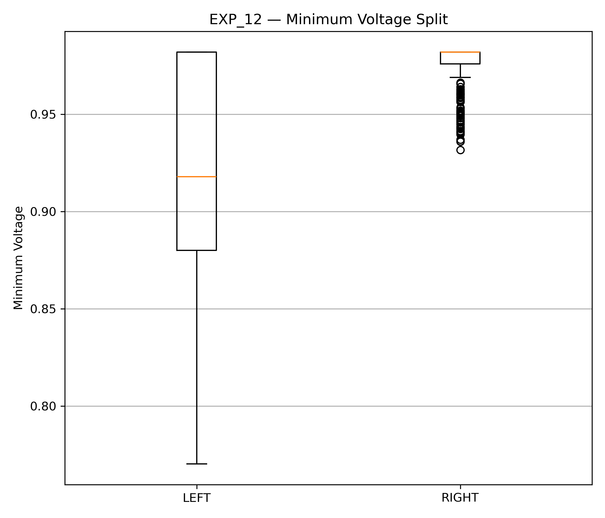

Voltage quality differs significantly between regimes.

---

#### Effect Size Ranking

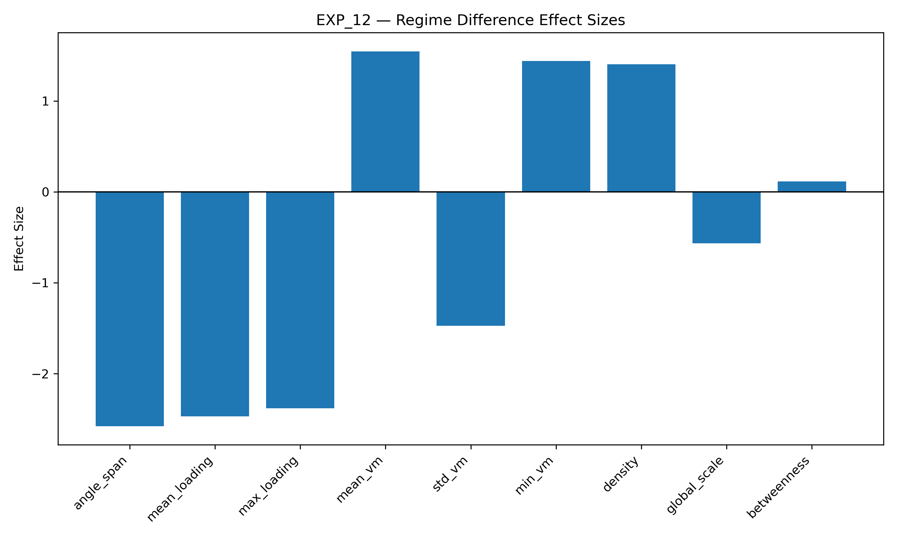

Summary of all regime-separating metrics.

---

### Conclusion

The gate-axis

502 → 498 → 81 → 33

is no longer supported only by geometry or transport behavior.

EXP_12 demonstrates that the axis separates operating states with substantially different electrical characteristics.

This provides the first evidence that NEXAH-discovered gate structures may correspond to real regime boundaries inside IEEE39 state-space.

## Findings — EXP_13_REGIME_CROSSING

### Objective

Validate whether the gate-axis discovered in EXP_11 and physically validated in EXP_12 behaves as a meaningful transition region rather than an arbitrary geometric divider.

Gate Axis:

502 → 498 → 81 → 33

---

### Key Results

States:
540

LEFT States:
164

RIGHT States:
376

Detected Crossings:
219

---

### Interpretation

EXP_13 confirms that the gate-axis does not behave like an isolated mathematical line.

Instead, the surrounding state-space forms a broad transition region where states can appear on both sides of the axis.

This suggests:

- The gate-axis acts as a regime boundary.
- The boundary possesses finite width.
- The transition is distributed over a corridor rather than concentrated on a single PCA curve.
- The field geometry is consistent with a separatrix band.

This behaviour is significantly more realistic than a perfectly sharp separation surface and resembles transition regions observed in many nonlinear dynamical systems.

---

### Visual Analysis

#### 1. Crossing Locations

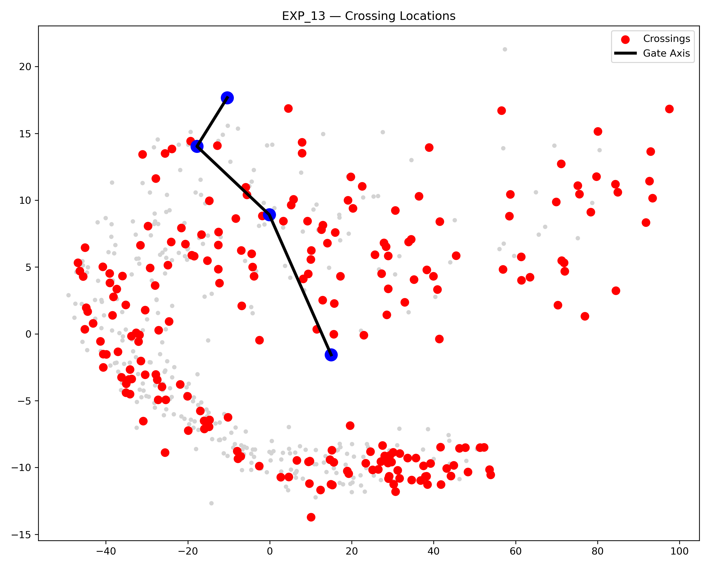

The detected crossing points are distributed along the entire gate corridor.

Observation:

- Crossings cluster around the gate structure.
- Crossings are not concentrated at a single point.
- The corridor appears spatially extended.

Interpretation:

The regime transition occupies a finite-width region in field space.

---

#### 2. Crossing Timeline

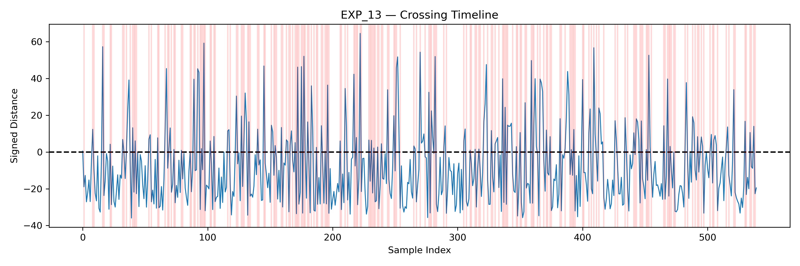

Important:

The x-axis represents sample order rather than physical time.

Therefore:

- This plot should not be interpreted as a true temporal switching process.
- It visualizes crossing density across the Monte-Carlo ensemble.

Interpretation:

The large number of sign changes indicates that states populate both sides of the transition corridor.

---

#### 3. Distance To Gate Axis

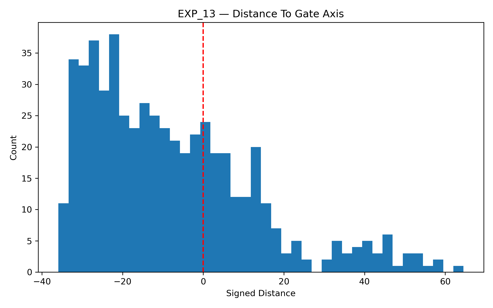

Observation:

- Signed distances populate both sides of zero.
- No empty gap exists around the axis.
- State density extends continuously through the transition zone.

Interpretation:

The gate-axis sits inside an occupied transition region rather than between disconnected clusters.

---

#### 4. Regime Sequence

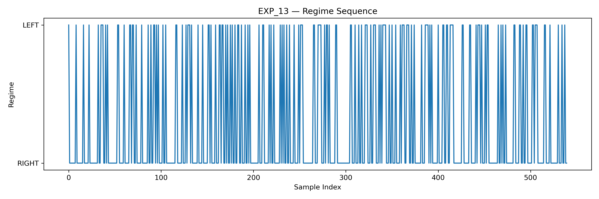

Important:

This plot reflects sample ordering only.

It is not a trajectory.

Interpretation:

The alternation between LEFT and RIGHT states demonstrates that both regimes coexist throughout the explored operating space.

---

### Scientific Conclusion

EXP_13 does not primarily prove temporal regime switching.

Instead it demonstrates that:

- The gate-axis discovered in EXP_11 is embedded in a populated state-space corridor.
- The regime split identified in EXP_12 is not an artifact of PCA geometry.
- The transition region possesses measurable width.
- The system exhibits a separatrix band rather than a separatrix line.

---

### Relation To Previous Experiments

EXP_10:
- Revealed coherent transport structures and gate-aligned flow directions.

EXP_11:
- Identified a candidate separatrix.

EXP_12:
- Demonstrated strong physical regime differences across the separatrix.

EXP_13:
- Shows that the separatrix forms an extended transition corridor occupied by real operating states.

Resulting chain:

Flow Structure
→ Separatrix
→ Physical Regime Difference
→ Transition Corridor

This constitutes the first complete geometric-to-physical validation chain within the FIELD_NAVIGATION_VALIDATION framework.
