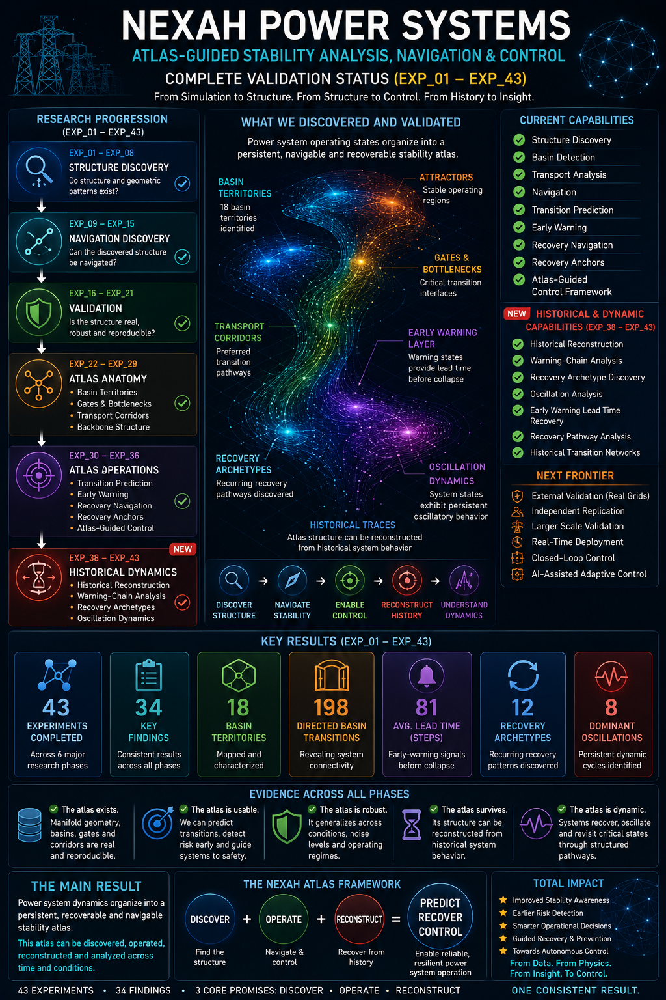

# ⚡ NEXAH Power Systems

### Atlas-Guided Stability Analysis, Navigation and Control for Electrical Power Networks

---

## Overview

This repository contains the power-system application layer of the NEXAH framework.

NEXAH investigates whether complex power-system dynamics organize into discoverable and navigable state-space structures.

Rather than treating operating conditions as isolated points, NEXAH constructs a stability atlas containing:

- Basin Territories
- Attractors
- Transport Corridors
- Gates & Bottlenecks
- Recovery Anchors
- Atlas-Guided Control Pathways

The framework has been validated across IEEE benchmark systems and demonstrates that operating states organize into coherent geometric structures rather than random state clouds.

---

## 🌌 Stability Field Dynamics


 
NEXAH transforms dynamical simulations into navigable stability fields.

```text
System Simulation
        ↓
Structure Discovery
        ↓
Field Construction
        ↓
Atlas Generation
        ↓
Prediction
        ↓
Recovery
        ↓
Control
```

The objective is not only to observe system behavior but to discover actionable structure that supports navigation and intervention.

---

## Atlas Operations & Historical Dynamics



The latest validation phase demonstrates that the discovered atlas can be used operationally for:

- Transition Prediction
- Trajectory Forecasting
- Early Warning Detection
- Recovery Corridor Discovery
- Recovery Anchor Identification
- Atlas-Guided Control

In addition, the most recent experiments demonstrate that atlas structure can be reconstructed from historical operational archives.

NEXAH now supports both:

- Atlas Discovery from simulations
- Atlas Reconstruction from historical operational data

This transforms the atlas from a descriptive model into an operational decision-support framework.

---

## Historical Dynamics Reconstruction


EXP_38–EXP_40 investigated whether atlas structure can be reconstructed from historical repository artifacts without rerunning the original simulation pipeline.

Recovered layers include:

- State Classification
- Basin Evidence
- Atlas Organization
- Field Geometry
- Warning-State Dynamics
- Early Warning Structure

Key findings:

- 24 historical state archives recovered
- measurable warning-state dynamics discovered
- warning states precede collapse events
- mean warning lead time: 81.35 state steps
- maximum warning lead time: 96 state steps

Observed progression:

```text
SAFE
 ↓
WARNING
 ↓
CRITICAL
 ↓
COLLAPSED
```

rather than:

```text
SAFE
 ↓
COLLAPSED
```

The results indicate that instability develops through structured intermediate regimes rather than abrupt transitions.

---

## Recovery Archetypes & Oscillation Dynamics


EXP_41–EXP_43 investigated the internal dynamics of historical warning-state archives.

Recovered structures include:

- degradation chains
- recovery archetypes
- oscillatory dynamics

Key observations:

### Recovery Archetypes

Historical trajectories repeatedly converge toward similar stabilization pathways.

Recovery therefore appears structured rather than random.

### Oscillation Dynamics

Dominant oscillation:

```text
SAFE ↔ CRITICAL
```

Additional oscillations:

```text
SAFE ↔ WARNING
WARNING ↔ CRITICAL
SAFE ↔ COLLAPSED
```

These findings suggest that instability often develops through repeated excursions between neighboring regimes.

The atlas therefore contains:

- warning dynamics
- recovery dynamics
- oscillatory dynamics

that remain recoverable from historical archives.

---

## Experimental Status

The NEXAH Power Systems program currently contains more than 43 validation and reconstruction experiments.

The most recent phase extends NEXAH beyond atlas discovery and operations toward historical dynamics reconstruction, recovery archetype discovery, and oscillation analysis.

| Phase | Focus |
|---------|---------|
| EXP_01 – EXP_08 | Structure Discovery |
| EXP_09 – EXP_15 | Navigation Discovery |
| EXP_16 – EXP_21 | Validation |
| EXP_22 – EXP_29 | Atlas Anatomy |
| EXP_30 – EXP_36 | Prediction, Recovery & Control |
| EXP_38 – EXP_43 | Historical Dynamics Reconstruction |

Current results demonstrate:

✅ Basin Discovery

✅ Transport Backbone Detection

✅ Transition Prediction

✅ Early Warning Detection

✅ Recovery Corridor Discovery

✅ Recovery Anchor Discovery

✅ Atlas-Guided Control Framework

✅ Historical Atlas Reconstruction

✅ Early-Warning Dynamics Reconstruction

✅ Recovery Archetype Discovery

✅ Oscillation Dynamics Discovery

---

## Power Systems Architecture

### Validation Layer

Quantitative validation and evidence generation.

📂 VALIDATION_LAYER/

---

### IEEE X-Ray Pipeline

Feature extraction and geometric state reconstruction.

📂 ieee_xray_pipeline/

---

### IEEE9

Minimal reproducible navigation environment.

📂 nexah_ieee9/

---

### IEEE X

Scaling experiments across larger benchmark systems.

📂 nexah_ieeeX/

---

### Field Navigation Validation

Primary research environment for atlas construction and operational validation.

Focus areas include:

- Atlas Discovery
- Basin Detection
- Transport Networks
- Transition Prediction
- Recovery Navigation
- Early Warning Systems
- Atlas-Guided Control

📂 FIELD_NAVIGATION_VALIDATION/

---

## Core Principle

```text
Simulation
      ↓
Structure
      ↓
Field
      ↓
Geometry
      ↓
Basins
      ↓
Atlas
      ↓
Prediction
      ↓
Recovery
      ↓
Control


Historical Archives
      ↓
Reconstruction
      ↓
Atlas
```

---

## Current Research Questions

- How universal are state-space atlases?
- Do transport corridors emerge consistently?
- Can recovery structures be identified before intervention?
- Can atlas-guided control outperform conventional strategies?
- Can navigable geometry improve resilience and stability management?

---

## Current Development Status

| Capability | Status |
|------------|---------|
| Structure Discovery | ✅ |
| Basin Detection | ✅ |
| Navigation | ✅ |
| Transport Analysis | ✅ |
| Transition Prediction | ✅ |
| Early Warning | ✅ |
| Recovery Navigation | ✅ |
| Atlas-Guided Control | ✅ |
| Historical Reconstruction | ✅ |
| Recovery Archetypes | ✅ |
| Oscillation Analysis | ✅ |
| External Validation | 🟡 |
| Real-Time Operator Trials | 🟡 |

---

## Collaboration & Validation

The next phase of development focuses on independent validation and real-world testing.

We welcome collaboration with:

- Power-System Researchers
- Grid Operators
- Control Engineers
- Infrastructure Operators
- Digital Twin Developers
- Complex Systems Scientists

Researchers interested in evaluating NEXAH on independent datasets, benchmark systems, or operational environments are encouraged to participate.

The central question remains:

**Do navigable state-space atlases represent a general organizing principle of complex dynamical systems?**

---

## Vision

The long-term objective is to move beyond passive monitoring:

```text
Observation
      ↓
Monitoring
```

toward:

```text
Observation
      ↓
Structure Discovery
      ↓
Atlas Construction
      ↓
Prediction
      ↓
Navigation
      ↓
Recovery
      ↓
Control
      ↓
Historical Reconstruction
      ↓
Atlas Memory
```

for resilient and adaptive power-system operation.

---

**Discover Structure. Navigate Stability. Enable Control.**

