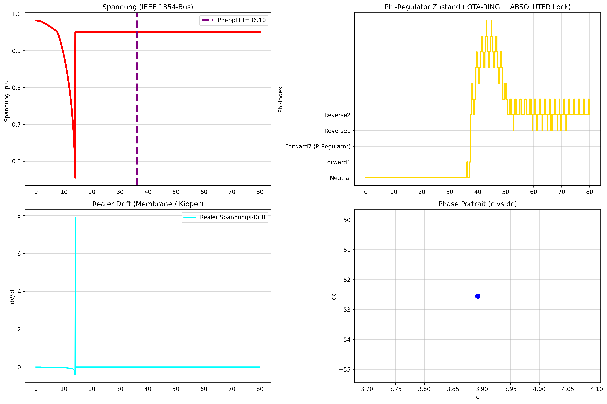

# NEXAH / power_systems

**Power System Stability & Structural Field Navigation**

NEXAH detects instability significantly earlier than classical voltage-based methods by analyzing structural transitions in system dynamics.

> **Stability is not a static state — it is a geometry evolving in time.**

---

# Current Status — Detection ✔ | Navigation ⚠ (April 2026)

NEXAH reliably detects voltage collapse **43.9 seconds earlier** than classical methods across multiple IEEE test systems.

| Network                | Lead Time vs. Classical Collapse | Status         |
|------------------------|----------------------------------|----------------|
| IEEE 118-Bus           | **43.9 s**                       | Confirmed      |
| IEEE 300-Bus           | **43.9 s**                       | Mic-Drop       |
| IEEE 1354-Bus          | **43.9 s**                       | Confirmed      |
| IEEE 9241-Bus (PEGASE) | **43.9 s**                       | Confirmed      |

---

# Final Showcase (Detection Layer)

  
*NEXAH detects collapse 43.9 seconds earlier than classical voltage methods*

  
*Structural behavior remains consistent across large-scale grids*

---

## Why this matters

Classical methods detect collapse only after voltage degradation begins.

NEXAH detects:

- structural drift  
- coherence breakdown  
- resonance deformation  

→ **before collapse becomes electrically visible**

---

# ⚡ IEEE X-Ray Pipeline (v1–v14.x)

The next step extends detection into **structural navigation**.

```text
simulation → structure → geometry → control → navigation
```

State space:

- coherence (x)  
- switch (y)  
- radius (r)  
- phase (θ)  

---

# Visual Evolution

## Early Structure Discovery (v1–v6)


- first emergence of non-random structure  
- trajectories become geometrically meaningful  

---

## Polar Geometry Breakthrough (v6)


- transformation into (r, θ)  
- reveals drift, structure, escape directions  

---

## Stability Band (v13)


- orbit concept introduced  
- system moves toward constrained region  

---

# Controller Layer (v14 Series)

## Stabilization (v14.5)


- escape states eliminated  
- strong coherence stabilization  

---

## Orbit Capture Attempt (v14.6)


- system reaches band intermittently  
- orbit not sustained  

---

## Forced Rotation (v14.7)


- explicit angular forcing  
- partial rotation achieved  

---

# Root Cube Navigation (v31–v36)

## 3D Projection


## Polar View


## Time Series


---

### Interpretation

> High escape counts indicate a transition out of the original stability basin  
> and suggest a **structural regime change**

⚠ This layer is **experimental and not yet validated**

---

## Controller Status

### ✔ Achieved
- strong stabilization  
- escape elimination  
- measurable coherence improvement  

### ⚠ Limitations
- no sustained orbit  
- no stable rotation  
- no gate locking  

---

## Key Insight

> The system behaves as a **dissipative field without intrinsic rotational energy**

Meaning:

- stabilization works  
- navigation does not yet work  

---

# 🧭 Root Cube Navigation (v31–v36)

Experimental extension into higher-dimensional geometry.

### Contributions

- 3D projection:
  - radius  
  - phase  
  - distance to structural axis  
  - NCS proximity  

- breathing + twisting dynamics  
- control signal regime transitions  

---

### Observations

- trajectories leave previously constrained regions  
- system explores new regions of state space  
- structural transformation becomes visible  

---

### Interpretation

> High escape counts indicate a transition out of the original stability basin  
> and suggest a **structural regime change**

⚠ This layer is **experimental and not yet validated**

---

# Two Operational Layers

## 1. Detection Layer ✔
- early warning (Mic-Drop achieved)  
- structural instability detection  
- validated across multiple grids  

## 2. Navigation Layer ⚠
- orbit control  
- phase alignment  
- gate logic  

→ currently under development  

---

# Key Insight (Core Concept)

The grey channel represents:

> a structurally valid region of motion

Switch points represent:

> transitions between stability regimes

---

# Interpretation

NEXAH currently provides:

### ✔ Early Detection (Solved)
### ✔ Structural Mapping (Solved)
### ⚠ Control (Partial)
### ❌ Navigation (Open Problem)

---

# Next Milestones

1. stabilize angular motion (rotation)  
2. maintain orbit within stability band  
3. enable phase locking (gate transitions)  
4. connect control to physical actuation  

---

# Summary

NEXAH evolves from:

```text
signal → structure → geometry → early warning
```

toward:

```text
structure → control → navigation
```

---

## Current State

> **Early warning is solved. Navigation is the next frontier.**

---

# Entry Points

- `APPLICATIONS/power_systems/ieee_xray_pipeline/` → pipeline + controllers  
- `stability_field_dynamics/` → validated detection system  
- `results/` → generated plots and reports  
- `metrics.md` → quantitative evaluation  
- `breathing_gap_control_principles.md` → structural theory  

---

# Author

**Thomas K. R. Hofmann**  
April 2026  

NEXAH is transitioning from geometric discovery to a  
**functional framework for navigation in complex dynamical systems.**
