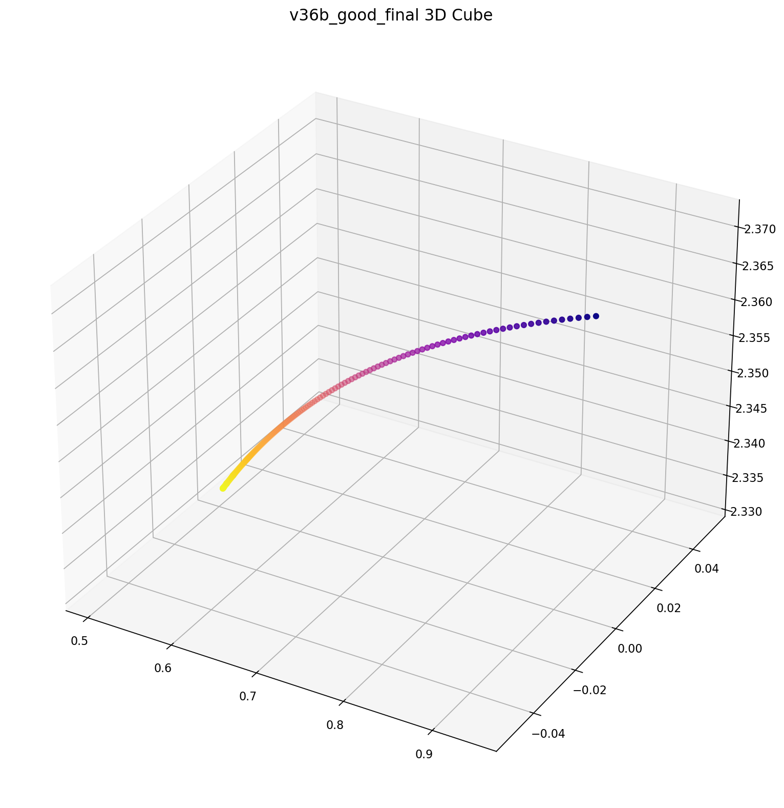
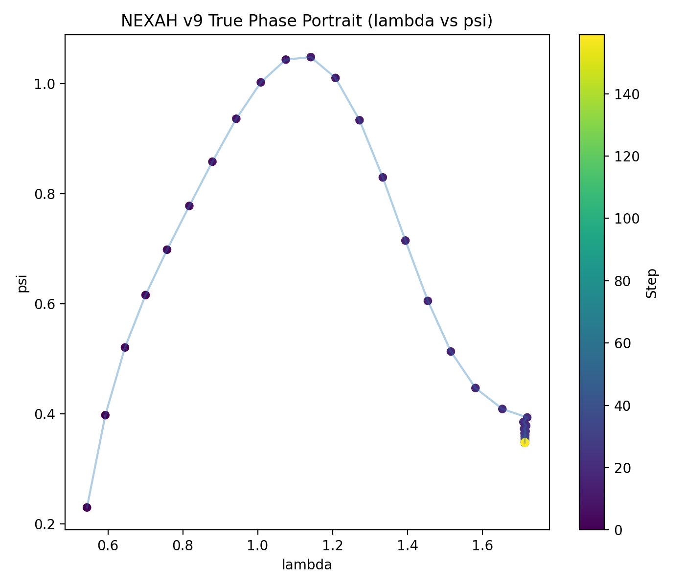
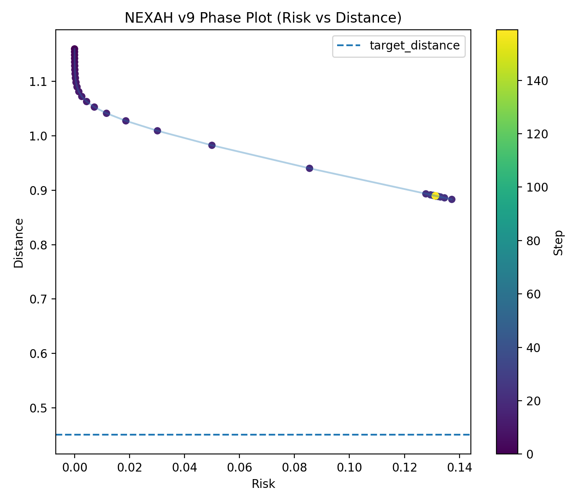
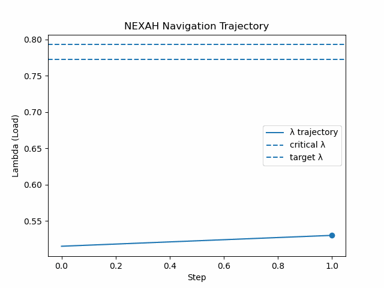

# ⚡ NEXAH / Power Systems  
**Structural Field Analysis for Power System Stability and Regime Navigation**

---

## 🧭 Overview

NEXAH explores a **geometry-based perspective on power system stability**.

Instead of treating instability purely as a threshold violation, NEXAH interprets it as:

> a **structural transformation in system dynamics**

This enables:

- regime transition detection  
- continuous stability assessment  
- trajectory-aware analysis  
- phase-space interpretation of system dynamics  

---

## 🚀 Core Idea

NEXAH shifts the focus from:

→ discrete collapse detection  

to:

→ **analysis of evolving system structure and regimes**

---

## 🧠 Core Paradigm

Classical methods:

→ monitor voltage thresholds  
→ react after instability  

NEXAH:

→ reconstructs **structure + flow + geometry**  
→ interprets instability as **regime transition**  
→ analyzes trajectories within a **stability landscape**

---

# 📊 System Highlights

The following figures illustrate the transition:

→ structure  
→ flow  
→ geometry  
→ dynamics  
→ regime behavior  

---

## 🔹 Figure 1 — Collapse Geometry (Structure)

**Observation:**
- system states organize into structured regions  
- collapse emerges as a boundary  

**Interpretation:**

> Stability can be interpreted as **proximity within a structured state space**

---

## 🔹 Figure 2 — Flow Field (Dynamics, V69)

**Observation:**
- trajectories exhibit directional organization  
- system evolution is structured rather than random  

**Interpretation:**

> The dynamics are **consistent with a flow-like structure**,  
> suggesting a possible vector-field interpretation.

---

## 🔹 Figure 3 — Geometric State Space

**Observation:**
- high-dimensional system behavior becomes geometrically interpretable  

**Interpretation:**

> Stability can be analyzed through a **geometric representation of state space**

---

## 🔹 Figure 4 — Control Interaction (IEEE9)

**Observation:**
- control modifies trajectory evolution  
- system stabilizes without suppressing dynamics  

**Interpretation:**

> Control acts on **trajectory evolution**, not only on instantaneous state correction  

---

## 🔹 Figure 5 — Phase Dynamics (λ, ψ)

**Observation:**
- structured trajectories appear in phase space  
- attractor-like behavior is visible  

**Interpretation:**

> Stability emerges as a **dynamical structure in phase space**

---

## 🔹 Figure 6 — Risk–Distance Field

**Observation:**
- risk correlates with geometric structure  

**Interpretation:**

> Risk can be interpreted as a **projection of system geometry**

---

## 🔹 Figure 7 — Trajectory-Based Stabilization (v11)

**Observation:**
- controller modifies trajectory near critical regions  
- collapse is avoided in this scenario  

**Interpretation:**

> This suggests a **trajectory-based stabilization approach**,  
> where system evolution is influenced within a structured stability landscape.

---

## 🔹 Figure 8 — Scaling Behavior (9241-Bus)

**Observation:**
- structured behavior persists at larger scale  
- similar qualitative patterns are observed  

**Interpretation:**

> Structural patterns appear to **persist across system sizes**,  
> indicating potential scalability (requires further validation).

---

# 🔬 Regime Detection Experiments (Phi Geometry)

Recent experiments introduced a signal-based regime detection layer using:

- drift (dv/dt)  
- acceleration (d²v/dt²)  
- hybrid change score  
- adaptive thresholds  

---

## Key Observation

- regime transitions can be detected before collapse  
- lead time depends strongly on system dynamics  

| Case              | Lead Time |
|------------------|----------|
| smooth decay     | high (20–35) |
| accelerated      | moderate |
| noisy systems    | moderate |
| sharp collapse   | near zero |

---

## Interpretation

> Instability is better described as a **transition between regimes**,  
> rather than a single identifiable event.

---

# 🧭 Conceptual Contribution

Transition explored:

state-based monitoring → regime-based analysis

---

## 🧠 System Interpretation

The system can be viewed as:

> a trajectory evolving within a structured dynamical landscape

where:

- structure defines possible regimes  
- dynamics define transitions  
- analysis identifies regime changes  

---

# 🧮 Mathematical View

System state:

x = (c, drift, acceleration, residual, distance, ψ)

Dynamics:

dx/dt = f(x)

NEXAH focuses on:

- structural properties of trajectories  
- regime transitions in time-series behavior  

---

# ⚖️ Classical vs NEXAH

| Feature                | Classical IEEE | NEXAH |
|----------------------|---------------|------|
| Static thresholds     | Yes           | Yes |
| Dynamic analysis      | Limited       | Yes |
| Regime detection      | No            | Yes |
| Structural modeling   | No            | Yes |
| Phase interpretation  | No            | Yes |
| Predictive capability | Limited       | Case-dependent |

---

# ⚠️ Limitations

- no universal early-warning signal identified  
- lead time is system-dependent  
- synthetic data still dominates experiments  
- real IEEE integration limited  
- no probabilistic confidence model yet  

---

# 🔮 Next Steps

- integration of real IEEE datasets  
- regime confidence modeling  
- comparison with classical stability metrics  
- extension to multi-dimensional state spaces  

---

# 🧠 Final Insight

> Instability is not reliably captured by a single threshold or event.

It is better described as:

→ a **transition between dynamical regimes**

---

# 🌀 NEXAH

> From simulation → structure  
> From structure → flow  
> From flow → geometry  
> From geometry → dynamics  
> From dynamics → regimes  

---

**Author:** Thomas K. R. Hofmann  
April 2026
