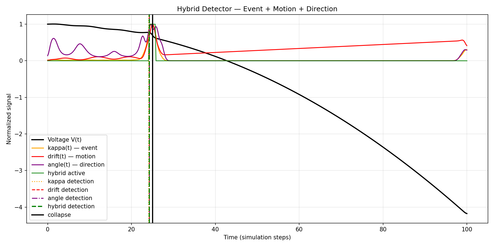
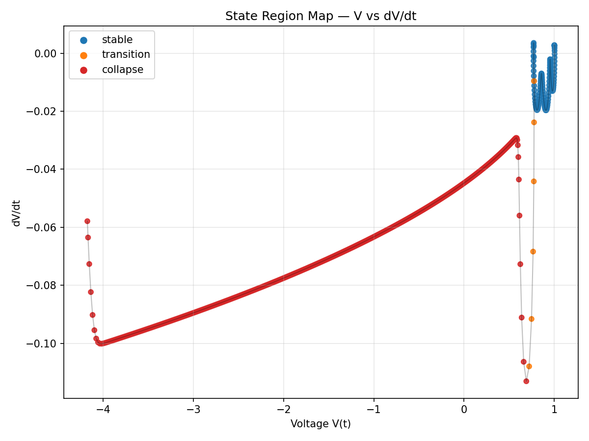
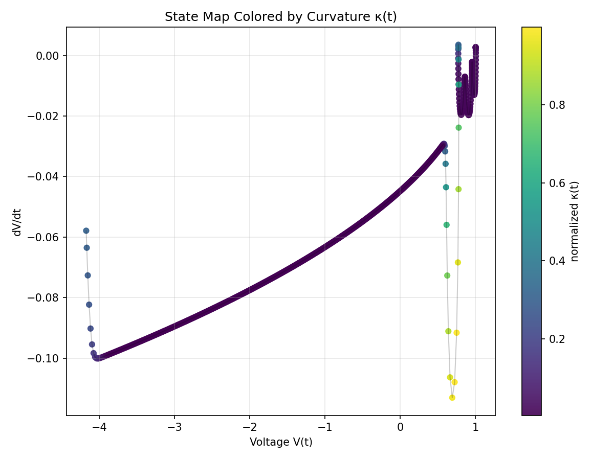
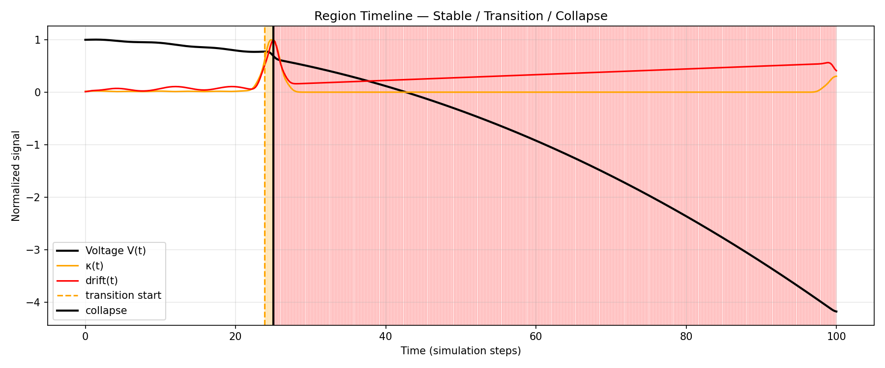
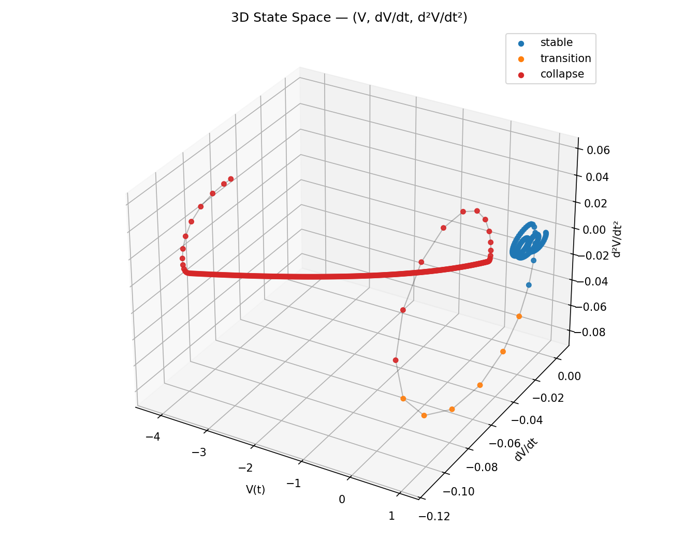
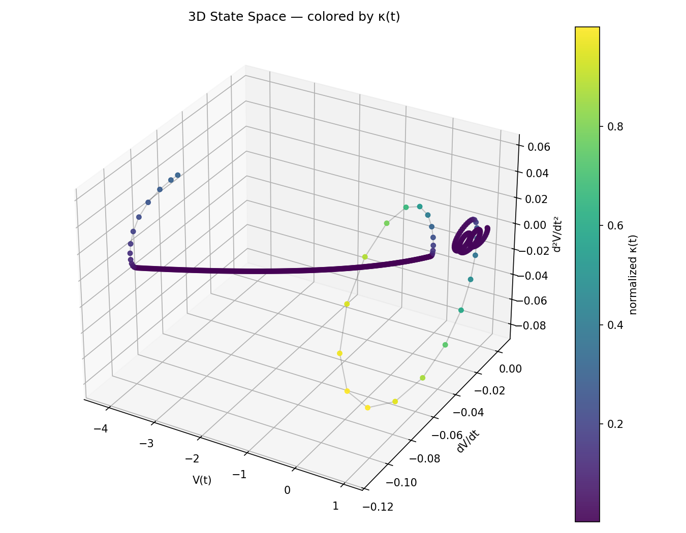
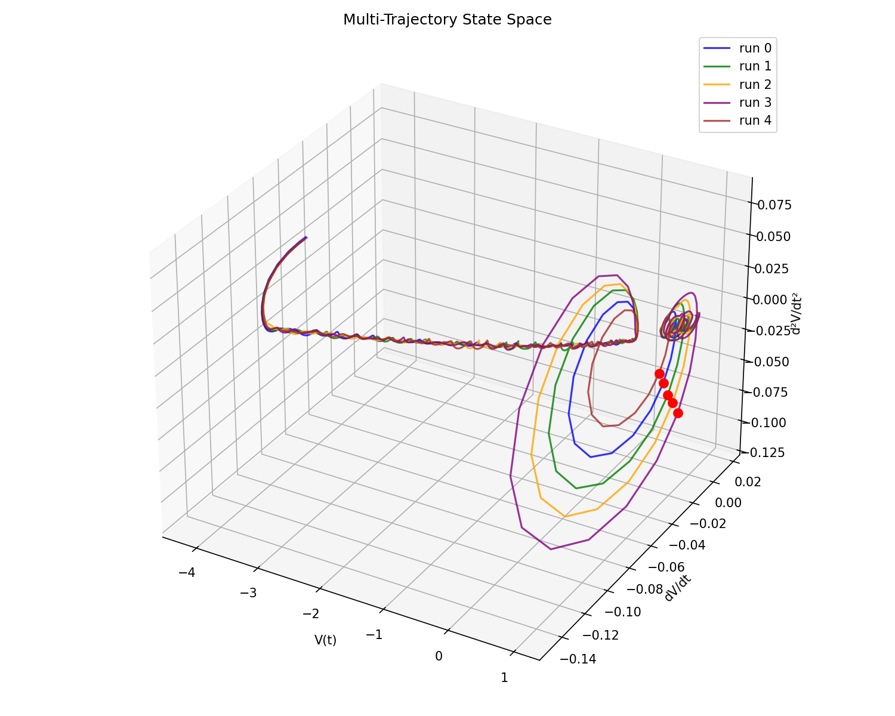
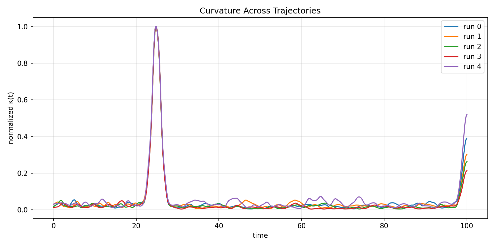

# 📊 NEXAH — Figure Map
### (Validation Layer Visual Reference — Pipeline + Core Results)

---

# 🧭 Purpose

This document maps all generated figures from the validation pipeline to:

```text
experiments → outputs → interpretation
```

It ensures:

- full reproducibility  
- correct file references  
- clean integration into reports  

---

# 📁 Source

All figures originate from:

```text
APPLICATIONS/power_systems/VALIDATION_LAYER/outputs/
```

---

# 📊 PART A — PIPELINE FIGURES (STRUCTURE DISCOVERY)

---

## 🔹 FIG 01 — Shape Geometry (Cluster Relations I)


---

## 🔹 FIG 02 — Shape Geometry (Cluster Relations II)


---

## 🔹 FIG 03 — Shape Space Trajectory


---

## 🔹 FIG 04 — Pre-Collapse Structural Shift


---

## 🔹 FIG 05 — Motion Instability Metric


---

## 🔹 FIG 06 — Shape Flow (Speed)


---

## 🔹 FIG 07 — Shape Flow (Angle)


---

## 🔹 FIG 08–10 — IEEE Shape Flow


---

## 🔹 FIG 11–13 — IEEE Collapse Sweep


---

# 📊 PART B — SIGNAL LAYER (LIMITATION ANALYSIS)

---

## 🔹 FIG 14 — Hybrid Detection Timeline



**Key Insight:**
```text
Combining signals improves robustness, not lead time.
```

---

# 📊 PART C — STATE SPACE STRUCTURE (CORE RESULTS)

---

## 🔹 FIG 21 — State Region Map (CRITICAL)



**Key Insight:**
```text
State space partitions into stable / transition / collapse regions.
```

---

## 🔹 FIG 22 — Curvature Region Map



---

## 🔹 FIG 23 — Region Timeline



**Key Insight:**
```text
A consistent transition phase exists before collapse.
```

---

## 🔹 FIG 24 — 3D State Space Trajectory



**Key Insight:**
```text
Time series corresponds to a trajectory in state space.
```

---

## 🔹 FIG 25 — 3D State Space (Curvature Overlay)



---

# 🚨 CORE RESULT (PAPER FIGURE)

---

## 🔹 FIG 26 — Multi-Trajectory State Space (MAIN RESULT)



**Key Insight:**
```text
All trajectories pass through the same transition region
at the same time (~23.85), independent of perturbations.
```

---

## 🔹 FIG 27 — Multi-Trajectory Curvature Comparison



---

# 🧠 Updated Summary

```text
signal → event → shape → geometry → motion → transition region → collapse
```

---

# 🔥 Recommended Figures for Paper

Use only:

```text
Fig. 21 — State Region Map
Fig. 23 — Region Timeline
Fig. 24 — 3D State Space
Fig. 26 — Multi-Trajectory State Space (MAIN RESULT)
```

---

# ⚡ NEXAH

```text
instability is not a point

it is a movement through structure
```
