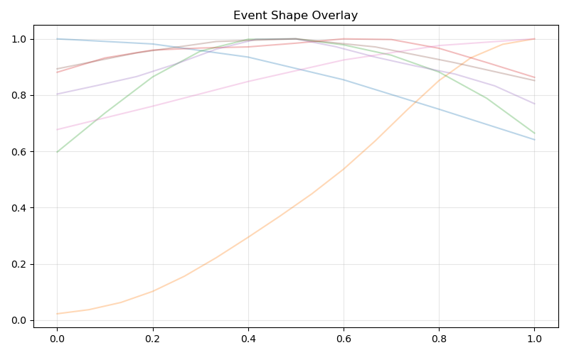
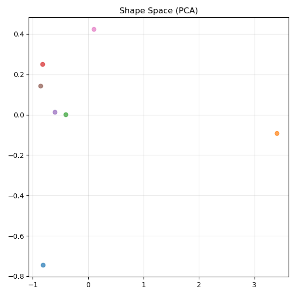
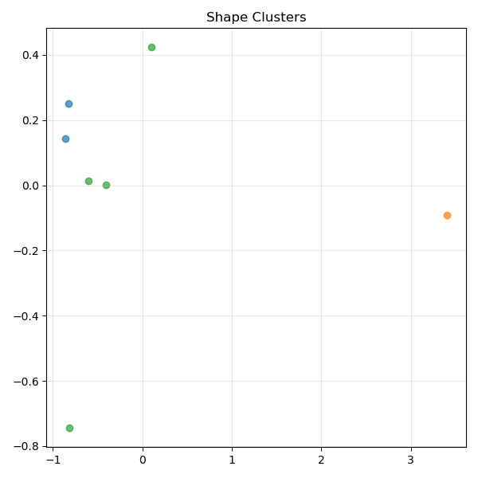

# 📊 NEXAH — Figure Map
### (Validation Layer Visual Reference)

---

# 🧭 Purpose

This document defines the mapping between:

```text
generated figures → experiment outputs → report references
```

---

# 📁 Figure Directory

```text
APPLICATIONS/power_systems/VALIDATION_LAYER/figures/
```

---

# 📊 FIGURE INDEX

---

## 🔹 FIG 01 — Event Shape Overlay



**File:**
```text
figures/fig_01_overlay.png
```

**Source:**
```text
run_001_shape_validation.py
```

---

## 🔹 FIG 02 — Shape Space (PCA)



**File:**
```text
figures/fig_02_shape_space.png
```

**Source:**
```text
run_001_shape_validation.py
```

---

## 🔹 FIG 03 — Shape Clusters



**File:**
```text
figures/fig_03_clusters.png
```

**Source:**
```text
run_001_shape_validation.py
```

---

## 🔹 FIG 04 — Shape Geometry


**File:**
```text
figures/fig_04_geometry.png
```

**Source:**
```text
run_002_shape_geometry.py
```

---

## 🔹 FIG 05 — Shape Trajectories


**File:**
```text
figures/fig_05_trajectory.png
```

**Source:**
```text
run_003_shape_dynamics.py
```

---

## 🔹 FIG 06 — Pre-Collapse Dynamics


**File:**
```text
figures/fig_06_pre_collapse.png
```

**Source:**
```text
run_004_pre_collapse_dynamics.py
```

---

## 🔹 FIG 07 — Motion Instability Metric


**File:**
```text
figures/fig_07_motion_metric.png
```

**Source:**
```text
run_005_motion_instability_metric.py
```

---

## 🔹 FIG 08 — Continuous Shape Flow


**File:**
```text
figures/fig_08_shape_flow.png
```

**Source:**
```text
run_006_continuous_shape_flow.py
```

---

## 🔹 FIG 09 — IEEE Shape Flow


**File:**
```text
figures/fig_09_ieee_flow.png
```

**Source:**
```text
run_008_ieee_bridge.py
```

---

## 🔹 FIG 10 — IEEE Collapse Sweep


**File:**
```text
figures/fig_10_ieee_sweep.png
```

**Source:**
```text
run_009_ieee_collapse_sweep.py
```

---

# 🧠 Summary

```text
signal → event → shape → geometry → motion
```

---

# 🧭 Usage

In reports:

```text
Fig. 1 — Event Shape Overlay
Fig. 2 — Shape Space
...
```

---

# 📌 Notes

- Figures must exist in `/figures/`
- Use `export_figures.py` to populate this folder
- Missing figures indicate incomplete pipeline outputs

---

# ⚡ NEXAH

```text
structure is visible
before collapse is measurable
```
