# 📊 NEXAH — Figure Map
### (Validation Layer Visual Reference — Pipeline v1)

---

# 🧭 Purpose

This document maps all generated figures from the validation pipeline to:

```text
experiments → outputs → interpretation
```

It ensures:

- full reproducibility  
- correct file references  
- clean integration into reports  

---

# 📁 Source

All figures originate from:

```text
APPLICATIONS/power_systems/VALIDATION_LAYER/outputs/pipeline_20260429_012000/
```

---

# 📊 FIGURE INDEX (PIPELINE OUTPUT)

---

## 🔹 FIG 01 — Shape Geometry (Cluster Relations I)

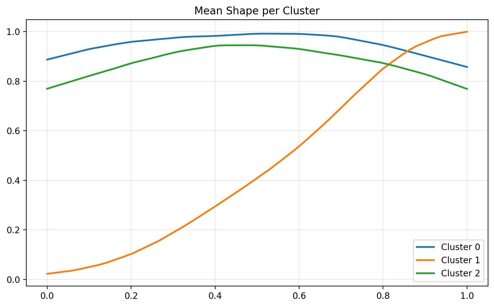

**Source:**
```text
run_002_shape_geometry.py
```

**Meaning:**
```text
First comparison between cluster shapes.
Shows crossings and structural similarity.
```

---

## 🔹 FIG 02 — Shape Geometry (Cluster Relations II)

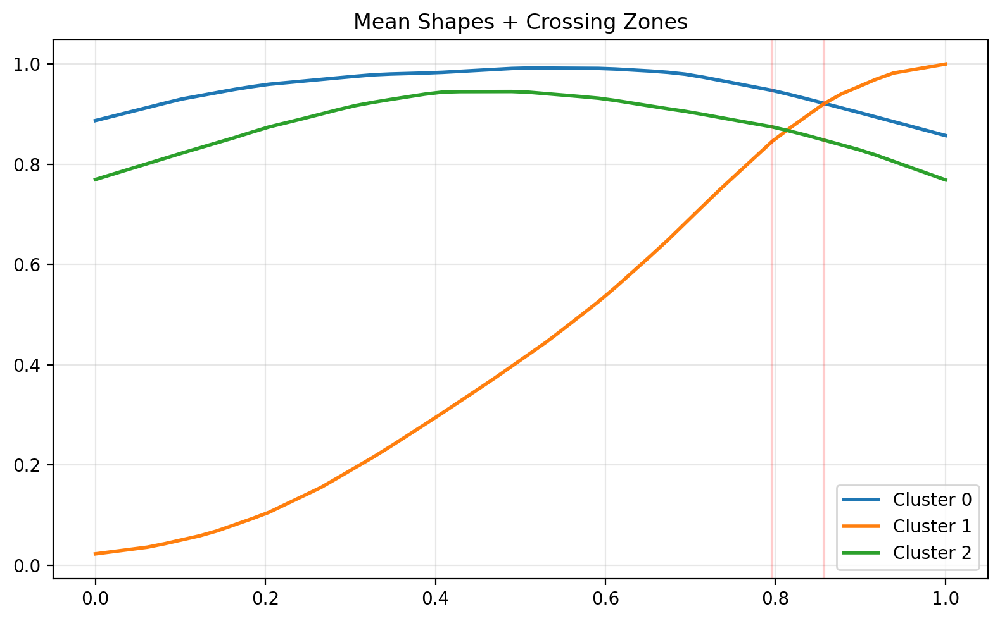

**Source:**
```text
run_002_shape_geometry.py
```

**Meaning:**
```text
Additional cluster comparison.
Highlights geometric differences and deformation.
```

---

## 🔹 FIG 03 — Shape Space Trajectory

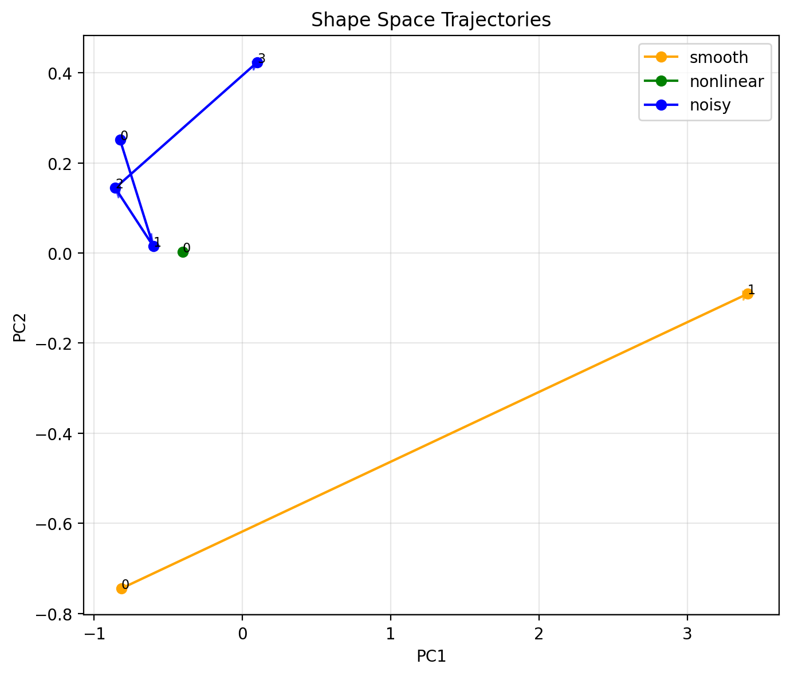

**Source:**
```text
run_003_shape_dynamics.py
```

**Meaning:**
```text
Ordered movement of events in shape space.

Key insight:
events form trajectories, not isolated points.
```

---

## 🔹 FIG 04 — Pre-Collapse Structural Shift

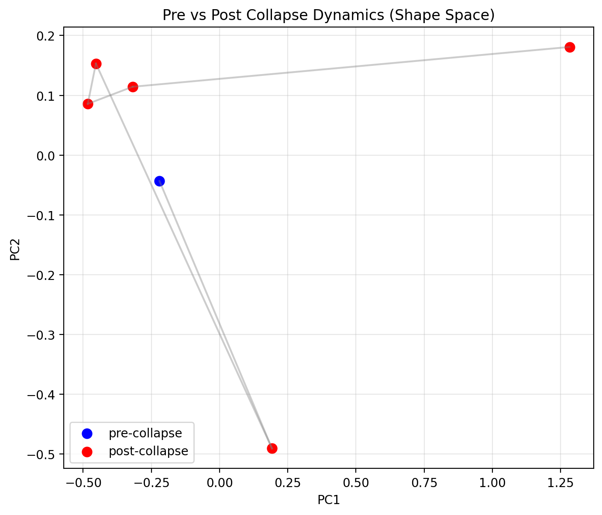

**Source:**
```text
run_004_pre_collapse_dynamics.py
```

**Meaning:**
```text
Separation between stable and pre-collapse regimes.

Key insight:
structure changes before collapse is visible in voltage.
```

---

## 🔹 FIG 05 — Motion Instability Metric

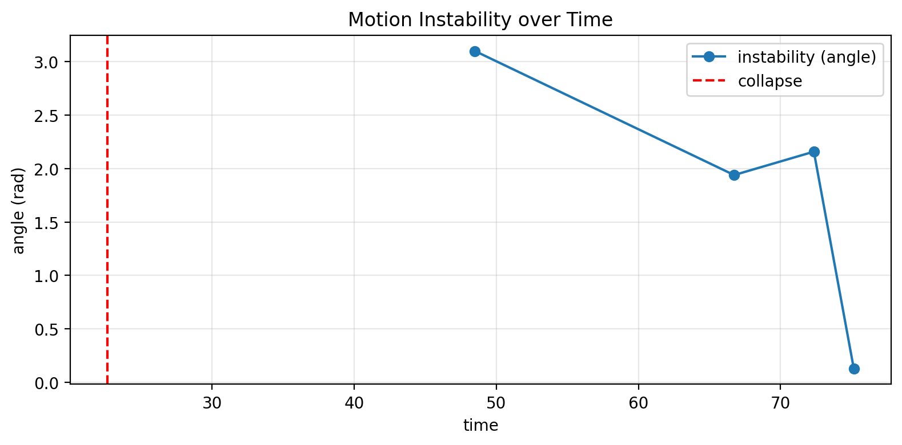

**Source:**
```text
run_005_motion_instability_metric.py
```

**Meaning:**
```text
Directional instability measure.

Key insight:
instability is encoded in directional change (angle).
```

---

## 🔹 FIG 06 — Continuous Shape Flow (Speed)

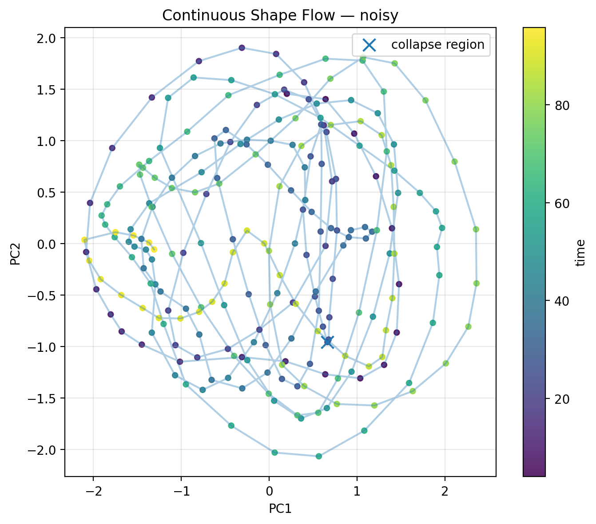

**Source:**
```text
run_006_continuous_shape_flow.py
```

**Meaning:**
```text
Speed of movement in shape space over time.
```

---

## 🔹 FIG 07 — Continuous Shape Flow (Angle)


**Source:**
```text
run_006_continuous_shape_flow.py
```

**Meaning:**
```text
Directional change over time.

Key insight:
angle spikes occur before collapse.
```

---

## 🔹 FIG 08 — IEEE Shape Flow (State Evolution I)

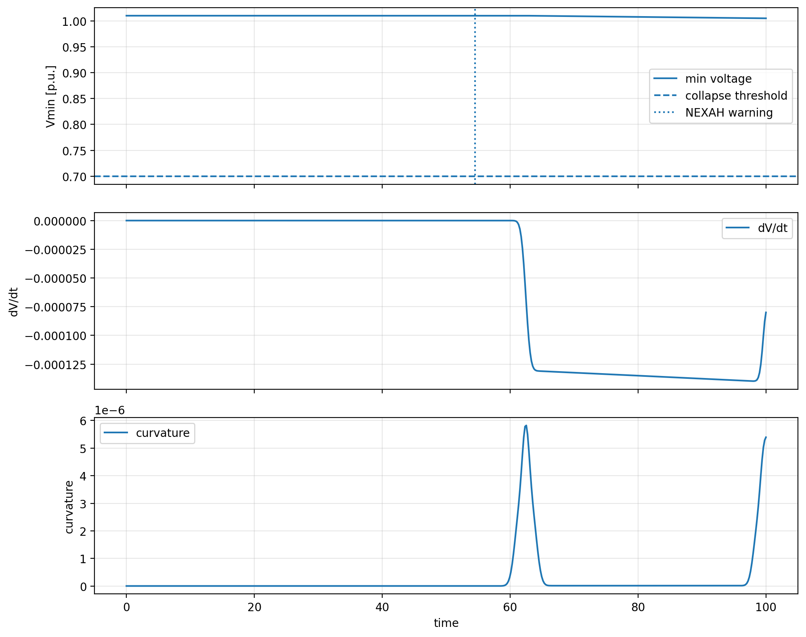

**Source:**
```text
run_008_ieee_bridge.py
```

**Meaning:**
```text
Shape space behavior in IEEE14 system.

Shows structured motion even without collapse.
```

---

## 🔹 FIG 09 — IEEE Shape Flow (State Evolution II)

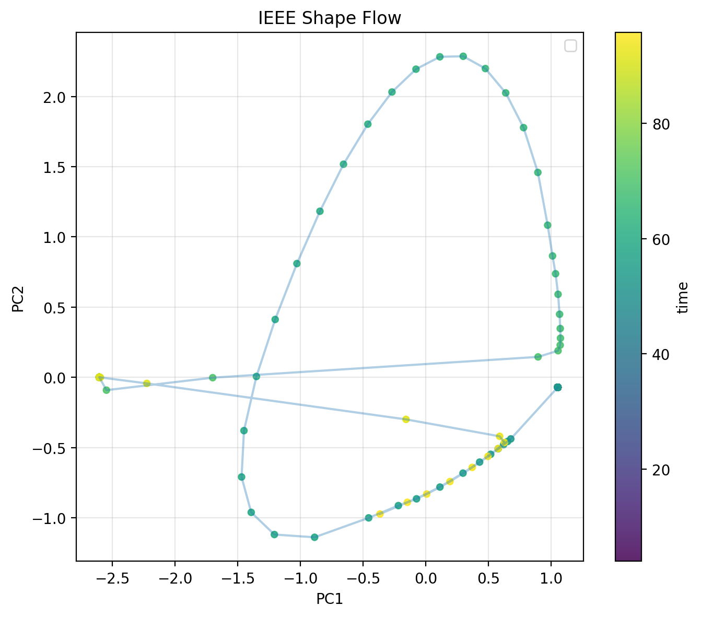

**Source:**
```text
run_008_ieee_bridge.py
```

**Meaning:**
```text
Additional perspective on trajectory structure.
```

---

## 🔹 FIG 10 — IEEE Shape Flow (State Evolution III)

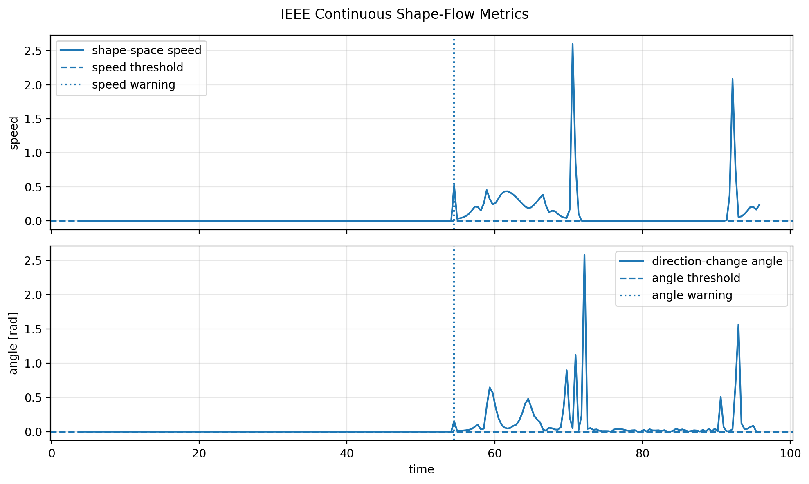

**Source:**
```text
run_008_ieee_bridge.py
```

**Meaning:**
```text
Detailed view of geometric structure in IEEE system.
```

---

## 🔹 FIG 11 — IEEE Collapse Sweep (Overview)

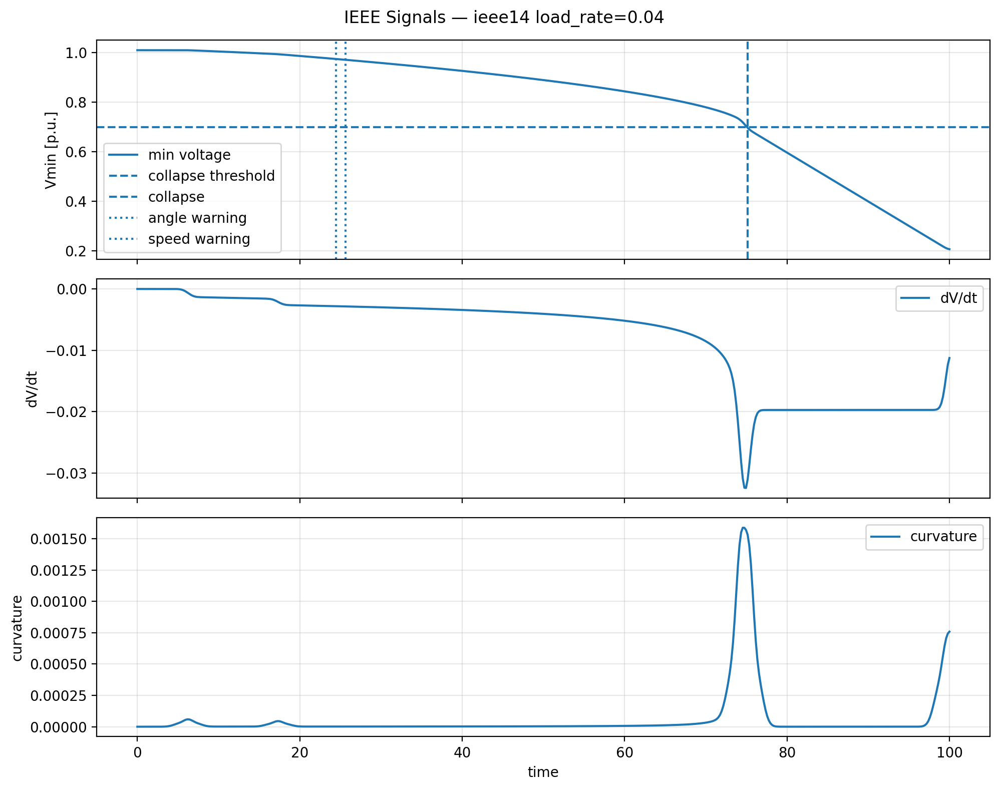

**Source:**
```text
run_009_ieee_collapse_sweep.py
```

**Meaning:**
```text
Transition from stable to collapse across load rates.
```

---

## 🔹 FIG 12 — IEEE Collapse Sweep (Detail)

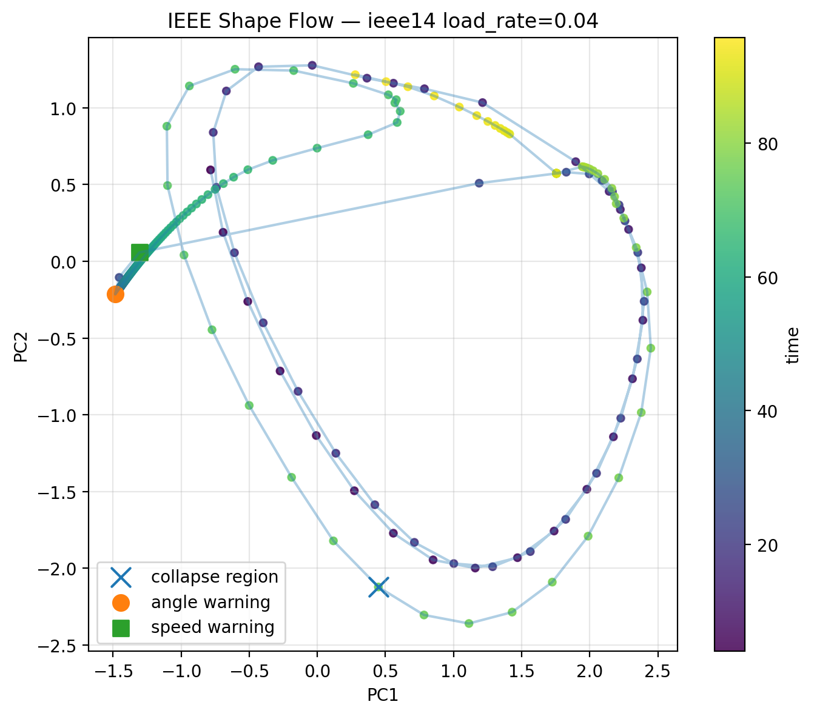

**Source:**
```text
run_009_ieee_collapse_sweep.py
```

**Meaning:**
```text
Intermediate regime behavior under increasing load.
```

---

## 🔹 FIG 13 — IEEE Collapse Sweep (Critical Case)


**Source:**
```text
run_009_ieee_collapse_sweep.py
```

**Meaning:**
```text
Collapse scenario with strong geometric drift.

Key insight:
warning appears ~40–50 time units before collapse.
```

---

# ⚠️ Notes

- `run_001_shape_validation.py` failed → no figures generated  
- `run_007_statistical_validation.py` produces numeric output only  

---

# 🧠 Summary

```text
signal → event → shape → geometry → motion → instability
```

---

# 🧭 Usage in Reports

Use consistent references:

```text
Fig. 1 — Shape Geometry
Fig. 3 — Shape Trajectory
Fig. 7 — Angle Signal
Fig. 13 — IEEE Collapse Case
```

---

# ⚡ NEXAH

```text
instability is not a point

it is a movement through structure
```
