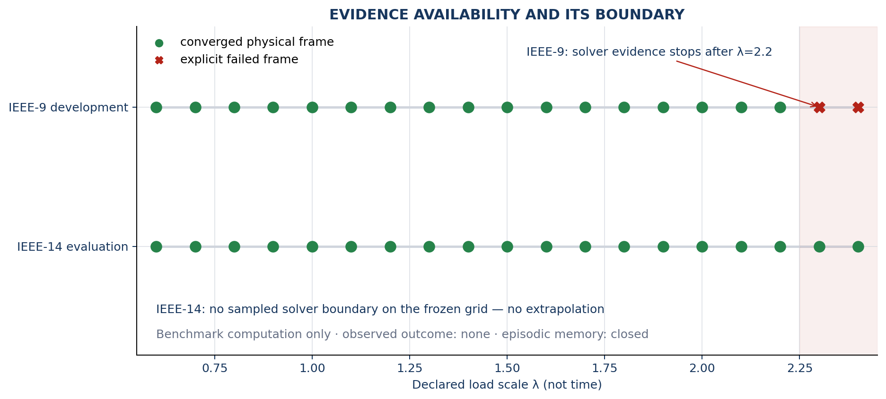

# IEEE Geometry V1 — 90-Second Map

## The question

Can one frozen structural description follow an ordered power-system benchmark
campaign into a second network without changing the method after seeing the
evaluation result?

## What goes in

- IEEE-9 as the development benchmark
- IEEE-14 as the locked evaluation benchmark
- 19 predeclared load-scale positions from 0.6 to 2.4
- physical Pandapower bus and line results
- explicit solver failures rather than replacement values

The load scale is a campaign parameter. It is **not elapsed time** and these are
**not operational-grid measurements**.

## What NEXAH does

```text
benchmark source
→ typed physical frames
→ IEEE-9-fitted standardized representation
→ local displacement, drift, path, direction, and curvature
→ five read-only orientation perspectives
→ bounded Orientation Brief
→ frozen validation and claim audit
```

## What happened

| Result | IEEE-9 development | IEEE-14 evaluation |
|---|---:|---:|
| Declared frames | 19 | 19 |
| Converged frames | 17 | 19 |
| Failed frames | 2 | 0 |
| Available adjacent steps | 16 | 18 |
| Available centered turns | 15 | 17 |

The unchanged IEEE-9 model runs across the full IEEE-14 evaluation grid. No
IEEE-14 solver failure appears on that grid, so NEXAH reports **no sampled
boundary** instead of inventing one.



## What this supports

- a reproducible benchmark computation under the frozen environment;
- explicit structural measurements along a declared ordered campaign;
- unchanged technical transfer from IEEE-9 development to IEEE-14 evaluation;
- inspectable limitations, missing information, and evidence boundaries.

## What it does not support

- real-world grid generalization;
- prediction, causal warning, or control;
- a certified physical stability boundary;
- calibrated uncertainty;
- observed outcomes or episodic-memory learning.

Continue with the **[10-minute runnable case](QUICKSTART_10_MINUTES.md)**.
