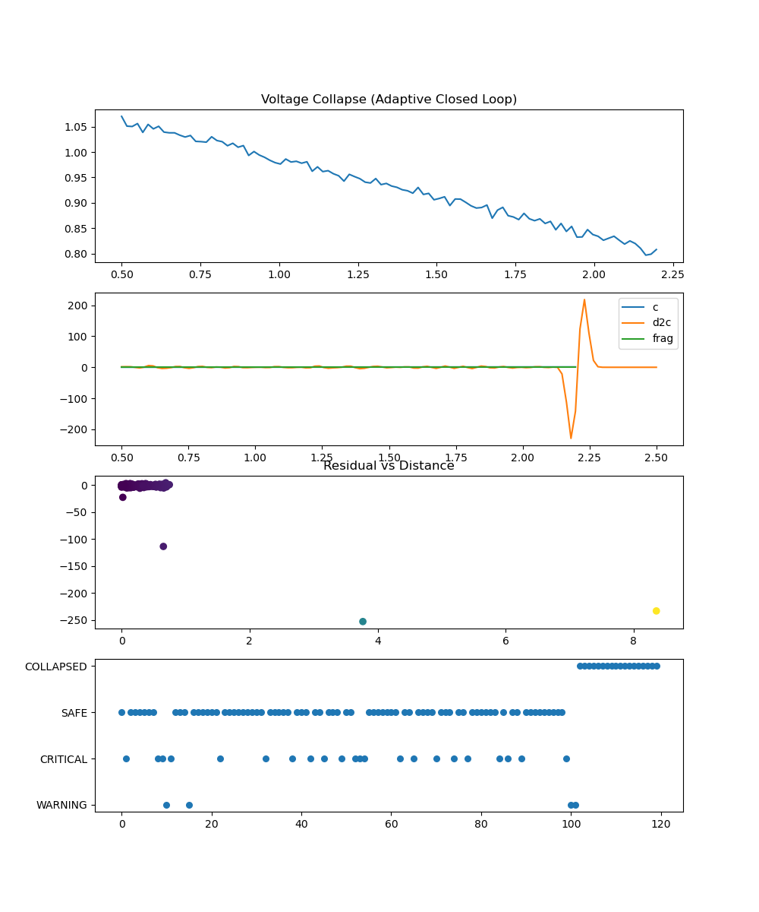
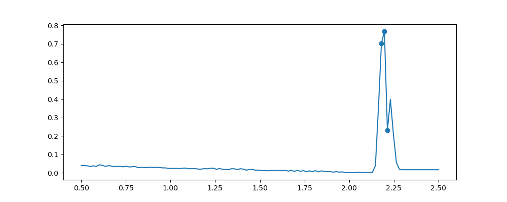
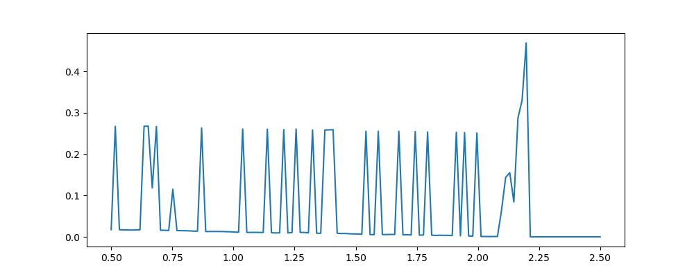
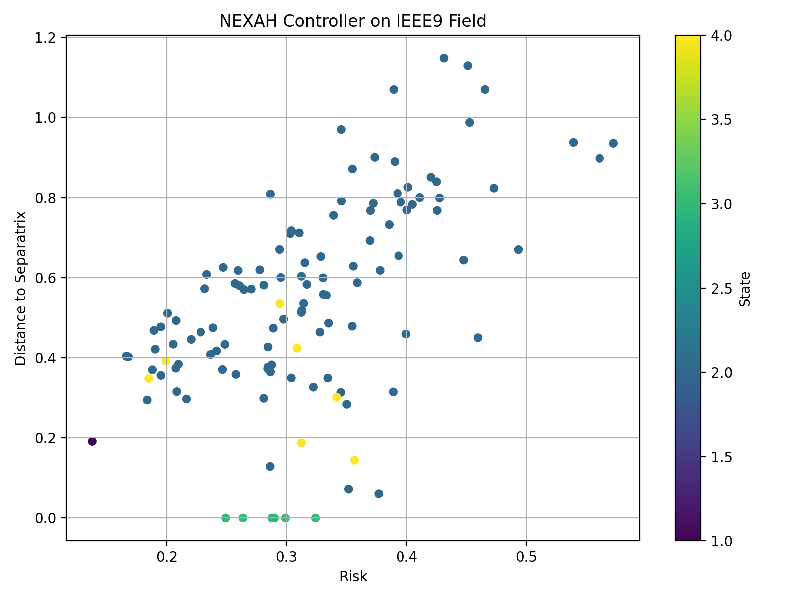
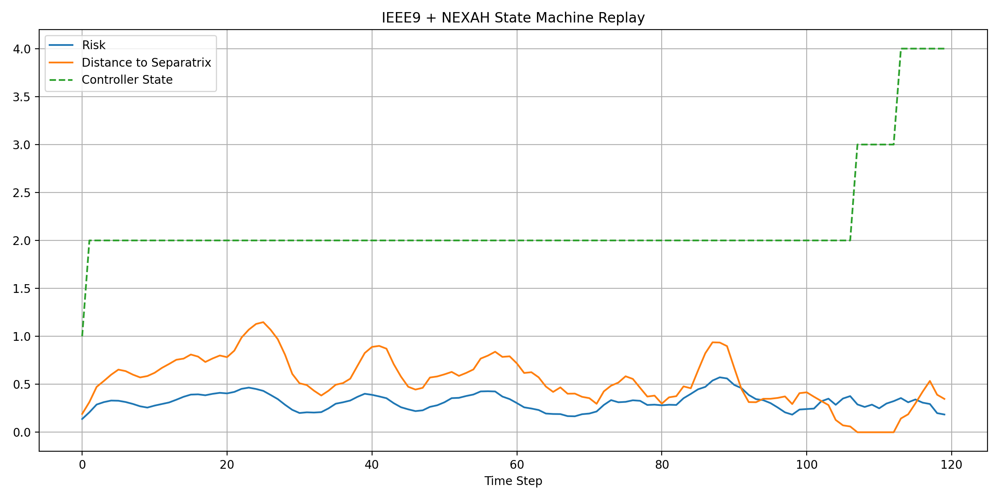
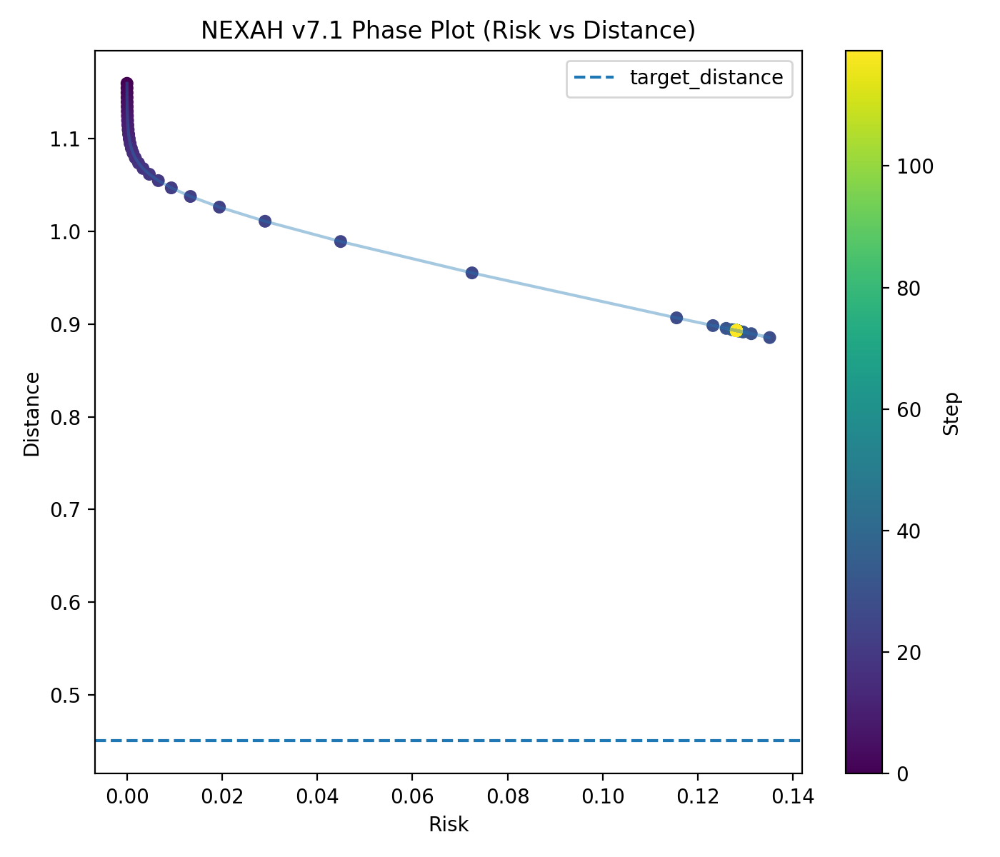
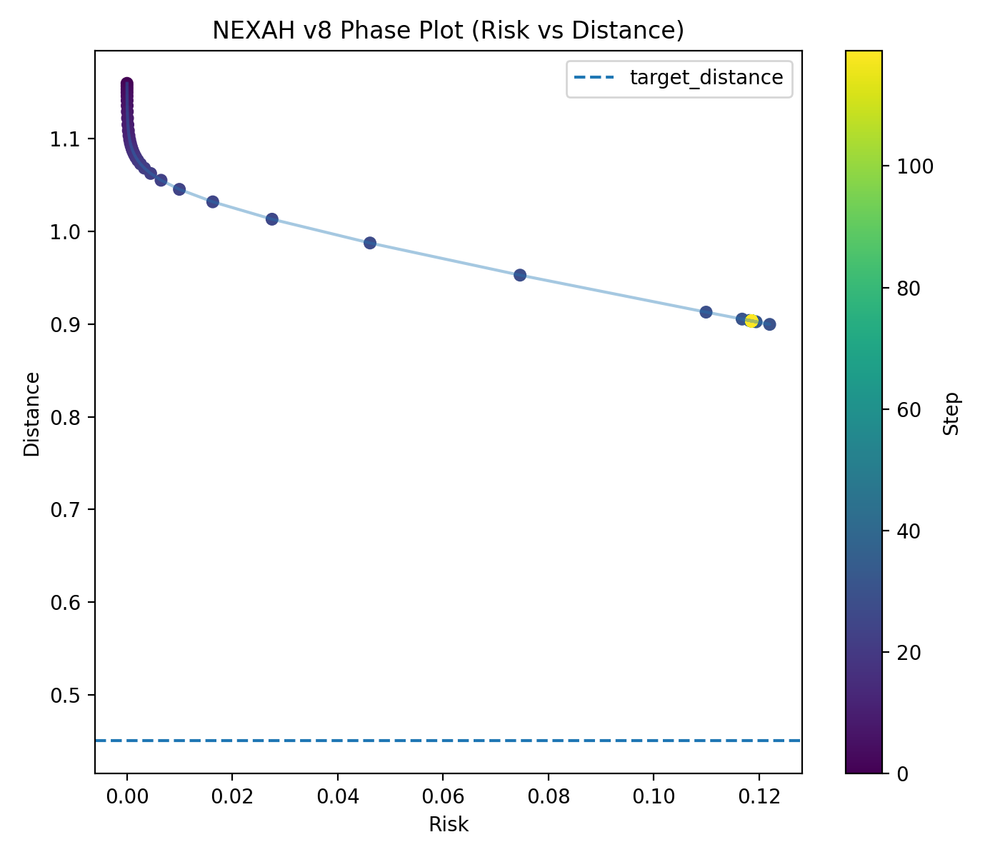
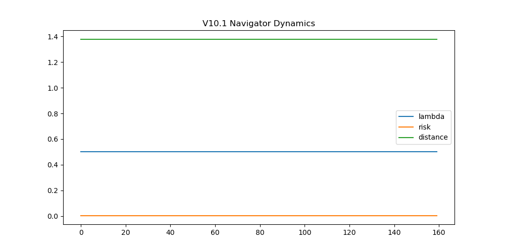
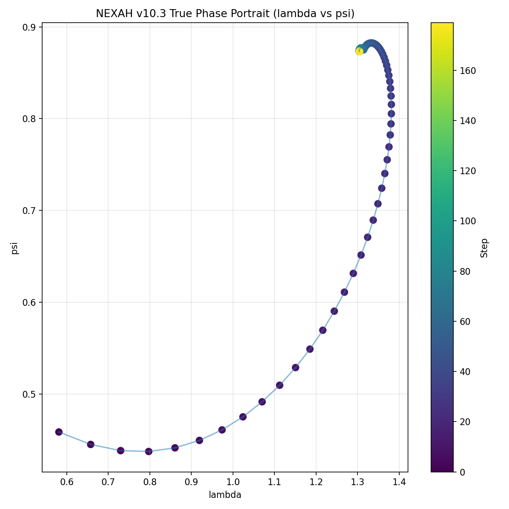
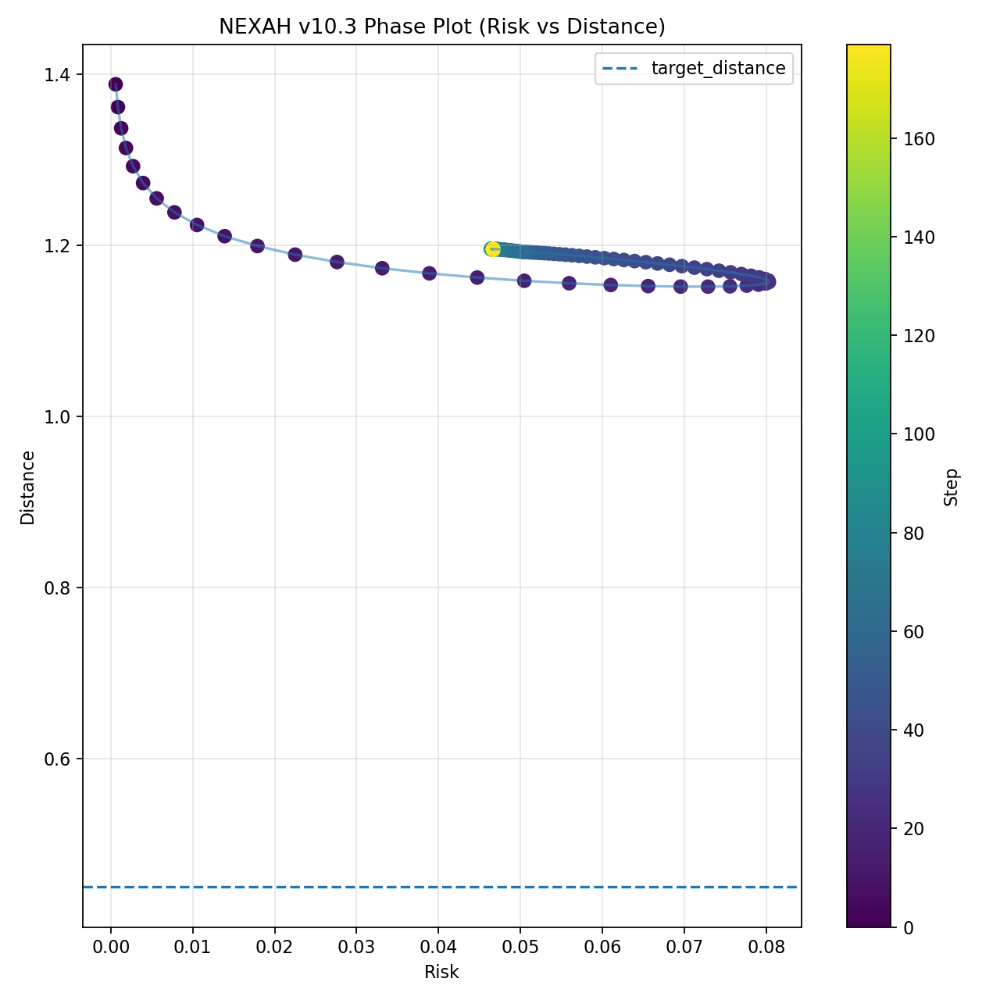

# ⚡ NEXAH — IEEE9 Stability Field Navigation


---

## 🧭 Abstract

NEXAH introduces a new paradigm for power system stability:

> **Stability is not a binary condition — it is a navigable field.**

Instead of detecting collapse after it occurs, NEXAH:

- reconstructs the **underlying stability geometry**
- defines a **continuous risk field**
- enables **closed-loop navigation along safe trajectories**

This transforms control from:

> reactive intervention → **predictive field navigation**

---

## 🔬 Problem Statement

Classical power system analysis operates on:

- static thresholds  
- discrete stability labels  
- post-event detection  

This leads to a fundamental limitation:

> The system reacts **after instability emerges**, not before.

---

## 💡 NEXAH Approach

NEXAH reframes the problem:

> A power system exists inside a **structured stability landscape**

Key idea:

- every system state has a **position in a field**
- instability is a **geometric property**
- control becomes **movement within that geometry**

---

## 🧱 System Pipeline

```text
Simulation → Features → Manifold → Field → Risk → Policy → Control → Navigation
```

---

## 🎬 Field Navigation (Prototype)

This animation shows the controller navigating toward the **stability boundary** without triggering collapse.


### Interpretation

- trajectory approaches critical region  
- stabilizes before instability  
- maintains maximum safe utilization  

👉 **Insight:**  
Control follows the **geometry of the field**, not just local state error.

---

**Note:**
- This visualization is based on **internal experimental versions (v7–v11)**  
- The latest **public, reproducible version is v6**  

---

# 📊 Field Reconstruction (v3)

## Voltage Collapse



The voltage profile shows gradual degradation under increasing load.

👉 **Insight:**  
Collapse is not abrupt — it follows a **continuous trajectory in state space**.

---

## Risk Field



The risk function encodes system stability as a continuous scalar field.

- low values → stable region  
- sharp increase → collapse boundary  

👉 **Insight:**  
Instability appears as a **structured region**, not a threshold.

---

## Intervention Dynamics



The controller response evolves smoothly with system stress.

👉 **Insight:**  
Control becomes **trajectory-aware**, not event-triggered.

---

# 🔁 Closed-Loop Field Interaction

## Field Overlay



## Time Evolution



👉 **Insight:**  
The controller is not external — it is part of the **field dynamics itself**.

---

# 🌀 Dynamical System Layer (v7 → v9, experimental progression)

NEXAH evolves from static control to a true dynamical system.

---

## Phase Evolution

### v7 — Static Convergence


→ gradient + drift  
→ fixed-point behavior  

---

### v8 — Perturbed Dynamics


→ rotational component  
→ small oscillations  

---

### v9 — Phase System


👉 **Insight:**  
The system becomes a **coupled dynamical process**, not a static controller.

---

# 🔥 Field Geometry (v10 → v11, experimental)

The system is now analyzed as a **continuous stability surface**.

---

## Stability Surface



## Field Structure





---

## 🧠 Emergent Structure

Two regimes naturally appear:

### 🟡 Transition Region (~λ ≈ 0.8)

- first curvature  
- structural deformation  
- still stable  

---

### 🔴 Instability Region (~λ ≈ 1.25+)

- nonlinear amplification  
- rapid risk growth  
- collapse dynamics  

---

## ⚠️ Critical Insight

> Instability is NOT triggered by first curvature  
> but by **nonlinear amplification of the field**

---

# 🧭 Navigation Result

λ = 0.600 → 0.7717

→ just below critical boundary

👉 **Insight:**  
Maximum utilization without entering instability.

---

# 🧠 System Interpretation

The system now operates as:

> a trajectory evolving within a structured stability field

where:

- field = extracted from system physics  
- geometry = defines stability structure  
- navigation = movement along safe trajectories

# 🚀 Run (Public Version)

```bash
PYTHONPATH=. python APPLICATIONS/power_systems/nexah_ieee9/controller/nexah_closed_loop_ieee9_v6.py
```
Note:
	•	v6 is the latest stable and reproducible version in this repository
	•	newer iterations (v7–v11) are currently being consolidated and cleaned


---

# 🔥 Key Result

A complex physical system can be:

- mapped into a field  
- understood geometrically  
- navigated safely  
