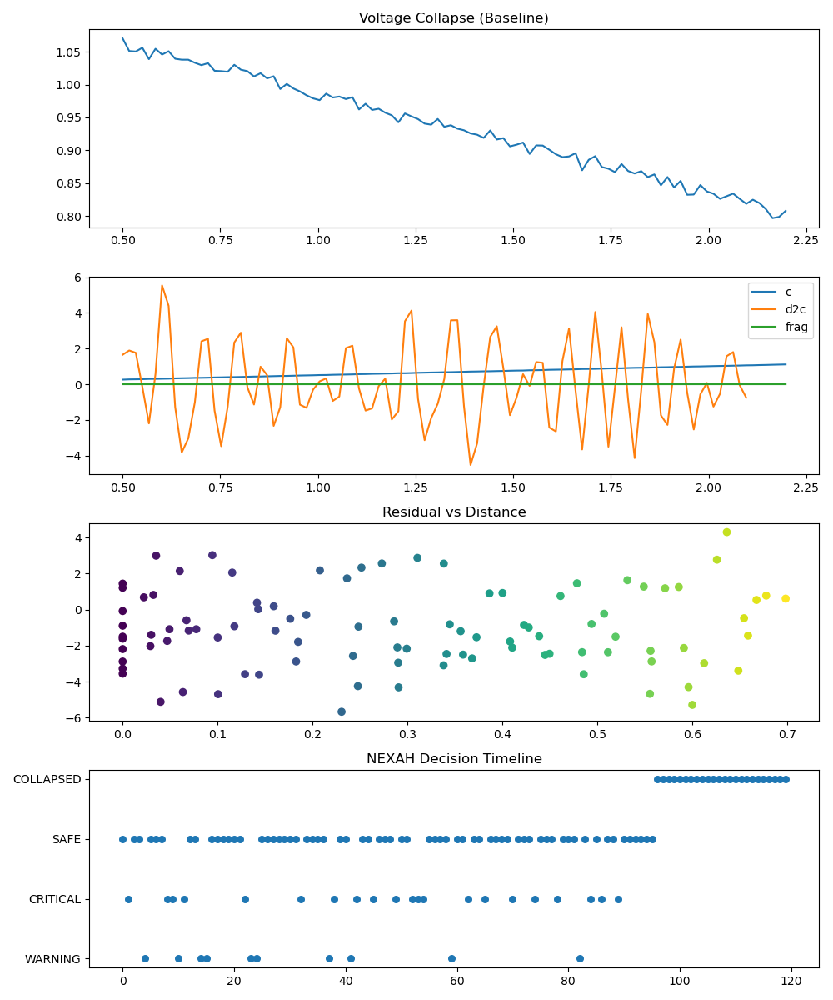
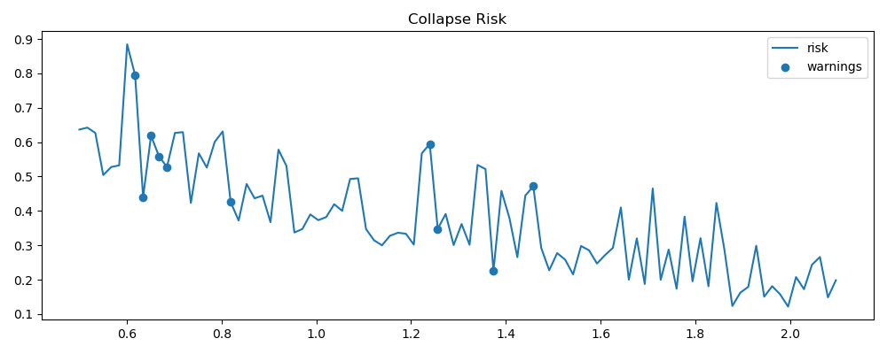
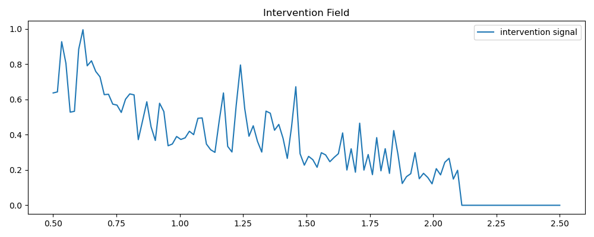

# ⚡ NEXAH — IEEE9 Stability Field System

## 🧭 Overview

This module implements the **NEXAH framework** on a power system test case (IEEE 9-bus).

It transforms classical voltage stability analysis into a:

> **continuous stability field with dynamic intervention capability**

---

## 🔬 Core Idea

Instead of asking:

> *"Will the system collapse?"*

NEXAH answers:

> *"Where are we in the stability field — and how can we navigate it?"*

---

## 🧱 Pipeline Architecture

Simulation → Features → Manifold → Overlay → Prediction → Policy → Control

---

## 📊 System Behavior (Latest Run)

### 🧪 Run ID

    run_20260412_210330

---

### ⚡ Voltage Collapse (Closed-Loop)

✔ Baseline collapse behavior preserved  
✔ Slight stabilization via feedback  
✔ No artificial suppression of physics  

---

### 📉 Collapse Risk Field

✔ Early warning detected around λ ≈ 0.6  
✔ Peak risk ≈ 0.88  
✔ Structured (non-random) dynamics  

---

### 🛠 Intervention Field

✔ Strong response in unstable regions  
✔ Adaptive control signal  
✔ Decay near collapse (control saturation)  

---

## 🧠 Interpretation

NEXAH does NOT replace classical power system physics.

It introduces:

> **a continuous stability field + navigation layer**

---

## ⚖️ Classical vs NEXAH

| Feature                | Classical IEEE | NEXAH |
|----------------------|---------------|------|
| Static thresholds     | Yes           | No   |
| Dynamic risk field    | No            | Yes  |
| Early warning         | Limited       | Yes  |
| Closed-loop control   | No            | Yes  |
| Structural modeling   | No            | Yes  |

---

## 🚀 Run

    PYTHONPATH=. python APPLICATIONS/power_systems/nexah_ieee9/main.py

---

## 📁 Results Folder

    APPLICATIONS/power_systems/nexah_ieee9/results/

Each run contains:

- `plot.png`
- `risk.png`
- `intervention.png`
- `states.txt`
- `actions.txt`

---

## 🧭 Status

    Baseline      DONE
    Manifold      DONE
    Predictor     DONE
    Policy        DONE
    Closed Loop   DONE
    Real Grid     IN PROGRESS

---

## 🔥 Final Insight

> **Power systems are not binary (stable / unstable)**  
> → they live inside a **structured stability landscape**

---
