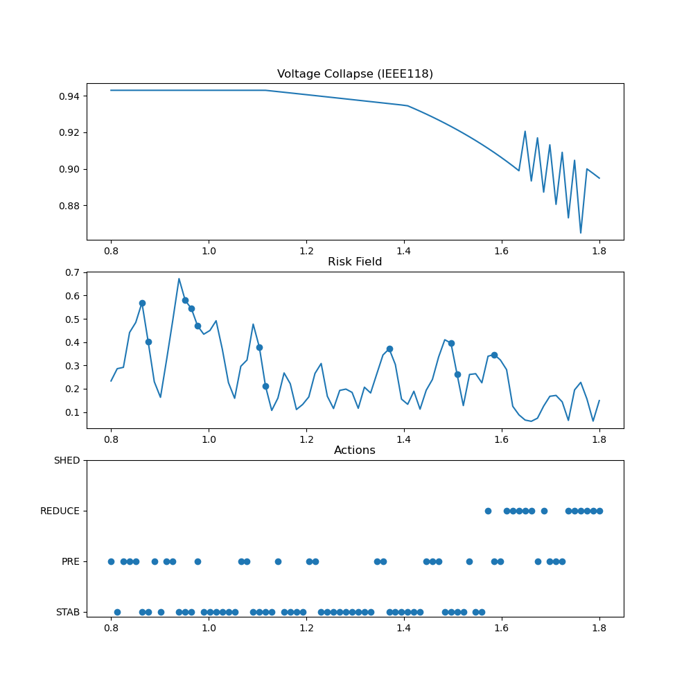
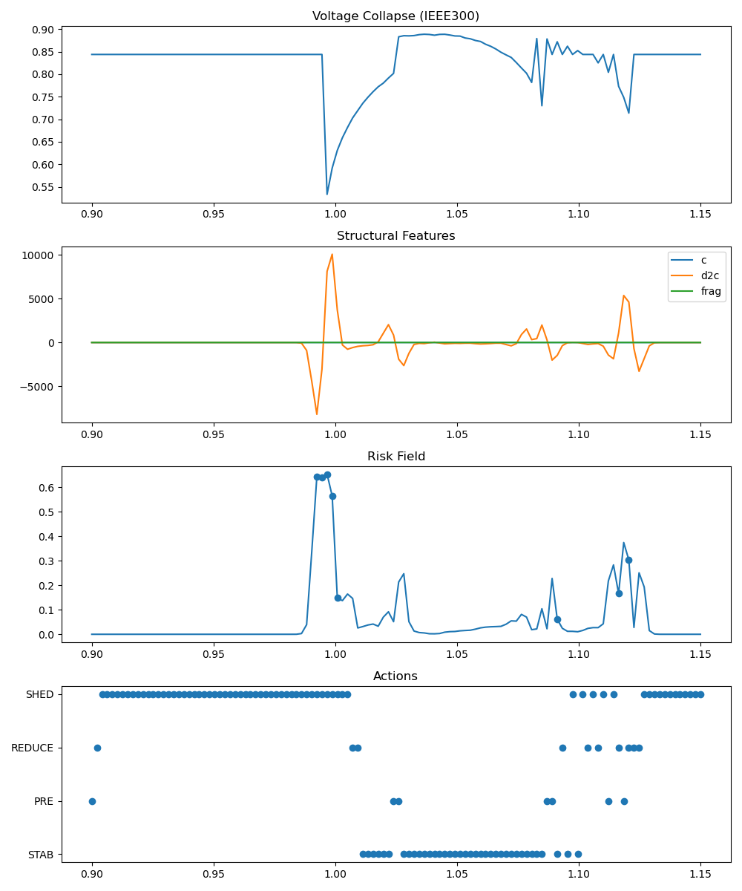
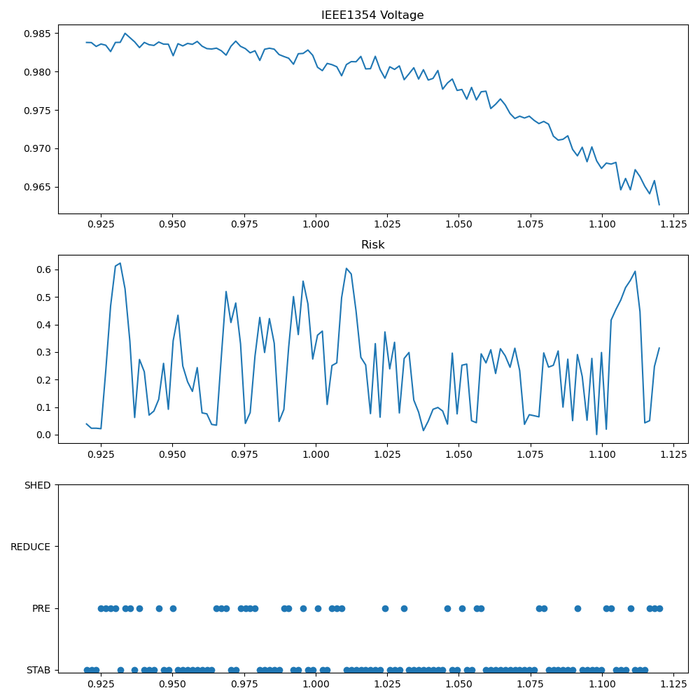
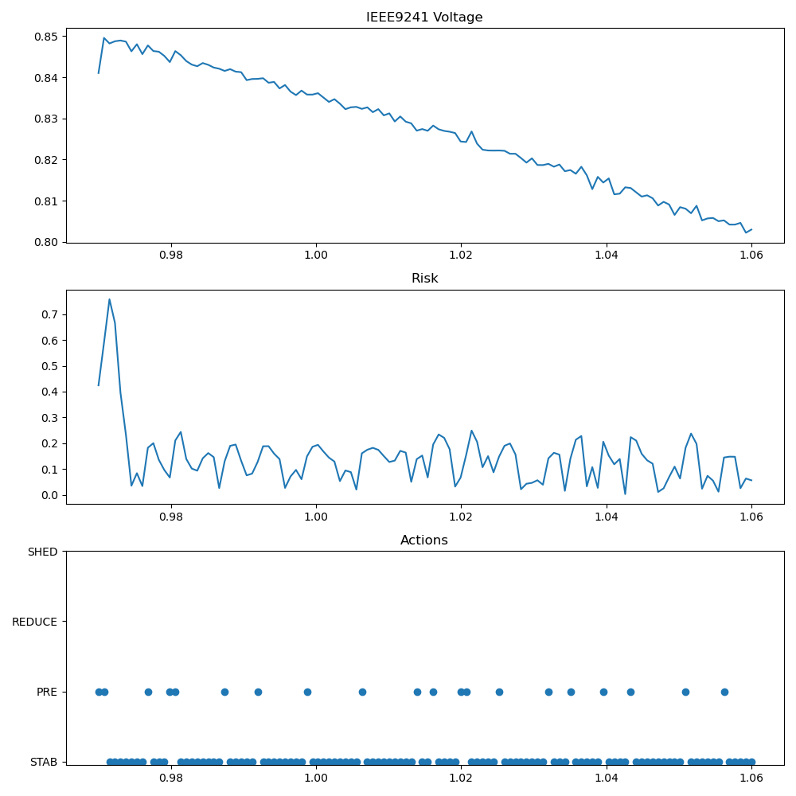

# ⚡ NEXAH — Scalable Stability Field System (IEEE X)

This module demonstrates the **scaling of the NEXAH framework**
from small benchmark systems to **large-scale and real-world power grids**.

---

# 🧭 Abstract

NEXAH explores a different perspective on power system stability:

> **Stability is not only a limit — it is a navigable field.**

The framework transforms power system dynamics into:

- structural fields
- risk landscapes
- adaptive intervention strategies
- navigable stability geometries

Instead of reacting only after instability emerges, NEXAH seeks to:

- identify structural transitions early
- characterize stability regimes continuously
- support geometry-aware intervention strategies

---

# 🔬 Research Progression

The IEEE X module represents the scaling phase of the NEXAH framework.

```text
IEEE9
    ↓
IEEE118
    ↓
IEEE300
    ↓
IEEE1354
    ↓
PEGASE 9241
```

The objective is to evaluate whether stability-field concepts remain useful as system size increases by several orders of magnitude.

---

# 📊 Results Overview

## 🔹 IEEE 118 — Baseline



- clear voltage collapse structure
- early risk detection
- proof of pipeline functionality

---

## 🔹 IEEE 300 — Scaling Phase



- emergence of nonlinear dynamics
- structural feature activation
- adaptive control becomes relevant

---

## 🔹 IEEE 1354 — Large Grid



- stable large-scale voltage field
- distributed risk fluctuations
- system remains controllable

---

## 🔹 IEEE 9241 (PEGASE) — Real Scale



- real-world scale behavior
- early risk spike detection
- stable regime after intervention
- no full collapse observed

---

# ⚙️ Pipeline

```text
Simulation
    ↓
Features
    ↓
Manifold
    ↓
Risk
    ↓
Policy
    ↓
Actions
```

Core components:

- Generic power-flow solver (pandapower)
- Structural feature extraction
- Manifold fitting
- Risk prediction
- Adaptive intervention policy

---

# 🚀 Key Results

NEXAH demonstrates consistent structural behavior across:

```text
IEEE9 → IEEE118 → IEEE300 → IEEE1354 → IEEE9241
```

Observed characteristics:

- emergence of structured risk fields
- identifiable transition regions
- scalable feature extraction
- consistent instability signatures
- applicability across multiple grid sizes

The framework transitions from:

```text
collapse detection
        ↓
anticipatory control
        ↓
stability navigation
```

---

# 📜 Run Log (Condensed)

| System | Status | Notes |
|----------|----------|----------|
| IEEE118 | ✅ Stable | Clean collapse curve, baseline validated |
| IEEE300 | ⚠️ Nonlinear | Required structural fallback and tuning |
| IEEE1354 | ✅ Stable | Distributed field behavior emerges |
| IEEE9241 | 🚀 Success | Real-scale system evaluation |

---

# 🧭 Development Status

| Layer | Status |
|---------|---------|
| IEEE118 Validation | ✅ |
| IEEE300 Scaling | ✅ |
| IEEE1354 Large Grid | ✅ |
| PEGASE 9241 Evaluation | ✅ |
| Adaptive Control | ⚙️ |
| Stability Navigation | 🧪 |
| Real-Time Deployment | ❌ |

---

# 🧠 System Interpretation

The IEEE X experiments suggest that:

- stability fields remain observable across scales
- risk structures remain interpretable
- geometric approaches can be applied beyond small benchmark systems

The module therefore serves as the scalability validation layer of the NEXAH framework.

---

# 🔮 Next Steps

- lead-time analysis versus classical methods
- robustness across random seeds
- sensitivity to intervention strategies
- comparison with OPF and contingency methods
- integration of real-world operational data
- validation on additional grid topologies

---

# 🚀 Position within NEXAH

Within the broader NEXAH ecosystem:

- IEEE9 establishes the core concepts
- IEEE57 X-Ray Pipeline explores advanced navigation and control
- IEEE X evaluates scalability across increasingly large systems

This repository therefore functions as the primary scaling and validation platform for the framework.

---

# 🌀 NEXAH

> From simulation to structure
> From structure to geometry
> From geometry to navigation
> From navigation to stability
