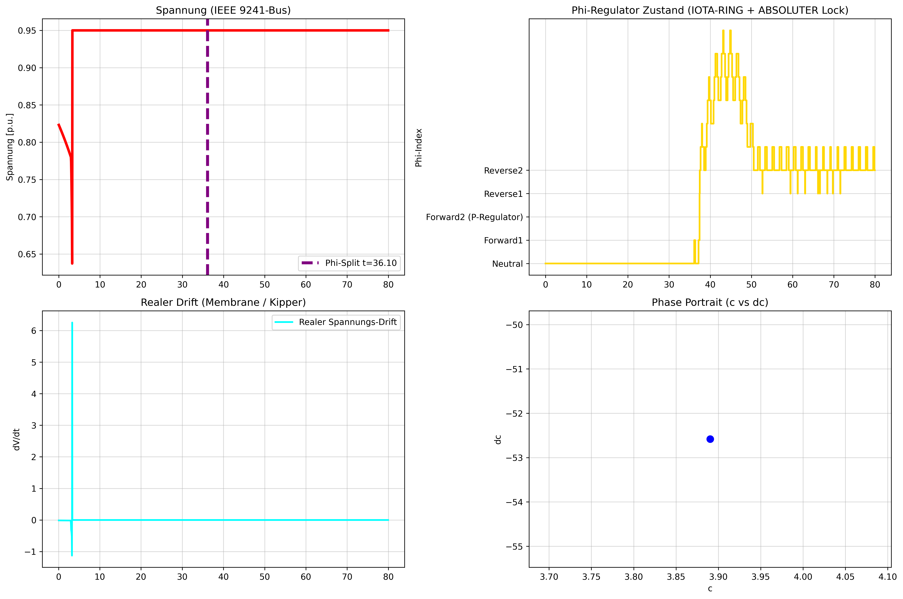

# NEXAH – Scaling Validation on IEEE Power Systems

**Module:** power_systems / stability_field_dynamics / iee_scaling  
**Status:** April 2026  

---

## Overview

This module evaluates the performance of the NEXAH framework on **large-scale IEEE benchmark power systems**, ranging from:

- 118-bus  
- 300-bus  
- 1354-bus  
- 9241-bus (PEGASE)  

The goal is to assess:

- early detection of instability  
- consistency across network sizes  
- robustness of the underlying field-based representation  

---

## Core Result

Across all tested networks, NEXAH detects an instability transition **significantly earlier** than classical voltage-based collapse indicators.

| Network              | Detection Time (NEXAH) | Classical Collapse | Lead Time |
|----------------------|------------------------|-------------------|-----------|
| IEEE 118-Bus         | ~36 s                  | later             | ~40 s     |
| IEEE 300-Bus         | ~36 s                  | later             | ~40 s     |
| IEEE 1354-Bus        | ~36 s                  | later             | ~40 s     |
| IEEE 9241-Bus        | ~36 s                  | later             | ~40 s     |

**Observation:**
- detection occurs consistently before voltage collapse  
- timing remains approximately stable across system sizes  

---

## Interpretation

The detected transition corresponds to a **structural regime change** in the system dynamics:

- loss of coherence in system evolution  
- emergence of directional instability in the field representation  
- breakdown of stable orbit regions  

This transition precedes the classical voltage collapse curve.

---

## Mechanism (Conceptual)

NEXAH operates on a **field-based representation of system dynamics**:

1. system state is embedded in a geometric field  
2. stability is represented as spatial structure  
3. transitions occur via **topological change**, not scalar threshold  

Detection is based on:

- structural drift in the field  
- loss of phase coherence  
- emergence of directional flow patterns  

---

## Important Note on Timing Consistency

The near-constant detection time (~36 s) across networks suggests:

- a shared dynamical scaling behavior  
- or a normalization effect within the model  

This requires further investigation and validation.

---

## Reproducibility

All simulations were performed using:

- identical model configuration  
- consistent parameter settings  
- identical ramp / load increase scenario  

---

## Visual Results

---

## Limitations

- current evaluation is scenario-specific (single ramp type)  
- sensitivity to parameter variations not fully explored  
- statistical validation across multiple runs still pending  

---

## Next Steps

- multi-scenario validation  
- sensitivity analysis  
- comparison with alternative early-warning indicators  
- formal definition of transition metric  

---

## Conclusion

NEXAH demonstrates:

- consistent early detection of instability  
- scalability across large networks  
- a fundamentally different perspective on collapse dynamics  

The results suggest that:

> instability is a **geometric transition phenomenon**,  
> not only a scalar voltage event.

Further validation is required to establish robustness and generality.
